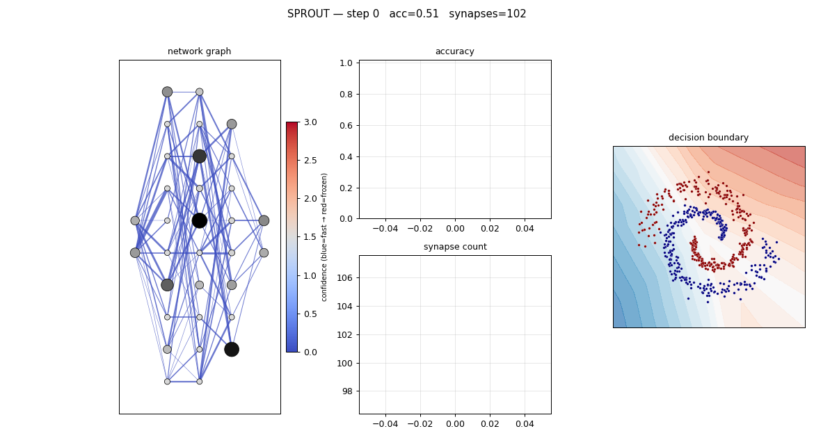
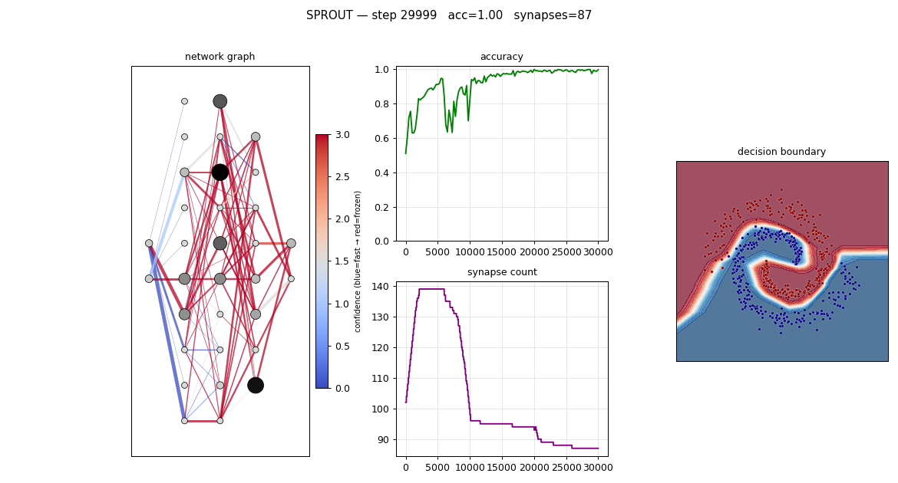

# SPROUT — a legible, self-wiring classifier

A tiny feedforward classifier whose brain-inspired mechanics are *directly
observable*: synapses accumulate **confidence**, slow their own learning, get
**pruned**, and new ones **grow** — all on a standard backprop core, on a
sparse graph you can watch rewire itself.

The architecture is **gradient-as-currency**: one metered signal drives
everything. Backprop already computes a per-synapse gradient `g_ij = δ_j·a_i`
("how hard, and which way, the loss wants this wire to change"). We meter that
once into one shared per-wire state — **load** `|w|/w̄` and **demand** `M/M̄` —
and read it through three lenses: **confidence** (freeze a wire that is
*important and settled*), **pruning** (delete a wire weak in *both* load and
demand), **growth** (add the missing wire the loss most wishes existed, when it
clears a *selective* bar — RigL-style). See [sprout/currency.py](sprout/currency.py).

Structural change is **phasic** *(default)*: the net **learns while awake** (pure
gated-SGD + metering, no rewiring) and **rewires while it sleeps** — one
prune-the-weak + grow-the-wanted pass, fired only once the loss has *settled*
onto a plateau, then it must re-settle before the next. One signal, one
operation, one trigger: this subsumes the older always-on churn (and its
anti-oscillation patches) and ends a net ~45% sparser at no single-task accuracy
cost. See [sprout/sleep.py](sprout/sleep.py) and `_rewire_phasic` in
[sprout/train.py](sprout/train.py). The continuous path is retained behind
`phasic_structure=False` as the pinned A/B baseline.

> An earlier **legacy v1** stack (Hebbian eligibility + three-factor confidence +
> `|w|·r` pruning + activity-chasing growth) was removed once gradient-as-currency
> proved a lateral move on accuracy from a *single* signal. Its multi-seed
> comparison is archived under [docs/eval-runs/](docs/eval-runs/); the original
> design notes remain in [docs/v1_implementation.MD](docs/v1_implementation.MD).

## Headline result

The currency system passes **7/7** of the "it works" criteria on two interleaving
spirals (`python validate.py`), hitting **99% accuracy** *with no `theta_prune`,
`prune_warmup`, or `grow_budget` tuning* — those three hand-set knobs from v1 are
replaced by the one gradient-aware signal.

| step 0 (all plastic, garbage boundary) | converged (consolidated, fits spirals) |
|---|---|
|  |  |
| acc ≈ 0.5, every synapse blue (c=0) | acc ≈ 1.0, working pathways red (frozen) |

## Honest comparison: where currency stands

Currency is the **default architecture and the baseline** other variants are
measured against. The honest truths, all multi-seed (full scorecards under
[docs/eval-runs/](docs/eval-runs/)):

**Accuracy vs the old legacy stack was a lateral move, not an upgrade.** Currency
matched legacy's ~0.97–0.99 on spirals from a *single* signal and deleted three
tuned knobs (`theta_prune`, `prune_warmup`, `grow_budget`) — elegance, not a
higher ceiling. The dead-ReLU growth churn that forced `grow_budget` is gone *for
free*: a dead neuron has zero gradient, so candidate wires into it score ~0 and
are never grown. (The legacy variant has since been **removed**; its scorecards
remain archived under [docs/eval-runs/](docs/eval-runs/).)

**Confidence calibration is a genuine, measured win.** The original tug-of-war
rule *anti-correlated* with real wire utility (`conf_utility_corr ≈ −0.17`): it
froze wires by settledness alone, so it froze *freeloaders*. Re-deriving
confidence as the **2D (importance × settledness)** rule on the *same*
`(load, demand)` state prune reads — with a **softened sigmoid cliff** so a
contested load-bearer keeps some consolidation instead of collapsing to zero —
fixed the sign and made it a significant **+0.31** (15 seeds, no-shift), at **no
accuracy cost** and **zero frozen freeloaders**. Measure calibration on a
*no-shift* run: a mid-run label swap makes the slow confidence EMA lag the
instantaneous post-swap demand, which understates the correlation. See
[docs/eval-runs/2dsoft-vs-2dconf-noshift-15seeds/](docs/eval-runs/2dsoft-vs-2dconf-noshift-15seeds/).

**Grow↔prune oscillation is now largely tamed by a selective grow bar.** Removing
v1's `grow_budget` cap exposed thrash — a wire grown (high virtual gradient),
pruned before it matures, then re-requested because the same virtual gradient is
still there. The fix turned out to be *growth selectivity*, not prune patience:
raising the grow bar to `grow_bar_frac=3.0` (the new default — grow only a wire
the loss wants ≫ a typical live wire) cut the oscillating *population*
(`oscillation_frac` 0.37 → 0.28 ▲), the worst re-grow (`max_regrow` 11 → 6.5 ▲)
and overall churn, and ended ~20% **sparser** (125 → 99 wires) at no accuracy cost
with calibration held. A 15-seed sweep isolates it:
[docs/eval-runs/b1-growbar-sweep/](docs/eval-runs/b1-growbar-sweep/). Two honest
residuals: (1) ~28% of grown wires are still tried twice — the bar lowers thrash
*incidence* but doesn't zero it; (2) damping growth nudges post-shift
`recovered_test_acc` down a little (not significant at 15 seeds, but consistent —
[oscillation-shift-guardrail](docs/eval-runs/oscillation-shift-guardrail/)). An
optional second lever, the **ghost-gradient meter** (`ghost_meter=True` — grow on
a *sustained* EMA so a just-cut wire must re-earn its place), cuts the worst
re-grow further (to ~4) but proved partly redundant once the bar is high
([gb3-ghost-combo](docs/eval-runs/gb3-ghost-combo/)).

**Phasic structure makes the net ~45% sparser and kills grow↔prune churn — now
the default.** Instead of rewiring continuously, the net changes structure only
when the training loss has *settled* (a plateau in its EMA — the only clean
settledness signal; mean confidence and the gradient meter are too noisy): one
pass prunes the weak tail (below utility floor `1.0`, **no per-burst cap**) and
grows the wanted, then it must re-settle before the next. Because rewires are far
apart and gated on a fresh plateau, oscillation is *structurally* impossible — the
ghost-meter refractory and inflated grow bar stop being load-bearing. The floor
`1.0` is a *quality filter* (it sits below the median wire utility ~1.7, so only
genuinely-weak wires are eligible; an uncapped sweep 0→2 found accuracy holds to
~1.8 then cliffs at 2.0). Measured (5 seeds, w16, 15k + 3k shift,
[docs/eval-runs/phasic-vs-continuous/](docs/eval-runs/phasic-vs-continuous/)):
**accuracy preserved** (final / recovered test acc ≈ the continuous baseline),
**~47% fewer synapses** at the end (234 → 123; mean fan-in 4.7 → 2.5, so ~2–3×
cheaper forward + step), near-zero re-grow (`max_regrow` 3.4 → 0.4 ▲) and
higher-quality survivors (`p10_utility` ▲). Two honest costs: it roughly
**doubles permanently-dead units** (`dead_unit_frac` 0.09 → 0.18 ▼) and slightly
worsens post-shift accuracy stability — synapse sparsity is orthogonal to the
~47% per-input firing fraction (the win is lower fan-in, not fewer neurons
firing). `validate.py` and the `currency` / `sleep` baselines pin the continuous
path (`phasic_structure=False`) as stable references.

**The dead-unit cost is real on the continual regime — and recycling corpses
didn't fix it.** An autopsy showed dead units are an *absorbing* state (~65%
killed by uncapped sleep-burst prunes down to one inhibitory orphan-guard wire;
`delta = 0` then freezes their parameters and hides them from the grow scan as
both pre and post — permanent by construction). On the continual A→B→A+B
benchmark (5 seeds, [recycle-continual](docs/eval-runs/recycle-continual/)),
the continuous baseline keeps ~2× more capacity in service than phasic
(`idle_unit_frac` 0.17 ▲ vs 0.34) and acquires task B slightly better
(`b_learned` 0.983 ▲ vs 0.973): phasic's sparsity buys a small second-task
acquisition cost. An opt-in **sleep-time recycling** experiment
(`recycle_dead=True`: at each burst, clear a corpse's wires and rebirth it as a
faint blank that re-enters `active_pre` and must out-bid the normal grow bar)
was accuracy-safe and trivially zeroes `dead_unit_frac`, but the market never
hired: **zero rehires on continual** (idle frac *worse* 0.34 → 0.42 ▼, final
test loss ▼), because plateau-gated bursts are **demand-blind** — by the time
the loss has re-settled enough to fire a burst, the transition's demand spike
the blanks needed is gone. See
[recycle-vs-phasic](docs/eval-runs/recycle-vs-phasic/) and
`docs/superpowers/specs/2026-06-11-sleep-recycling-design.md`.

**Startle — demand-triggered growth — fixes the timing, half-fixes the gap.**
The follow-up experiment (`startle=True`, opt-in): a third phase alongside
wake/sleep — a **grow-only pass fired ~60 steps into a loss spike**, while the
transition's deltas are hot. The alarm is three-condition and measured-robust
(fast-vs-slow loss EMA ×1.5, an absolute trouble floor auto-set to `ln(K)/2` ≈
half chance-level CE, sustained 50 steps): **0 false alarms** on stationary
runs, ~2 per transition, after the naive best-relative trigger stormed (29
false alarms — convergence waves and post-burst prune bumps are huge
*relative* spikes but sit far below chance-level loss). Measured (5 seeds,
[startle-vs-phasic](docs/eval-runs/startle-vs-phasic/) +
[startle-continual](docs/eval-runs/startle-continual/)): single+shift —
`idle_unit_frac` 0.30 → 0.22 ▲, `turnover` ▲, accuracy ≈; continual —
`b_learned` 0.973 → 0.979 ≈ (closes ~half the gap to continuous, and raises
the worst seed 0.960 → 0.977) at **identical end sparsity** (~106 wires vs
continuous's ~226). Honest costs: emergency hires read as freeloaders until a
sleep cycle cleans them (`freeloader_frac` ▼), and the mean `b_learned` gain
is *not significant* at 5 seeds — so startle stays **opt-in**. The residual
gap vs continuous lives in **refinement-tail growth** (continuous grows ~175×
spread over the run; one onset hire can't substitute), pointing at an *aroused
window* (growth re-enabled while the loss stays above the floor) as the next
lever. Spec + results:
`docs/superpowers/specs/2026-06-11-startle-demand-triggered-growth-design.md`.

## Quick start

```bash
python3 -m venv .venv && source .venv/bin/activate
pip install numpy matplotlib pytest pillow

pytest -q                                   # 219 unit + integration tests

python run.py --preset currency --dataset spirals --steps 15000 --density 0.4
python validate.py                          # currency, all 7 criteria + plots

python evaluate.py --variants currency,sleep,phasic --baseline currency --seeds 5 --shift 3000
                                            # multi-seed comparative scorecard
```

Artifacts land in `output/<preset>_<dataset>/` (`animation.gif`, frames,
`metrics.json`); the evaluation harness writes its scorecard + plots to
`output/eval/<dataset>_<timestamp>/`.

## Presets (`run.py --preset`)

| Preset | Architecture | Notes |
|---|---|---|
| `core` | plain sparse backprop | all mechanisms off |
| `currency-conf` | currency: + confidence | edges auto-coloured by gradient **demand** |
| **`currency`** *(default)* | currency: confidence + prune + grow, **phasic** structure | the architecture (2D calibrated confidence + softened cliff + selective grow bar + phasic structural plasticity — wake learns, sleep rewires — on by default) |

## What you can watch

The main panel draws neurons as dots (brightness ∝ activation) and synapses as
lines (**thickness ∝ |weight|**). Edge **colour** depends on the mode:

- `confidence` (default): blue = unsure/fast → red = confident/frozen.
- `demand` (currency): dark = settled → bright = the loss is still pushing it.

A line appearing = growth; vanishing = a prune. Side panels: accuracy, synapse
count, and the 2-D decision boundary. `validate.py` also writes `eff_lr.png`
(confidence ↑ ⇒ effective LR ↓), `selectivity.png` (the metered signal is
selective), and `decay.png` (confidence falls after a concept shift).

## How the currency works (formulas)

Two EMAs per wire are the whole currency:

```
M_ij ← β·M_ij + (1−β)·|g_ij|     # magnitude meter — "how hard am I pushed"
S_ij ← β·S_ij + (1−β)· g_ij      # signed meter    — "which way, on net"
load        ℓ = |w_ij| / mean(|w|)        # weight vs the network (carries load now?)
demand      d = M_ij / mean(M)            # gradient vs the network (still wanted?)
consistency κ = |S_ij| / (M_ij + ε)       # tug-of-war variant: 1 = same dir, 0 = contested
```

`load` and `demand` are the shared 2D state; confidence and pruning are two
lenses on it (one source of truth, [sprout/currency.py](sprout/currency.py)'s
`network_scales`/`load`/`demand`).

- **Confidence / plasticity** (`update_confidence_2d`, default): freeze a wire
  only when it is **important *and* settled**. `imp = (ℓ−1)₊` (above-average
  load), `settled = σ(k·(1−d))` (a *softened* cliff — demand below average ⇒
  settled, smoothly), `c ← EMA toward gain·imp·settled` clipped to `[0, c_max]`;
  effective LR is `η/(1+c)`. Reading the *same* `(load, demand)` state prune
  reads is what makes confidence *track* utility instead of fighting it, and the
  hard `imp` floor means freeloaders (below-average load) never freeze. The prior
  tug-of-war rule (`update_confidence_currency`, `confidence_mode="tugofwar"`)
  earned from `κ·(1−d)₊` and lost from `(d−1)₊` — kept as a variant for comparison.
- **Pruning** (`prune_currency`): utility `|w|/w̄ + λ·M/M̄`; cut only wires weak in
  **both** senses. Protects small-but-wanted newborns ⇒ no warmup needed.
- **Growth** (`batch_edge_scores` + `grow_currency`): score missing wires by
  their *virtual* gradient `δ_j·a_i`; grow only those wanted **far more than a
  typical live wire** (`grow_bar_frac=3.0` — a *selective* hiring bar that keeps
  rewiring calm and sparse and tames the grow↔prune oscillation), born at weight
  0. Dead neurons (`δ_j=0`) score ~0 and are never grown. Optional:
  `ghost_meter=True` grows on a *sustained* EMA of the virtual gradient so a
  just-cut wire must re-earn its place (`update_ghost_meter`).

The full design, including the honest trade-off discussion, is the basis for
[sprout/currency.py](sprout/currency.py)'s module docstring.

## Code layout

```
sprout/
  data.py        generate_blobs / generate_spirals
  network.py     Neuron, Synapse (+ grad_mag/grad_signed meters); forward/backward
  learning.py    firing-rate EMA + confidence-gated weight update
  currency.py    gradient meters + confidence/prune/grow readouts
  sleep.py       SettlednessDetector — the loss-plateau gate / phasic trigger
  viz.py         render_frame (confidence / demand edges) + make_gif
  train.py       Config + Trainer (phasic vs continuous structural plasticity)
run.py           experiment driver / CLI (currency presets)
validate.py      validation harness (the 7 "it works" criteria + plots)
evaluate.py      comparative eval entry: multi-seed scorecard + diagnostic plots
evals/           eval harness package (spec, runner, metrics, aggregate, report, cli)
tests/           TDD suite (data, network, learning, train, currency, sleep, infra, eval)
```

Pure NumPy; forward/backward are hand-rolled over adjacency lists so the
irregular, mutating sparse graph is handled directly (no dense layers).

## Deviations & known limitations

**Trade-off of the currency architecture:** it replaces the Hebbian eligibility
trace (the most *biologically local* part of v1) with the backprop gradient. The
result is more functional and unified but openly "backprop, read three ways" —
less biologically plausible. For a project about *legibility*, leading with the
clearer single-cause story is the deliberate choice; the original local Hebbian
v1 is preserved in the design notes ([docs/v1_implementation.MD](docs/v1_implementation.MD)).

**Legacy-v1 deviations** (the now-removed stack; documented for the record in
[docs/v1_implementation.MD](docs/v1_implementation.MD)): eligibility clamped ≥0;
confidence read eligibility as a *bounded gate* not a raw multiplier; homeostasis
off by default (ReLU + weight-rescaling diverges); `grow_budget` /
`theta_prune` / `prune_warmup` hand-tuning — all obsoleted by the single
gradient-aware signal.

**Default topology + horizon.** The default hidden layers were promoted from
`10,10,8` to a uniform **16** (`[2,16,16,16,2]`), and the single-task training
horizon shortened to **15k steps**. The [neuron-width sweep](docs/eval-runs/neuron-width-sweep/)
found w16 the accuracy/speed sweet spot — near-top accuracy, ~1.8× faster
convergence than the old net, and the fewest idle units — and w16 converges
comfortably inside 15k. (`validate.py` stays pinned to the original net/horizon
as a fixed regression guardrail.)

**The one genuinely unsolved problem: reviving dead ReLU units.** A neuron whose
pre-activation is always negative emits zero gradient, so
*no* growth rule — activity-based or gradient-based — can revive it (a wire into
it gets no learning signal). Currency handles this gracefully (never wastes
growth there); it does not *solve* it. Fixes on the list: a small non-zero birth
weight, or a bias nudge for chronically-dead units.

## Next steps

Confidence **calibration is resolved** (the 2D + softened-cliff redesign) and
grow↔prune **oscillation is structurally resolved** by phasic structure (rewires
fire only at far-apart plateaus, so a just-cut wire can't be re-requested mid-run;
see "Honest comparison" above). Remaining:

1. **Dead-unit cost on the continual/forgetting regime** — phasic roughly doubles
   permanently-dead units (`dead_unit_frac` 0.09 → 0.18); whether that erodes
   retention on the A→B→A+B benchmark (vs the pinned continuous baseline) is the
   key open measurement.
2. **Dead-unit revival** — small non-zero birth weight or bias nudge (would also
   relieve #1).
3. **Stable homeostasis** — a per-neuron trained gain instead of multiplicative
   weight rescaling.
4. Parked v2 ideas: spiking neurons + surrogate-gradient STDP, recurrence,
   confidence-gated exploration noise.
