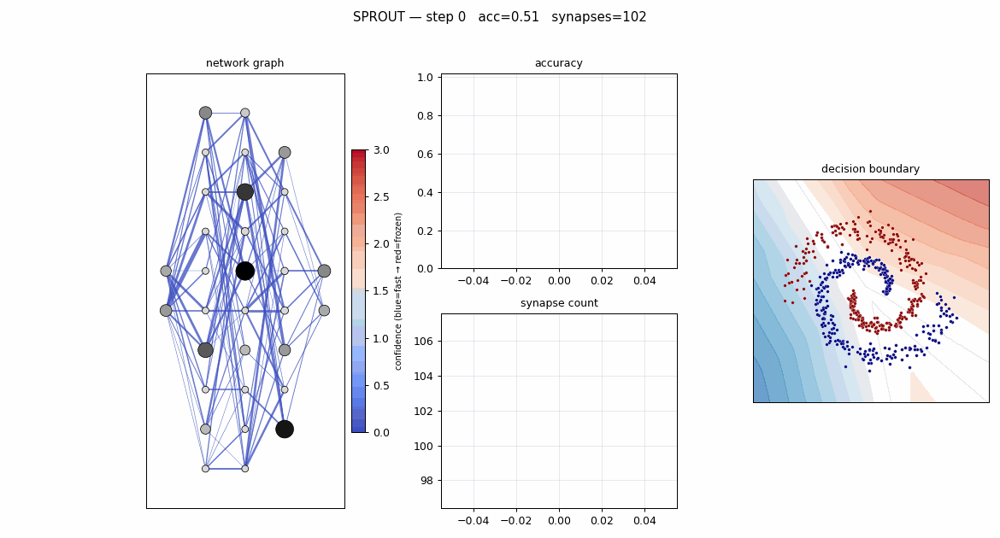
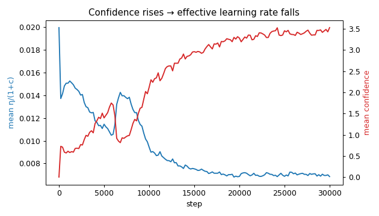
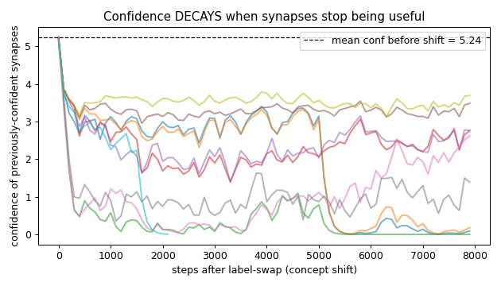

# SPROUT — Confidence-Gated Structural Plasticity (v1)

A tiny, **legible** feedforward classifier whose three brain-inspired mechanics
are *directly observable*: synapses fire, accumulate confidence, slow their own
learning, get pruned, and new ones grow. Built to the spec in
[docs/v1_implementation.MD](docs/v1_implementation.MD).

The three coupled mechanisms (all on a standard backprop core):

1. **Structural plasticity** — a sparse connection graph that prunes and grows during training.
2. **Per-synapse confidence + confidence-gated learning** — each synapse slows its own learning as it grows sure (`η_eff = η_base/(1+c)`).
3. **Three-factor / eligibility-trace learning** — a local "fired-together-recently" signal gates a global low-error signal to drive confidence.

## Headline result

Full system on two interleaving spirals: **99.7% accuracy**, and **all 7 of the
spec's §11 "it works" criteria pass** (see `validate.py`).

| step 0 (all plastic, garbage boundary) | step 30k (consolidated, fits spirals) |
|---|---|
|  |  |
| acc 0.51, every synapse blue (c=0) | acc 1.00, working pathways red (frozen) |



The synapse count **grows** 102 → 139 (growth-dominated warmup) then **prunes to
a stable 87** — a real equilibrium, not runaway growth or collapse. Confidence
rises to mean 3.5 and the mean effective learning rate falls 0.020 → 0.0068 as a
direct consequence.

## Quick start

```bash
python3 -m venv .venv && source .venv/bin/activate
pip install numpy matplotlib pytest pillow

pytest -q                                   # 68 unit + integration tests

python run.py --preset full --dataset spirals --steps 30000 --density 0.4
python validate.py                          # checks all §11 criteria, writes plots
```

`run.py` presets follow the build order (`step1`…`step5`, `full`); each enables
one more mechanism. Artifacts land in `output/<preset>_<dataset>/`
(`animation.gif`, frames, `metrics.json`).

## What you can watch

The main panel draws neurons as dots (brightness ∝ activation) and synapses as
lines (**thickness ∝ |weight|**, **colour ∝ confidence**: blue = unsure/fast →
red = confident/frozen). A line appearing = growth; a line vanishing = a prune.
Side panels: accuracy, synapse count, and the 2-D decision boundary.

`validate.py` additionally produces (copies in [docs/assets/](docs/assets/)):
- `eff_lr.png` — confidence rises ⇒ effective LR falls (the signature mechanic).

  
- `eligibility.png` — eligibility is high *only* on co-active synapses (corr 0.96).
- `decay.png` — after a concept shift, previously-confident synapses **lose** confidence (decay enables re-adaptation).

  

## Build order (§10) — each step verified before the next

| Step | Mechanism | Verified by |
|---|---|---|
| 1 | Sparse net + backprop | finite-difference gradient check; blobs → 100%; deep-layer signal alive (§5.2 init) |
| 2 | Eligibility traces | EMA math; high on co-active / ~0 on quiet synapses; visible "glow" |
| 3 | Confidence + gated LR | confidence rises blue→red; effective LR drops; confidence can decay |
| 4 | Pruning by utility | low-utility synapses removed; accuracy holds (0.99) |
| 5 | Growth into underfiring neurons | neurons sprout zero-weight connections; count finds equilibrium |
| 6 | Homeostasis | implemented, clamped, **off by default** (see deviations) |

## Code layout

```
sprout/
  data.py        generate_blobs / generate_spirals (§6)
  network.py     Neuron, Synapse, Network; build_graph, init_weights, forward, backward (§3,4.1,4.4,5)
  learning.py    update_firing_rates, update_eligibility, update_confidence, apply_gated_update (§4.2–4.6)
  plasticity.py  prune, grow, homeostasis (§4.7–4.8)
  viz.py         render_frame + make_gif (§9)
  train.py       Config (hyperparameters §8) + Trainer (loop §7, mechanisms behind flags)
run.py           experiment driver / CLI
validate.py      §11 validation harness
tests/           TDD test suite (data, network, learning, plasticity, train)
```

Pure NumPy; the forward/backward are hand-rolled over adjacency lists so the
irregular, mutating sparse graph is handled directly (no dense layers).

## Deviations from the v1 spec (and why)

These were discovered empirically while making the mechanics *work*, not just
compile. The spec invited minor deviations; each is documented in-code.

1. **Eligibility clamped to ≥ 0** (§4.3). Input neurons hold raw signed
   coordinates, so `coact = a_pre·a_post` can go negative; we clamp to honour
   the spec's own stated invariant `e ≥ 0`.

2. **Confidence reads eligibility as a *bounded gate*, not a raw multiplier**
   (§4.5) — the most important change. With ReLU, eligibility runs hot and
   unbounded; the literal `e·(γ_q·g + γ_h)` drives confidence into the hundreds
   *before the task is learned*, freezing half-trained synapses that slow decay
   never releases. On blobs this is invisible (the early solution is already
   optimal); on spirals it is fatal (full system fell to ~70% vs backprop's
   99.7%). We use `gate = e/(e + e_half) ∈ [0,1)` — the "gate" the spec's own
   prose describes — so per-step credit is capped and consolidation *lags*
   learning. Retuned: `γ_dec 0.001→0.01`, `γ_h 0.01→0.005`, `e_half=0.1`. Result:
   confidence lands in a legible 0–5 range and the full system matches backprop.

3. **Homeostasis is off by default** (§4.8). The spec's weight-rescaling form is
   *unstable* with ReLU: a dead neuron (`r≈0`) gets `scale≈3.3`, which compounds
   into a runaway explosion (we observed activations → 1e10, accuracy → chance).
   The net is stable *without* it, so it is opt-in; the implementation is
   clamped to a safe band so enabling it can't diverge.

4. **Per-neuron growth budget** (`grow_budget=6`). A zero-weight synapse into a
   *dead* ReLU neuron gets no gradient and cannot revive it, so growth + pruning
   churn forever on a handful of dead units (one neuron was grown into 228×).
   The budget retires chronically-dead neurons; genuinely under-connected ones
   recover within a few attempts. (We kept the spec's zero-weight birth — a
   deliberate §2 design decision — rather than nudging newborns to revive
   neurons.)

5. **Pruning: `θ_prune 0.01→0.001` + a warmup.** The spec calls `θ_prune`
   "tune empirically"; 0.01 pruned the bottom ~28% (functional synapses), so we
   lowered it to catch only near-zero-weight synapses. A `prune_warmup` (no
   pruning for the first ~6k steps) lets weights develop before pruning judges
   them — the same philosophy as the grace period, applied globally — and is
   what produces the clean "grows then stabilizes" curve.

6. **Network `[2,8,8,6,2] → [2,10,10,8,2]`** for the spirals run. The spec size
   (79 synapses at density 0.5) has no redundancy, so pruning erodes it below
   viability. 32 neurons is still "every neuron is a dot."

7. **Spiral difficulty tuned** to `turns=1.0, noise=0.10` — hard enough to be
   non-linear and use capacity, easy enough that the boundary visibly forms.

## Next steps (proposed)

The one genuinely unsolved item is **reviving dead ReLU units**. Activity-based
growth with zero-weight birth *cannot* revive a neuron whose pre-activation is
always negative (no gradient flows), so growth into dead units is cosmetic and
we suppress it with a budget. Two fixes, both already on the spec's v2 list:

- **Gradient-informed (RigL-style) growth**: grow the edge with the largest
  backprop gradient rather than the most-active source — this targets edges that
  *can* reduce loss, and would let growth genuinely add capacity (and could
  recover the "growth beats a fixed graph" story, which we could not show here:
  the fixed graph already had enough capacity).
- **Small non-zero birth weight** (or a bias nudge) for grown synapses, trading
  a little of the "no-op on birth" guarantee for the ability to escape the dead
  zone.

Other follow-ups:
- A **stable homeostasis** that doesn't fight the confidence-gated rate (e.g.
  normalise activations toward `r_target` via a per-neuron gain term trained
  alongside, instead of multiplicatively rescaling learned weights).
- **Confidence/gradient-aware pruning protection** so the system tolerates
  sparse starts without a warmup (currently sparse starts collapse because
  pruning by `|w|` severs mid-training synapses).
- The spec's parked v2 items: spiking neurons + surrogate-gradient STDP,
  recurrent connections, confidence-gated exploration noise, and a sleep/replay
  consolidation phase.
```
