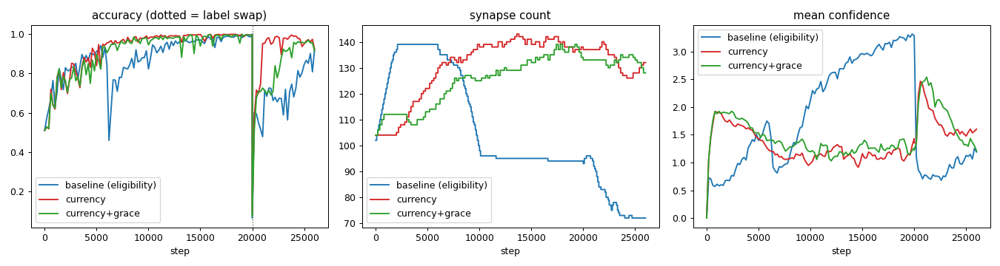

# SPROUT — a legible, self-wiring classifier

A tiny feedforward classifier whose brain-inspired mechanics are *directly
observable*: synapses accumulate **confidence**, slow their own learning, get
**pruned**, and new ones **grow** — all on a standard backprop core, on a
sparse graph you can watch rewire itself.

The project has two architectures, both live and both tested:

1. **Gradient-as-currency** *(current default)* — one metered signal drives
   everything. Backprop already computes a per-synapse gradient
   `g_ij = δ_j·a_i` ("how hard, and which way, the loss wants this wire to
   change"). We meter that once and read it three ways: **confidence** (calm +
   consistent ⇒ consolidate), **pruning** (small weight *and* ignored by the
   loss), **growth** (the missing wire the loss most wishes existed — RigL-style).
   See [sprout/currency.py](sprout/currency.py).

2. **Legacy v1 — eligibility / three-factor** — the original spec
   ([docs/v1_implementation.MD](docs/v1_implementation.MD)): a Hebbian
   "fired-together-recently" eligibility trace gates a global low-error signal to
   drive confidence; growth chases under-firing neurons; pruning uses `|w|·r`.
   Kept verbatim under the `legacy-*` presets — it is more *biologically* flavoured
   and, today, still the better-tuned system on spirals (see results below).

## Headline result

Both pass **7/7** of the "it works" criteria on two interleaving spirals
(`python validate.py` for currency, `--legacy` for v1). The currency system hits
**99% accuracy** *with no `theta_prune`, `prune_warmup`, or `grow_budget`
tuning* — those three hand-set knobs from v1 are replaced by the one
gradient-aware signal.

| step 0 (all plastic, garbage boundary) | converged (consolidated, fits spirals) |
|---|---|
|  |  |
| acc ≈ 0.5, every synapse blue (c=0) | acc ≈ 1.0, working pathways red (frozen) |

## Honest comparison: is currency actually *better*?

Not yet — it's a **lateral move that's more elegant, not an upgrade**. The
figures below are the original *single-seed* run; regenerate them as a
multi-seed scorecard (mean ± std + bootstrap verdicts vs the baseline) with
`python evaluate.py --variants legacy-full,currency,currency-grace --shift 6000`
(identical net/data/seed; 30k steps + a 6k concept-shift):

| metric | legacy (eligibility) | currency | currency + longer grace |
|---|--:|--:|--:|
| final accuracy | **0.998** | 0.992 | 0.993 |
| max accuracy | 0.998 | 0.997 | 0.997 |
| recovered acc (after label-swap) | 0.918 | 0.922 | 0.913 |
| synapse count (start→peak→end) | 102→139→**94** | 104→143→138 | 104→139→134 |
| max grows into ONE neuron *(churn)* | **6** | 19 | 17 |
| max confidence | 3.90 | 5.00 (capped) | 5.00 |



**What currency wins:** it matches accuracy from a *single* signal and deletes
the three tuned knobs. The dead-ReLU growth churn that forced `grow_budget` in v1
is gone *for free* — a dead neuron has zero gradient, so its candidate wires
score ~0 and are simply never grown.

**What it loses / open issues (honest):**
- **Churn regressed.** v1's clean "6" was just the `grow_budget` cap. Removing it
  exposed a **grow↔prune oscillation**: a wire is grown (high virtual gradient),
  pruned before it matures, then re-requested because the same virtual gradient
  is still there. A longer grace barely dents it (19→17).
- **Slower to settle.** At 20k steps the count is still inflated (138). It *does*
  settle by 30k (peak 143 → **end 127**, which is why `validate.py`'s longer run
  passes "grows-then-stabilizes") — but v1 settles below its start much sooner.
- **The predicted concept-shift win didn't materialise** — recovery is a tie
  (~0.92). Confidence *does* fall correctly after the swap (4.80 → 0.49), the
  re-adaptation just isn't faster end-to-end on this task.

The fix that should turn this into a real win: **grow/prune hysteresis** (a
just-grown wire is prune-locked for a window, a just-pruned pair grow-locked) or
a short virtual-gradient memory to stop re-requesting the wire it just cut.

## Quick start

```bash
python3 -m venv .venv && source .venv/bin/activate
pip install numpy matplotlib pytest pillow

pytest -q                                   # 88 unit + integration tests

python run.py --preset currency --dataset spirals --steps 30000 --density 0.4
python validate.py                          # currency, all 7 criteria + plots
python validate.py --legacy                 # the v1 eligibility system instead

python evaluate.py --variants currency,legacy-full --seeds 5 --shift 6000
                                            # multi-seed comparative scorecard
```

Artifacts land in `output/<preset>_<dataset>/` (`animation.gif`, frames,
`metrics.json`); the evaluation harness writes its scorecard + plots to
`output/eval/<dataset>_<timestamp>/`.

## Presets (`run.py --preset`)

| Preset | Architecture | Notes |
|---|---|---|
| `core` | plain sparse backprop | all mechanisms off |
| `currency-conf` | currency: + confidence | edges auto-coloured by gradient **demand** |
| **`currency`** *(default)* | currency: confidence + prune + grow | the current architecture |
| `legacy-step1…step5` | v1 build-order, one mechanism at a time | the most legible way to watch each part |
| `legacy-step6` | + homeostasis | opt-in; unstable with ReLU (see deviations) |
| `legacy-full` | full v1 eligibility system | the tuned baseline in the table above |

## What you can watch

The main panel draws neurons as dots (brightness ∝ activation) and synapses as
lines (**thickness ∝ |weight|**). Edge **colour** depends on the mode:

- `confidence` (default): blue = unsure/fast → red = confident/frozen.
- `demand` (currency): dark = settled → bright = the loss is still pushing it.
- `eligibility` (legacy): dark = quiet → bright = co-active "glow".

A line appearing = growth; vanishing = a prune. Side panels: accuracy, synapse
count, and the 2-D decision boundary. `validate.py` also writes `eff_lr.png`
(confidence ↑ ⇒ effective LR ↓), `selectivity.png` (the metered signal is
selective), and `decay.png` (confidence falls after a concept shift).

## How the currency works (formulas)

Two EMAs per wire are the whole currency:

```
M_ij ← β·M_ij + (1−β)·|g_ij|     # magnitude meter — "how hard am I pushed"
S_ij ← β·S_ij + (1−β)· g_ij      # signed meter    — "which way, on net"
demand      d = M_ij / mean(M)            # vs the rest of the network
consistency κ = |S_ij| / (M_ij + ε)       # 1 = always same direction, 0 = contested
```

- **Confidence** (`update_confidence_currency`): `c ← (1−γ_dec)·c +
  γ_up·κ·(1−d)₊ − γ_dn·(d−1)₊`, clipped to `[0, c_max]`. Earn when *calm and
  consistent*; lose when a *contested hot-spot*. `κ` stops dead wires (no
  feedback) gaining false confidence. `γ_dn > γ_up`: hard to earn, easy to lose.
- **Pruning** (`prune_currency`): utility `|w|/w̄ + λ·M/M̄`; cut only wires weak in
  **both** senses. Protects small-but-wanted newborns ⇒ no warmup needed.
- **Growth** (`batch_edge_scores` + `grow_currency`): score missing wires by
  their *virtual* gradient `δ_j·a_i`; grow the top few, born at weight 0. Dead
  neurons (`δ_j=0`) score ~0 and are never grown.

The full design, including the honest trade-off discussion, is the basis for
[sprout/currency.py](sprout/currency.py)'s module docstring.

## Code layout

```
sprout/
  data.py        generate_blobs / generate_spirals
  network.py     Neuron, Synapse (+ grad_mag/grad_signed meters); forward/backward
  learning.py    legacy: firing-rate, eligibility, three-factor confidence, gated update
  currency.py    current: gradient meters + confidence/prune/grow readouts
  plasticity.py  legacy: prune (|w|·r), grow (activity), homeostasis
  viz.py         render_frame (confidence / demand / eligibility edges) + make_gif
  train.py       Config (both stacks behind flags) + Trainer (grad_currency branch)
run.py           experiment driver / CLI (currency default, legacy-* presets)
validate.py      validation harness (currency default; --legacy for v1)
evaluate.py      comparative eval entry: multi-seed scorecard + diagnostic plots
evals/           eval harness package (spec, runner, metrics, aggregate, report, cli)
tests/           TDD suite (data, network, learning, plasticity, train, currency, infra, eval)
```

Pure NumPy; forward/backward are hand-rolled over adjacency lists so the
irregular, mutating sparse graph is handled directly (no dense layers).

## Deviations & known limitations

**Trade-off of the currency architecture:** it replaces the Hebbian eligibility
trace (the most *biologically local* part of v1) with the backprop gradient. The
result is more functional and unified but openly "backprop, read three ways" —
less biologically plausible. For a project about *legibility*, leading with the
clearer single-cause story is the deliberate choice; the local Hebbian version
remains one command away (`--legacy`).

**Legacy-v1 deviations** (discovered empirically; each documented in-code):
eligibility clamped ≥0; confidence reads eligibility as a *bounded gate* not a
raw multiplier (unbounded froze half-trained synapses); homeostasis off by
default (ReLU + weight-rescaling diverges); `grow_budget` to stop dead-ReLU
growth churn; `theta_prune`/`prune_warmup` tuned so pruning doesn't sever
mid-training wires; network `[2,10,10,8,2]` and spirals `turns=1.0, noise=0.10`.

**The one genuinely unsolved problem (both architectures): reviving dead ReLU
units.** A neuron whose pre-activation is always negative emits zero gradient, so
*no* growth rule — activity-based or gradient-based — can revive it (a wire into
it gets no learning signal). Currency handles this gracefully (never wastes
growth there); it does not *solve* it. Fixes on the list: a small non-zero birth
weight, or a bias nudge for chronically-dead units.

## Next steps

1. **Grow/prune hysteresis** — kill the oscillation; the most likely path to
   currency genuinely beating v1.
2. **Dead-unit revival** — small non-zero birth weight or bias nudge.
3. **Stable homeostasis** — a per-neuron trained gain instead of multiplicative
   weight rescaling.
4. Parked v2 ideas: spiking neurons + surrogate-gradient STDP, recurrence,
   confidence-gated exploration noise, a sleep/replay consolidation phase.
