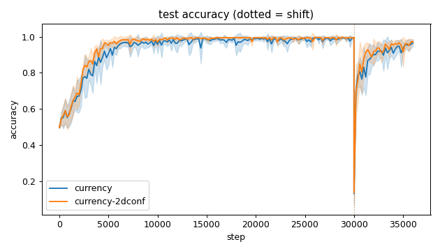
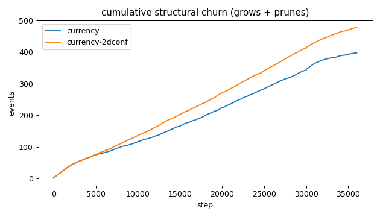
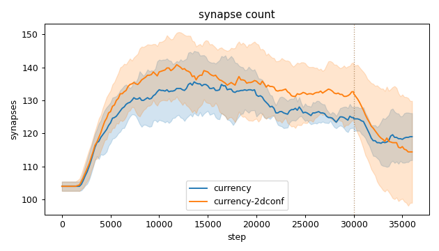
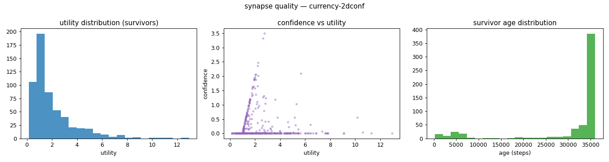
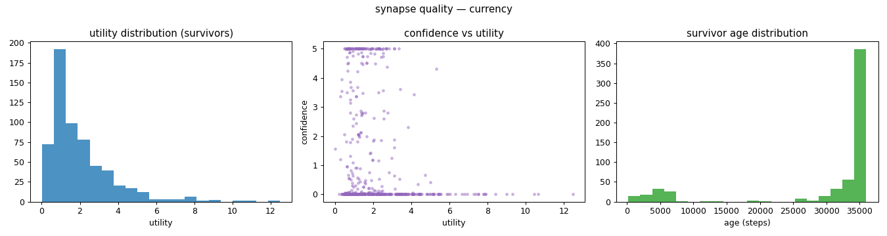
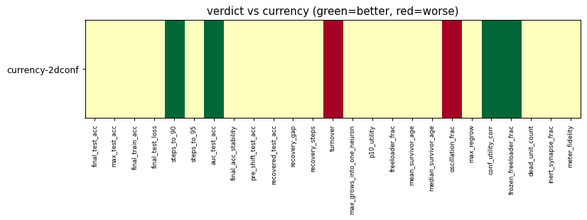

# Evaluation run: 2dconf-vs-currency

- **Date:** 2026-05-31 11:36:10
- **Variants:** currency, currency-2dconf  (baseline: currency)
- **Seeds:** 5  |  **Dataset:** spirals  |  **Steps:** 30000 (+6000 shift)
- **Commit:** 43070a6
- **Command:** `python evaluate.py --variants currency,currency-2dconf --baseline currency --seeds 5 --dataset spirals --steps 30000 --shift 6000 --jobs 6 --no-cache --publish --run-name 2dconf-vs-currency`

## Key metrics

| Metric | What it means | currency (baseline) | currency-2dconf |
|---|---|---|---|
| final_test_acc ↑ | held-out accuracy at the end of the run | 0.967 ± 0.019 | 0.971 ± 0.013 ≈ |
| pre_shift_test_acc ↑ | test accuracy just before the concept shift | 0.993 ± 0.004 | 0.995 ± 0.004 ≈ |
| recovered_test_acc ↑ | test accuracy at the end, after the label swap | 0.967 ± 0.019 | 0.971 ± 0.013 ≈ |
| auc_test_acc ↑ | area under the test-accuracy curve (speed + level) | 0.926 ± 0.013 | 0.943 ± 0.008 ▲ |
| max_grows_into_one_neuron ↓ | most times one neuron was grown into (churn) | 29.800 ± 3.970 | 36.200 ± 8.183 ≈ |
| oscillation_frac ↓ | fraction of grown edges grown ≥2× (thrash) | 0.333 ± 0.052 | 0.395 ± 0.041 ▼ |
| freeloader_frac ↓ | fraction of synapses below the prune-utility floor | 0.023 ± 0.016 | 0.022 ± 0.011 ≈ |
| conf_utility_corr ↑ | corr of confidence with real utility (calibration) | -0.172 ± 0.054 | 0.020 ± 0.062 ▲ |
| dead_unit_count ↓ | hidden neurons that never fire on test data | 4.400 ± 1.020 | 4.600 ± 2.332 ≈ |

## Full scorecard

| Metric | currency (baseline) | currency-2dconf |
|---|---|---|
| **Prediction performance** | | |
| final_test_acc ↑ | 0.967 ± 0.019 | 0.971 ± 0.013 ≈ |
| max_test_acc ↑ | 0.996 ± 0.004 | 0.998 ± 0.002 ≈ |
| final_train_acc ↑ | 0.971 ± 0.021 | 0.976 ± 0.015 ≈ |
| final_test_loss ↓ | 0.111 ± 0.047 | 0.092 ± 0.040 ≈ |
| **Training efficacy** | | |
| steps_to_90 ↓ | 4121 ± 765.245 | 3121 ± 411.825 ▲ |
| steps_to_95 ↓ | 5521 ± 968.297 | 4641 ± 941.488 ≈ |
| auc_test_acc ↑ | 0.926 ± 0.013 | 0.943 ± 0.008 ▲ |
| final_acc_stability ↓ | 0.022 ± 0.015 | 0.024 ± 0.022 ≈ |
| pre_shift_test_acc ↑ | 0.993 ± 0.004 | 0.995 ± 0.004 ≈ |
| recovered_test_acc ↑ | 0.967 ± 0.019 | 0.971 ± 0.013 ≈ |
| recovery_gap ↓ | 0.027 ± 0.015 | 0.024 ± 0.013 ≈ |
| recovery_steps ↓ | ∞ ± — | ∞ ± — ? |
| **Synapse structure** | | |
| synapse_count_start | 104 ± 1.414 | 104 ± 1.414 ≈ |
| synapse_count_peak | 138.600 ± 6.280 | 143.800 ± 8.424 ≈ |
| synapse_count_end | 119 ± 7.127 | 114.400 ± 15.409 ≈ |
| n_grow_events | 207 ± 27.619 | 244.600 ± 25.594 ≈ |
| n_prune_events | 190 ± 27.907 | 232.200 ± 17.337 ≈ |
| distinct_neurons_grown | 15.800 ± 0.980 | 17.200 ± 1.166 ≈ |
| turnover ↓ | 3.160 ± 0.397 | 3.688 ± 0.154 ▼ |
| max_grows_into_one_neuron ↓ | 29.800 ± 3.970 | 36.200 ± 8.183 ≈ |
| mean_fan_in | 3.967 ± 0.238 | 3.813 ± 0.514 ≈ |
| mean_fan_out | 3.967 ± 0.238 | 3.813 ± 0.514 ≈ |
| effective_density | 0.551 ± 0.033 | 0.530 ± 0.071 ≈ |
| **Synapse quality** | | |
| p10_utility ↑ | 0.628 ± 0.025 | 0.645 ± 0.052 ≈ |
| freeloader_frac ↓ | 0.023 ± 0.016 | 0.022 ± 0.011 ≈ |
| mean_survivor_age ↑ | 30145 ± 1091 | 31215 ± 2362 ≈ |
| median_survivor_age ↑ | 36000 ± 0 | 36000 ± 0 ≈ |
| mean_pruned_lifespan | 4905 ± 644.839 | 4807 ± 573.745 ≈ |
| oscillation_frac ↓ | 0.333 ± 0.052 | 0.395 ± 0.041 ▼ |
| max_regrow ↓ | 10 ± 2 | 11.200 ± 1.166 ≈ |
| conf_utility_corr ↑ | -0.172 ± 0.054 | 0.020 ± 0.062 ▲ |
| frozen_freeloader_frac ↓ | 0.009 ± 0.008 | 0 ± 0 ▲ |
| dead_unit_count ↓ | 4.400 ± 1.020 | 4.600 ± 2.332 ≈ |
| inert_synapse_frac ↓ | 0 ± 0 | 0 ± 0 ≈ |
| used_vs_allocated | 1.167 ± 0.079 | 1.122 ± 0.155 ≈ |
| **Signal sanity** | | |
| meter_fidelity ↑ | 0.880 ± 0.129 | 0.872 ± 0.069 ≈ |

Baseline: **currency**. ▲ better / ▼ worse / ≈ no clear difference vs baseline (95% bootstrap CI of the mean difference). Cells show mean ± std across seeds.

## Charts

### acc_curves

### churn_curves

### count_curves

### quality_currency-2dconf

### quality_currency

### verdict_heatmap

