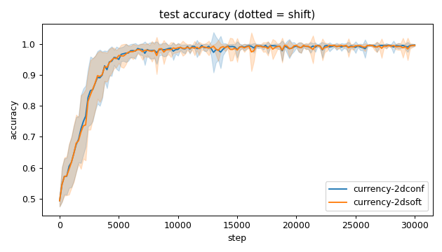
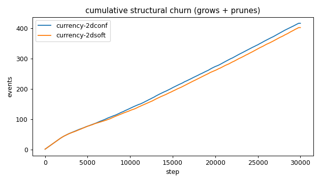
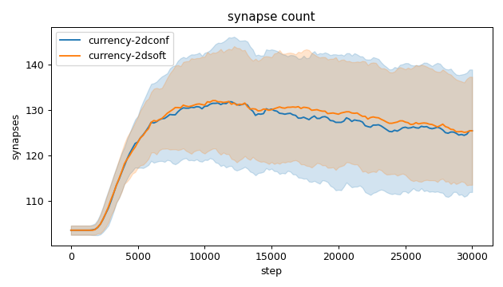
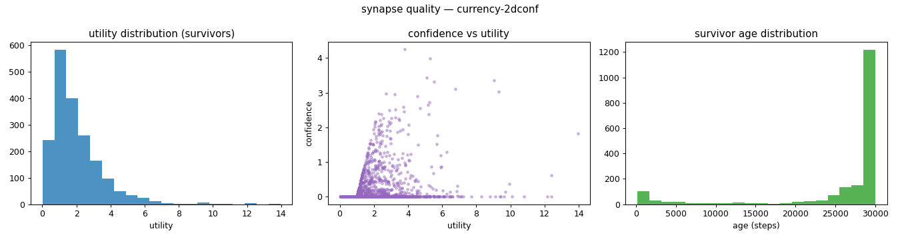
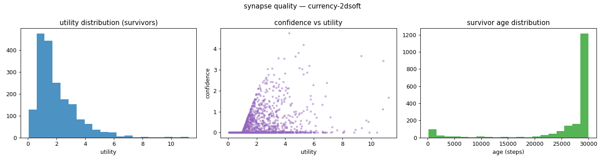
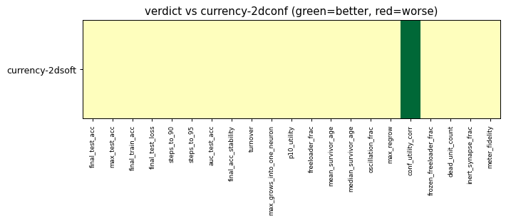

# Evaluation run: 2dsoft-vs-2dconf-noshift-15seeds

- **Date:** 2026-05-31 15:46:09
- **Variants:** currency-2dconf, currency-2dsoft  (baseline: currency-2dconf)
- **Seeds:** 15  |  **Dataset:** spirals  |  **Steps:** 30000 (+0 shift)
- **Commit:** 688eeb0
- **Command:** `python evaluate.py --variants currency-2dconf,currency-2dsoft --baseline currency-2dconf --seeds 15 --dataset spirals --steps 30000 --shift 0 --jobs 6 --no-cache --publish --run-name 2dsoft-vs-2dconf-noshift-15seeds`

## Key metrics

| Metric | What it means | currency-2dconf (baseline) | currency-2dsoft |
|---|---|---|---|
| final_test_acc ↑ | held-out accuracy at the end of the run | 0.996 ± 0.003 | 0.996 ± 0.003 ≈ |
| auc_test_acc ↑ | area under the test-accuracy curve (speed + level) | 0.954 ± 0.010 | 0.953 ± 0.011 ≈ |
| max_grows_into_one_neuron ↓ | most times one neuron was grown into (churn) | 37.800 ± 8.495 | 37.600 ± 5.690 ≈ |
| oscillation_frac ↓ | fraction of grown edges grown ≥2× (thrash) | 0.397 ± 0.056 | 0.368 ± 0.066 ≈ |
| freeloader_frac ↓ | fraction of synapses below the prune-utility floor | 0.036 ± 0.034 | 0.032 ± 0.029 ≈ |
| conf_utility_corr ↑ | corr of confidence with real utility (calibration) | 0.207 ± 0.152 | 0.314 ± 0.125 ▲ |
| dead_unit_count ↓ | hidden neurons that never fire on test data | 3.400 ± 1.818 | 3.600 ± 1.993 ≈ |

## Full scorecard

| Metric | currency-2dconf (baseline) | currency-2dsoft |
|---|---|---|
| **Prediction performance** | | |
| final_test_acc ↑ | 0.996 ± 0.003 | 0.996 ± 0.003 ≈ |
| max_test_acc ↑ | 0.999 ± 0.001 | 0.998 ± 0.002 ≈ |
| final_train_acc ↑ | 0.998 ± 0.003 | 0.998 ± 0.002 ≈ |
| final_test_loss ↓ | 0.015 ± 0.009 | 0.015 ± 0.008 ≈ |
| **Training efficacy** | | |
| steps_to_90 ↓ | 3001 ± 711.805 | 3174 ± 775.858 ≈ |
| steps_to_95 ↓ | 3974 ± 1177 | 3921 ± 1117 ≈ |
| auc_test_acc ↑ | 0.954 ± 0.010 | 0.953 ± 0.011 ≈ |
| final_acc_stability ↓ | 0.006 ± 0.007 | 0.010 ± 0.013 ≈ |
| **Synapse structure** | | |
| synapse_count_start | 103.533 ± 1.024 | 103.533 ± 1.024 ≈ |
| synapse_count_peak | 136.067 ± 12.141 | 136.667 ± 9.964 ≈ |
| synapse_count_end | 125.467 ± 13.515 | 125.467 ± 11.916 ≈ |
| n_grow_events | 220 ± 23.249 | 212.933 ± 20.038 ≈ |
| n_prune_events | 196.067 ± 19.475 | 189 ± 19.339 ≈ |
| distinct_neurons_grown | 14.933 ± 2.112 | 14.200 ± 2.286 ≈ |
| turnover ↓ | 3.349 ± 0.410 | 3.215 ± 0.399 ≈ |
| max_grows_into_one_neuron ↓ | 37.800 ± 8.495 | 37.600 ± 5.690 ≈ |
| mean_fan_in | 4.182 ± 0.450 | 4.182 ± 0.397 ≈ |
| mean_fan_out | 4.182 ± 0.450 | 4.182 ± 0.397 ≈ |
| effective_density | 0.581 ± 0.063 | 0.581 ± 0.055 ≈ |
| **Synapse quality** | | |
| p10_utility ↑ | 0.662 ± 0.110 | 0.671 ± 0.072 ≈ |
| freeloader_frac ↓ | 0.036 ± 0.034 | 0.032 ± 0.029 ≈ |
| mean_survivor_age ↑ | 25915 ± 873.066 | 26217 ± 867.733 ≈ |
| median_survivor_age ↑ | 29973 ± 100.027 | 29986 ± 50.104 ≈ |
| mean_pruned_lifespan | 2575 ± 483.221 | 2580 ± 424.471 ≈ |
| oscillation_frac ↓ | 0.397 ± 0.056 | 0.368 ± 0.066 ≈ |
| max_regrow ↓ | 10.867 ± 1.746 | 11 ± 2.422 ≈ |
| conf_utility_corr ↑ | 0.207 ± 0.152 | 0.314 ± 0.125 ▲ |
| frozen_freeloader_frac ↓ | 0 ± 0 | 0 ± 0 ≈ |
| dead_unit_count ↓ | 3.400 ± 1.818 | 3.600 ± 1.993 ≈ |
| inert_synapse_frac ↓ | 0 ± 0 | 0 ± 0 ≈ |
| used_vs_allocated | 1.236 ± 0.132 | 1.236 ± 0.118 ≈ |
| **Signal sanity** | | |
| meter_fidelity ↑ | 0.675 ± 0.242 | 0.657 ± 0.260 ≈ |

Baseline: **currency-2dconf**. ▲ better / ▼ worse / ≈ no clear difference vs baseline (95% bootstrap CI of the mean difference). Cells show mean ± std across seeds.

## Charts

### acc_curves

### churn_curves

### count_curves

### quality_currency-2dconf

### quality_currency-2dsoft

### verdict_heatmap

