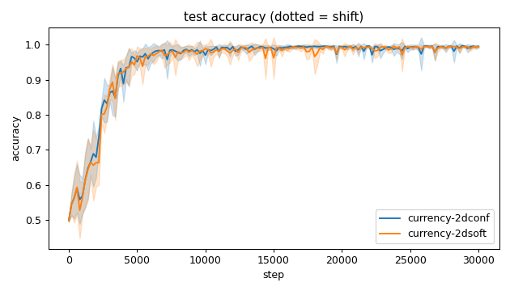
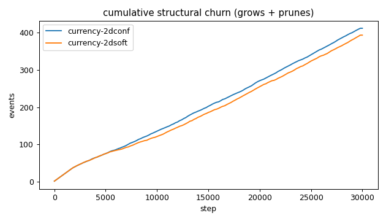
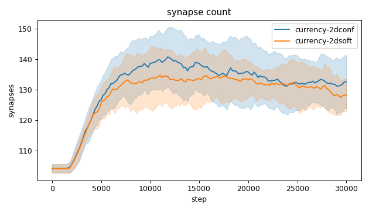
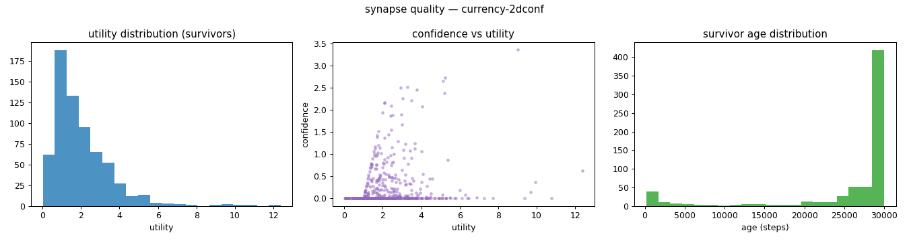
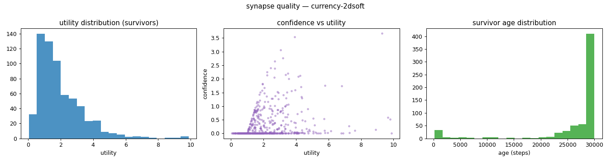
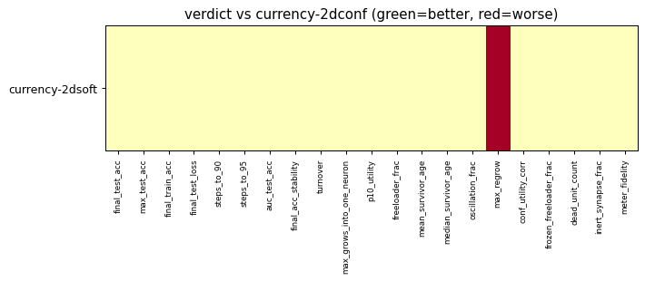

# Evaluation run: 2dsoft-vs-2dconf-noshift

- **Date:** 2026-05-31 15:08:35
- **Variants:** currency-2dconf, currency-2dsoft  (baseline: currency-2dconf)
- **Seeds:** 5  |  **Dataset:** spirals  |  **Steps:** 30000 (+0 shift)
- **Commit:** ae0ce00
- **Command:** `python evaluate.py --variants currency-2dconf,currency-2dsoft --baseline currency-2dconf --seeds 5 --dataset spirals --steps 30000 --shift 0 --jobs 6 --no-cache --publish --run-name 2dsoft-vs-2dconf-noshift`

## Key metrics

| Metric | What it means | currency-2dconf (baseline) | currency-2dsoft |
|---|---|---|---|
| final_test_acc ↑ | held-out accuracy at the end of the run | 0.995 ± 0.004 | 0.994 ± 0.003 ≈ |
| auc_test_acc ↑ | area under the test-accuracy curve (speed + level) | 0.951 ± 0.006 | 0.948 ± 0.008 ≈ |
| max_grows_into_one_neuron ↓ | most times one neuron was grown into (churn) | 34.400 ± 8.777 | 36 ± 5.514 ≈ |
| oscillation_frac ↓ | fraction of grown edges grown ≥2× (thrash) | 0.382 ± 0.055 | 0.331 ± 0.038 ≈ |
| freeloader_frac ↓ | fraction of synapses below the prune-utility floor | 0.041 ± 0.040 | 0.038 ± 0.034 ≈ |
| conf_utility_corr ↑ | corr of confidence with real utility (calibration) | 0.235 ± 0.143 | 0.296 ± 0.089 ≈ |
| dead_unit_count ↓ | hidden neurons that never fire on test data | 2.200 ± 1.327 | 2.800 ± 2.227 ≈ |

## Full scorecard

| Metric | currency-2dconf (baseline) | currency-2dsoft |
|---|---|---|
| **Prediction performance** | | |
| final_test_acc ↑ | 0.995 ± 0.004 | 0.994 ± 0.003 ≈ |
| max_test_acc ↑ | 0.998 ± 0.002 | 0.997 ± 0.002 ≈ |
| final_train_acc ↑ | 0.998 ± 0.003 | 0.999 ± 0.002 ≈ |
| final_test_loss ↓ | 0.019 ± 0.013 | 0.016 ± 0.011 ≈ |
| **Training efficacy** | | |
| steps_to_90 ↓ | 3121 ± 411.825 | 3521 ± 652.380 ≈ |
| steps_to_95 ↓ | 4641 ± 941.488 | 4401 ± 1004 ≈ |
| auc_test_acc ↑ | 0.951 ± 0.006 | 0.948 ± 0.008 ≈ |
| final_acc_stability ↓ | 0.006 ± 0.009 | 0.003 ± 0.002 ≈ |
| **Synapse structure** | | |
| synapse_count_start | 104 ± 1.414 | 104 ± 1.414 ≈ |
| synapse_count_peak | 143.800 ± 8.424 | 139.400 ± 6.621 ≈ |
| synapse_count_end | 132.600 ± 8.732 | 128.200 ± 5.381 ≈ |
| n_grow_events | 221 ± 21.185 | 209.600 ± 10.613 ≈ |
| n_prune_events | 190.400 ± 15.945 | 183.400 ± 12.690 ≈ |
| distinct_neurons_grown | 16.600 ± 0.800 | 15.400 ± 2.059 ≈ |
| turnover ↓ | 3.140 ± 0.197 | 3.063 ± 0.207 ≈ |
| max_grows_into_one_neuron ↓ | 34.400 ± 8.777 | 36 ± 5.514 ≈ |
| mean_fan_in | 4.420 ± 0.291 | 4.273 ± 0.179 ≈ |
| mean_fan_out | 4.420 ± 0.291 | 4.273 ± 0.179 ≈ |
| effective_density | 0.614 ± 0.040 | 0.594 ± 0.025 ≈ |
| **Synapse quality** | | |
| p10_utility ↑ | 0.638 ± 0.135 | 0.656 ± 0.075 ≈ |
| freeloader_frac ↓ | 0.041 ± 0.040 | 0.038 ± 0.034 ≈ |
| mean_survivor_age ↑ | 25748 ± 787.476 | 26341 ± 426.749 ≈ |
| median_survivor_age ↑ | 30000 ± 0 | 30000 ± 0.400 ≈ |
| mean_pruned_lifespan | 2736 ± 626.807 | 2591 ± 532.862 ≈ |
| oscillation_frac ↓ | 0.382 ± 0.055 | 0.331 ± 0.038 ≈ |
| max_regrow ↓ | 10.600 ± 0.800 | 12.600 ± 1.960 ▼ |
| conf_utility_corr ↑ | 0.235 ± 0.143 | 0.296 ± 0.089 ≈ |
| frozen_freeloader_frac ↓ | 0 ± 0 | 0 ± 0 ≈ |
| dead_unit_count ↓ | 2.200 ± 1.327 | 2.800 ± 2.227 ≈ |
| inert_synapse_frac ↓ | 0 ± 0 | 0 ± 0 ≈ |
| used_vs_allocated | 1.300 ± 0.089 | 1.257 ± 0.053 ≈ |
| **Signal sanity** | | |
| meter_fidelity ↑ | 0.760 ± 0.135 | 0.780 ± 0.173 ≈ |

Baseline: **currency-2dconf**. ▲ better / ▼ worse / ≈ no clear difference vs baseline (95% bootstrap CI of the mean difference). Cells show mean ± std across seeds.

## Charts

### acc_curves

### churn_curves

### count_curves

### quality_currency-2dconf

### quality_currency-2dsoft

### verdict_heatmap

