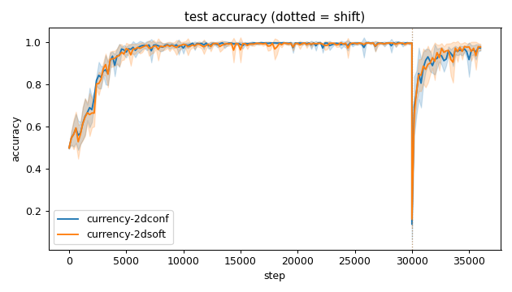
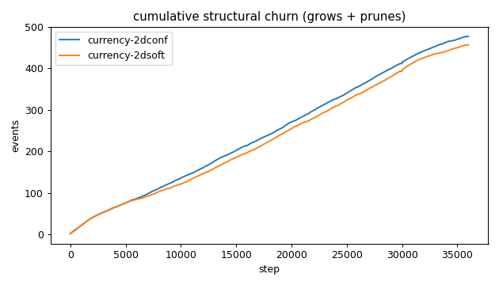
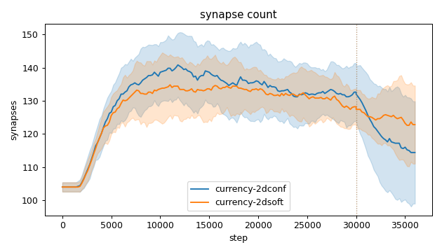
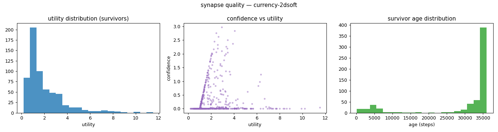
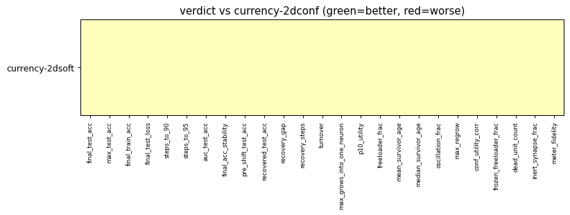

# Evaluation run: 2dsoft-vs-2dconf

- **Date:** 2026-05-31 15:07:45
- **Variants:** currency-2dconf, currency-2dsoft  (baseline: currency-2dconf)
- **Seeds:** 5  |  **Dataset:** spirals  |  **Steps:** 30000 (+6000 shift)
- **Commit:** ae0ce00
- **Command:** `python evaluate.py --variants currency-2dconf,currency-2dsoft --baseline currency-2dconf --seeds 5 --dataset spirals --steps 30000 --shift 6000 --jobs 6 --no-cache --publish --run-name 2dsoft-vs-2dconf`

## Key metrics

| Metric | What it means | currency-2dconf (baseline) | currency-2dsoft |
|---|---|---|---|
| final_test_acc ↑ | held-out accuracy at the end of the run | 0.971 ± 0.013 | 0.975 ± 0.015 ≈ |
| pre_shift_test_acc ↑ | test accuracy just before the concept shift | 0.995 ± 0.004 | 0.994 ± 0.003 ≈ |
| recovered_test_acc ↑ | test accuracy at the end, after the label swap | 0.971 ± 0.013 | 0.975 ± 0.015 ≈ |
| auc_test_acc ↑ | area under the test-accuracy curve (speed + level) | 0.943 ± 0.008 | 0.941 ± 0.011 ≈ |
| max_grows_into_one_neuron ↓ | most times one neuron was grown into (churn) | 36.200 ± 8.183 | 37.400 ± 4.883 ≈ |
| oscillation_frac ↓ | fraction of grown edges grown ≥2× (thrash) | 0.395 ± 0.041 | 0.350 ± 0.031 ≈ |
| freeloader_frac ↓ | fraction of synapses below the prune-utility floor | 0.022 ± 0.011 | 0.017 ± 0.009 ≈ |
| conf_utility_corr ↑ | corr of confidence with real utility (calibration) | 0.020 ± 0.062 | 0.099 ± 0.116 ≈ |
| dead_unit_count ↓ | hidden neurons that never fire on test data | 4.600 ± 2.332 | 4.600 ± 1.960 ≈ |

## Full scorecard

| Metric | currency-2dconf (baseline) | currency-2dsoft |
|---|---|---|
| **Prediction performance** | | |
| final_test_acc ↑ | 0.971 ± 0.013 | 0.975 ± 0.015 ≈ |
| max_test_acc ↑ | 0.998 ± 0.002 | 0.997 ± 0.002 ≈ |
| final_train_acc ↑ | 0.976 ± 0.015 | 0.979 ± 0.014 ≈ |
| final_test_loss ↓ | 0.092 ± 0.040 | 0.077 ± 0.043 ≈ |
| **Training efficacy** | | |
| steps_to_90 ↓ | 3121 ± 411.825 | 3521 ± 652.380 ≈ |
| steps_to_95 ↓ | 4641 ± 941.488 | 4401 ± 1004 ≈ |
| auc_test_acc ↑ | 0.943 ± 0.008 | 0.941 ± 0.011 ≈ |
| final_acc_stability ↓ | 0.024 ± 0.022 | 0.021 ± 0.019 ≈ |
| pre_shift_test_acc ↑ | 0.995 ± 0.004 | 0.994 ± 0.003 ≈ |
| recovered_test_acc ↑ | 0.971 ± 0.013 | 0.975 ± 0.015 ≈ |
| recovery_gap ↓ | 0.024 ± 0.013 | 0.019 ± 0.015 ≈ |
| recovery_steps ↓ | ∞ ± — | ∞ ± — ? |
| **Synapse structure** | | |
| synapse_count_start | 104 ± 1.414 | 104 ± 1.414 ≈ |
| synapse_count_peak | 143.800 ± 8.424 | 140.800 ± 7.305 ≈ |
| synapse_count_end | 114.400 ± 15.409 | 122.800 ± 11.771 ≈ |
| n_grow_events | 244.600 ± 25.594 | 238.600 ± 14.527 ≈ |
| n_prune_events | 232.200 ± 17.337 | 217.800 ± 10.342 ≈ |
| distinct_neurons_grown | 17.200 ± 1.166 | 16.200 ± 1.470 ≈ |
| turnover ↓ | 3.688 ± 0.154 | 3.570 ± 0.135 ≈ |
| max_grows_into_one_neuron ↓ | 36.200 ± 8.183 | 37.400 ± 4.883 ≈ |
| mean_fan_in | 3.813 ± 0.514 | 4.093 ± 0.392 ≈ |
| mean_fan_out | 3.813 ± 0.514 | 4.093 ± 0.392 ≈ |
| effective_density | 0.530 ± 0.071 | 0.569 ± 0.054 ≈ |
| **Synapse quality** | | |
| p10_utility ↑ | 0.645 ± 0.052 | 0.676 ± 0.058 ≈ |
| freeloader_frac ↓ | 0.022 ± 0.011 | 0.017 ± 0.009 ≈ |
| mean_survivor_age ↑ | 31215 ± 2362 | 30145 ± 2438 ≈ |
| median_survivor_age ↑ | 36000 ± 0 | 35760 ± 388.186 ≈ |
| mean_pruned_lifespan | 4807 ± 573.745 | 4269 ± 713.479 ≈ |
| oscillation_frac ↓ | 0.395 ± 0.041 | 0.350 ± 0.031 ≈ |
| max_regrow ↓ | 11.200 ± 1.166 | 12.600 ± 1.960 ≈ |
| conf_utility_corr ↑ | 0.020 ± 0.062 | 0.099 ± 0.116 ≈ |
| frozen_freeloader_frac ↓ | 0 ± 0 | 0 ± 0 ≈ |
| dead_unit_count ↓ | 4.600 ± 2.332 | 4.600 ± 1.960 ≈ |
| inert_synapse_frac ↓ | 0 ± 0 | 0 ± 0 ≈ |
| used_vs_allocated | 1.122 ± 0.155 | 1.204 ± 0.113 ≈ |
| **Signal sanity** | | |
| meter_fidelity ↑ | 0.872 ± 0.069 | 0.826 ± 0.167 ≈ |

Baseline: **currency-2dconf**. ▲ better / ▼ worse / ≈ no clear difference vs baseline (95% bootstrap CI of the mean difference). Cells show mean ± std across seeds.

## Charts

### acc_curves

### churn_curves

### count_curves

### quality_currency-2dconf

### quality_currency-2dsoft

### verdict_heatmap

