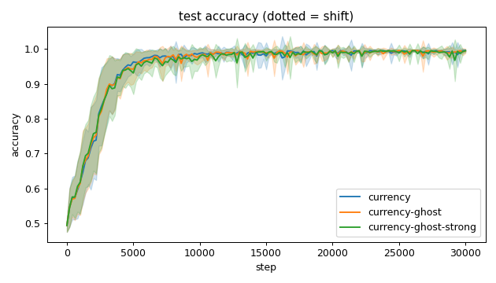
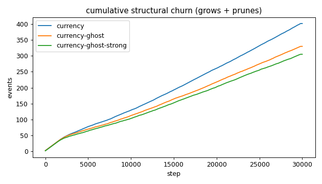
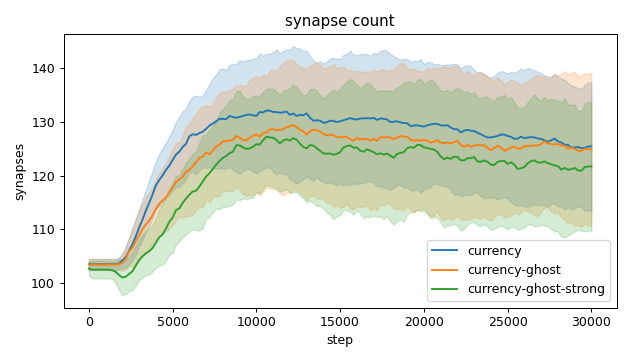
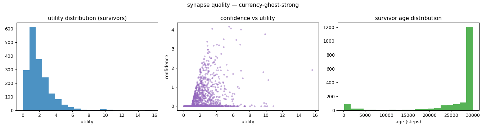
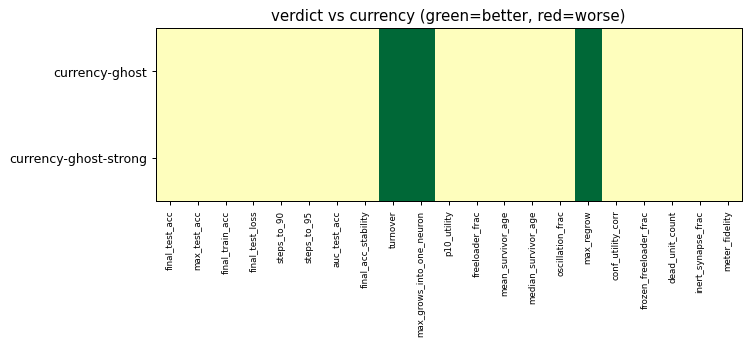

# Evaluation run: a2-ghost-meter

- **Date:** 2026-05-31 20:45:23
- **Variants:** currency, currency-ghost, currency-ghost-strong  (baseline: currency)
- **Seeds:** 15  |  **Dataset:** spirals  |  **Steps:** 30000 (+0 shift)
- **Commit:** 0dacbe9
- **Command:** `python evaluate.py --variants currency,currency-ghost,currency-ghost-strong --seeds 15 --baseline currency --jobs 10 --no-cache --publish --run-name a2-ghost-meter`

## Key metrics

| Metric | What it means | currency (baseline) | currency-ghost | currency-ghost-strong |
|---|---|---|---|---|
| final_test_acc ↑ | held-out accuracy at the end of the run | 0.996 ± 0.003 | 0.994 ± 0.006 ≈ | 0.995 ± 0.005 ≈ |
| auc_test_acc ↑ | area under the test-accuracy curve (speed + level) | 0.953 ± 0.011 | 0.952 ± 0.012 ≈ | 0.950 ± 0.014 ≈ |
| max_grows_into_one_neuron ↓ | most times one neuron was grown into (churn) | 37.600 ± 5.690 | 25.133 ± 3.263 ▲ | 22.067 ± 3.511 ▲ |
| oscillation_frac ↓ | fraction of grown edges grown ≥2× (thrash) | 0.368 ± 0.066 | 0.376 ± 0.051 ≈ | 0.366 ± 0.066 ≈ |
| freeloader_frac ↓ | fraction of synapses below the prune-utility floor | 0.032 ± 0.029 | 0.041 ± 0.034 ≈ | 0.034 ± 0.030 ≈ |
| conf_utility_corr ↑ | corr of confidence with real utility (calibration) | 0.314 ± 0.125 | 0.347 ± 0.111 ≈ | 0.339 ± 0.103 ≈ |
| dead_unit_count ↓ | hidden neurons that never fire on test data | 3.600 ± 1.993 | 3.600 ± 2.245 ≈ | 3.600 ± 2.026 ≈ |

## Full scorecard

| Metric | currency (baseline) | currency-ghost | currency-ghost-strong |
|---|---|---|---|
| **Prediction performance** | | | |
| final_test_acc ↑ | 0.996 ± 0.003 | 0.994 ± 0.006 ≈ | 0.995 ± 0.005 ≈ |
| max_test_acc ↑ | 0.998 ± 0.002 | 0.999 ± 0.001 ≈ | 0.999 ± 0.001 ≈ |
| final_train_acc ↑ | 0.998 ± 0.002 | 0.997 ± 0.004 ≈ | 0.997 ± 0.002 ≈ |
| final_test_loss ↓ | 0.015 ± 0.008 | 0.022 ± 0.022 ≈ | 0.019 ± 0.012 ≈ |
| **Training efficacy** | | | |
| steps_to_90 ↓ | 3174 ± 775.858 | 3228 ± 885.036 ≈ | 3348 ± 1042 ≈ |
| steps_to_95 ↓ | 3921 ± 1117 | 4121 ± 1193 ≈ | 4214 ± 1622 ≈ |
| auc_test_acc ↑ | 0.953 ± 0.011 | 0.952 ± 0.012 ≈ | 0.950 ± 0.014 ≈ |
| final_acc_stability ↓ | 0.010 ± 0.013 | 0.007 ± 0.006 ≈ | 0.016 ± 0.019 ≈ |
| **Synapse structure** | | | |
| synapse_count_start | 103.533 ± 1.024 | 103.467 ± 1.024 ≈ | 102.733 ± 1.340 ≈ |
| synapse_count_peak | 136.667 ± 9.964 | 134.467 ± 11.882 ≈ | 133.467 ± 9.824 ≈ |
| synapse_count_end | 125.467 ± 11.916 | 124.933 ± 14.158 ≈ | 121.733 ± 11.964 ≈ |
| n_grow_events | 212.933 ± 20.038 | 176.733 ± 16.114 ≈ | 162.667 ± 18.860 ≈ |
| n_prune_events | 189 ± 19.339 | 153.333 ± 13.573 ≈ | 142.467 ± 18.882 ≈ |
| distinct_neurons_grown | 14.200 ± 2.286 | 14.333 ± 1.578 ≈ | 14.800 ± 1.904 ≈ |
| turnover ↓ | 3.215 ± 0.399 | 2.697 ± 0.281 ▲ | 2.554 ± 0.364 ▲ |
| max_grows_into_one_neuron ↓ | 37.600 ± 5.690 | 25.133 ± 3.263 ▲ | 22.067 ± 3.511 ▲ |
| mean_fan_in | 4.182 ± 0.397 | 4.164 ± 0.472 ≈ | 4.058 ± 0.399 ≈ |
| mean_fan_out | 4.182 ± 0.397 | 4.164 ± 0.472 ≈ | 4.058 ± 0.399 ≈ |
| effective_density | 0.581 ± 0.055 | 0.578 ± 0.066 ≈ | 0.564 ± 0.055 ≈ |
| **Synapse quality** | | | |
| p10_utility ↑ | 0.671 ± 0.072 | 0.673 ± 0.107 ≈ | 0.680 ± 0.073 ≈ |
| freeloader_frac ↓ | 0.032 ± 0.029 | 0.041 ± 0.034 ≈ | 0.034 ± 0.030 ≈ |
| mean_survivor_age ↑ | 26217 ± 867.733 | 26055 ± 717.225 ≈ | 25998 ± 862.004 ≈ |
| median_survivor_age ↑ | 29986 ± 50.104 | 30000 ± 0.249 ≈ | 30000 ± 0.125 ≈ |
| mean_pruned_lifespan | 2580 ± 424.471 | 2882 ± 424.722 ≈ | 3133 ± 449.631 ≈ |
| oscillation_frac ↓ | 0.368 ± 0.066 | 0.376 ± 0.051 ≈ | 0.366 ± 0.066 ≈ |
| max_regrow ↓ | 11 ± 2.422 | 6.200 ± 1.046 ▲ | 4.400 ± 0.952 ▲ |
| conf_utility_corr ↑ | 0.314 ± 0.125 | 0.347 ± 0.111 ≈ | 0.339 ± 0.103 ≈ |
| frozen_freeloader_frac ↓ | 0 ± 0 | 0 ± 0 ≈ | 0 ± 0 ≈ |
| dead_unit_count ↓ | 3.600 ± 1.993 | 3.600 ± 2.245 ≈ | 3.600 ± 2.026 ≈ |
| inert_synapse_frac ↓ | 0 ± 0 | 0 ± 0 ≈ | 0.000 ± 0.002 ≈ |
| used_vs_allocated | 1.236 ± 0.118 | 1.230 ± 0.138 ≈ | 1.199 ± 0.115 ≈ |
| **Signal sanity** | | | |
| meter_fidelity ↑ | 0.657 ± 0.260 | 0.686 ± 0.115 ≈ | 0.722 ± 0.253 ≈ |

Baseline: **currency**. ▲ better / ▼ worse / ≈ no clear difference vs baseline (95% bootstrap CI of the mean difference). Cells show mean ± std across seeds.

## Charts

### acc_curves

### churn_curves

### count_curves

### quality_currency-ghost-strong

### quality_currency-ghost

### quality_currency

### verdict_heatmap

