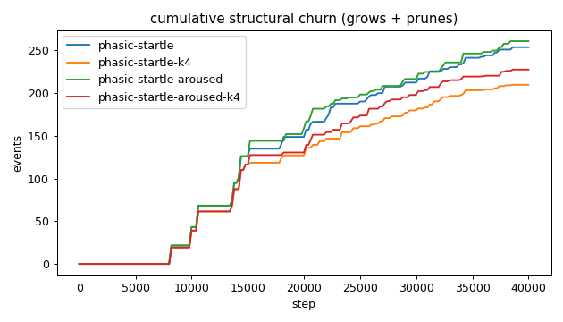
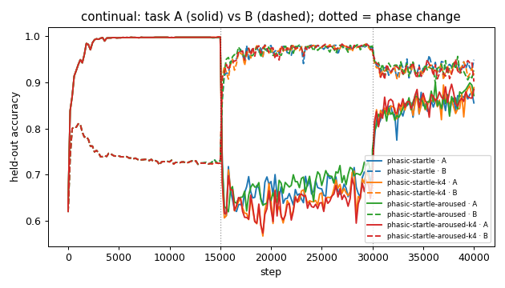
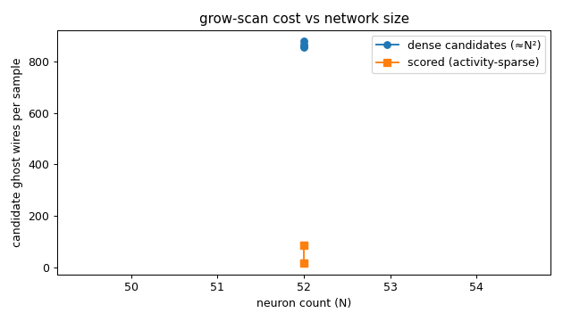
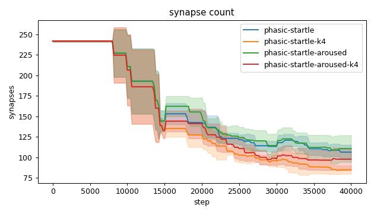
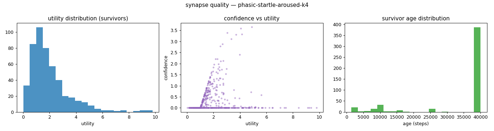
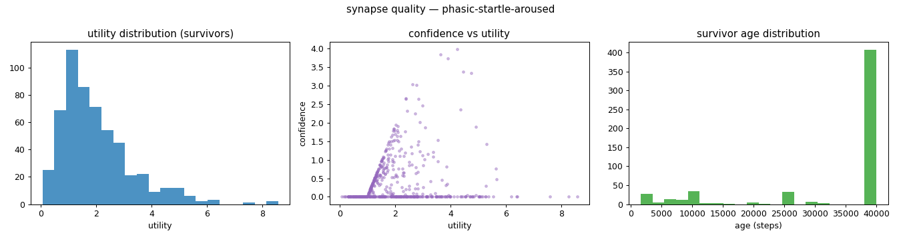
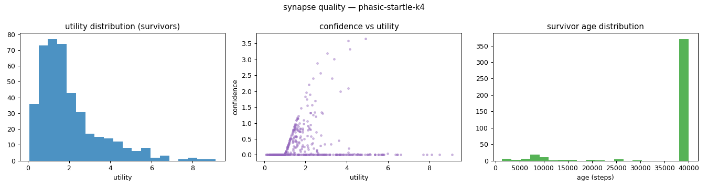
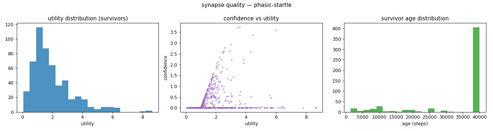
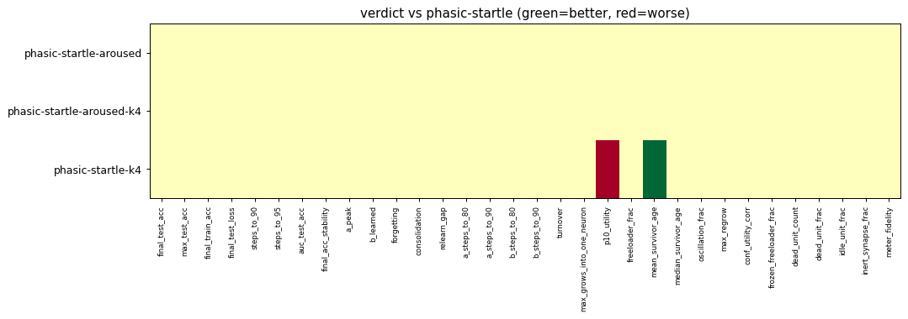

# Evaluation run: aroused-grow-continual

- **Date:** 2026-06-12 21:23:56
- **Variants:** phasic-startle, phasic-startle-aroused, phasic-startle-aroused-k4, phasic-startle-k4  (baseline: phasic-startle)
- **Seeds:** 5  |  **Dataset:** spirals  |  **Steps:** 15000 (+0 shift)
- **Commit:** da0d1d1
- **Command:** `python evaluate.py --variants phasic-startle,phasic-startle-k4,phasic-startle-aroused,phasic-startle-aroused-k4 --seeds 5 --regime continual --baseline phasic-startle --jobs 6 --no-cache --publish --run-name aroused-grow-continual`

## Key metrics

| Metric | What it means | phasic-startle (baseline) | phasic-startle-aroused | phasic-startle-aroused-k4 | phasic-startle-k4 |
|---|---|---|---|---|---|
| final_test_acc ↑ | held-out accuracy at the end of the run | 0.903 ± 0.014 | 0.899 ± 0.023 ≈ | 0.894 ± 0.015 ≈ | 0.903 ± 0.016 ≈ |
| steps_to_90 ↓ | steps to first reach 90% test accuracy | ∞ ± — | 33601 ± 2595 ? | 33761 ± 3026 ? | ∞ ± — ? |
| steps_to_95 ↓ | steps to first reach 95% test accuracy | ∞ ± — | ∞ ± — ? | ∞ ± — ? | ∞ ± — ? |
| auc_test_acc ↑ | area under the test-accuracy curve (speed + level) | 0.853 ± 0.010 | 0.855 ± 0.011 ≈ | 0.849 ± 0.015 ≈ | 0.848 ± 0.015 ≈ |
| a_peak ↑ | accuracy on task A at the end of phase A (its peak) | 0.998 ± 0.004 | 0.998 ± 0.004 ≈ | 0.999 ± 0.002 ≈ | 0.999 ± 0.002 ≈ |
| a_steps_to_90 ↓ | steps into phase A to reach 90% on task A (first-task speed) | 560 ± 233.238 | 560 ± 233.238 ≈ | 560 ± 233.238 ≈ | 560 ± 233.238 ≈ |
| b_learned ↑ | accuracy on task B at the end of phase B (forward learning) | 0.979 ± 0.003 | 0.979 ± 0.003 ≈ | 0.972 ± 0.014 ≈ | 0.973 ± 0.013 ≈ |
| b_steps_to_90 ↓ | steps into phase B to reach 90% on task B (second-task speed) | 360 ± 149.666 | 320 ± 97.980 ≈ | 280 ± 97.980 ≈ | 280 ± 97.980 ≈ |
| forgetting ↓ | task A accuracy lost while learning B (lower=better) | 0.288 ± 0.062 | 0.291 ± 0.073 ≈ | 0.315 ± 0.069 ≈ | 0.304 ± 0.077 ≈ |
| consolidation ↑ | min(A, B) accuracy after interleaved A+B (holds both?) | 0.856 ± 0.035 | 0.868 ± 0.039 ≈ | 0.857 ± 0.026 ≈ | 0.875 ± 0.020 ≈ |
| synapse_count_end | live synapses at the end | 106.400 ± 8.890 | 110.600 ± 16.354 ≈ | 97.800 ± 13.644 ≈ | 84.800 ± 5.115 ≈ |
| effective_density | live edges as a fraction of fully-connected | 0.185 ± 0.015 | 0.192 ± 0.028 ≈ | 0.170 ± 0.024 ≈ | 0.147 ± 0.009 ≈ |
| ghost_dense_cost | candidate ghost wires the grow-scan must consider (~N²) | 857.600 ± 8.890 | 853.400 ± 16.354 ≈ | 866.200 ± 13.644 ≈ | 879.200 ± 5.115 ≈ |
| ghost_pairs_scored | candidate wires actually scored after activity+demand pruning | 84.713 ± 13.896 | 86.823 ± 13.752 ≈ | 17.401 ± 2.642 ≈ | 15.858 ± 3.248 ≈ |
| mean_neuron_activation | avg hidden-neuron ReLU output on test data (neuron value) | 0.237 ± 0.027 | 0.259 ± 0.036 ≈ | 0.251 ± 0.043 ≈ | 0.261 ± 0.052 ≈ |
| dead_unit_frac ↓ | fraction of hidden neurons that never fire (scale-free) | 0.175 ± 0.045 | 0.171 ± 0.040 ≈ | 0.162 ± 0.050 ≈ | 0.162 ± 0.044 ≈ |
| idle_unit_frac ↓ | fraction of hidden neurons dead OR outputless (not in service) | 0.346 ± 0.034 | 0.346 ± 0.045 ≈ | 0.350 ± 0.053 ≈ | 0.362 ± 0.021 ≈ |
| n_recycle_events | dead-unit recycles fired over the run (sleep recycling) | 0 ± 0 | 0 ± 0 ≈ | 0 ± 0 ≈ | 0 ± 0 ≈ |
| recycled_rehired_frac | of recycled units, fraction back in service at the end | — ± — | — ± — ? | — ± — ? | — ± — ? |
| n_startle_events | demand-spike hiring alarms fired (startle growth) | 1.800 ± 0.400 | 2 ± 0 ≈ | 1.800 ± 0.400 ≈ | 1.600 ± 0.490 ≈ |
| n_arousal_events | post-startle refinement windows that ran grow-only passes | 0 ± 0 | 1.400 ± 0.490 ≈ | 0.600 ± 0.490 ≈ | 0 ± 0 ≈ |
| max_grows_into_one_neuron ↓ | most times one neuron was grown into (churn) | 9.400 ± 1.855 | 11.600 ± 5.352 ≈ | 9.800 ± 3.544 ≈ | 7.400 ± 1.356 ≈ |
| oscillation_frac ↓ | fraction of grown edges grown ≥2× (thrash) | 0.083 ± 0.038 | 0.062 ± 0.069 ≈ | 0.078 ± 0.063 ≈ | 0.058 ± 0.039 ≈ |
| freeloader_frac ↓ | fraction of synapses below the prune-utility floor | 0.052 ± 0.016 | 0.044 ± 0.011 ≈ | 0.062 ± 0.021 ≈ | 0.075 ± 0.026 ≈ |
| conf_utility_corr ↑ | corr of confidence with real utility (calibration) | 0.113 ± 0.099 | 0.147 ± 0.085 ≈ | 0.103 ± 0.056 ≈ | 0.079 ± 0.045 ≈ |
| dead_unit_count ↓ | hidden neurons that never fire on test data | 8.400 ± 2.154 | 8.200 ± 1.939 ≈ | 7.800 ± 2.400 ≈ | 7.800 ± 2.135 ≈ |

## Full scorecard

| Metric | phasic-startle (baseline) | phasic-startle-aroused | phasic-startle-aroused-k4 | phasic-startle-k4 |
|---|---|---|---|---|
| **Prediction performance** | | | | |
| final_test_acc ↑ | 0.903 ± 0.014 | 0.899 ± 0.023 ≈ | 0.894 ± 0.015 ≈ | 0.903 ± 0.016 ≈ |
| max_test_acc ↑ | 0.923 ± 0.018 | 0.919 ± 0.004 ≈ | 0.920 ± 0.017 ≈ | 0.914 ± 0.019 ≈ |
| final_train_acc ↑ | 0.909 ± 0.015 | 0.902 ± 0.021 ≈ | 0.898 ± 0.019 ≈ | 0.906 ± 0.022 ≈ |
| final_test_loss ↓ | 0.214 ± 0.022 | 0.214 ± 0.040 ≈ | 0.227 ± 0.039 ≈ | 0.216 ± 0.030 ≈ |
| **Training efficacy** | | | | |
| steps_to_90 ↓ | ∞ ± — | 33601 ± 2595 ? | 33761 ± 3026 ? | ∞ ± — ? |
| steps_to_95 ↓ | ∞ ± — | ∞ ± — ? | ∞ ± — ? | ∞ ± — ? |
| auc_test_acc ↑ | 0.853 ± 0.010 | 0.855 ± 0.011 ≈ | 0.849 ± 0.015 ≈ | 0.848 ± 0.015 ≈ |
| final_acc_stability ↓ | 0.012 ± 0.004 | 0.011 ± 0.004 ≈ | 0.014 ± 0.007 ≈ | 0.013 ± 0.006 ≈ |
| **Continual learning** | | | | |
| a_peak ↑ | 0.998 ± 0.004 | 0.998 ± 0.004 ≈ | 0.999 ± 0.002 ≈ | 0.999 ± 0.002 ≈ |
| b_learned ↑ | 0.979 ± 0.003 | 0.979 ± 0.003 ≈ | 0.972 ± 0.014 ≈ | 0.973 ± 0.013 ≈ |
| forgetting ↓ | 0.288 ± 0.062 | 0.291 ± 0.073 ≈ | 0.315 ± 0.069 ≈ | 0.304 ± 0.077 ≈ |
| consolidation ↑ | 0.856 ± 0.035 | 0.868 ± 0.039 ≈ | 0.857 ± 0.026 ≈ | 0.875 ± 0.020 ≈ |
| relearn_gap ↓ | 0.142 ± 0.039 | 0.126 ± 0.040 ≈ | 0.114 ± 0.047 ≈ | 0.110 ± 0.040 ≈ |
| a_steps_to_80 ↓ | 240 ± 80 | 240 ± 80 ≈ | 240 ± 80 ≈ | 240 ± 80 ≈ |
| a_steps_to_90 ↓ | 560 ± 233.238 | 560 ± 233.238 ≈ | 560 ± 233.238 ≈ | 560 ± 233.238 ≈ |
| b_steps_to_80 ↓ | 200 ± 0 | 200 ± 0 ≈ | 200 ± 0 ≈ | 200 ± 0 ≈ |
| b_steps_to_90 ↓ | 360 ± 149.666 | 320 ± 97.980 ≈ | 280 ± 97.980 ≈ | 280 ± 97.980 ≈ |
| **Synapse structure** | | | | |
| synapse_count_start | 242 ± 0.894 | 242 ± 0.894 ≈ | 242 ± 0.894 ≈ | 242 ± 0.894 ≈ |
| synapse_count_peak | 242 ± 0.894 | 242 ± 0.894 ≈ | 242 ± 0.894 ≈ | 242 ± 0.894 ≈ |
| synapse_count_end | 106.400 ± 8.890 | 110.600 ± 16.354 ≈ | 97.800 ± 13.644 ≈ | 84.800 ± 5.115 ≈ |
| n_grow_events | 59 ± 13.416 | 64.600 ± 20.382 ≈ | 41.600 ± 19.001 ≈ | 26.200 ± 6.177 ≈ |
| n_prune_events | 194.600 ± 17.188 | 196 ± 17.029 ≈ | 185.800 ± 20.341 ≈ | 183.400 ± 8.593 ≈ |
| n_startle_events | 1.800 ± 0.400 | 2 ± 0 ≈ | 1.800 ± 0.400 ≈ | 1.600 ± 0.490 ≈ |
| n_arousal_events | 0 ± 0 | 1.400 ± 0.490 ≈ | 0.600 ± 0.490 ≈ | 0 ± 0 ≈ |
| distinct_neurons_grown | 15.600 ± 2.059 | 16 ± 1.095 ≈ | 10.400 ± 3.878 ≈ | 7.800 ± 2.713 ≈ |
| turnover ↓ | 1.590 ± 0.229 | 1.611 ± 0.260 ≈ | 1.500 ± 0.257 ≈ | 1.431 ± 0.136 ≈ |
| max_grows_into_one_neuron ↓ | 9.400 ± 1.855 | 11.600 ± 5.352 ≈ | 9.800 ± 3.544 ≈ | 7.400 ± 1.356 ≈ |
| mean_fan_in | 2.128 ± 0.178 | 2.212 ± 0.327 ≈ | 1.956 ± 0.273 ≈ | 1.696 ± 0.102 ≈ |
| mean_fan_out | 2.128 ± 0.178 | 2.212 ± 0.327 ≈ | 1.956 ± 0.273 ≈ | 1.696 ± 0.102 ≈ |
| effective_density | 0.185 ± 0.015 | 0.192 ± 0.028 ≈ | 0.170 ± 0.024 ≈ | 0.147 ± 0.009 ≈ |
| **Synapse quality** | | | | |
| p10_utility ↑ | 0.709 ± 0.054 | 0.755 ± 0.032 ≈ | 0.639 ± 0.064 ≈ | 0.589 ± 0.052 ▼ |
| freeloader_frac ↓ | 0.052 ± 0.016 | 0.044 ± 0.011 ≈ | 0.062 ± 0.021 ≈ | 0.075 ± 0.026 ≈ |
| mean_survivor_age ↑ | 33754 ± 1158 | 33078 ± 2488 ≈ | 34031 ± 1589 ≈ | 36259 ± 748.495 ▲ |
| median_survivor_age ↑ | 40000 ± 0 | 40000 ± 0 ≈ | 40000 ± 0 ≈ | 40000 ± 0 ≈ |
| mean_pruned_lifespan | 14730 ± 1437 | 14893 ± 1516 ≈ | 15244 ± 1514 ≈ | 15498 ± 1394 ≈ |
| oscillation_frac ↓ | 0.083 ± 0.038 | 0.062 ± 0.069 ≈ | 0.078 ± 0.063 ≈ | 0.058 ± 0.039 ≈ |
| max_regrow ↓ | 1 ± 0 | 1 ± 0.894 ≈ | 1.200 ± 0.748 ≈ | 1 ± 0.632 ≈ |
| conf_utility_corr ↑ | 0.113 ± 0.099 | 0.147 ± 0.085 ≈ | 0.103 ± 0.056 ≈ | 0.079 ± 0.045 ≈ |
| frozen_freeloader_frac ↓ | 0 ± 0 | 0 ± 0 ≈ | 0 ± 0 ≈ | 0 ± 0 ≈ |
| dead_unit_count ↓ | 8.400 ± 2.154 | 8.200 ± 1.939 ≈ | 7.800 ± 2.400 ≈ | 7.800 ± 2.135 ≈ |
| dead_unit_frac ↓ | 0.175 ± 0.045 | 0.171 ± 0.040 ≈ | 0.162 ± 0.050 ≈ | 0.162 ± 0.044 ≈ |
| idle_unit_frac ↓ | 0.346 ± 0.034 | 0.346 ± 0.045 ≈ | 0.350 ± 0.053 ≈ | 0.362 ± 0.021 ≈ |
| mean_neuron_activation | 0.237 ± 0.027 | 0.259 ± 0.036 ≈ | 0.251 ± 0.043 ≈ | 0.261 ± 0.052 ≈ |
| inert_synapse_frac ↓ | 0 ± 0 | 0 ± 0 ≈ | 0 ± 0 ≈ | 0 ± 0 ≈ |
| used_vs_allocated | 0.440 ± 0.038 | 0.457 ± 0.069 ≈ | 0.404 ± 0.057 ≈ | 0.350 ± 0.022 ≈ |
| n_recycle_events | 0 ± 0 | 0 ± 0 ≈ | 0 ± 0 ≈ | 0 ± 0 ≈ |
| recycled_rehired_frac | — ± — | — ± — ? | — ± — ? | — ± — ? |
| **Compute cost** | | | | |
| ghost_dense_cost | 857.600 ± 8.890 | 853.400 ± 16.354 ≈ | 866.200 ± 13.644 ≈ | 879.200 ± 5.115 ≈ |
| ghost_pairs_scored | 84.713 ± 13.896 | 86.823 ± 13.752 ≈ | 17.401 ± 2.642 ≈ | 15.858 ± 3.248 ≈ |
| **Signal sanity** | | | | |
| meter_fidelity ↑ | 0.971 ± 0.014 | 0.946 ± 0.048 ≈ | 0.955 ± 0.018 ≈ | 0.983 ± 0.009 ≈ |

Baseline: **phasic-startle**. ▲ better / ▼ worse / ≈ no clear difference vs baseline (95% bootstrap CI of the mean difference). Cells show mean ± std across seeds.

## Charts

### churn_curves

### continual_curves

### cost_scaling

### count_curves

### quality_phasic-startle-aroused-k4

### quality_phasic-startle-aroused

### quality_phasic-startle-k4

### quality_phasic-startle

### verdict_heatmap

