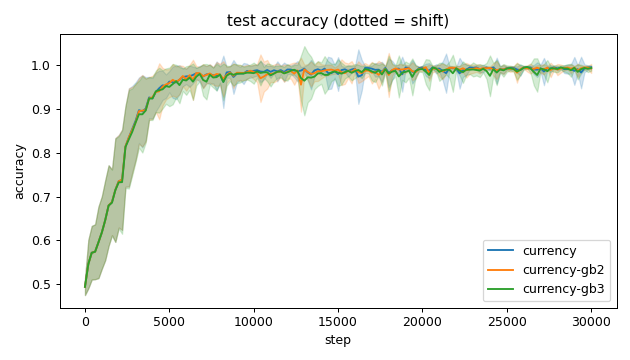
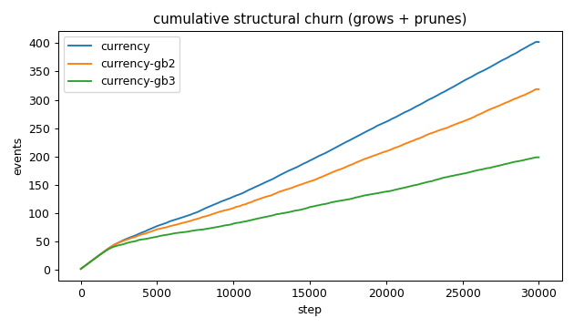
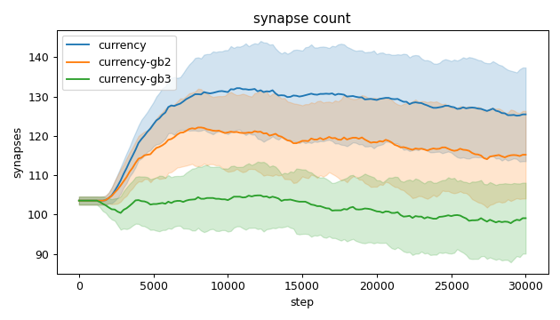
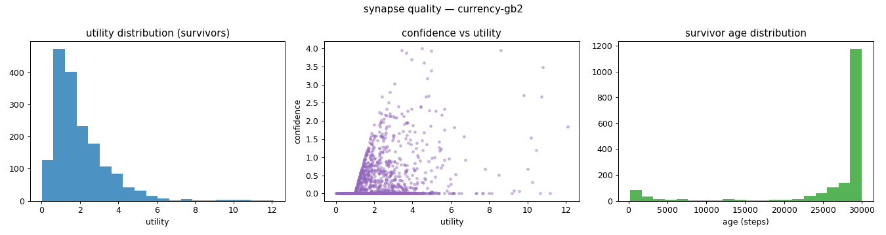
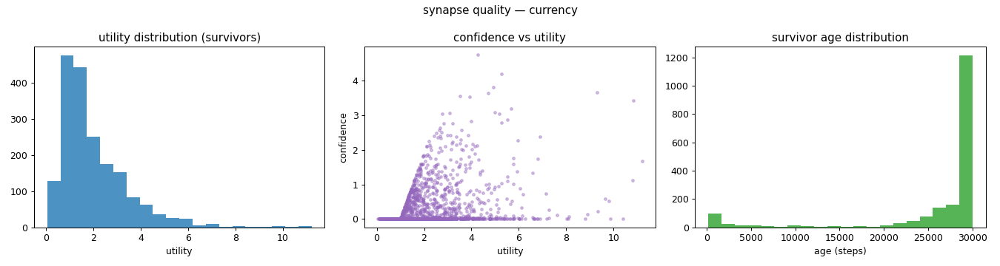
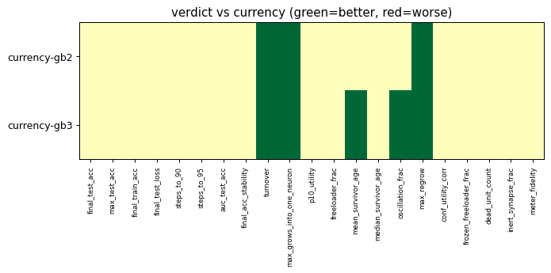

# Evaluation run: b1-growbar-sweep

- **Date:** 2026-05-31 20:39:46
- **Variants:** currency, currency-gb2, currency-gb3  (baseline: currency)
- **Seeds:** 15  |  **Dataset:** spirals  |  **Steps:** 30000 (+0 shift)
- **Commit:** 0dacbe9
- **Command:** `python evaluate.py --variants currency,currency-gb2,currency-gb3 --seeds 15 --baseline currency --jobs 10 --no-cache --publish --run-name b1-growbar-sweep`

## Key metrics

| Metric | What it means | currency (baseline) | currency-gb2 | currency-gb3 |
|---|---|---|---|---|
| final_test_acc ↑ | held-out accuracy at the end of the run | 0.996 ± 0.003 | 0.993 ± 0.011 ≈ | 0.994 ± 0.006 ≈ |
| auc_test_acc ↑ | area under the test-accuracy curve (speed + level) | 0.953 ± 0.011 | 0.952 ± 0.013 ≈ | 0.949 ± 0.014 ≈ |
| max_grows_into_one_neuron ↓ | most times one neuron was grown into (churn) | 37.600 ± 5.690 | 30.400 ± 6.042 ▲ | 18.800 ± 5.729 ▲ |
| oscillation_frac ↓ | fraction of grown edges grown ≥2× (thrash) | 0.368 ± 0.066 | 0.331 ± 0.063 ≈ | 0.277 ± 0.068 ▲ |
| freeloader_frac ↓ | fraction of synapses below the prune-utility floor | 0.032 ± 0.029 | 0.028 ± 0.017 ≈ | 0.020 ± 0.016 ≈ |
| conf_utility_corr ↑ | corr of confidence with real utility (calibration) | 0.314 ± 0.125 | 0.350 ± 0.149 ≈ | 0.322 ± 0.113 ≈ |
| dead_unit_count ↓ | hidden neurons that never fire on test data | 3.600 ± 1.993 | 3.933 ± 2.205 ≈ | 4.067 ± 2.294 ≈ |

## Full scorecard

| Metric | currency (baseline) | currency-gb2 | currency-gb3 |
|---|---|---|---|
| **Prediction performance** | | | |
| final_test_acc ↑ | 0.996 ± 0.003 | 0.993 ± 0.011 ≈ | 0.994 ± 0.006 ≈ |
| max_test_acc ↑ | 0.998 ± 0.002 | 0.999 ± 0.001 ≈ | 0.998 ± 0.001 ≈ |
| final_train_acc ↑ | 0.998 ± 0.002 | 0.997 ± 0.007 ≈ | 0.996 ± 0.006 ≈ |
| final_test_loss ↓ | 0.015 ± 0.008 | 0.020 ± 0.017 ≈ | 0.019 ± 0.012 ≈ |
| **Training efficacy** | | | |
| steps_to_90 ↓ | 3174 ± 775.858 | 3241 ± 900.962 ≈ | 3374 ± 971.231 ≈ |
| steps_to_95 ↓ | 3921 ± 1117 | 3948 ± 1179 ≈ | 4201 ± 1435 ≈ |
| auc_test_acc ↑ | 0.953 ± 0.011 | 0.952 ± 0.013 ≈ | 0.949 ± 0.014 ≈ |
| final_acc_stability ↓ | 0.010 ± 0.013 | 0.006 ± 0.005 ≈ | 0.007 ± 0.005 ≈ |
| **Synapse structure** | | | |
| synapse_count_start | 103.533 ± 1.024 | 103.533 ± 1.024 ≈ | 103.533 ± 1.024 ≈ |
| synapse_count_peak | 136.667 ± 9.964 | 126.200 ± 9.282 ≈ | 110.533 ± 5.714 ≈ |
| synapse_count_end | 125.467 ± 11.916 | 115.200 ± 11.137 ≈ | 99.067 ± 9.022 ≈ |
| n_grow_events | 212.933 ± 20.038 | 166.133 ± 20.056 ≈ | 98.067 ± 18.635 ≈ |
| n_prune_events | 189 ± 19.339 | 152.467 ± 18.736 ≈ | 100.533 ± 20.536 ≈ |
| distinct_neurons_grown | 14.200 ± 2.286 | 13.600 ± 2.215 ≈ | 12.333 ± 2.150 ≈ |
| turnover ↓ | 3.215 ± 0.399 | 2.747 ± 0.399 ▲ | 1.963 ± 0.422 ▲ |
| max_grows_into_one_neuron ↓ | 37.600 ± 5.690 | 30.400 ± 6.042 ▲ | 18.800 ± 5.729 ▲ |
| mean_fan_in | 4.182 ± 0.397 | 3.840 ± 0.371 ≈ | 3.302 ± 0.301 ≈ |
| mean_fan_out | 4.182 ± 0.397 | 3.840 ± 0.371 ≈ | 3.302 ± 0.301 ≈ |
| effective_density | 0.581 ± 0.055 | 0.533 ± 0.052 ≈ | 0.459 ± 0.042 ≈ |
| **Synapse quality** | | | |
| p10_utility ↑ | 0.671 ± 0.072 | 0.697 ± 0.079 ≈ | 0.704 ± 0.063 ≈ |
| freeloader_frac ↓ | 0.032 ± 0.029 | 0.028 ± 0.017 ≈ | 0.020 ± 0.016 ≈ |
| mean_survivor_age ↑ | 26217 ± 867.733 | 26321 ± 581.674 ≈ | 26893 ± 784.922 ▲ |
| median_survivor_age ↑ | 29986 ± 50.104 | 30000 ± 0 ≈ | 30000 ± 0 ≈ |
| mean_pruned_lifespan | 2580 ± 424.471 | 3104 ± 684.279 ≈ | 3961 ± 779.769 ≈ |
| oscillation_frac ↓ | 0.368 ± 0.066 | 0.331 ± 0.063 ≈ | 0.277 ± 0.068 ▲ |
| max_regrow ↓ | 11 ± 2.422 | 9.467 ± 1.628 ▲ | 6.533 ± 2.247 ▲ |
| conf_utility_corr ↑ | 0.314 ± 0.125 | 0.350 ± 0.149 ≈ | 0.322 ± 0.113 ≈ |
| frozen_freeloader_frac ↓ | 0 ± 0 | 0 ± 0 ≈ | 0 ± 0 ≈ |
| dead_unit_count ↓ | 3.600 ± 1.993 | 3.933 ± 2.205 ≈ | 4.067 ± 2.294 ≈ |
| inert_synapse_frac ↓ | 0 ± 0 | 0 ± 0 ≈ | 0 ± 0 ≈ |
| used_vs_allocated | 1.236 ± 0.118 | 1.135 ± 0.109 ≈ | 0.976 ± 0.089 ≈ |
| **Signal sanity** | | | |
| meter_fidelity ↑ | 0.657 ± 0.260 | 0.618 ± 0.251 ≈ | 0.711 ± 0.140 ≈ |

Baseline: **currency**. ▲ better / ▼ worse / ≈ no clear difference vs baseline (95% bootstrap CI of the mean difference). Cells show mean ± std across seeds.

## Charts

### acc_curves

### churn_curves

### count_curves

### quality_currency-gb2

### quality_currency-gb3

### quality_currency

### verdict_heatmap

