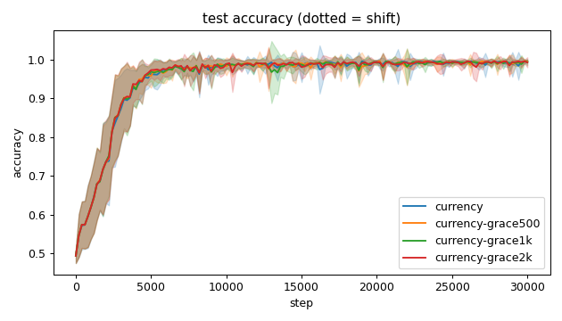
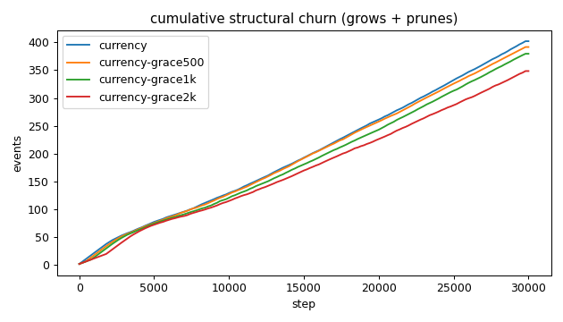
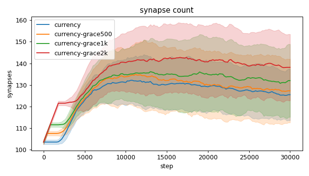
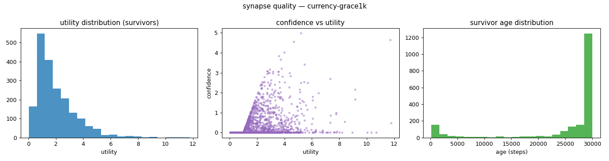
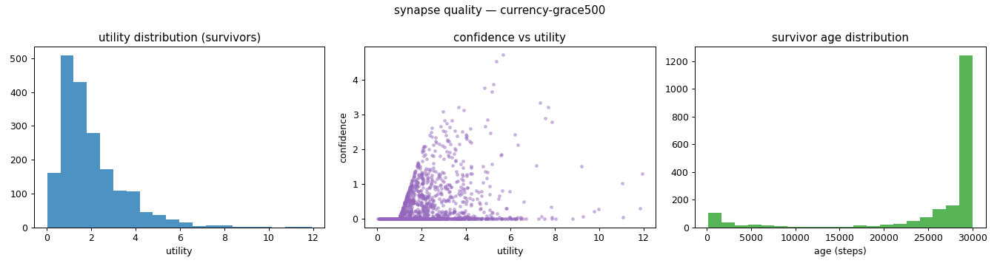
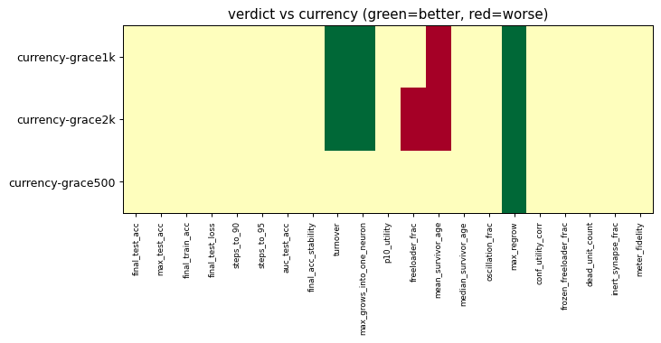

# Evaluation run: c1-grace-sweep

- **Date:** 2026-05-31 20:43:00
- **Variants:** currency, currency-grace1k, currency-grace2k, currency-grace500  (baseline: currency)
- **Seeds:** 15  |  **Dataset:** spirals  |  **Steps:** 30000 (+0 shift)
- **Commit:** 0dacbe9
- **Command:** `python evaluate.py --variants currency,currency-grace500,currency-grace1k,currency-grace2k --seeds 15 --baseline currency --jobs 10 --no-cache --publish --run-name c1-grace-sweep`

## Key metrics

| Metric | What it means | currency (baseline) | currency-grace1k | currency-grace2k | currency-grace500 |
|---|---|---|---|---|---|
| final_test_acc ↑ | held-out accuracy at the end of the run | 0.996 ± 0.003 | 0.993 ± 0.008 ≈ | 0.993 ± 0.013 ≈ | 0.995 ± 0.004 ≈ |
| auc_test_acc ↑ | area under the test-accuracy curve (speed + level) | 0.953 ± 0.011 | 0.953 ± 0.012 ≈ | 0.954 ± 0.011 ≈ | 0.954 ± 0.010 ≈ |
| max_grows_into_one_neuron ↓ | most times one neuron was grown into (churn) | 37.600 ± 5.690 | 32.800 ± 6.524 ▲ | 28.467 ± 4.978 ▲ | 34.733 ± 6.202 ≈ |
| oscillation_frac ↓ | fraction of grown edges grown ≥2× (thrash) | 0.368 ± 0.066 | 0.391 ± 0.051 ≈ | 0.409 ± 0.049 ≈ | 0.380 ± 0.059 ≈ |
| freeloader_frac ↓ | fraction of synapses below the prune-utility floor | 0.032 ± 0.029 | 0.041 ± 0.011 ≈ | 0.054 ± 0.018 ▼ | 0.036 ± 0.018 ≈ |
| conf_utility_corr ↑ | corr of confidence with real utility (calibration) | 0.314 ± 0.125 | 0.340 ± 0.086 ≈ | 0.312 ± 0.118 ≈ | 0.316 ± 0.143 ≈ |
| dead_unit_count ↓ | hidden neurons that never fire on test data | 3.600 ± 1.993 | 3.600 ± 2.185 ≈ | 2.933 ± 1.731 ≈ | 3.533 ± 2.061 ≈ |

## Full scorecard

| Metric | currency (baseline) | currency-grace1k | currency-grace2k | currency-grace500 |
|---|---|---|---|---|
| **Prediction performance** | | | | |
| final_test_acc ↑ | 0.996 ± 0.003 | 0.993 ± 0.008 ≈ | 0.993 ± 0.013 ≈ | 0.995 ± 0.004 ≈ |
| max_test_acc ↑ | 0.998 ± 0.002 | 0.999 ± 0.001 ≈ | 0.999 ± 0.002 ≈ | 0.998 ± 0.002 ≈ |
| final_train_acc ↑ | 0.998 ± 0.002 | 0.997 ± 0.007 ≈ | 0.994 ± 0.015 ≈ | 0.997 ± 0.003 ≈ |
| final_test_loss ↓ | 0.015 ± 0.008 | 0.020 ± 0.017 ≈ | 0.025 ± 0.039 ≈ | 0.018 ± 0.010 ≈ |
| **Training efficacy** | | | | |
| steps_to_90 ↓ | 3174 ± 775.858 | 3041 ± 705.030 ≈ | 3094 ± 768.953 ≈ | 3068 ± 750.703 ≈ |
| steps_to_95 ↓ | 3921 ± 1117 | 3868 ± 1099 ≈ | 3708 ± 992.953 ≈ | 3881 ± 1226 ≈ |
| auc_test_acc ↑ | 0.953 ± 0.011 | 0.953 ± 0.012 ≈ | 0.954 ± 0.011 ≈ | 0.954 ± 0.010 ≈ |
| final_acc_stability ↓ | 0.010 ± 0.013 | 0.007 ± 0.008 ≈ | 0.008 ± 0.009 ≈ | 0.007 ± 0.009 ≈ |
| **Synapse structure** | | | | |
| synapse_count_start | 103.533 ± 1.024 | 103.533 ± 1.024 ≈ | 103.533 ± 1.024 ≈ | 103.533 ± 1.024 ≈ |
| synapse_count_peak | 136.667 ± 9.964 | 142.133 ± 14.970 ≈ | 147.800 ± 15.570 ≈ | 139 ± 14.935 ≈ |
| synapse_count_end | 125.467 ± 11.916 | 132 ± 16.888 ≈ | 138.133 ± 15.366 ≈ | 127.267 ± 14.708 ≈ |
| n_grow_events | 212.933 ± 20.038 | 204.933 ± 25.263 ≈ | 192.467 ± 21.884 ≈ | 208.600 ± 23.096 ≈ |
| n_prune_events | 189 ± 19.339 | 174.467 ± 16.729 ≈ | 155.867 ± 16.848 ≈ | 182.867 ± 20.123 ≈ |
| distinct_neurons_grown | 14.200 ± 2.286 | 14.867 ± 2.655 ≈ | 14.933 ± 1.731 ≈ | 14.533 ± 2.363 ≈ |
| turnover ↓ | 3.215 ± 0.399 | 2.922 ± 0.284 ▲ | 2.569 ± 0.286 ▲ | 3.091 ± 0.396 ≈ |
| max_grows_into_one_neuron ↓ | 37.600 ± 5.690 | 32.800 ± 6.524 ▲ | 28.467 ± 4.978 ▲ | 34.733 ± 6.202 ≈ |
| mean_fan_in | 4.182 ± 0.397 | 4.400 ± 0.563 ≈ | 4.604 ± 0.512 ≈ | 4.242 ± 0.490 ≈ |
| mean_fan_out | 4.182 ± 0.397 | 4.400 ± 0.563 ≈ | 4.604 ± 0.512 ≈ | 4.242 ± 0.490 ≈ |
| effective_density | 0.581 ± 0.055 | 0.611 ± 0.078 ≈ | 0.640 ± 0.071 ≈ | 0.589 ± 0.068 ≈ |
| **Synapse quality** | | | | |
| p10_utility ↑ | 0.671 ± 0.072 | 0.661 ± 0.054 ≈ | 0.645 ± 0.070 ≈ | 0.683 ± 0.060 ≈ |
| freeloader_frac ↓ | 0.032 ± 0.029 | 0.041 ± 0.011 ≈ | 0.054 ± 0.018 ▼ | 0.036 ± 0.018 ≈ |
| mean_survivor_age ↑ | 26217 ± 867.733 | 25233 ± 841.039 ▼ | 24774 ± 732.576 ▼ | 26045 ± 684.466 ≈ |
| median_survivor_age ↑ | 29986 ± 50.104 | 29953 ± 174.825 ≈ | 29953 ± 109.029 ≈ | 29973 ± 68.327 ≈ |
| mean_pruned_lifespan | 2580 ± 424.471 | 3369 ± 460.723 ≈ | 4289 ± 361.036 ≈ | 2825 ± 459.426 ≈ |
| oscillation_frac ↓ | 0.368 ± 0.066 | 0.391 ± 0.051 ≈ | 0.409 ± 0.049 ≈ | 0.380 ± 0.059 ≈ |
| max_regrow ↓ | 11 ± 2.422 | 7.800 ± 1.166 ▲ | 5.800 ± 0.542 ▲ | 9.400 ± 1.356 ▲ |
| conf_utility_corr ↑ | 0.314 ± 0.125 | 0.340 ± 0.086 ≈ | 0.312 ± 0.118 ≈ | 0.316 ± 0.143 ≈ |
| frozen_freeloader_frac ↓ | 0 ± 0 | 0 ± 0 ≈ | 0 ± 0 ≈ | 0 ± 0 ≈ |
| dead_unit_count ↓ | 3.600 ± 1.993 | 3.600 ± 2.185 ≈ | 2.933 ± 1.731 ≈ | 3.533 ± 2.061 ≈ |
| inert_synapse_frac ↓ | 0 ± 0 | 0 ± 0 ≈ | 0 ± 0 ≈ | 0 ± 0 ≈ |
| used_vs_allocated | 1.236 ± 0.118 | 1.300 ± 0.164 ≈ | 1.360 ± 0.146 ≈ | 1.253 ± 0.145 ≈ |
| **Signal sanity** | | | | |
| meter_fidelity ↑ | 0.657 ± 0.260 | 0.711 ± 0.174 ≈ | 0.763 ± 0.179 ≈ | 0.734 ± 0.195 ≈ |

Baseline: **currency**. ▲ better / ▼ worse / ≈ no clear difference vs baseline (95% bootstrap CI of the mean difference). Cells show mean ± std across seeds.

## Charts

### acc_curves

### churn_curves

### count_curves

### quality_currency-grace1k

### quality_currency-grace2k

### quality_currency-grace500

### quality_currency

### verdict_heatmap

