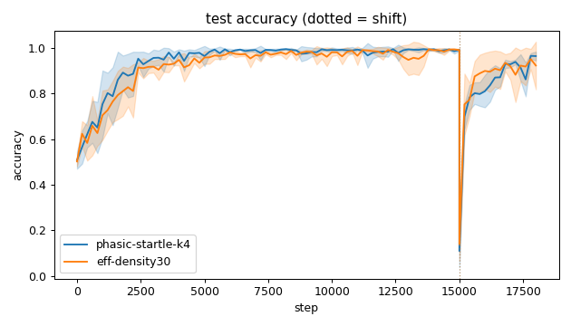
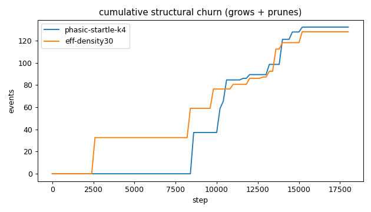
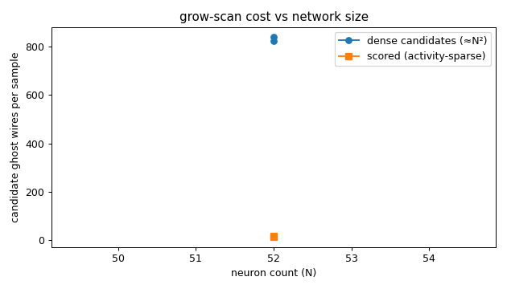
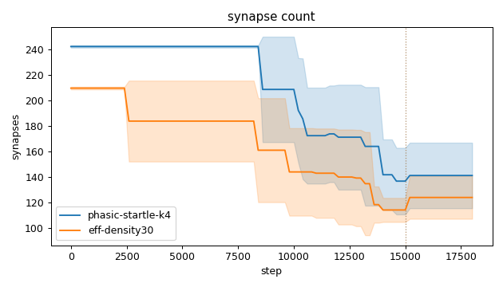
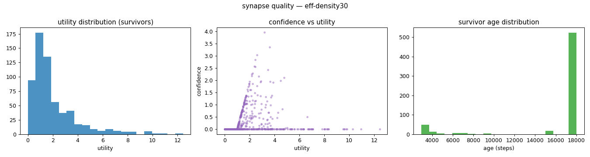
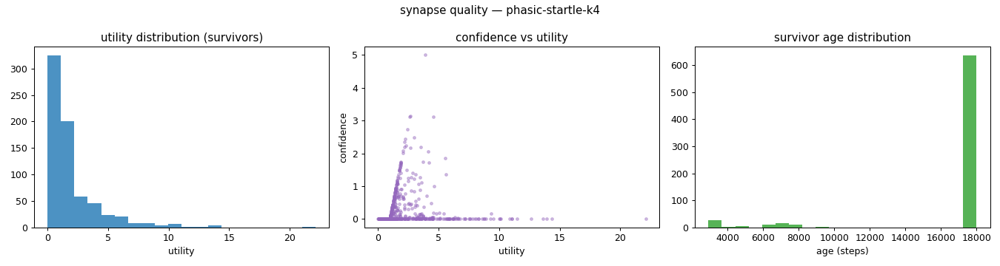
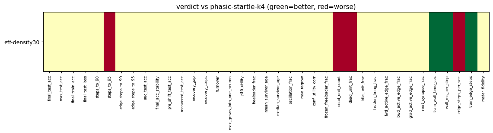

# Evaluation run: compute-efficiency-density30-shift

- **Date:** 2026-06-12 22:27:35
- **Variants:** eff-density30, phasic-startle-k4  (baseline: phasic-startle-k4)
- **Seeds:** 5  |  **Dataset:** spirals  |  **Steps:** 15000 (+3000 shift)
- **Commit:** bd98091
- **Command:** `python evaluate.py --variants phasic-startle-k4,eff-density30 --baseline phasic-startle-k4 --seeds 5 --dataset spirals --steps 15000 --shift 3000 --jobs 1 --record-every 200 --no-cache --publish --run-name compute-efficiency-density30-shift`

## Key metrics

| Metric | What it means | eff-density30 | phasic-startle-k4 (baseline) |
|---|---|---|---|
| final_test_acc ↑ | held-out accuracy at the end of the run | 0.923 ± 0.104 ≈ | 0.964 ± 0.020 |
| steps_to_90 ↓ | steps to first reach 90% test accuracy | 2121 ± 483.322 ≈ | 1721 ± 587.878 |
| steps_to_95 ↓ | steps to first reach 95% test accuracy | 3961 ± 1015 ▼ | 2681 ± 881.816 |
| auc_test_acc ↑ | area under the test-accuracy curve (speed + level) | 0.915 ± 0.018 ≈ | 0.928 ± 0.019 |
| edge_steps_to_90 ↓ | live-edge training work to first reach 90% test accuracy | 441316 ± 97311 ≈ | 416402 ± 142130 |
| edge_steps_to_95 ↓ | live-edge training work to first reach 95% test accuracy | 809916 ± 215306 ≈ | 648322 ± 211820 |
| pre_shift_test_acc ↑ | test accuracy just before the concept shift | 0.991 ± 0.005 ≈ | 0.991 ± 0.004 |
| recovered_test_acc ↑ | test accuracy at the end, after the label swap | 0.923 ± 0.104 ≈ | 0.964 ± 0.020 |
| synapse_count_end | live synapses at the end | 123.800 ± 16.738 ≈ | 141 ± 25.675 |
| effective_density | live edges as a fraction of fully-connected | 0.215 ± 0.029 ≈ | 0.245 ± 0.045 |
| avg_live_edges | time-average live edges during training | 161.284 ± 19.083 ≈ | 201.686 ± 15.901 |
| train_edge_steps ↓ | cumulative live-edge steps over training | 2903278 ± 343504 ▲ | 3630541 ± 286233 |
| train_wall_time_sec ↓ | training-loop wall time only, excluding eval snapshots | 5.112 ± 0.492 ▲ | 6.176 ± 0.427 |
| wall_ms_per_step ↓ | training-loop milliseconds per SGD step | 0.284 ± 0.027 ▲ | 0.343 ± 0.024 |
| edge_steps_per_sec ↑ | live-edge steps processed per wall-clock second | 566797 ± 12737 ▼ | 587531 ± 8794 |
| ghost_dense_cost | candidate ghost wires the grow-scan must consider (~N²) | 840.200 ± 16.738 ≈ | 823 ± 25.675 |
| ghost_pairs_scored | candidate wires actually scored after activity+demand pruning | 15.565 ± 4.381 ≈ | 13.023 ± 2.425 |
| mean_neuron_activation | avg hidden-neuron ReLU output on test data (neuron value) | 0.304 ± 0.066 ≈ | 0.302 ± 0.047 |
| dead_unit_frac ↓ | fraction of hidden neurons that never fire (scale-free) | 0.208 ± 0.048 ▼ | 0.150 ± 0.040 |
| hidden_firing_frac ↓ | fraction of hidden ReLUs active on test data | 0.371 ± 0.044 ≈ | 0.355 ± 0.035 |
| fwd_active_edge_frac ↓ | fraction of live edges whose pre neuron is active | 0.552 ± 0.032 ≈ | 0.533 ± 0.031 |
| bwd_active_edge_frac ↓ | fraction of live edges whose post delta is nonzero | 0.383 ± 0.059 ≈ | 0.358 ± 0.026 |
| grad_active_edge_frac ↓ | fraction of live edges with nonzero weight gradient | 0.223 ± 0.051 ≈ | 0.183 ± 0.026 |
| idle_unit_frac ↓ | fraction of hidden neurons dead OR outputless (not in service) | 0.300 ± 0.028 ≈ | 0.250 ± 0.054 |
| n_recycle_events | dead-unit recycles fired over the run (sleep recycling) | 0 ± 0 ≈ | 0 ± 0 |
| recycled_rehired_frac | of recycled units, fraction back in service at the end | — ± — ? | — ± — |
| n_startle_events | demand-spike hiring alarms fired (startle growth) | 1 ± 0 ≈ | 1.600 ± 0.490 |
| n_arousal_events | post-startle refinement windows that ran grow-only passes | 0 ± 0 ≈ | 0 ± 0 |
| max_grows_into_one_neuron ↓ | most times one neuron was grown into (churn) | 7.200 ± 2.227 ≈ | 6 ± 1.414 |
| oscillation_frac ↓ | fraction of grown edges grown ≥2× (thrash) | 0.009 ± 0.018 ≈ | 0 ± 0 |
| freeloader_frac ↓ | fraction of synapses below the prune-utility floor | 0.118 ± 0.046 ≈ | 0.102 ± 0.020 |
| conf_utility_corr ↑ | corr of confidence with real utility (calibration) | 0.066 ± 0.029 ≈ | 0.045 ± 0.026 |
| dead_unit_count ↓ | hidden neurons that never fire on test data | 10 ± 2.280 ▼ | 7.200 ± 1.939 |

## Full scorecard

| Metric | eff-density30 | phasic-startle-k4 (baseline) |
|---|---|---|
| **Prediction performance** | | |
| final_test_acc ↑ | 0.923 ± 0.104 ≈ | 0.964 ± 0.020 |
| max_test_acc ↑ | 0.997 ± 0.003 ≈ | 0.997 ± 0.002 |
| final_train_acc ↑ | 0.922 ± 0.105 ≈ | 0.959 ± 0.019 |
| final_test_loss ↓ | 0.180 ± 0.180 ≈ | 0.109 ± 0.029 |
| **Training efficacy** | | |
| steps_to_90 ↓ | 2121 ± 483.322 ≈ | 1721 ± 587.878 |
| steps_to_95 ↓ | 3961 ± 1015 ▼ | 2681 ± 881.816 |
| edge_steps_to_90 ↓ | 441316 ± 97311 ≈ | 416402 ± 142130 |
| edge_steps_to_95 ↓ | 809916 ± 215306 ≈ | 648322 ± 211820 |
| auc_test_acc ↑ | 0.915 ± 0.018 ≈ | 0.928 ± 0.019 |
| final_acc_stability ↓ | 0.031 ± 0.020 ≈ | 0.055 ± 0.022 |
| pre_shift_test_acc ↑ | 0.991 ± 0.005 ≈ | 0.991 ± 0.004 |
| recovered_test_acc ↑ | 0.923 ± 0.104 ≈ | 0.964 ± 0.020 |
| recovery_gap ↓ | 0.068 ± 0.108 ≈ | 0.027 ± 0.018 |
| recovery_steps ↓ | ∞ ± — ? | ∞ ± — |
| **Synapse structure** | | |
| synapse_count_start | 209.400 ± 1.020 ≈ | 242 ± 0.894 |
| synapse_count_peak | 209.400 ± 1.020 ≈ | 242 ± 0.894 |
| synapse_count_end | 123.800 ± 16.738 ≈ | 141 ± 25.675 |
| n_grow_events | 21.200 ± 8.750 ≈ | 15.600 ± 7.003 |
| n_prune_events | 106.800 ± 8.588 ≈ | 116.600 ± 22.096 |
| n_startle_events | 1 ± 0 ≈ | 1.600 ± 0.490 |
| n_arousal_events | 0 ± 0 ≈ | 0 ± 0 |
| distinct_neurons_grown | 6 ± 2.280 ≈ | 4.400 ± 1.200 |
| turnover ↓ | 0.810 ± 0.112 ≈ | 0.671 ± 0.150 |
| max_grows_into_one_neuron ↓ | 7.200 ± 2.227 ≈ | 6 ± 1.414 |
| mean_fan_in | 2.476 ± 0.335 ≈ | 2.820 ± 0.513 |
| mean_fan_out | 2.476 ± 0.335 ≈ | 2.820 ± 0.513 |
| effective_density | 0.215 ± 0.029 ≈ | 0.245 ± 0.045 |
| avg_live_edges | 161.284 ± 19.083 ≈ | 201.686 ± 15.901 |
| **Synapse quality** | | |
| p10_utility ↑ | 0.452 ± 0.175 ≈ | 0.479 ± 0.062 |
| freeloader_frac ↓ | 0.118 ± 0.046 ≈ | 0.102 ± 0.020 |
| mean_survivor_age ↑ | 16233 ± 851.355 ≈ | 16832 ± 491.009 |
| median_survivor_age ↑ | 18000 ± 0 ≈ | 18000 ± 0 |
| mean_pruned_lifespan | 8666 ± 3219 ≈ | 10977 ± 1603 |
| oscillation_frac ↓ | 0.009 ± 0.018 ≈ | 0 ± 0 |
| max_regrow ↓ | 0.200 ± 0.400 ≈ | 0 ± 0 |
| conf_utility_corr ↑ | 0.066 ± 0.029 ≈ | 0.045 ± 0.026 |
| frozen_freeloader_frac ↓ | 0 ± 0 ≈ | 0 ± 0 |
| dead_unit_count ↓ | 10 ± 2.280 ▼ | 7.200 ± 1.939 |
| dead_unit_frac ↓ | 0.208 ± 0.048 ▼ | 0.150 ± 0.040 |
| idle_unit_frac ↓ | 0.300 ± 0.028 ≈ | 0.250 ± 0.054 |
| mean_neuron_activation | 0.304 ± 0.066 ≈ | 0.302 ± 0.047 |
| hidden_firing_frac ↓ | 0.371 ± 0.044 ≈ | 0.355 ± 0.035 |
| fwd_active_edge_frac ↓ | 0.552 ± 0.032 ≈ | 0.533 ± 0.031 |
| bwd_active_edge_frac ↓ | 0.383 ± 0.059 ≈ | 0.358 ± 0.026 |
| grad_active_edge_frac ↓ | 0.223 ± 0.051 ≈ | 0.183 ± 0.026 |
| inert_synapse_frac ↓ | 0 ± 0 ≈ | 0 ± 0 |
| used_vs_allocated | 0.591 ± 0.077 ≈ | 0.583 ± 0.105 |
| n_recycle_events | 0 ± 0 ≈ | 0 ± 0 |
| recycled_rehired_frac | — ± — ? | — ± — |
| **Compute cost** | | |
| train_wall_time_sec ↓ | 5.112 ± 0.492 ▲ | 6.176 ± 0.427 |
| wall_ms_per_step ↓ | 0.284 ± 0.027 ▲ | 0.343 ± 0.024 |
| edge_steps_per_sec ↑ | 566797 ± 12737 ▼ | 587531 ± 8794 |
| train_edge_steps ↓ | 2903278 ± 343504 ▲ | 3630541 ± 286233 |
| ghost_dense_cost | 840.200 ± 16.738 ≈ | 823 ± 25.675 |
| ghost_pairs_scored | 15.565 ± 4.381 ≈ | 13.023 ± 2.425 |
| **Signal sanity** | | |
| meter_fidelity ↑ | 0.947 ± 0.033 ≈ | 0.951 ± 0.027 |

Baseline: **phasic-startle-k4**. ▲ better / ▼ worse / ≈ no clear difference vs baseline (95% bootstrap CI of the mean difference). Cells show mean ± std across seeds.

## Charts

### acc_curves

### churn_curves

### cost_scaling

### count_curves

### quality_eff-density30

### quality_phasic-startle-k4

### verdict_heatmap

