# Evaluation run: compute-efficiency-finalists

- **Date:** 2026-06-12 22:24:37
- **Variants:** eff-density30, eff-w12, eff-wta8, fully-connected, phasic-startle-k4, phasic-startle-k4-lazy  (baseline: phasic-startle-k4)
- **Seeds:** 10  |  **Dataset:** spirals  |  **Steps:** 15000 (+0 shift)
- **Commit:** bd98091
- **Command:** `python evaluate.py --variants fully-connected,phasic-startle-k4,eff-density30,eff-w12,eff-wta8,phasic-startle-k4-lazy --baseline phasic-startle-k4 --seeds 10 --dataset spirals --steps 15000 --shift 0 --jobs 6 --record-every 200 --no-cache --publish --run-name compute-efficiency-finalists`

## Key metrics

| Metric | What it means | eff-density30 | eff-w12 | eff-wta8 | fully-connected | phasic-startle-k4 (baseline) | phasic-startle-k4-lazy |
|---|---|---|---|---|---|---|---|
| final_test_acc ↑ | held-out accuracy at the end of the run | 0.993 ± 0.004 ≈ | 0.984 ± 0.027 ≈ | 0.992 ± 0.010 ≈ | 0.996 ± 0.004 ≈ | 0.993 ± 0.004 | 0.993 ± 0.004 ≈ |
| steps_to_90 ↓ | steps to first reach 90% test accuracy | 2241 ± 856.971 ≈ | 3781 ± 1316 ▼ | 2141 ± 805.233 ≈ | 1281 ± 132.665 ▲ | 2141 ± 805.233 | 2141 ± 805.233 ≈ |
| steps_to_95 ↓ | steps to first reach 95% test accuracy | 3601 ± 1095 ≈ | 4841 ± 2041 ▼ | 2761 ± 731.027 ≈ | 1521 ± 203.961 ▲ | 2881 ± 785.875 | 2881 ± 785.875 ≈ |
| auc_test_acc ↑ | area under the test-accuracy curve (speed + level) | 0.929 ± 0.019 ≈ | 0.903 ± 0.029 ▼ | 0.939 ± 0.017 ≈ | 0.961 ± 0.006 ▲ | 0.937 ± 0.020 | 0.937 ± 0.020 ≈ |
| edge_steps_to_90 ↓ | live-edge training work to first reach 90% test accuracy | 467843 ± 177865 ≈ | 596498 ± 207581 ≈ | 518202 ± 194532 ≈ | 737856 ± 76415 ▼ | 518322 ± 194948 | 518322 ± 194948 ≈ |
| edge_steps_to_95 ↓ | live-edge training work to first reach 95% test accuracy | 744403 ± 227082 ≈ | 763958 ± 322513 ≈ | 668362 ± 176671 ≈ | 876096 ± 117481 ▼ | 697302 ± 189633 | 697302 ± 189633 ≈ |
| synapse_count_end | live synapses at the end | 117.500 ± 11.817 ≈ | 107.800 ± 34.351 ≈ | 132.100 ± 17.038 ≈ | 576 ± 0 ≈ | 140.800 ± 39.603 | 140.800 ± 39.603 ≈ |
| effective_density | live edges as a fraction of fully-connected | 0.204 ± 0.021 ≈ | 0.321 ± 0.102 ≈ | 0.229 ± 0.030 ≈ | 1 ± 0 ≈ | 0.244 ± 0.069 | 0.244 ± 0.069 ≈ |
| avg_live_edges | time-average live edges during training | 178.280 ± 20.070 ≈ | 142.856 ± 12.883 ≈ | 214.590 ± 17.118 ≈ | 575.962 ± 0.000 ≈ | 212.384 ± 16.585 | 212.384 ± 16.585 ≈ |
| train_edge_steps ↓ | cumulative live-edge steps over training | 2674380 ± 301066 ▲ | 2142980 ± 193264 ▲ | 3219060 ± 256788 ≈ | 8640000 ± 0 ▼ | 3185965 ± 248794 | 3185965 ± 248794 ≈ |
| train_wall_time_sec ↓ | training-loop wall time only, excluding eval snapshots | 4.793 ± 0.456 ▲ | 3.803 ± 0.301 ▲ | 5.604 ± 0.380 ≈ | 6.163 ± 0.053 ▼ | 5.573 ± 0.348 | 6.214 ± 0.399 ▼ |
| wall_ms_per_step ↓ | training-loop milliseconds per SGD step | 0.320 ± 0.030 ▲ | 0.253 ± 0.020 ▲ | 0.374 ± 0.025 ≈ | 0.411 ± 0.004 ▼ | 0.372 ± 0.023 | 0.414 ± 0.027 ▼ |
| edge_steps_per_sec ↑ | live-edge steps processed per wall-clock second | 557024 ± 11133 ▼ | 563061 ± 8609 ≈ | 573981 ± 8476 ≈ | 1402045 ± 12064 ▲ | 571140 ± 11765 | 512347 ± 9550 ▼ |
| ghost_dense_cost | candidate ghost wires the grow-scan must consider (~N²) | 846.500 ± 11.817 ≈ | 472.200 ± 34.351 ≈ | 831.900 ± 17.038 ≈ | 388 ± 0 ≈ | 823.200 ± 39.603 | 823.200 ± 39.603 ≈ |
| ghost_pairs_scored | candidate wires actually scored after activity+demand pruning | 10.659 ± 2.099 ≈ | 12.328 ± 2.558 ≈ | 11.014 ± 2.337 ≈ | 105.084 ± 12.144 ≈ | 9.537 ± 2.538 | 9.537 ± 2.538 ≈ |
| mean_neuron_activation | avg hidden-neuron ReLU output on test data (neuron value) | 0.466 ± 0.049 ≈ | 0.461 ± 0.115 ≈ | 0.469 ± 0.080 ≈ | 0.400 ± 0.057 ≈ | 0.459 ± 0.058 | 0.459 ± 0.058 ≈ |
| dead_unit_frac ↓ | fraction of hidden neurons that never fire (scale-free) | 0.144 ± 0.041 ≈ | 0.122 ± 0.096 ≈ | 0.137 ± 0.057 ≈ | 0.023 ± 0.022 ▲ | 0.125 ± 0.062 | 0.125 ± 0.062 ≈ |
| hidden_firing_frac ↓ | fraction of hidden ReLUs active on test data | 0.450 ± 0.047 ≈ | 0.411 ± 0.072 ≈ | 0.428 ± 0.037 ≈ | 0.428 ± 0.033 ≈ | 0.454 ± 0.057 | 0.454 ± 0.057 ≈ |
| fwd_active_edge_frac ↓ | fraction of live edges whose pre neuron is active | 0.630 ± 0.035 ≈ | 0.591 ± 0.056 ≈ | 0.603 ± 0.044 ≈ | 0.454 ± 0.033 ▲ | 0.628 ± 0.068 | 0.628 ± 0.068 ≈ |
| bwd_active_edge_frac ↓ | fraction of live edges whose post delta is nonzero | 0.490 ± 0.043 ≈ | 0.437 ± 0.096 ▲ | 0.506 ± 0.048 ≈ | 0.466 ± 0.036 ≈ | 0.508 ± 0.062 | 0.508 ± 0.062 ≈ |
| grad_active_edge_frac ↓ | fraction of live edges with nonzero weight gradient | 0.326 ± 0.040 ≈ | 0.267 ± 0.070 ▲ | 0.317 ± 0.045 ≈ | 0.212 ± 0.030 ▲ | 0.331 ± 0.064 | 0.331 ± 0.064 ≈ |
| idle_unit_frac ↓ | fraction of hidden neurons dead OR outputless (not in service) | 0.260 ± 0.049 ≈ | 0.197 ± 0.134 ≈ | 0.215 ± 0.057 ≈ | 0.023 ± 0.022 ▲ | 0.219 ± 0.100 | 0.219 ± 0.100 ≈ |
| n_recycle_events | dead-unit recycles fired over the run (sleep recycling) | 0 ± 0 ≈ | 0 ± 0 ≈ | 0 ± 0 ≈ | 0 ± 0 ≈ | 0 ± 0 | 0 ± 0 ≈ |
| recycled_rehired_frac | of recycled units, fraction back in service at the end | — ± — ? | — ± — ? | — ± — ? | — ± — ? | — ± — | — ± — ? |
| n_startle_events | demand-spike hiring alarms fired (startle growth) | 0 ± 0 ≈ | 0 ± 0 ≈ | 0 ± 0 ≈ | 0 ± 0 ≈ | 0.100 ± 0.300 | 0.100 ± 0.300 ≈ |
| n_arousal_events | post-startle refinement windows that ran grow-only passes | 0 ± 0 ≈ | 0 ± 0 ≈ | 0 ± 0 ≈ | 0 ± 0 ≈ | 0 ± 0 | 0 ± 0 ≈ |
| max_grows_into_one_neuron ↓ | most times one neuron was grown into (churn) | 5.300 ± 2.492 ≈ | 2.400 ± 2.289 ≈ | 2.900 ± 1.700 ≈ | 0 ± 0 ▲ | 4.200 ± 2.482 | 4.200 ± 2.482 ≈ |
| oscillation_frac ↓ | fraction of grown edges grown ≥2× (thrash) | 0.006 ± 0.019 ≈ | 0.020 ± 0.060 ≈ | 0 ± 0 ≈ | 0 ± 0 ≈ | 0 ± 0 | 0 ± 0 ≈ |
| freeloader_frac ↓ | fraction of synapses below the prune-utility floor | 0.038 ± 0.013 ≈ | 0.093 ± 0.096 ≈ | 0.027 ± 0.015 ≈ | 0.189 ± 0.013 ▼ | 0.044 ± 0.062 | 0.044 ± 0.062 ≈ |
| conf_utility_corr ↑ | corr of confidence with real utility (calibration) | 0.275 ± 0.101 ≈ | 0.296 ± 0.130 ≈ | 0.215 ± 0.085 ▼ | — ± — ? | 0.314 ± 0.077 | 0.314 ± 0.077 ≈ |
| dead_unit_count ↓ | hidden neurons that never fire on test data | 6.900 ± 1.972 ≈ | 4.400 ± 3.441 ≈ | 6.600 ± 2.728 ≈ | 1.100 ± 1.044 ▲ | 6 ± 3 | 6 ± 3 ≈ |

## Full scorecard

| Metric | eff-density30 | eff-w12 | eff-wta8 | fully-connected | phasic-startle-k4 (baseline) | phasic-startle-k4-lazy |
|---|---|---|---|---|---|---|
| **Prediction performance** | | | | | | |
| final_test_acc ↑ | 0.993 ± 0.004 ≈ | 0.984 ± 0.027 ≈ | 0.992 ± 0.010 ≈ | 0.996 ± 0.004 ≈ | 0.993 ± 0.004 | 0.993 ± 0.004 ≈ |
| max_test_acc ↑ | 0.997 ± 0.002 ≈ | 0.996 ± 0.004 ≈ | 0.998 ± 0.001 ≈ | 0.998 ± 0.001 ≈ | 0.998 ± 0.002 | 0.998 ± 0.002 ≈ |
| final_train_acc ↑ | 0.995 ± 0.004 ≈ | 0.984 ± 0.027 ≈ | 0.994 ± 0.009 ≈ | 0.995 ± 0.008 ≈ | 0.993 ± 0.005 | 0.993 ± 0.005 ≈ |
| final_test_loss ↓ | 0.028 ± 0.011 ≈ | 0.049 ± 0.050 ≈ | 0.028 ± 0.024 ≈ | 0.020 ± 0.018 ≈ | 0.030 ± 0.018 | 0.030 ± 0.018 ≈ |
| **Training efficacy** | | | | | | |
| steps_to_90 ↓ | 2241 ± 856.971 ≈ | 3781 ± 1316 ▼ | 2141 ± 805.233 ≈ | 1281 ± 132.665 ▲ | 2141 ± 805.233 | 2141 ± 805.233 ≈ |
| steps_to_95 ↓ | 3601 ± 1095 ≈ | 4841 ± 2041 ▼ | 2761 ± 731.027 ≈ | 1521 ± 203.961 ▲ | 2881 ± 785.875 | 2881 ± 785.875 ≈ |
| edge_steps_to_90 ↓ | 467843 ± 177865 ≈ | 596498 ± 207581 ≈ | 518202 ± 194532 ≈ | 737856 ± 76415 ▼ | 518322 ± 194948 | 518322 ± 194948 ≈ |
| edge_steps_to_95 ↓ | 744403 ± 227082 ≈ | 763958 ± 322513 ≈ | 668362 ± 176671 ≈ | 876096 ± 117481 ▼ | 697302 ± 189633 | 697302 ± 189633 ≈ |
| auc_test_acc ↑ | 0.929 ± 0.019 ≈ | 0.903 ± 0.029 ▼ | 0.939 ± 0.017 ≈ | 0.961 ± 0.006 ▲ | 0.937 ± 0.020 | 0.937 ± 0.020 ≈ |
| final_acc_stability ↓ | 0.016 ± 0.020 ≈ | 0.017 ± 0.019 ≈ | 0.008 ± 0.006 ≈ | 0.005 ± 0.005 ≈ | 0.009 ± 0.009 | 0.009 ± 0.009 ≈ |
| **Synapse structure** | | | | | | |
| synapse_count_start | 209.500 ± 0.806 ≈ | 157.800 ± 0.980 ≈ | 242.100 ± 0.831 ≈ | 576 ± 0 ≈ | 242.100 ± 0.831 | 242.100 ± 0.831 ≈ |
| synapse_count_peak | 209.500 ± 0.806 ≈ | 157.800 ± 0.980 ≈ | 242.100 ± 0.831 ≈ | 576 ± 0 ≈ | 242.100 ± 0.831 | 242.100 ± 0.831 ≈ |
| synapse_count_end | 117.500 ± 11.817 ≈ | 107.800 ± 34.351 ≈ | 132.100 ± 17.038 ≈ | 576 ± 0 ≈ | 140.800 ± 39.603 | 140.800 ± 39.603 ≈ |
| n_grow_events | 10.100 ± 4.928 ≈ | 4.500 ± 4.272 ≈ | 5.400 ± 4.152 ≈ | 0 ± 0 ≈ | 8.600 ± 6.391 | 8.600 ± 6.391 ≈ |
| n_prune_events | 102.100 ± 12.833 ≈ | 54.500 ± 37.972 ≈ | 115.400 ± 19.658 ≈ | 0 ± 0 ≈ | 109.900 ± 40.695 | 109.900 ± 40.695 ≈ |
| n_startle_events | 0 ± 0 ≈ | 0 ± 0 ≈ | 0 ± 0 ≈ | 0 ± 0 ≈ | 0.100 ± 0.300 | 0.100 ± 0.300 ≈ |
| n_arousal_events | 0 ± 0 ≈ | 0 ± 0 ≈ | 0 ± 0 ≈ | 0 ± 0 ≈ | 0 ± 0 | 0 ± 0 ≈ |
| distinct_neurons_grown | 3 ± 1.549 ≈ | 1.800 ± 1.720 ≈ | 1.900 ± 1.044 ≈ | 0 ± 0 ≈ | 2.400 ± 1.685 | 2.400 ± 1.685 ≈ |
| turnover ↓ | 0.649 ± 0.154 ≈ | 0.443 ± 0.325 ≈ | 0.574 ± 0.140 ≈ | 0 ± 0 ▲ | 0.576 ± 0.222 | 0.576 ± 0.222 ≈ |
| max_grows_into_one_neuron ↓ | 5.300 ± 2.492 ≈ | 2.400 ± 2.289 ≈ | 2.900 ± 1.700 ≈ | 0 ± 0 ▲ | 4.200 ± 2.482 | 4.200 ± 2.482 ≈ |
| mean_fan_in | 2.350 ± 0.236 ≈ | 2.837 ± 0.904 ≈ | 2.642 ± 0.341 ≈ | 11.520 ± 0 ≈ | 2.816 ± 0.792 | 2.816 ± 0.792 ≈ |
| mean_fan_out | 2.350 ± 0.236 ≈ | 2.837 ± 0.904 ≈ | 2.642 ± 0.341 ≈ | 11.520 ± 0 ≈ | 2.816 ± 0.792 | 2.816 ± 0.792 ≈ |
| effective_density | 0.204 ± 0.021 ≈ | 0.321 ± 0.102 ≈ | 0.229 ± 0.030 ≈ | 1 ± 0 ≈ | 0.244 ± 0.069 | 0.244 ± 0.069 ≈ |
| avg_live_edges | 178.280 ± 20.070 ≈ | 142.856 ± 12.883 ≈ | 214.590 ± 17.118 ≈ | 575.962 ± 0.000 ≈ | 212.384 ± 16.585 | 212.384 ± 16.585 ≈ |
| **Synapse quality** | | | | | | |
| p10_utility ↑ | 0.772 ± 0.109 ≈ | 0.555 ± 0.237 ≈ | 0.742 ± 0.086 ≈ | 0.294 ± 0.022 ▼ | 0.718 ± 0.190 | 0.718 ± 0.190 ≈ |
| freeloader_frac ↓ | 0.038 ± 0.013 ≈ | 0.093 ± 0.096 ≈ | 0.027 ± 0.015 ≈ | 0.189 ± 0.013 ▼ | 0.044 ± 0.062 | 0.044 ± 0.062 ≈ |
| mean_survivor_age ↑ | 14277 ± 183.529 ≈ | 14470 ± 507.251 ≈ | 14612 ± 337.427 ≈ | 15000 ± 0 ▲ | 14384 ± 414.129 | 14384 ± 414.129 ≈ |
| median_survivor_age ↑ | 15000 ± 0 ≈ | 15000 ± 0 ≈ | 15000 ± 0 ≈ | 15000 ± 0 ≈ | 15000 ± 0 | 15000 ± 0 ≈ |
| mean_pruned_lifespan | 10017 ± 3176 ≈ | 7474 ± 5089 ≈ | 11318 ± 2050 ≈ | 0 ± 0 ≈ | 9567 ± 3469 | 9567 ± 3469 ≈ |
| oscillation_frac ↓ | 0.006 ± 0.019 ≈ | 0.020 ± 0.060 ≈ | 0 ± 0 ≈ | 0 ± 0 ≈ | 0 ± 0 | 0 ± 0 ≈ |
| max_regrow ↓ | 0.100 ± 0.300 ≈ | 0 ± 0.447 ≈ | -0.100 ± 0.300 ≈ | 0 ± 0 ≈ | -0.100 ± 0.300 | -0.100 ± 0.300 ≈ |
| conf_utility_corr ↑ | 0.275 ± 0.101 ≈ | 0.296 ± 0.130 ≈ | 0.215 ± 0.085 ▼ | — ± — ? | 0.314 ± 0.077 | 0.314 ± 0.077 ≈ |
| frozen_freeloader_frac ↓ | 0 ± 0 ≈ | 0 ± 0 ≈ | 0 ± 0 ≈ | 0 ± 0 ≈ | 0 ± 0 | 0 ± 0 ≈ |
| dead_unit_count ↓ | 6.900 ± 1.972 ≈ | 4.400 ± 3.441 ≈ | 6.600 ± 2.728 ≈ | 1.100 ± 1.044 ▲ | 6 ± 3 | 6 ± 3 ≈ |
| dead_unit_frac ↓ | 0.144 ± 0.041 ≈ | 0.122 ± 0.096 ≈ | 0.137 ± 0.057 ≈ | 0.023 ± 0.022 ▲ | 0.125 ± 0.062 | 0.125 ± 0.062 ≈ |
| idle_unit_frac ↓ | 0.260 ± 0.049 ≈ | 0.197 ± 0.134 ≈ | 0.215 ± 0.057 ≈ | 0.023 ± 0.022 ▲ | 0.219 ± 0.100 | 0.219 ± 0.100 ≈ |
| mean_neuron_activation | 0.466 ± 0.049 ≈ | 0.461 ± 0.115 ≈ | 0.469 ± 0.080 ≈ | 0.400 ± 0.057 ≈ | 0.459 ± 0.058 | 0.459 ± 0.058 ≈ |
| hidden_firing_frac ↓ | 0.450 ± 0.047 ≈ | 0.411 ± 0.072 ≈ | 0.428 ± 0.037 ≈ | 0.428 ± 0.033 ≈ | 0.454 ± 0.057 | 0.454 ± 0.057 ≈ |
| fwd_active_edge_frac ↓ | 0.630 ± 0.035 ≈ | 0.591 ± 0.056 ≈ | 0.603 ± 0.044 ≈ | 0.454 ± 0.033 ▲ | 0.628 ± 0.068 | 0.628 ± 0.068 ≈ |
| bwd_active_edge_frac ↓ | 0.490 ± 0.043 ≈ | 0.437 ± 0.096 ▲ | 0.506 ± 0.048 ≈ | 0.466 ± 0.036 ≈ | 0.508 ± 0.062 | 0.508 ± 0.062 ≈ |
| grad_active_edge_frac ↓ | 0.326 ± 0.040 ≈ | 0.267 ± 0.070 ▲ | 0.317 ± 0.045 ≈ | 0.212 ± 0.030 ▲ | 0.331 ± 0.064 | 0.331 ± 0.064 ≈ |
| inert_synapse_frac ↓ | 0 ± 0 ≈ | 0 ± 0 ≈ | 0 ± 0 ≈ | 0 ± 0 ≈ | 0 ± 0 | 0 ± 0 ≈ |
| used_vs_allocated | 0.561 ± 0.056 ≈ | 0.683 ± 0.218 ≈ | 0.546 ± 0.070 ≈ | 1 ± 0 ≈ | 0.582 ± 0.163 | 0.582 ± 0.163 ≈ |
| n_recycle_events | 0 ± 0 ≈ | 0 ± 0 ≈ | 0 ± 0 ≈ | 0 ± 0 ≈ | 0 ± 0 | 0 ± 0 ≈ |
| recycled_rehired_frac | — ± — ? | — ± — ? | — ± — ? | — ± — ? | — ± — | — ± — ? |
| **Compute cost** | | | | | | |
| train_wall_time_sec ↓ | 4.793 ± 0.456 ▲ | 3.803 ± 0.301 ▲ | 5.604 ± 0.380 ≈ | 6.163 ± 0.053 ▼ | 5.573 ± 0.348 | 6.214 ± 0.399 ▼ |
| wall_ms_per_step ↓ | 0.320 ± 0.030 ▲ | 0.253 ± 0.020 ▲ | 0.374 ± 0.025 ≈ | 0.411 ± 0.004 ▼ | 0.372 ± 0.023 | 0.414 ± 0.027 ▼ |
| edge_steps_per_sec ↑ | 557024 ± 11133 ▼ | 563061 ± 8609 ≈ | 573981 ± 8476 ≈ | 1402045 ± 12064 ▲ | 571140 ± 11765 | 512347 ± 9550 ▼ |
| train_edge_steps ↓ | 2674380 ± 301066 ▲ | 2142980 ± 193264 ▲ | 3219060 ± 256788 ≈ | 8640000 ± 0 ▼ | 3185965 ± 248794 | 3185965 ± 248794 ≈ |
| ghost_dense_cost | 846.500 ± 11.817 ≈ | 472.200 ± 34.351 ≈ | 831.900 ± 17.038 ≈ | 388 ± 0 ≈ | 823.200 ± 39.603 | 823.200 ± 39.603 ≈ |
| ghost_pairs_scored | 10.659 ± 2.099 ≈ | 12.328 ± 2.558 ≈ | 11.014 ± 2.337 ≈ | 105.084 ± 12.144 ≈ | 9.537 ± 2.538 | 9.537 ± 2.538 ≈ |
| **Signal sanity** | | | | | | |
| meter_fidelity ↑ | 0.763 ± 0.106 ≈ | 0.780 ± 0.140 ≈ | 0.832 ± 0.109 ≈ | 0.680 ± 0.181 ≈ | 0.717 ± 0.164 | 0.717 ± 0.164 ≈ |

Baseline: **phasic-startle-k4**. ▲ better / ▼ worse / ≈ no clear difference vs baseline (95% bootstrap CI of the mean difference). Cells show mean ± std across seeds.

## Charts

### acc_curves
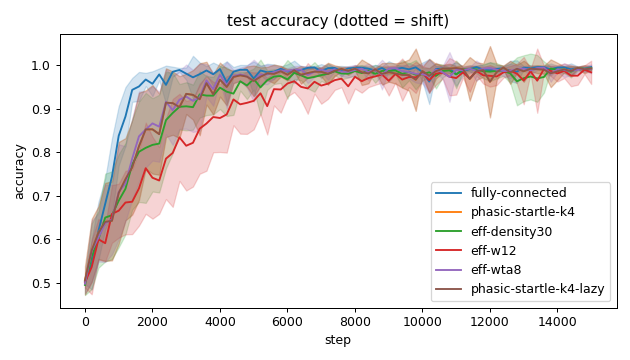

### churn_curves
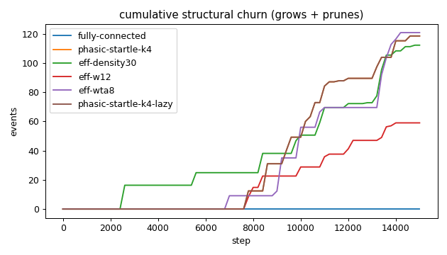

### cost_scaling
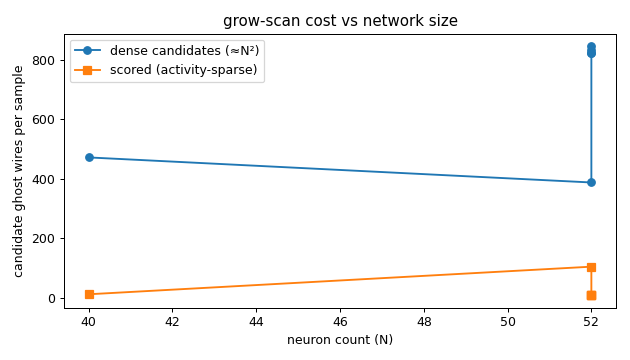

### count_curves
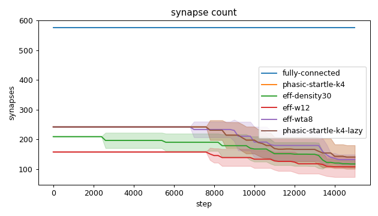

### quality_eff-density30
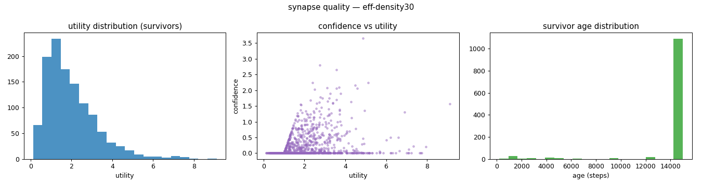

### quality_eff-w12
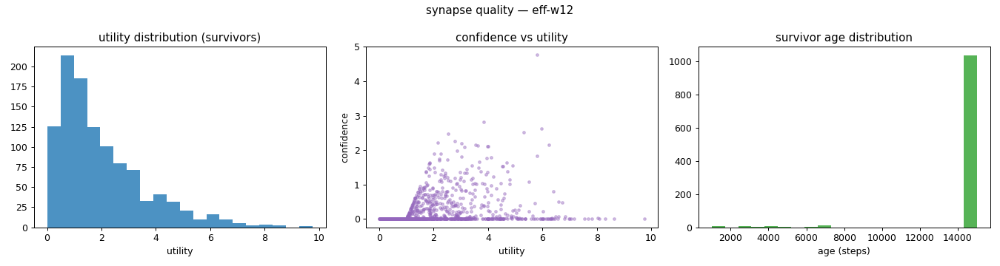

### quality_eff-wta8
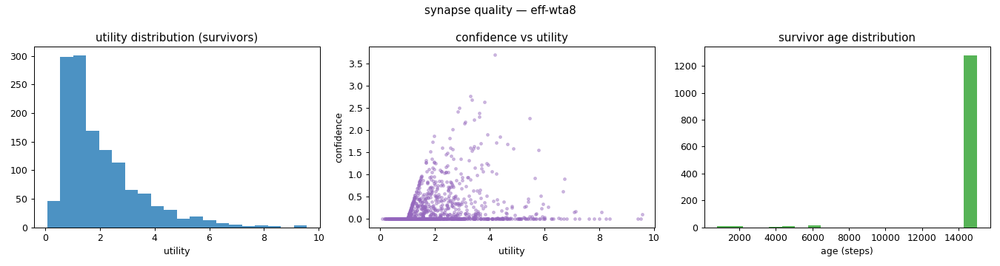

### quality_fully-connected
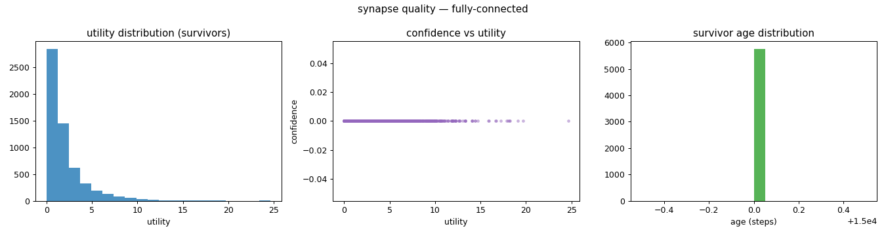

### quality_phasic-startle-k4-lazy
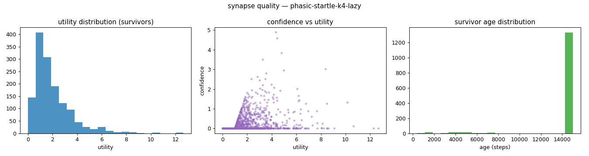

### quality_phasic-startle-k4
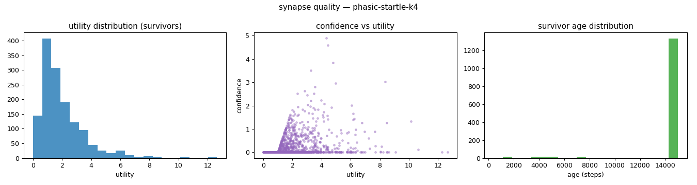

### verdict_heatmap
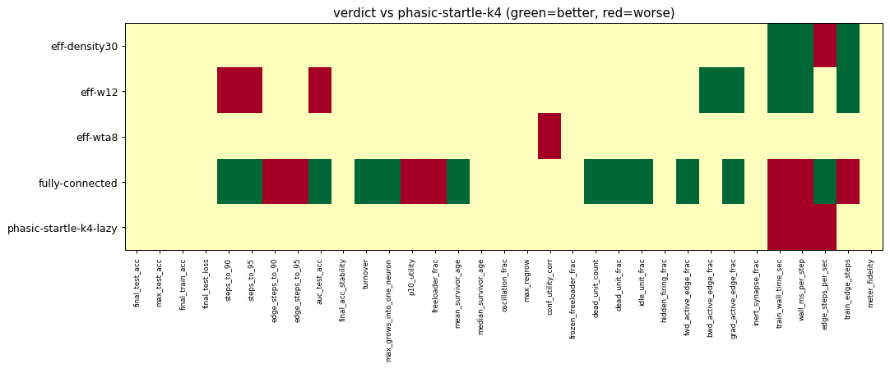

