# Evaluation run: compute-efficiency-probes

- **Date:** 2026-06-12 22:21:02
- **Variants:** eff-density30, eff-density50, eff-floor08, eff-floor12, eff-floor15, eff-w12, eff-w20, eff-wta4, eff-wta6, eff-wta8, phasic-startle-k4, phasic-startle-k4-lazy  (baseline: phasic-startle-k4)
- **Seeds:** 5  |  **Dataset:** spirals  |  **Steps:** 10000 (+0 shift)
- **Commit:** bd98091
- **Command:** `python evaluate.py --variants phasic-startle-k4,phasic-startle-k4-lazy,eff-density30,eff-density50,eff-w12,eff-w20,eff-floor08,eff-floor12,eff-floor15,eff-wta4,eff-wta6,eff-wta8 --baseline phasic-startle-k4 --seeds 5 --dataset spirals --steps 10000 --shift 0 --jobs 6 --record-every 200 --no-cache --publish --run-name compute-efficiency-probes`

## Key metrics

| Metric | What it means | eff-density30 | eff-density50 | eff-floor08 | eff-floor12 | eff-floor15 | eff-w12 | eff-w20 | eff-wta4 | eff-wta6 | eff-wta8 | phasic-startle-k4 (baseline) | phasic-startle-k4-lazy |
|---|---|---|---|---|---|---|---|---|---|---|---|---|---|
| final_test_acc ↑ | held-out accuracy at the end of the run | 0.981 ± 0.017 ≈ | 0.966 ± 0.038 ≈ | 0.991 ± 0.010 ≈ | 0.991 ± 0.008 ≈ | 0.992 ± 0.007 ≈ | 0.988 ± 0.014 ≈ | 0.995 ± 0.004 ≈ | 0.966 ± 0.027 ≈ | 0.980 ± 0.022 ≈ | 0.987 ± 0.015 ≈ | 0.991 ± 0.011 | 0.991 ± 0.011 ≈ |
| steps_to_90 ↓ | steps to first reach 90% test accuracy | 2121 ± 483.322 ≈ | 1561 ± 366.606 ≈ | 1721 ± 587.878 ≈ | 1721 ± 587.878 ≈ | 1721 ± 587.878 ≈ | 3481 ± 1478 ▼ | 1521 ± 370.945 ≈ | 3001 ± 400 ▼ | 2161 ± 427.083 ≈ | 1801 ± 632.456 ≈ | 1721 ± 587.878 | 1721 ± 587.878 ≈ |
| steps_to_95 ↓ | steps to first reach 95% test accuracy | 3961 ± 1015 ▼ | 2081 ± 805.978 ≈ | 2681 ± 881.816 ≈ | 2681 ± 881.816 ≈ | 2681 ± 881.816 ≈ | 4761 ± 2337 ≈ | 2081 ± 775.629 ≈ | 4321 ± 1177 ▼ | 2801 ± 876.356 ≈ | 2361 ± 649.923 ≈ | 2681 ± 881.816 | 2681 ± 881.816 ≈ |
| auc_test_acc ↑ | area under the test-accuracy curve (speed + level) | 0.900 ± 0.018 ≈ | 0.937 ± 0.023 ≈ | 0.925 ± 0.027 ≈ | 0.925 ± 0.027 ≈ | 0.925 ± 0.027 ≈ | 0.878 ± 0.030 ▼ | 0.942 ± 0.012 ≈ | 0.879 ± 0.017 ▼ | 0.914 ± 0.025 ≈ | 0.927 ± 0.019 ≈ | 0.925 ± 0.027 | 0.925 ± 0.027 ≈ |
| edge_steps_to_90 ↓ | live-edge training work to first reach 90% test accuracy | 441316 ± 97311 ≈ | 481148 ± 113433 ≈ | 416402 ± 142130 ≈ | 416402 ± 142130 ≈ | 416402 ± 142130 ≈ | 551598 ± 235025 ≈ | 583664 ± 142151 ▼ | 726202 ± 96195 ▼ | 522682 ± 101876 ≈ | 435682 ± 152381 ≈ | 416402 ± 142130 | 416402 ± 142130 ≈ |
| edge_steps_to_95 ↓ | live-edge training work to first reach 95% test accuracy | 809916 ± 215306 ≈ | 641708 ± 249774 ≈ | 648322 ± 211820 ≈ | 648322 ± 211820 ≈ | 648322 ± 211820 ≈ | 754518 ± 371002 ≈ | 798904 ± 298211 ≈ | 1045442 ± 283596 ▼ | 677122 ± 209670 ≈ | 571122 ± 155948 ≈ | 648322 ± 211820 | 648322 ± 211820 ≈ |
| synapse_count_end | live synapses at the end | 143.800 ± 34.272 ≈ | 254.800 ± 67.754 ≈ | 215.200 ± 33.433 ≈ | 202 ± 49.010 ≈ | 194.400 ± 58.305 ≈ | 134.400 ± 29.001 ≈ | 324.600 ± 73.587 ≈ | 198.600 ± 53.582 ≈ | 200 ± 51.447 ≈ | 198.600 ± 54.379 ≈ | 208.400 ± 41.278 | 208.400 ± 41.278 ≈ |
| effective_density | live edges as a fraction of fully-connected | 0.250 ± 0.059 ≈ | 0.442 ± 0.118 ≈ | 0.374 ± 0.058 ≈ | 0.351 ± 0.085 ≈ | 0.338 ± 0.101 ≈ | 0.400 ± 0.086 ≈ | 0.369 ± 0.084 ≈ | 0.345 ± 0.093 ≈ | 0.347 ± 0.089 ≈ | 0.345 ± 0.094 ≈ | 0.362 ± 0.072 | 0.362 ± 0.072 ≈ |
| avg_live_edges | time-average live edges during training | 186.301 ± 22.592 ≈ | 288.333 ± 33.852 ≈ | 238.224 ± 4.853 ≈ | 236.376 ± 6.925 ≈ | 235.312 ± 8.198 ≈ | 154.129 ± 4.355 ≈ | 361.844 ± 34.854 ≈ | 230.753 ± 15.509 ≈ | 238.648 ± 5.212 ≈ | 234.549 ± 12.018 ≈ | 237.272 ± 5.879 | 237.272 ± 5.879 ≈ |
| train_edge_steps ↓ | cumulative live-edge steps over training | 1863200 ± 225940 ▲ | 2883618 ± 338558 ▼ | 2382480 ± 48538 ≈ | 2364000 ± 69253 ≈ | 2353360 ± 81988 ≈ | 1541440 ± 43550 ▲ | 3618800 ± 348580 ▼ | 2307760 ± 155104 ≈ | 2386720 ± 52129 ≈ | 2345720 ± 120196 ≈ | 2372960 ± 58792 | 2372960 ± 58792 ≈ |
| train_wall_time_sec ↓ | training-loop wall time only, excluding eval snapshots | 3.337 ± 0.278 ▲ | 4.909 ± 0.465 ▼ | 4.143 ± 0.080 ▼ | 4.103 ± 0.111 ≈ | 4.093 ± 0.131 ≈ | 2.660 ± 0.069 ▲ | 6.184 ± 0.514 ▼ | 3.994 ± 0.232 ≈ | 4.106 ± 0.092 ▼ | 3.989 ± 0.178 ≈ | 3.983 ± 0.079 | 4.557 ± 0.097 ▼ |
| wall_ms_per_step ↓ | training-loop milliseconds per SGD step | 0.334 ± 0.028 ▲ | 0.491 ± 0.047 ▼ | 0.414 ± 0.008 ▼ | 0.410 ± 0.011 ≈ | 0.409 ± 0.013 ≈ | 0.266 ± 0.007 ▲ | 0.618 ± 0.051 ▼ | 0.399 ± 0.023 ≈ | 0.411 ± 0.009 ▼ | 0.399 ± 0.018 ≈ | 0.398 ± 0.008 | 0.456 ± 0.010 ▼ |
| edge_steps_per_sec ↑ | live-edge steps processed per wall-clock second | 556838 ± 29091 ▼ | 585927 ± 16913 ≈ | 575071 ± 2004 ▼ | 576201 ± 4111 ▼ | 574990 ± 3844 ▼ | 579434 ± 3732 ▼ | 584412 ± 9072 ▼ | 577550 ± 6098 ▼ | 581323 ± 2107 ▼ | 587903 ± 6695 ▼ | 595693 ± 3568 | 520742 ± 4546 ▼ |
| ghost_dense_cost | candidate ghost wires the grow-scan must consider (~N²) | 820.200 ± 34.272 ≈ | 709.200 ± 67.754 ≈ | 748.800 ± 33.433 ≈ | 762 ± 49.010 ≈ | 769.600 ± 58.305 ≈ | 445.600 ± 29.001 ≈ | 1119 ± 73.587 ≈ | 765.400 ± 53.582 ≈ | 764 ± 51.447 ≈ | 765.400 ± 54.379 ≈ | 755.600 ± 41.278 | 755.600 ± 41.278 ≈ |
| ghost_pairs_scored | candidate wires actually scored after activity+demand pruning | 11.435 ± 2.345 ≈ | 8.989 ± 2.206 ≈ | 10.774 ± 2.825 ≈ | 10.785 ± 2.795 ≈ | 11.060 ± 2.585 ≈ | 10.812 ± 1.893 ≈ | 11.753 ± 2.070 ≈ | 12.566 ± 1.399 ≈ | 9.279 ± 2.380 ≈ | 11.391 ± 1.176 ≈ | 10.597 ± 2.935 | 10.597 ± 2.935 ≈ |
| mean_neuron_activation | avg hidden-neuron ReLU output on test data (neuron value) | 0.435 ± 0.057 ≈ | 0.387 ± 0.039 ≈ | 0.443 ± 0.080 ≈ | 0.438 ± 0.083 ≈ | 0.440 ± 0.081 ≈ | 0.443 ± 0.088 ≈ | 0.399 ± 0.042 ≈ | 0.321 ± 0.036 ≈ | 0.404 ± 0.057 ≈ | 0.460 ± 0.075 ≈ | 0.444 ± 0.080 | 0.444 ± 0.080 ≈ |
| dead_unit_frac ↓ | fraction of hidden neurons that never fire (scale-free) | 0.133 ± 0.010 ▼ | 0.062 ± 0.048 ≈ | 0.058 ± 0.036 ≈ | 0.079 ± 0.057 ≈ | 0.079 ± 0.057 ≈ | 0.078 ± 0.087 ≈ | 0.063 ± 0.039 ≈ | 0.171 ± 0.058 ▼ | 0.096 ± 0.065 ≈ | 0.058 ± 0.036 ≈ | 0.062 ± 0.044 | 0.062 ± 0.044 ≈ |
| hidden_firing_frac ↓ | fraction of hidden ReLUs active on test data | 0.446 ± 0.013 ≈ | 0.460 ± 0.021 ≈ | 0.471 ± 0.029 ≈ | 0.469 ± 0.028 ≈ | 0.471 ± 0.027 ≈ | 0.441 ± 0.065 ≈ | 0.491 ± 0.028 ≈ | 0.249 ± 0.001 ▲ | 0.345 ± 0.015 ▲ | 0.441 ± 0.018 ▲ | 0.470 ± 0.026 | 0.470 ± 0.026 ≈ |
| fwd_active_edge_frac ↓ | fraction of live edges whose pre neuron is active | 0.602 ± 0.043 ≈ | 0.538 ± 0.034 ▲ | 0.586 ± 0.036 ≈ | 0.593 ± 0.041 ≈ | 0.599 ± 0.047 ≈ | 0.563 ± 0.012 ≈ | 0.573 ± 0.038 ≈ | 0.392 ± 0.056 ▲ | 0.485 ± 0.046 ▲ | 0.550 ± 0.056 ≈ | 0.589 ± 0.038 | 0.589 ± 0.038 ≈ |
| bwd_active_edge_frac ↓ | fraction of live edges whose post delta is nonzero | 0.502 ± 0.052 ≈ | 0.516 ± 0.028 ≈ | 0.508 ± 0.042 ≈ | 0.510 ± 0.044 ≈ | 0.511 ± 0.045 ≈ | 0.480 ± 0.054 ≈ | 0.529 ± 0.033 ≈ | 0.314 ± 0.028 ▲ | 0.408 ± 0.027 ▲ | 0.493 ± 0.032 ≈ | 0.506 ± 0.041 | 0.506 ± 0.041 ≈ |
| grad_active_edge_frac ↓ | fraction of live edges with nonzero weight gradient | 0.314 ± 0.060 ≈ | 0.281 ± 0.030 ≈ | 0.294 ± 0.038 ≈ | 0.301 ± 0.044 ≈ | 0.307 ± 0.051 ≈ | 0.277 ± 0.022 ≈ | 0.301 ± 0.031 ≈ | 0.132 ± 0.039 ▲ | 0.206 ± 0.041 ▲ | 0.273 ± 0.044 ≈ | 0.296 ± 0.039 | 0.296 ± 0.039 ≈ |
| idle_unit_frac ↓ | fraction of hidden neurons dead OR outputless (not in service) | 0.192 ± 0.052 ▼ | 0.075 ± 0.067 ≈ | 0.071 ± 0.047 ≈ | 0.092 ± 0.070 ≈ | 0.113 ± 0.096 ≈ | 0.111 ± 0.115 ≈ | 0.083 ± 0.066 ≈ | 0.188 ± 0.068 ▼ | 0.121 ± 0.089 ≈ | 0.083 ± 0.059 ≈ | 0.083 ± 0.060 | 0.083 ± 0.060 ≈ |
| n_recycle_events | dead-unit recycles fired over the run (sleep recycling) | 0 ± 0 ≈ | 0 ± 0 ≈ | 0 ± 0 ≈ | 0 ± 0 ≈ | 0 ± 0 ≈ | 0 ± 0 ≈ | 0 ± 0 ≈ | 0 ± 0 ≈ | 0 ± 0 ≈ | 0 ± 0 ≈ | 0 ± 0 | 0 ± 0 ≈ |
| recycled_rehired_frac | of recycled units, fraction back in service at the end | — ± — ? | — ± — ? | — ± — ? | — ± — ? | — ± — ? | — ± — ? | — ± — ? | — ± — ? | — ± — ? | — ± — ? | — ± — | — ± — ? |
| n_startle_events | demand-spike hiring alarms fired (startle growth) | 0 ± 0 ≈ | 0.200 ± 0.400 ≈ | 0 ± 0 ≈ | 0 ± 0 ≈ | 0 ± 0 ≈ | 0 ± 0 ≈ | 0 ± 0 ≈ | 0 ± 0 ≈ | 0 ± 0 ≈ | 0 ± 0 ≈ | 0 ± 0 | 0 ± 0 ≈ |
| n_arousal_events | post-startle refinement windows that ran grow-only passes | 0 ± 0 ≈ | 0 ± 0 ≈ | 0 ± 0 ≈ | 0 ± 0 ≈ | 0 ± 0 ≈ | 0 ± 0 ≈ | 0 ± 0 ≈ | 0 ± 0 ≈ | 0 ± 0 ≈ | 0 ± 0 ≈ | 0 ± 0 | 0 ± 0 ≈ |
| max_grows_into_one_neuron ↓ | most times one neuron was grown into (churn) | 3.200 ± 2.315 ≈ | 2.600 ± 2.577 ≈ | 1.800 ± 2.227 ≈ | 1.600 ± 2.059 ≈ | 1 ± 1.265 ≈ | 1.200 ± 1.470 ≈ | 2 ± 2.530 ≈ | 1 ± 1.265 ≈ | 2 ± 2.530 ≈ | 0.800 ± 1.166 ≈ | 1.800 ± 2.400 | 1.800 ± 2.400 ≈ |
| oscillation_frac ↓ | fraction of grown edges grown ≥2× (thrash) | 0 ± 0 ≈ | 0 ± 0 ≈ | 0 ± 0 ≈ | 0 ± 0 ≈ | 0 ± 0 ≈ | 0 ± 0 ≈ | 0 ± 0 ≈ | 0 ± 0 ≈ | 0 ± 0 ≈ | 0 ± 0 ≈ | 0 ± 0 | 0 ± 0 ≈ |
| freeloader_frac ↓ | fraction of synapses below the prune-utility floor | 0.075 ± 0.084 ≈ | 0.119 ± 0.090 ≈ | 0.120 ± 0.082 ≈ | 0.117 ± 0.085 ≈ | 0.120 ± 0.082 ≈ | 0.122 ± 0.077 ≈ | 0.122 ± 0.089 ≈ | 0.184 ± 0.123 ≈ | 0.154 ± 0.097 ≈ | 0.141 ± 0.081 ≈ | 0.121 ± 0.082 | 0.121 ± 0.082 ≈ |
| conf_utility_corr ↑ | corr of confidence with real utility (calibration) | 0.150 ± 0.087 ≈ | 0.218 ± 0.028 ≈ | 0.232 ± 0.071 ≈ | 0.216 ± 0.072 ≈ | 0.202 ± 0.090 ≈ | 0.262 ± 0.123 ≈ | 0.208 ± 0.099 ≈ | 0.160 ± 0.110 ≈ | 0.141 ± 0.053 ▼ | 0.187 ± 0.077 ≈ | 0.244 ± 0.081 | 0.244 ± 0.081 ≈ |
| dead_unit_count ↓ | hidden neurons that never fire on test data | 6.400 ± 0.490 ▼ | 3 ± 2.280 ≈ | 2.800 ± 1.720 ≈ | 3.800 ± 2.713 ≈ | 3.800 ± 2.713 ≈ | 2.800 ± 3.124 ≈ | 3.800 ± 2.315 ≈ | 8.200 ± 2.786 ▼ | 4.600 ± 3.137 ≈ | 2.800 ± 1.720 ≈ | 3 ± 2.098 | 3 ± 2.098 ≈ |

## Full scorecard

| Metric | eff-density30 | eff-density50 | eff-floor08 | eff-floor12 | eff-floor15 | eff-w12 | eff-w20 | eff-wta4 | eff-wta6 | eff-wta8 | phasic-startle-k4 (baseline) | phasic-startle-k4-lazy |
|---|---|---|---|---|---|---|---|---|---|---|---|---|
| **Prediction performance** | | | | | | | | | | | | |
| final_test_acc ↑ | 0.981 ± 0.017 ≈ | 0.966 ± 0.038 ≈ | 0.991 ± 0.010 ≈ | 0.991 ± 0.008 ≈ | 0.992 ± 0.007 ≈ | 0.988 ± 0.014 ≈ | 0.995 ± 0.004 ≈ | 0.966 ± 0.027 ≈ | 0.980 ± 0.022 ≈ | 0.987 ± 0.015 ≈ | 0.991 ± 0.011 | 0.991 ± 0.011 ≈ |
| max_test_acc ↑ | 0.994 ± 0.003 ≈ | 0.997 ± 0.004 ≈ | 0.997 ± 0.002 ≈ | 0.997 ± 0.002 ≈ | 0.997 ± 0.002 ≈ | 0.992 ± 0.010 ≈ | 0.997 ± 0.003 ≈ | 0.986 ± 0.013 ▼ | 0.995 ± 0.004 ≈ | 0.996 ± 0.003 ≈ | 0.997 ± 0.002 | 0.997 ± 0.002 ≈ |
| final_train_acc ↑ | 0.985 ± 0.014 ≈ | 0.965 ± 0.039 ≈ | 0.991 ± 0.009 ≈ | 0.992 ± 0.006 ≈ | 0.993 ± 0.004 ≈ | 0.987 ± 0.014 ≈ | 0.995 ± 0.002 ≈ | 0.965 ± 0.025 ▼ | 0.983 ± 0.022 ≈ | 0.988 ± 0.018 ≈ | 0.993 ± 0.007 | 0.993 ± 0.007 ≈ |
| final_test_loss ↓ | 0.061 ± 0.044 ≈ | 0.109 ± 0.119 ≈ | 0.031 ± 0.024 ≈ | 0.030 ± 0.017 ≈ | 0.028 ± 0.013 ≈ | 0.050 ± 0.037 ≈ | 0.022 ± 0.011 ≈ | 0.096 ± 0.058 ▼ | 0.072 ± 0.083 ≈ | 0.039 ± 0.035 ≈ | 0.030 ± 0.023 | 0.030 ± 0.023 ≈ |
| **Training efficacy** | | | | | | | | | | | | |
| steps_to_90 ↓ | 2121 ± 483.322 ≈ | 1561 ± 366.606 ≈ | 1721 ± 587.878 ≈ | 1721 ± 587.878 ≈ | 1721 ± 587.878 ≈ | 3481 ± 1478 ▼ | 1521 ± 370.945 ≈ | 3001 ± 400 ▼ | 2161 ± 427.083 ≈ | 1801 ± 632.456 ≈ | 1721 ± 587.878 | 1721 ± 587.878 ≈ |
| steps_to_95 ↓ | 3961 ± 1015 ▼ | 2081 ± 805.978 ≈ | 2681 ± 881.816 ≈ | 2681 ± 881.816 ≈ | 2681 ± 881.816 ≈ | 4761 ± 2337 ≈ | 2081 ± 775.629 ≈ | 4321 ± 1177 ▼ | 2801 ± 876.356 ≈ | 2361 ± 649.923 ≈ | 2681 ± 881.816 | 2681 ± 881.816 ≈ |
| edge_steps_to_90 ↓ | 441316 ± 97311 ≈ | 481148 ± 113433 ≈ | 416402 ± 142130 ≈ | 416402 ± 142130 ≈ | 416402 ± 142130 ≈ | 551598 ± 235025 ≈ | 583664 ± 142151 ▼ | 726202 ± 96195 ▼ | 522682 ± 101876 ≈ | 435682 ± 152381 ≈ | 416402 ± 142130 | 416402 ± 142130 ≈ |
| edge_steps_to_95 ↓ | 809916 ± 215306 ≈ | 641708 ± 249774 ≈ | 648322 ± 211820 ≈ | 648322 ± 211820 ≈ | 648322 ± 211820 ≈ | 754518 ± 371002 ≈ | 798904 ± 298211 ≈ | 1045442 ± 283596 ▼ | 677122 ± 209670 ≈ | 571122 ± 155948 ≈ | 648322 ± 211820 | 648322 ± 211820 ≈ |
| auc_test_acc ↑ | 0.900 ± 0.018 ≈ | 0.937 ± 0.023 ≈ | 0.925 ± 0.027 ≈ | 0.925 ± 0.027 ≈ | 0.925 ± 0.027 ≈ | 0.878 ± 0.030 ▼ | 0.942 ± 0.012 ≈ | 0.879 ± 0.017 ▼ | 0.914 ± 0.025 ≈ | 0.927 ± 0.019 ≈ | 0.925 ± 0.027 | 0.925 ± 0.027 ≈ |
| final_acc_stability ↓ | 0.020 ± 0.010 ≈ | 0.018 ± 0.008 ≈ | 0.008 ± 0.006 ≈ | 0.010 ± 0.008 ≈ | 0.011 ± 0.012 ≈ | 0.018 ± 0.013 ≈ | 0.014 ± 0.010 ≈ | 0.015 ± 0.006 ≈ | 0.011 ± 0.008 ≈ | 0.014 ± 0.011 ≈ | 0.012 ± 0.010 | 0.012 ± 0.010 ≈ |
| **Synapse structure** | | | | | | | | | | | | |
| synapse_count_start | 209.400 ± 1.020 ≈ | 308.200 ± 1.470 ≈ | 242 ± 0.894 ≈ | 242 ± 0.894 ≈ | 242 ± 0.894 ≈ | 158.400 ± 1.020 ≈ | 383.800 ± 1.327 ≈ | 242 ± 0.894 ≈ | 242 ± 0.894 ≈ | 242 ± 0.894 ≈ | 242 ± 0.894 | 242 ± 0.894 ≈ |
| synapse_count_peak | 209.400 ± 1.020 ≈ | 308.800 ± 0.980 ≈ | 242 ± 0.894 ≈ | 242 ± 0.894 ≈ | 242 ± 0.894 ≈ | 158.400 ± 1.020 ≈ | 383.800 ± 1.327 ≈ | 242 ± 0.894 ≈ | 242 ± 0.894 ≈ | 242 ± 0.894 ≈ | 242 ± 0.894 | 242 ± 0.894 ≈ |
| synapse_count_end | 143.800 ± 34.272 ≈ | 254.800 ± 67.754 ≈ | 215.200 ± 33.433 ≈ | 202 ± 49.010 ≈ | 194.400 ± 58.305 ≈ | 134.400 ± 29.001 ≈ | 324.600 ± 73.587 ≈ | 198.600 ± 53.582 ≈ | 200 ± 51.447 ≈ | 198.600 ± 54.379 ≈ | 208.400 ± 41.278 | 208.400 ± 41.278 ≈ |
| n_grow_events | 5.400 ± 4.317 ≈ | 3.200 ± 2.926 ≈ | 1.800 ± 2.227 ≈ | 1.600 ± 2.059 ≈ | 1.400 ± 1.744 ≈ | 2.200 ± 2.713 ≈ | 3 ± 3.795 ≈ | 2 ± 2.530 ≈ | 3 ± 4 ≈ | 1.600 ± 2.332 ≈ | 1.800 ± 2.400 | 1.800 ± 2.400 ≈ |
| n_prune_events | 71 ± 35.956 ≈ | 56.600 ± 70.102 ≈ | 28.600 ± 35.438 ≈ | 41.600 ± 50.949 ≈ | 49 ± 60.020 ≈ | 26.200 ± 32.437 ≈ | 62.200 ± 77.383 ≈ | 45.400 ± 55.604 ≈ | 45 ± 55.187 ≈ | 45 ± 55.375 ≈ | 35.400 ± 43.385 | 35.400 ± 43.385 ≈ |
| n_startle_events | 0 ± 0 ≈ | 0.200 ± 0.400 ≈ | 0 ± 0 ≈ | 0 ± 0 ≈ | 0 ± 0 ≈ | 0 ± 0 ≈ | 0 ± 0 ≈ | 0 ± 0 ≈ | 0 ± 0 ≈ | 0 ± 0 ≈ | 0 ± 0 | 0 ± 0 ≈ |
| n_arousal_events | 0 ± 0 ≈ | 0 ± 0 ≈ | 0 ± 0 ≈ | 0 ± 0 ≈ | 0 ± 0 ≈ | 0 ± 0 ≈ | 0 ± 0 ≈ | 0 ± 0 ≈ | 0 ± 0 ≈ | 0 ± 0 ≈ | 0 ± 0 | 0 ± 0 ≈ |
| distinct_neurons_grown | 2 ± 1.673 ≈ | 1 ± 1.095 ≈ | 0.400 ± 0.490 ≈ | 0.400 ± 0.490 ≈ | 0.600 ± 0.800 ≈ | 1 ± 1.265 ≈ | 1 ± 1.549 ≈ | 1.200 ± 1.470 ≈ | 0.800 ± 0.980 ≈ | 0.800 ± 0.980 ≈ | 0.400 ± 0.490 | 0.400 ± 0.490 ≈ |
| turnover ↓ | 0.434 ± 0.231 ≈ | 0.241 ± 0.306 ≈ | 0.131 ± 0.163 ≈ | 0.191 ± 0.234 ≈ | 0.226 ± 0.276 ≈ | 0.192 ± 0.237 ≈ | 0.199 ± 0.243 ≈ | 0.224 ± 0.275 ≈ | 0.207 ± 0.254 ≈ | 0.212 ± 0.262 ≈ | 0.163 ± 0.199 | 0.163 ± 0.199 ≈ |
| max_grows_into_one_neuron ↓ | 3.200 ± 2.315 ≈ | 2.600 ± 2.577 ≈ | 1.800 ± 2.227 ≈ | 1.600 ± 2.059 ≈ | 1 ± 1.265 ≈ | 1.200 ± 1.470 ≈ | 2 ± 2.530 ≈ | 1 ± 1.265 ≈ | 2 ± 2.530 ≈ | 0.800 ± 1.166 ≈ | 1.800 ± 2.400 | 1.800 ± 2.400 ≈ |
| mean_fan_in | 2.876 ± 0.685 ≈ | 5.096 ± 1.355 ≈ | 4.304 ± 0.669 ≈ | 4.040 ± 0.980 ≈ | 3.888 ± 1.166 ≈ | 3.537 ± 0.763 ≈ | 5.235 ± 1.187 ≈ | 3.972 ± 1.072 ≈ | 4 ± 1.029 ≈ | 3.972 ± 1.088 ≈ | 4.168 ± 0.826 | 4.168 ± 0.826 ≈ |
| mean_fan_out | 2.876 ± 0.685 ≈ | 5.096 ± 1.355 ≈ | 4.304 ± 0.669 ≈ | 4.040 ± 0.980 ≈ | 3.888 ± 1.166 ≈ | 3.537 ± 0.763 ≈ | 5.235 ± 1.187 ≈ | 3.972 ± 1.072 ≈ | 4 ± 1.029 ≈ | 3.972 ± 1.088 ≈ | 4.168 ± 0.826 | 4.168 ± 0.826 ≈ |
| effective_density | 0.250 ± 0.059 ≈ | 0.442 ± 0.118 ≈ | 0.374 ± 0.058 ≈ | 0.351 ± 0.085 ≈ | 0.338 ± 0.101 ≈ | 0.400 ± 0.086 ≈ | 0.369 ± 0.084 ≈ | 0.345 ± 0.093 ≈ | 0.347 ± 0.089 ≈ | 0.345 ± 0.094 ≈ | 0.362 ± 0.072 | 0.362 ± 0.072 ≈ |
| avg_live_edges | 186.301 ± 22.592 ≈ | 288.333 ± 33.852 ≈ | 238.224 ± 4.853 ≈ | 236.376 ± 6.925 ≈ | 235.312 ± 8.198 ≈ | 154.129 ± 4.355 ≈ | 361.844 ± 34.854 ≈ | 230.753 ± 15.509 ≈ | 238.648 ± 5.212 ≈ | 234.549 ± 12.018 ≈ | 237.272 ± 5.879 | 237.272 ± 5.879 ≈ |
| **Synapse quality** | | | | | | | | | | | | |
| p10_utility ↑ | 0.640 ± 0.240 ≈ | 0.511 ± 0.290 ≈ | 0.460 ± 0.222 ≈ | 0.502 ± 0.272 ≈ | 0.519 ± 0.300 ≈ | 0.449 ± 0.192 ≈ | 0.498 ± 0.204 ≈ | 0.377 ± 0.267 ≈ | 0.412 ± 0.243 ≈ | 0.458 ± 0.236 ≈ | 0.470 ± 0.235 | 0.470 ± 0.235 ≈ |
| freeloader_frac ↓ | 0.075 ± 0.084 ≈ | 0.119 ± 0.090 ≈ | 0.120 ± 0.082 ≈ | 0.117 ± 0.085 ≈ | 0.120 ± 0.082 ≈ | 0.122 ± 0.077 ≈ | 0.122 ± 0.089 ≈ | 0.184 ± 0.123 ≈ | 0.154 ± 0.097 ≈ | 0.141 ± 0.081 ≈ | 0.121 ± 0.082 | 0.121 ± 0.082 ≈ |
| mean_survivor_age ↑ | 9798 ± 150.253 ≈ | 9860 ± 141.145 ≈ | 9912 ± 108.280 ≈ | 9903 ± 123.701 ≈ | 9902 ± 121.570 ≈ | 9819 ± 222.012 ≈ | 9931 ± 99.209 ≈ | 9892 ± 132.814 ≈ | 9795 ± 279.285 ≈ | 9923 ± 154.422 ≈ | 9903 ± 127.738 | 9903 ± 127.738 ≈ |
| median_survivor_age ↑ | 10000 ± 0 ≈ | 10000 ± 0 ≈ | 10000 ± 0 ≈ | 10000 ± 0 ≈ | 10000 ± 0 ≈ | 10000 ± 0 ≈ | 10000 ± 0 ≈ | 10000 ± 0 ≈ | 10000 ± 0 ≈ | 10000 ± 0 ≈ | 10000 ± 0 | 10000 ± 0 ≈ |
| mean_pruned_lifespan | 5045 ± 3624 ≈ | 2660 ± 3530 ≈ | 3440 ± 4213 ≈ | 3440 ± 4213 ≈ | 3440 ± 4213 ≈ | 3280 ± 4019 ≈ | 2320 ± 3488 ≈ | 2960 ± 3680 ≈ | 3680 ± 4514 ≈ | 3323 ± 4108 ≈ | 3440 ± 4213 | 3440 ± 4213 ≈ |
| oscillation_frac ↓ | 0 ± 0 ≈ | 0 ± 0 ≈ | 0 ± 0 ≈ | 0 ± 0 ≈ | 0 ± 0 ≈ | 0 ± 0 ≈ | 0 ± 0 ≈ | 0 ± 0 ≈ | 0 ± 0 ≈ | 0 ± 0 ≈ | 0 ± 0 | 0 ± 0 ≈ |
| max_regrow ↓ | 0 ± 0 ≈ | 0 ± 0 ≈ | 0 ± 0 ≈ | 0 ± 0 ≈ | 0 ± 0 ≈ | 0 ± 0 ≈ | 0 ± 0 ≈ | 0 ± 0 ≈ | 0 ± 0 ≈ | 0 ± 0 ≈ | 0 ± 0 | 0 ± 0 ≈ |
| conf_utility_corr ↑ | 0.150 ± 0.087 ≈ | 0.218 ± 0.028 ≈ | 0.232 ± 0.071 ≈ | 0.216 ± 0.072 ≈ | 0.202 ± 0.090 ≈ | 0.262 ± 0.123 ≈ | 0.208 ± 0.099 ≈ | 0.160 ± 0.110 ≈ | 0.141 ± 0.053 ▼ | 0.187 ± 0.077 ≈ | 0.244 ± 0.081 | 0.244 ± 0.081 ≈ |
| frozen_freeloader_frac ↓ | 0 ± 0 ≈ | 0 ± 0 ≈ | 0 ± 0 ≈ | 0 ± 0 ≈ | 0 ± 0 ≈ | 0 ± 0 ≈ | 0 ± 0 ≈ | 0 ± 0 ≈ | 0 ± 0 ≈ | 0 ± 0 ≈ | 0 ± 0 | 0 ± 0 ≈ |
| dead_unit_count ↓ | 6.400 ± 0.490 ▼ | 3 ± 2.280 ≈ | 2.800 ± 1.720 ≈ | 3.800 ± 2.713 ≈ | 3.800 ± 2.713 ≈ | 2.800 ± 3.124 ≈ | 3.800 ± 2.315 ≈ | 8.200 ± 2.786 ▼ | 4.600 ± 3.137 ≈ | 2.800 ± 1.720 ≈ | 3 ± 2.098 | 3 ± 2.098 ≈ |
| dead_unit_frac ↓ | 0.133 ± 0.010 ▼ | 0.062 ± 0.048 ≈ | 0.058 ± 0.036 ≈ | 0.079 ± 0.057 ≈ | 0.079 ± 0.057 ≈ | 0.078 ± 0.087 ≈ | 0.063 ± 0.039 ≈ | 0.171 ± 0.058 ▼ | 0.096 ± 0.065 ≈ | 0.058 ± 0.036 ≈ | 0.062 ± 0.044 | 0.062 ± 0.044 ≈ |
| idle_unit_frac ↓ | 0.192 ± 0.052 ▼ | 0.075 ± 0.067 ≈ | 0.071 ± 0.047 ≈ | 0.092 ± 0.070 ≈ | 0.113 ± 0.096 ≈ | 0.111 ± 0.115 ≈ | 0.083 ± 0.066 ≈ | 0.188 ± 0.068 ▼ | 0.121 ± 0.089 ≈ | 0.083 ± 0.059 ≈ | 0.083 ± 0.060 | 0.083 ± 0.060 ≈ |
| mean_neuron_activation | 0.435 ± 0.057 ≈ | 0.387 ± 0.039 ≈ | 0.443 ± 0.080 ≈ | 0.438 ± 0.083 ≈ | 0.440 ± 0.081 ≈ | 0.443 ± 0.088 ≈ | 0.399 ± 0.042 ≈ | 0.321 ± 0.036 ≈ | 0.404 ± 0.057 ≈ | 0.460 ± 0.075 ≈ | 0.444 ± 0.080 | 0.444 ± 0.080 ≈ |
| hidden_firing_frac ↓ | 0.446 ± 0.013 ≈ | 0.460 ± 0.021 ≈ | 0.471 ± 0.029 ≈ | 0.469 ± 0.028 ≈ | 0.471 ± 0.027 ≈ | 0.441 ± 0.065 ≈ | 0.491 ± 0.028 ≈ | 0.249 ± 0.001 ▲ | 0.345 ± 0.015 ▲ | 0.441 ± 0.018 ▲ | 0.470 ± 0.026 | 0.470 ± 0.026 ≈ |
| fwd_active_edge_frac ↓ | 0.602 ± 0.043 ≈ | 0.538 ± 0.034 ▲ | 0.586 ± 0.036 ≈ | 0.593 ± 0.041 ≈ | 0.599 ± 0.047 ≈ | 0.563 ± 0.012 ≈ | 0.573 ± 0.038 ≈ | 0.392 ± 0.056 ▲ | 0.485 ± 0.046 ▲ | 0.550 ± 0.056 ≈ | 0.589 ± 0.038 | 0.589 ± 0.038 ≈ |
| bwd_active_edge_frac ↓ | 0.502 ± 0.052 ≈ | 0.516 ± 0.028 ≈ | 0.508 ± 0.042 ≈ | 0.510 ± 0.044 ≈ | 0.511 ± 0.045 ≈ | 0.480 ± 0.054 ≈ | 0.529 ± 0.033 ≈ | 0.314 ± 0.028 ▲ | 0.408 ± 0.027 ▲ | 0.493 ± 0.032 ≈ | 0.506 ± 0.041 | 0.506 ± 0.041 ≈ |
| grad_active_edge_frac ↓ | 0.314 ± 0.060 ≈ | 0.281 ± 0.030 ≈ | 0.294 ± 0.038 ≈ | 0.301 ± 0.044 ≈ | 0.307 ± 0.051 ≈ | 0.277 ± 0.022 ≈ | 0.301 ± 0.031 ≈ | 0.132 ± 0.039 ▲ | 0.206 ± 0.041 ▲ | 0.273 ± 0.044 ≈ | 0.296 ± 0.039 | 0.296 ± 0.039 ≈ |
| inert_synapse_frac ↓ | 0 ± 0 ≈ | 0 ± 0 ≈ | 0 ± 0 ≈ | 0 ± 0 ≈ | 0 ± 0 ≈ | 0 ± 0 ≈ | 0 ± 0 ≈ | 0 ± 0 ≈ | 0 ± 0 ≈ | 0 ± 0 ≈ | 0 ± 0 | 0 ± 0 ≈ |
| used_vs_allocated | 0.686 ± 0.160 ≈ | 0.827 ± 0.219 ≈ | 0.889 ± 0.138 ≈ | 0.835 ± 0.202 ≈ | 0.803 ± 0.241 ≈ | 0.849 ± 0.187 ≈ | 0.846 ± 0.193 ≈ | 0.820 ± 0.220 ≈ | 0.826 ± 0.213 ≈ | 0.820 ± 0.222 ≈ | 0.861 ± 0.170 | 0.861 ± 0.170 ≈ |
| n_recycle_events | 0 ± 0 ≈ | 0 ± 0 ≈ | 0 ± 0 ≈ | 0 ± 0 ≈ | 0 ± 0 ≈ | 0 ± 0 ≈ | 0 ± 0 ≈ | 0 ± 0 ≈ | 0 ± 0 ≈ | 0 ± 0 ≈ | 0 ± 0 | 0 ± 0 ≈ |
| recycled_rehired_frac | — ± — ? | — ± — ? | — ± — ? | — ± — ? | — ± — ? | — ± — ? | — ± — ? | — ± — ? | — ± — ? | — ± — ? | — ± — | — ± — ? |
| **Compute cost** | | | | | | | | | | | | |
| train_wall_time_sec ↓ | 3.337 ± 0.278 ▲ | 4.909 ± 0.465 ▼ | 4.143 ± 0.080 ▼ | 4.103 ± 0.111 ≈ | 4.093 ± 0.131 ≈ | 2.660 ± 0.069 ▲ | 6.184 ± 0.514 ▼ | 3.994 ± 0.232 ≈ | 4.106 ± 0.092 ▼ | 3.989 ± 0.178 ≈ | 3.983 ± 0.079 | 4.557 ± 0.097 ▼ |
| wall_ms_per_step ↓ | 0.334 ± 0.028 ▲ | 0.491 ± 0.047 ▼ | 0.414 ± 0.008 ▼ | 0.410 ± 0.011 ≈ | 0.409 ± 0.013 ≈ | 0.266 ± 0.007 ▲ | 0.618 ± 0.051 ▼ | 0.399 ± 0.023 ≈ | 0.411 ± 0.009 ▼ | 0.399 ± 0.018 ≈ | 0.398 ± 0.008 | 0.456 ± 0.010 ▼ |
| edge_steps_per_sec ↑ | 556838 ± 29091 ▼ | 585927 ± 16913 ≈ | 575071 ± 2004 ▼ | 576201 ± 4111 ▼ | 574990 ± 3844 ▼ | 579434 ± 3732 ▼ | 584412 ± 9072 ▼ | 577550 ± 6098 ▼ | 581323 ± 2107 ▼ | 587903 ± 6695 ▼ | 595693 ± 3568 | 520742 ± 4546 ▼ |
| train_edge_steps ↓ | 1863200 ± 225940 ▲ | 2883618 ± 338558 ▼ | 2382480 ± 48538 ≈ | 2364000 ± 69253 ≈ | 2353360 ± 81988 ≈ | 1541440 ± 43550 ▲ | 3618800 ± 348580 ▼ | 2307760 ± 155104 ≈ | 2386720 ± 52129 ≈ | 2345720 ± 120196 ≈ | 2372960 ± 58792 | 2372960 ± 58792 ≈ |
| ghost_dense_cost | 820.200 ± 34.272 ≈ | 709.200 ± 67.754 ≈ | 748.800 ± 33.433 ≈ | 762 ± 49.010 ≈ | 769.600 ± 58.305 ≈ | 445.600 ± 29.001 ≈ | 1119 ± 73.587 ≈ | 765.400 ± 53.582 ≈ | 764 ± 51.447 ≈ | 765.400 ± 54.379 ≈ | 755.600 ± 41.278 | 755.600 ± 41.278 ≈ |
| ghost_pairs_scored | 11.435 ± 2.345 ≈ | 8.989 ± 2.206 ≈ | 10.774 ± 2.825 ≈ | 10.785 ± 2.795 ≈ | 11.060 ± 2.585 ≈ | 10.812 ± 1.893 ≈ | 11.753 ± 2.070 ≈ | 12.566 ± 1.399 ≈ | 9.279 ± 2.380 ≈ | 11.391 ± 1.176 ≈ | 10.597 ± 2.935 | 10.597 ± 2.935 ≈ |
| **Signal sanity** | | | | | | | | | | | | |
| meter_fidelity ↑ | 0.873 ± 0.056 ≈ | 0.863 ± 0.091 ≈ | 0.860 ± 0.071 ≈ | 0.872 ± 0.065 ≈ | 0.871 ± 0.059 ≈ | 0.775 ± 0.320 ≈ | 0.863 ± 0.116 ≈ | 0.879 ± 0.078 ≈ | 0.860 ± 0.055 ≈ | 0.803 ± 0.115 ≈ | 0.879 ± 0.046 | 0.879 ± 0.046 ≈ |

Baseline: **phasic-startle-k4**. ▲ better / ▼ worse / ≈ no clear difference vs baseline (95% bootstrap CI of the mean difference). Cells show mean ± std across seeds.

## Charts

### acc_curves
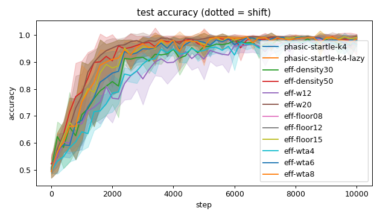

### churn_curves
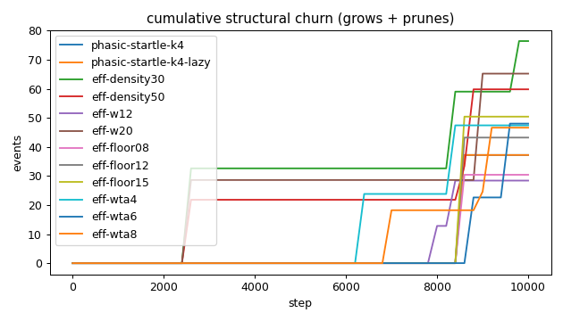

### cost_scaling
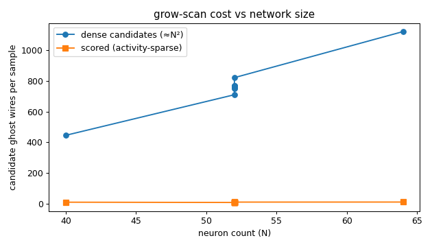

### count_curves
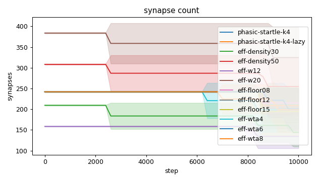

### quality_eff-density30

### quality_eff-density50

### quality_eff-floor08
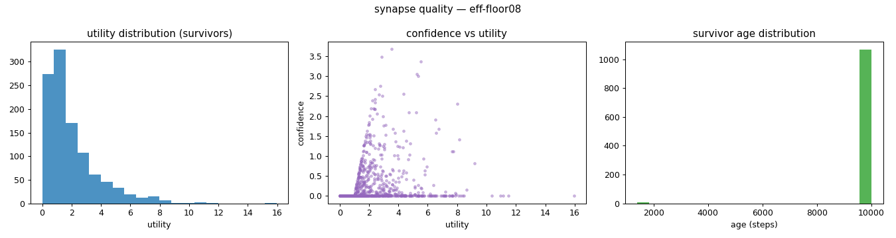

### quality_eff-floor12

### quality_eff-floor15
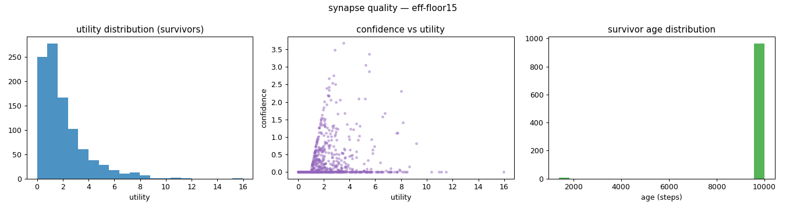

### quality_eff-w12
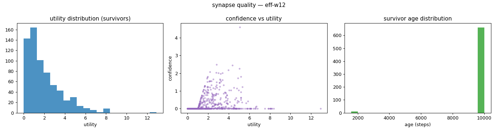

### quality_eff-w20
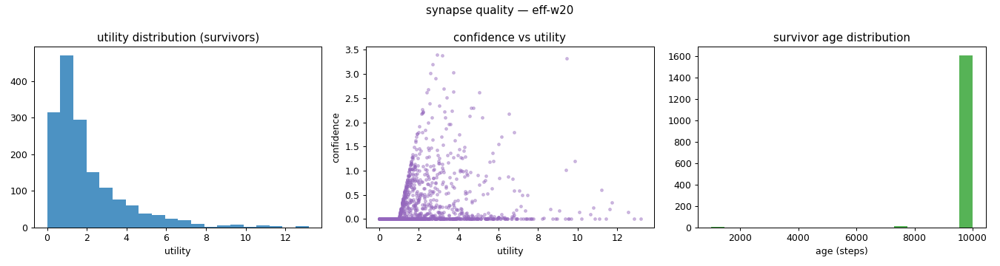

### quality_eff-wta4
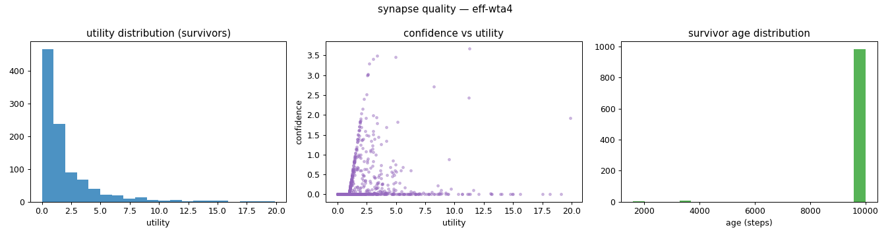

### quality_eff-wta6
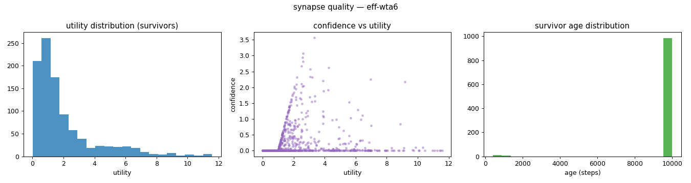

### quality_eff-wta8
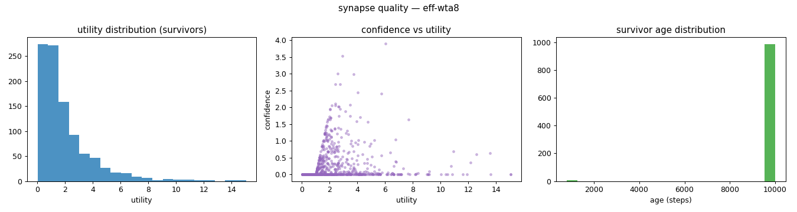

### quality_phasic-startle-k4-lazy

### quality_phasic-startle-k4

### verdict_heatmap
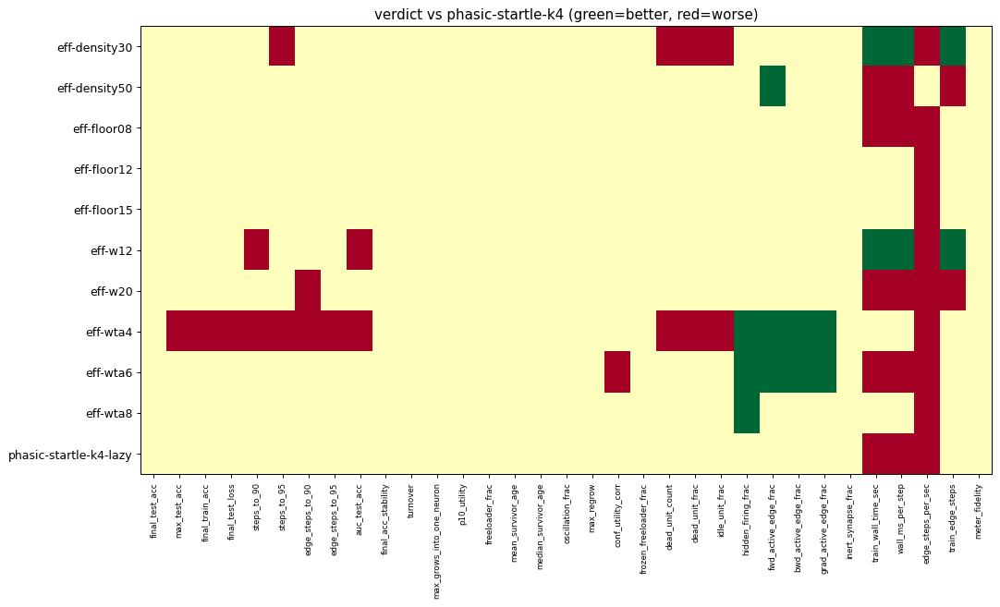

