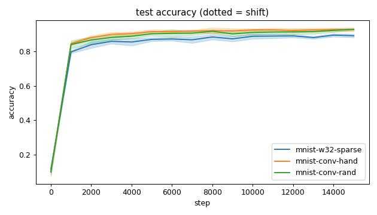
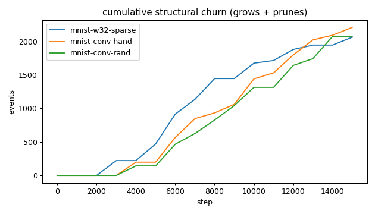
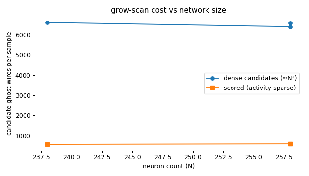
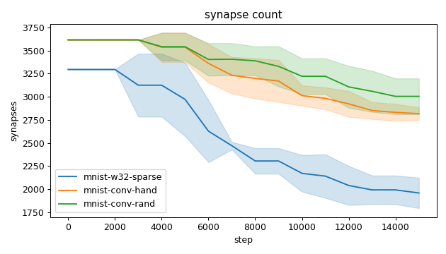
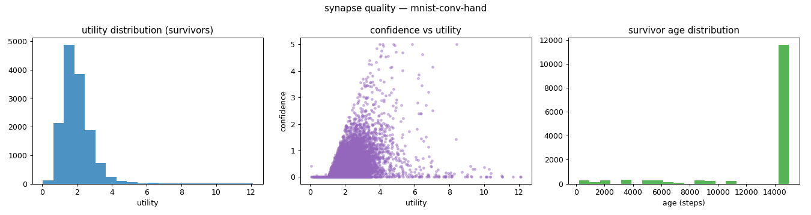
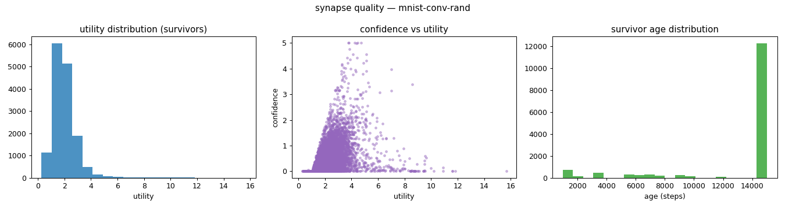
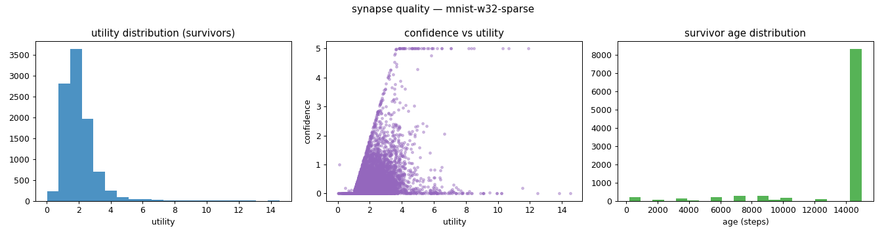
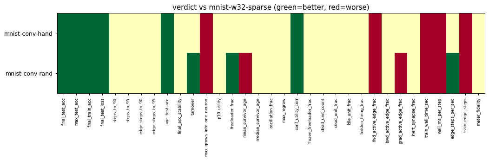

# Evaluation run: conv-front-end-mnist14

- **Date:** 2026-06-16 00:14:48
- **Variants:** mnist-conv-hand, mnist-conv-rand, mnist-w32-sparse  (baseline: mnist-w32-sparse)
- **Seeds:** 5  |  **Dataset:** mnist  |  **Steps:** 15000 (+0 shift)
- **Commit:** 5aeb342
- **Command:** `python evaluate.py --variants mnist-w32-sparse,mnist-conv-hand,mnist-conv-rand --seeds 5 --dataset mnist --steps 15000 --baseline mnist-w32-sparse --points 12000 --train-eval-cap 2000 --record-every 1000 --jobs 6 --no-cache --publish --run-name conv-front-end-mnist14`

## Key metrics

| Metric | What it means | mnist-conv-hand | mnist-conv-rand | mnist-w32-sparse (baseline) |
|---|---|---|---|---|
| final_test_acc ↑ | held-out accuracy at the end of the run | 0.929 ± 0.011 ▲ | 0.929 ± 0.004 ▲ | 0.892 ± 0.010 |
| steps_to_90 ↓ | steps to first reach 90% test accuracy | 4201 ± 1600 ? | 5401 ± 1625 ? | ∞ ± — |
| steps_to_95 ↓ | steps to first reach 95% test accuracy | ∞ ± — ? | ∞ ± — ? | ∞ ± — |
| auc_test_acc ↑ | area under the test-accuracy curve (speed + level) | 0.885 ± 0.009 ▲ | 0.874 ± 0.009 ▲ | 0.845 ± 0.010 |
| edge_steps_to_90 ↓ | live-edge training work to first reach 90% test accuracy | 15110936 ± 5747742 ? | 19128585 ± 5321010 ? | ∞ ± — |
| edge_steps_to_95 ↓ | live-edge training work to first reach 95% test accuracy | ∞ ± — ? | ∞ ± — ? | ∞ ± — |
| synapse_count_end | live synapses at the end | 2818 ± 67.908 ≈ | 3005 ± 193.607 ≈ | 1960 ± 164.750 |
| effective_density | live edges as a fraction of fully-connected | 0.390 ± 0.009 ≈ | 0.415 ± 0.027 ≈ | 0.297 ± 0.025 |
| avg_live_edges | time-average live edges during training | 3251 ± 90.090 ≈ | 3356 ± 132.573 ≈ | 2578 ± 107.817 |
| train_edge_steps ↓ | cumulative live-edge steps over training | 48774280 ± 1351436 ▼ | 50349120 ± 1988723 ▼ | 38679360 ± 1617370 |
| train_wall_time_sec ↓ | training-loop wall time only, excluding eval snapshots | 96.809 ± 3.287 ▼ | 98.887 ± 3.771 ▼ | 78.097 ± 4.228 |
| wall_ms_per_step ↓ | training-loop milliseconds per SGD step | 6.454 ± 0.219 ▼ | 6.592 ± 0.251 ▼ | 5.206 ± 0.282 |
| edge_steps_per_sec ↑ | live-edge steps processed per wall-clock second | 504008 ± 9864 ≈ | 509154 ± 4923 ▲ | 495647 ± 8801 |
| ghost_dense_cost | candidate ghost wires the grow-scan must consider (~N²) | 6574 ± 67.908 ≈ | 6387 ± 193.607 ≈ | 6592 ± 164.750 |
| ghost_pairs_scored | candidate wires actually scored after activity+demand pruning | 621.025 ± 12.049 ≈ | 609.259 ± 15.741 ≈ | 584.851 ± 10.190 |
| mean_neuron_activation | avg hidden-neuron ReLU output on test data (neuron value) | 1.067 ± 0.025 ≈ | 1.119 ± 0.031 ≈ | 5689 ± 11376 |
| dead_unit_frac ↓ | fraction of hidden neurons that never fire (scale-free) | 0 ± 0 ≈ | 0 ± 0 ≈ | 0 ± 0 |
| hidden_firing_frac ↓ | fraction of hidden ReLUs active on test data | 0.478 ± 0.005 ≈ | 0.477 ± 0.004 ≈ | 0.475 ± 0.008 |
| fwd_active_edge_frac ↓ | fraction of live edges whose pre neuron is active | 0.967 ± 0.001 ▼ | 0.970 ± 0.002 ▼ | 0.944 ± 0.003 |
| bwd_active_edge_frac ↓ | fraction of live edges whose post delta is nonzero | 0.566 ± 0.008 ≈ | 0.570 ± 0.007 ≈ | 0.574 ± 0.013 |
| grad_active_edge_frac ↓ | fraction of live edges with nonzero weight gradient | 0.533 ± 0.009 ≈ | 0.540 ± 0.007 ▼ | 0.522 ± 0.012 |
| idle_unit_frac ↓ | fraction of hidden neurons dead OR outputless (not in service) | 0 ± 0 ≈ | 0 ± 0 ≈ | 0 ± 0 |
| n_recycle_events | dead-unit recycles fired over the run (sleep recycling) | 0 ± 0 ≈ | 0 ± 0 ≈ | 0 ± 0 |
| recycled_rehired_frac | of recycled units, fraction back in service at the end | — ± — ? | — ± — ? | — ± — |
| n_startle_events | demand-spike hiring alarms fired (startle growth) | 0 ± 0 ≈ | 0 ± 0 ≈ | 0 ± 0 |
| n_arousal_events | post-startle refinement windows that ran grow-only passes | 0 ± 0 ≈ | 0 ± 0 ≈ | 0 ± 0 |
| max_grows_into_one_neuron ↓ | most times one neuron was grown into (churn) | 132.200 ± 27.125 ▼ | 155 ± 17.263 ▼ | 85 ± 17.100 |
| oscillation_frac ↓ | fraction of grown edges grown ≥2× (thrash) | 0.026 ± 0.030 ≈ | 0.007 ± 0.007 ≈ | 0.015 ± 0.017 |
| freeloader_frac ↓ | fraction of synapses below the prune-utility floor | 0.003 ± 0.003 ≈ | 0.003 ± 0.002 ▲ | 0.007 ± 0.003 |
| conf_utility_corr ↑ | corr of confidence with real utility (calibration) | 0.462 ± 0.033 ▲ | 0.492 ± 0.030 ▲ | 0.397 ± 0.032 |
| dead_unit_count ↓ | hidden neurons that never fire on test data | 0 ± 0 ≈ | 0 ± 0 ≈ | 0 ± 0 |

## Full scorecard

| Metric | mnist-conv-hand | mnist-conv-rand | mnist-w32-sparse (baseline) |
|---|---|---|---|
| **Prediction performance** | | | |
| final_test_acc ↑ | 0.929 ± 0.011 ▲ | 0.929 ± 0.004 ▲ | 0.892 ± 0.010 |
| max_test_acc ↑ | 0.937 ± 0.008 ▲ | 0.931 ± 0.004 ▲ | 0.901 ± 0.010 |
| final_train_acc ↑ | 0.946 ± 0.003 ▲ | 0.942 ± 0.006 ▲ | 0.907 ± 0.005 |
| final_test_loss ↓ | 0.247 ± 0.050 ▲ | 0.247 ± 0.034 ▲ | 0.405 ± 0.038 |
| **Training efficacy** | | | |
| steps_to_90 ↓ | 4201 ± 1600 ? | 5401 ± 1625 ? | ∞ ± — |
| steps_to_95 ↓ | ∞ ± — ? | ∞ ± — ? | ∞ ± — |
| edge_steps_to_90 ↓ | 15110936 ± 5747742 ? | 19128585 ± 5321010 ? | ∞ ± — |
| edge_steps_to_95 ↓ | ∞ ± — ? | ∞ ± — ? | ∞ ± — |
| auc_test_acc ↑ | 0.885 ± 0.009 ▲ | 0.874 ± 0.009 ▲ | 0.845 ± 0.010 |
| final_acc_stability ↓ | 0.009 ± 0.002 ≈ | 0.012 ± 0.003 ≈ | 0.012 ± 0.004 |
| **Synapse structure** | | | |
| synapse_count_start | 3616 ± 0 ≈ | 3616 ± 0 ≈ | 3296 ± 0 |
| synapse_count_peak | 3616 ± 0 ≈ | 3616 ± 0 ≈ | 3296 ± 0 |
| synapse_count_end | 2818 ± 67.908 ≈ | 3005 ± 193.607 ≈ | 1960 ± 164.750 |
| n_grow_events | 705.600 ± 216.762 ≈ | 731.800 ± 145.977 ≈ | 363.400 ± 64.086 |
| n_prune_events | 1504 ± 189.554 ≈ | 1343 ± 258.873 ≈ | 1700 ± 204.479 |
| n_startle_events | 0 ± 0 ≈ | 0 ± 0 ≈ | 0 ± 0 |
| n_arousal_events | 0 ± 0 ≈ | 0 ± 0 ≈ | 0 ± 0 |
| distinct_neurons_grown | 21 ± 3.406 ≈ | 18.200 ± 4.707 ≈ | 23.800 ± 2.135 |
| turnover ↓ | 0.679 ± 0.110 ≈ | 0.622 ± 0.130 ▲ | 0.807 ± 0.125 |
| max_grows_into_one_neuron ↓ | 132.200 ± 27.125 ▼ | 155 ± 17.263 ▼ | 85 ± 17.100 |
| mean_fan_in | 67.086 ± 1.617 ≈ | 71.543 ± 4.610 ≈ | 46.657 ± 3.923 |
| mean_fan_out | 11.361 ± 0.274 ≈ | 12.116 ± 0.781 ≈ | 8.595 ± 0.723 |
| effective_density | 0.390 ± 0.009 ≈ | 0.415 ± 0.027 ≈ | 0.297 ± 0.025 |
| avg_live_edges | 3251 ± 90.090 ≈ | 3356 ± 132.573 ≈ | 2578 ± 107.817 |
| **Synapse quality** | | | |
| p10_utility ↑ | 1.119 ± 0.034 ≈ | 1.124 ± 0.043 ≈ | 1.068 ± 0.046 |
| freeloader_frac ↓ | 0.003 ± 0.003 ≈ | 0.003 ± 0.002 ▲ | 0.007 ± 0.003 |
| mean_survivor_age ↑ | 13330 ± 667.190 ≈ | 13195 ± 385.056 ▼ | 13733 ± 344.078 |
| median_survivor_age ↑ | 15000 ± 0 ≈ | 15000 ± 0 ≈ | 15000 ± 0 |
| mean_pruned_lifespan | 7440 ± 992.892 ≈ | 8228 ± 1413 ≈ | 6930 ± 386.047 |
| oscillation_frac ↓ | 0.026 ± 0.030 ≈ | 0.007 ± 0.007 ≈ | 0.015 ± 0.017 |
| max_regrow ↓ | 1.200 ± 0.400 ≈ | 0.800 ± 0.748 ≈ | 0.800 ± 0.400 |
| conf_utility_corr ↑ | 0.462 ± 0.033 ▲ | 0.492 ± 0.030 ▲ | 0.397 ± 0.032 |
| frozen_freeloader_frac ↓ | 0 ± 0 ≈ | 0 ± 0 ≈ | 0 ± 0 |
| dead_unit_count ↓ | 0 ± 0 ≈ | 0 ± 0 ≈ | 0 ± 0 |
| dead_unit_frac ↓ | 0 ± 0 ≈ | 0 ± 0 ≈ | 0 ± 0 |
| idle_unit_frac ↓ | 0 ± 0 ≈ | 0 ± 0 ≈ | 0 ± 0 |
| mean_neuron_activation | 1.067 ± 0.025 ≈ | 1.119 ± 0.031 ≈ | 5689 ± 11376 |
| hidden_firing_frac ↓ | 0.478 ± 0.005 ≈ | 0.477 ± 0.004 ≈ | 0.475 ± 0.008 |
| fwd_active_edge_frac ↓ | 0.967 ± 0.001 ▼ | 0.970 ± 0.002 ▼ | 0.944 ± 0.003 |
| bwd_active_edge_frac ↓ | 0.566 ± 0.008 ≈ | 0.570 ± 0.007 ≈ | 0.574 ± 0.013 |
| grad_active_edge_frac ↓ | 0.533 ± 0.009 ≈ | 0.540 ± 0.007 ▼ | 0.522 ± 0.012 |
| inert_synapse_frac ↓ | 0 ± 0 ≈ | 0 ± 0 ≈ | 0 ± 0 |
| used_vs_allocated | 0.779 ± 0.019 ≈ | 0.831 ± 0.054 ≈ | 0.595 ± 0.050 |
| n_recycle_events | 0 ± 0 ≈ | 0 ± 0 ≈ | 0 ± 0 |
| recycled_rehired_frac | — ± — ? | — ± — ? | — ± — |
| **Compute cost** | | | |
| train_wall_time_sec ↓ | 96.809 ± 3.287 ▼ | 98.887 ± 3.771 ▼ | 78.097 ± 4.228 |
| wall_ms_per_step ↓ | 6.454 ± 0.219 ▼ | 6.592 ± 0.251 ▼ | 5.206 ± 0.282 |
| edge_steps_per_sec ↑ | 504008 ± 9864 ≈ | 509154 ± 4923 ▲ | 495647 ± 8801 |
| train_edge_steps ↓ | 48774280 ± 1351436 ▼ | 50349120 ± 1988723 ▼ | 38679360 ± 1617370 |
| ghost_dense_cost | 6574 ± 67.908 ≈ | 6387 ± 193.607 ≈ | 6592 ± 164.750 |
| ghost_pairs_scored | 621.025 ± 12.049 ≈ | 609.259 ± 15.741 ≈ | 584.851 ± 10.190 |
| **Signal sanity** | | | |
| meter_fidelity ↑ | 0.652 ± 0.125 ≈ | 0.625 ± 0.059 ≈ | 0.678 ± 0.154 |

Baseline: **mnist-w32-sparse**. ▲ better / ▼ worse / ≈ no clear difference vs baseline (95% bootstrap CI of the mean difference). Cells show mean ± std across seeds.

## Charts

### acc_curves

### churn_curves

### cost_scaling

### count_curves

### quality_mnist-conv-hand

### quality_mnist-conv-rand

### quality_mnist-w32-sparse

### verdict_heatmap

