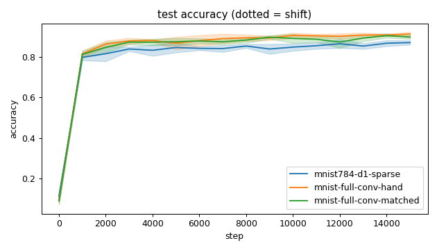
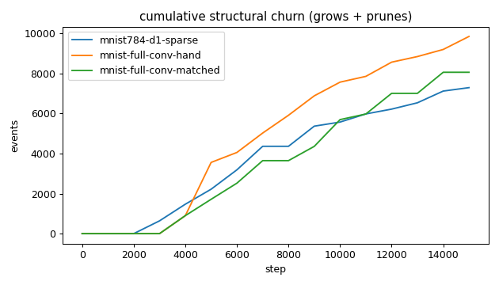
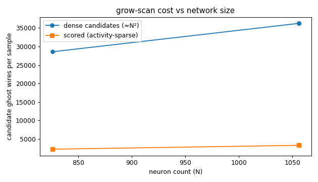
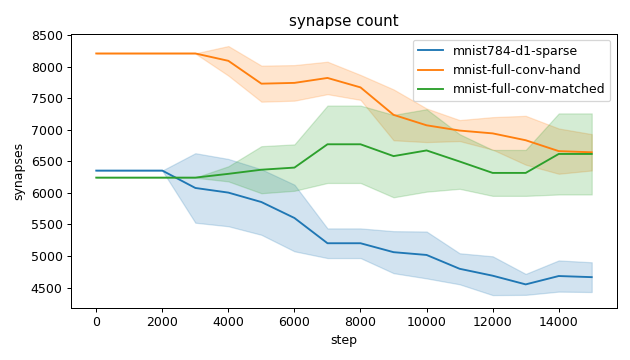
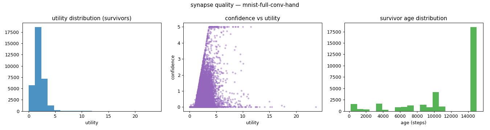
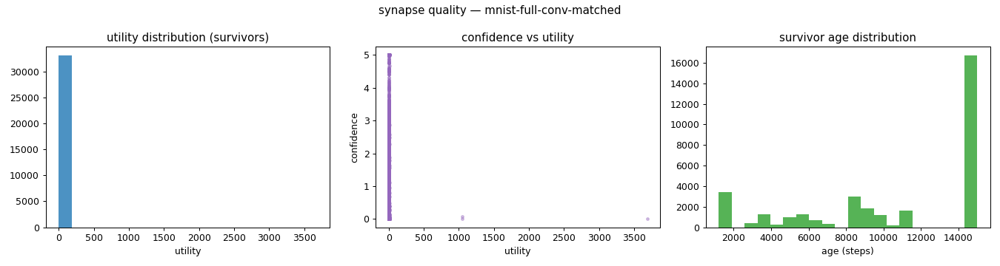
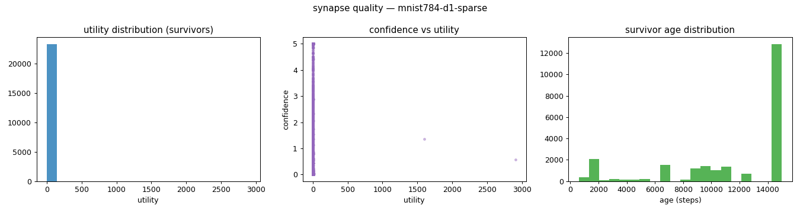
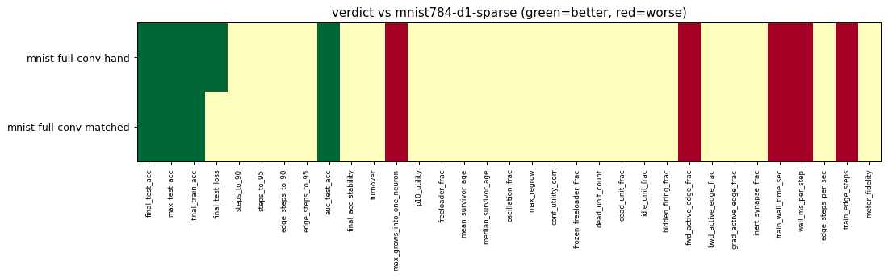

# Evaluation run: conv-front-end-mnist784

- **Date:** 2026-06-16 00:33:38
- **Variants:** mnist-full-conv-hand, mnist-full-conv-matched, mnist784-d1-sparse  (baseline: mnist784-d1-sparse)
- **Seeds:** 5  |  **Dataset:** mnist-full  |  **Steps:** 15000 (+0 shift)
- **Commit:** 5fac7c3
- **Command:** `python evaluate.py --variants mnist784-d1-sparse,mnist-full-conv-hand,mnist-full-conv-matched --seeds 5 --dataset mnist-full --steps 15000 --baseline mnist784-d1-sparse --points 12000 --train-eval-cap 2000 --record-every 1000 --jobs 6 --no-cache --publish --run-name conv-front-end-mnist784`

## Key metrics

| Metric | What it means | mnist-full-conv-hand | mnist-full-conv-matched | mnist784-d1-sparse (baseline) |
|---|---|---|---|---|
| final_test_acc ↑ | held-out accuracy at the end of the run | 0.913 ± 0.010 ▲ | 0.898 ± 0.009 ▲ | 0.871 ± 0.011 |
| steps_to_90 ↓ | steps to first reach 90% test accuracy | 8401 ± 2417 ? | ∞ ± — ? | ∞ ± — |
| steps_to_95 ↓ | steps to first reach 95% test accuracy | ∞ ± — ? | ∞ ± — ? | ∞ ± — |
| auc_test_acc ↑ | area under the test-accuracy curve (speed + level) | 0.859 ± 0.008 ▲ | 0.850 ± 0.009 ▲ | 0.819 ± 0.011 |
| edge_steps_to_90 ↓ | live-edge training work to first reach 90% test accuracy | 66821375 ± 18399197 ? | ∞ ± — ? | ∞ ± — |
| edge_steps_to_95 ↓ | live-edge training work to first reach 95% test accuracy | ∞ ± — ? | ∞ ± — ? | ∞ ± — |
| synapse_count_end | live synapses at the end | 6644 ± 288.084 ≈ | 6617 ± 642.603 ≈ | 4664 ± 236.011 |
| effective_density | live edges as a fraction of fully-connected | 0.203 ± 0.009 ≈ | 0.202 ± 0.020 ≈ | 0.184 ± 0.009 |
| avg_live_edges | time-average live edges during training | 7547 ± 129.845 ≈ | 6446 ± 264.020 ≈ | 5406 ± 168.915 |
| train_edge_steps ↓ | cumulative live-edge steps over training | 113206920 ± 1947806 ▼ | 96702321 ± 3960567 ▼ | 81100520 ± 2533892 |
| train_wall_time_sec ↓ | training-loop wall time only, excluding eval snapshots | 229.931 ± 3.709 ▼ | 196.601 ± 7.719 ▼ | 164.889 ± 4.914 |
| wall_ms_per_step ↓ | training-loop milliseconds per SGD step | 15.328 ± 0.247 ▼ | 13.106 ± 0.515 ▼ | 10.992 ± 0.328 |
| edge_steps_per_sec ↑ | live-edge steps processed per wall-clock second | 492344 ± 931.048 ≈ | 491840 ± 2107 ≈ | 491828 ± 1094 |
| ghost_dense_cost | candidate ghost wires the grow-scan must consider (~N²) | 36264 ± 288.084 ≈ | 36291 ± 642.603 ≈ | 28584 ± 236.011 |
| ghost_pairs_scored | candidate wires actually scored after activity+demand pruning | 3287 ± 29.893 ≈ | 3313 ± 87.779 ≈ | 2245 ± 46.353 |
| mean_neuron_activation | avg hidden-neuron ReLU output on test data (neuron value) | 1.291 ± 0.028 ≈ | 5136 ± 10269 ≈ | 21089 ± 42175 |
| dead_unit_frac ↓ | fraction of hidden neurons that never fire (scale-free) | 0 ± 0 ≈ | 0 ± 0 ≈ | 0 ± 0 |
| hidden_firing_frac ↓ | fraction of hidden ReLUs active on test data | 0.464 ± 0.010 ≈ | 0.466 ± 0.008 ≈ | 0.454 ± 0.013 |
| fwd_active_edge_frac ↓ | fraction of live edges whose pre neuron is active | 0.986 ± 0.001 ▼ | 0.986 ± 0.002 ▼ | 0.969 ± 0.003 |
| bwd_active_edge_frac ↓ | fraction of live edges whose post delta is nonzero | 0.627 ± 0.012 ≈ | 0.640 ± 0.022 ≈ | 0.630 ± 0.013 |
| grad_active_edge_frac ↓ | fraction of live edges with nonzero weight gradient | 0.613 ± 0.012 ≈ | 0.627 ± 0.022 ≈ | 0.605 ± 0.014 |
| idle_unit_frac ↓ | fraction of hidden neurons dead OR outputless (not in service) | 0.006 ± 0.013 ≈ | 0 ± 0 ≈ | 0.006 ± 0.013 |
| n_recycle_events | dead-unit recycles fired over the run (sleep recycling) | 0 ± 0 ≈ | 0 ± 0 ≈ | 0 ± 0 |
| recycled_rehired_frac | of recycled units, fraction back in service at the end | — ± — ? | — ± — ? | — ± — |
| n_startle_events | demand-spike hiring alarms fired (startle growth) | 0 ± 0 ≈ | 0.600 ± 0.490 ≈ | 0 ± 0 |
| n_arousal_events | post-startle refinement windows that ran grow-only passes | 0 ± 0 ≈ | 0 ± 0 ≈ | 0 ± 0 |
| max_grows_into_one_neuron ↓ | most times one neuron was grown into (churn) | 588.200 ± 77.290 ▼ | 617.600 ± 110.469 ▼ | 368.600 ± 61.298 |
| oscillation_frac ↓ | fraction of grown edges grown ≥2× (thrash) | 0.022 ± 0.013 ≈ | 0.028 ± 0.022 ≈ | 0.019 ± 0.019 |
| freeloader_frac ↓ | fraction of synapses below the prune-utility floor | 0.009 ± 0.004 ≈ | 0.069 ± 0.110 ≈ | 0.065 ± 0.123 |
| conf_utility_corr ↑ | corr of confidence with real utility (calibration) | 0.459 ± 0.045 ≈ | 0.393 ± 0.197 ≈ | 0.411 ± 0.191 |
| dead_unit_count ↓ | hidden neurons that never fire on test data | 0 ± 0 ≈ | 0 ± 0 ≈ | 0 ± 0 |

## Full scorecard

| Metric | mnist-full-conv-hand | mnist-full-conv-matched | mnist784-d1-sparse (baseline) |
|---|---|---|---|
| **Prediction performance** | | | |
| final_test_acc ↑ | 0.913 ± 0.010 ▲ | 0.898 ± 0.009 ▲ | 0.871 ± 0.011 |
| max_test_acc ↑ | 0.921 ± 0.008 ▲ | 0.909 ± 0.011 ▲ | 0.874 ± 0.013 |
| final_train_acc ↑ | 0.929 ± 0.007 ▲ | 0.921 ± 0.005 ▲ | 0.887 ± 0.013 |
| final_test_loss ↓ | 0.490 ± 0.063 ▲ | 0.577 ± 0.088 ≈ | 0.692 ± 0.127 |
| **Training efficacy** | | | |
| steps_to_90 ↓ | 8401 ± 2417 ? | ∞ ± — ? | ∞ ± — |
| steps_to_95 ↓ | ∞ ± — ? | ∞ ± — ? | ∞ ± — |
| edge_steps_to_90 ↓ | 66821375 ± 18399197 ? | ∞ ± — ? | ∞ ± — |
| edge_steps_to_95 ↓ | ∞ ± — ? | ∞ ± — ? | ∞ ± — |
| auc_test_acc ↑ | 0.859 ± 0.008 ▲ | 0.850 ± 0.009 ▲ | 0.819 ± 0.011 |
| final_acc_stability ↓ | 0.015 ± 0.005 ≈ | 0.015 ± 0.005 ≈ | 0.015 ± 0.003 |
| **Synapse structure** | | | |
| synapse_count_start | 8211 ± 1.327 ≈ | 6242 ± 1.470 ≈ | 6354 ± 1.200 |
| synapse_count_peak | 8211 ± 1.327 ≈ | 7157 ± 540.078 ≈ | 6354 ± 1.200 |
| synapse_count_end | 6644 ± 288.084 ≈ | 6617 ± 642.603 ≈ | 4664 ± 236.011 |
| n_grow_events | 4142 ± 925.537 ≈ | 4218 ± 1164 ≈ | 2803 ± 740.299 |
| n_prune_events | 5709 ± 1036 ≈ | 3843 ± 913.547 ≈ | 4492 ± 619.861 |
| n_startle_events | 0 ± 0 ≈ | 0.600 ± 0.490 ≈ | 0 ± 0 |
| n_arousal_events | 0 ± 0 ≈ | 0 ± 0 ≈ | 0 ± 0 |
| distinct_neurons_grown | 27 ± 3.521 ≈ | 24.400 ± 2.653 ≈ | 30.600 ± 1.356 |
| turnover ↓ | 1.311 ± 0.259 ≈ | 1.247 ± 0.298 ≈ | 1.346 ± 0.219 |
| max_grows_into_one_neuron ↓ | 588.200 ± 77.290 ▼ | 617.600 ± 110.469 ▼ | 368.600 ± 61.298 |
| mean_fan_in | 158.186 ± 6.859 ≈ | 157.557 ± 15.300 ≈ | 111.052 ± 5.619 |
| mean_fan_out | 6.352 ± 0.275 ≈ | 6.326 ± 0.614 ≈ | 5.716 ± 0.289 |
| effective_density | 0.203 ± 0.009 ≈ | 0.202 ± 0.020 ≈ | 0.184 ± 0.009 |
| avg_live_edges | 7547 ± 129.845 ≈ | 6446 ± 264.020 ≈ | 5406 ± 168.915 |
| **Synapse quality** | | | |
| p10_utility ↑ | 1.036 ± 0.055 ≈ | 0.823 ± 0.332 ≈ | 0.886 ± 0.370 |
| freeloader_frac ↓ | 0.009 ± 0.004 ≈ | 0.069 ± 0.110 ≈ | 0.065 ± 0.123 |
| mean_survivor_age ↑ | 11391 ± 573.469 ≈ | 10819 ± 1508 ≈ | 11510 ± 833.656 |
| median_survivor_age ↑ | 14000 ± 2000 ≈ | 12320 ± 3700 ≈ | 14240 ± 1520 |
| mean_pruned_lifespan | 6649 ± 579.462 ≈ | 6782 ± 895.755 ≈ | 6166 ± 768.961 |
| oscillation_frac ↓ | 0.022 ± 0.013 ≈ | 0.028 ± 0.022 ≈ | 0.019 ± 0.019 |
| max_regrow ↓ | 1.200 ± 0.400 ≈ | 1.200 ± 0.748 ≈ | 1.200 ± 0.400 |
| conf_utility_corr ↑ | 0.459 ± 0.045 ≈ | 0.393 ± 0.197 ≈ | 0.411 ± 0.191 |
| frozen_freeloader_frac ↓ | 0 ± 0 ≈ | 0 ± 0 ≈ | 0 ± 0 |
| dead_unit_count ↓ | 0 ± 0 ≈ | 0 ± 0 ≈ | 0 ± 0 |
| dead_unit_frac ↓ | 0 ± 0 ≈ | 0 ± 0 ≈ | 0 ± 0 |
| idle_unit_frac ↓ | 0.006 ± 0.013 ≈ | 0 ± 0 ≈ | 0.006 ± 0.013 |
| mean_neuron_activation | 1.291 ± 0.028 ≈ | 5136 ± 10269 ≈ | 21089 ± 42175 |
| hidden_firing_frac ↓ | 0.464 ± 0.010 ≈ | 0.466 ± 0.008 ≈ | 0.454 ± 0.013 |
| fwd_active_edge_frac ↓ | 0.986 ± 0.001 ▼ | 0.986 ± 0.002 ▼ | 0.969 ± 0.003 |
| bwd_active_edge_frac ↓ | 0.627 ± 0.012 ≈ | 0.640 ± 0.022 ≈ | 0.630 ± 0.013 |
| grad_active_edge_frac ↓ | 0.613 ± 0.012 ≈ | 0.627 ± 0.022 ≈ | 0.605 ± 0.014 |
| inert_synapse_frac ↓ | 0 ± 0 ≈ | 0 ± 0 ≈ | 0 ± 0 |
| used_vs_allocated | 0.809 ± 0.035 ≈ | 1.060 ± 0.103 ≈ | 0.734 ± 0.037 |
| n_recycle_events | 0 ± 0 ≈ | 0 ± 0 ≈ | 0 ± 0 |
| recycled_rehired_frac | — ± — ? | — ± — ? | — ± — |
| **Compute cost** | | | |
| train_wall_time_sec ↓ | 229.931 ± 3.709 ▼ | 196.601 ± 7.719 ▼ | 164.889 ± 4.914 |
| wall_ms_per_step ↓ | 15.328 ± 0.247 ▼ | 13.106 ± 0.515 ▼ | 10.992 ± 0.328 |
| edge_steps_per_sec ↑ | 492344 ± 931.048 ≈ | 491840 ± 2107 ≈ | 491828 ± 1094 |
| train_edge_steps ↓ | 113206920 ± 1947806 ▼ | 96702321 ± 3960567 ▼ | 81100520 ± 2533892 |
| ghost_dense_cost | 36264 ± 288.084 ≈ | 36291 ± 642.603 ≈ | 28584 ± 236.011 |
| ghost_pairs_scored | 3287 ± 29.893 ≈ | 3313 ± 87.779 ≈ | 2245 ± 46.353 |
| **Signal sanity** | | | |
| meter_fidelity ↑ | 0.558 ± 0.077 ≈ | 0.523 ± 0.265 ≈ | 0.587 ± 0.309 |

Baseline: **mnist784-d1-sparse**. ▲ better / ▼ worse / ≈ no clear difference vs baseline (95% bootstrap CI of the mean difference). Cells show mean ± std across seeds.

## Charts

### acc_curves

### churn_curves

### cost_scaling

### count_curves

### quality_mnist-full-conv-hand

### quality_mnist-full-conv-matched

### quality_mnist784-d1-sparse

### verdict_heatmap

