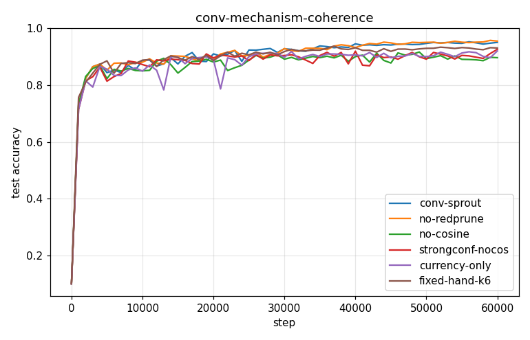
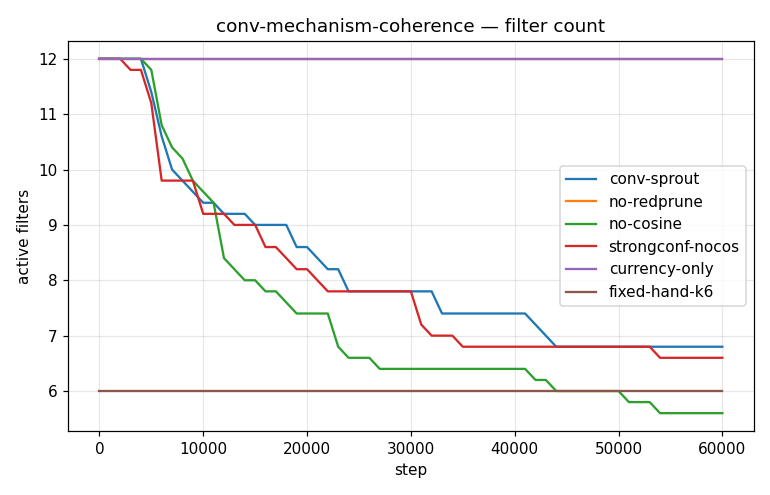
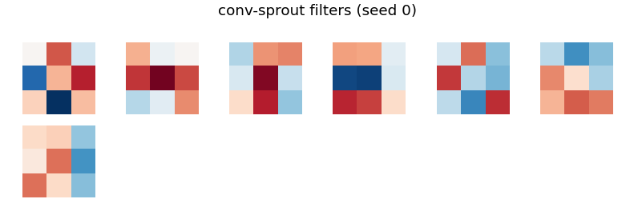
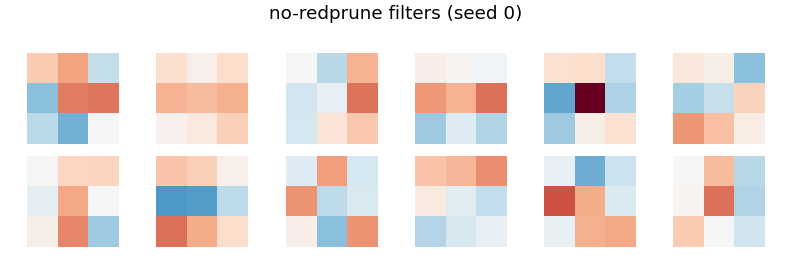
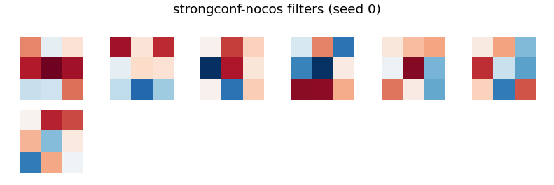
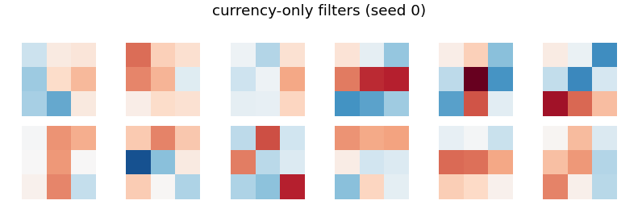

# Conv-SPROUT Phase 2 — conv-mechanism-coherence

- **Dataset:** mnist  |  **Seeds:** 5  |  **Steps:** 60000  |  **Baseline:** conv-sprout
- **Head:** sparse phasic (w32-sparse economy), conv 3x3 + ReLU + 2x2 maxpool

## Results (mean ± std across seeds)

| Arm | final test acc | max test acc | filters end | head synapses | conv grow/prune | verdict vs base |
|---|---|---|---|---|---|---|
| conv-sprout | 0.951 ± 0.008 | 0.957 ± 0.007 | 6.8 | 1920 | 0.0/0.0 | (baseline) |
| no-redprune | 0.955 ± 0.009 | 0.961 ± 0.006 | 12.0 | 2446 | 0.0/0.0 | UP |
| no-cosine | 0.897 ± 0.023 | 0.931 ± 0.012 | 5.6 | 1290 | 0.0/0.0 | DOWN |
| strongconf-nocos | 0.926 ± 0.015 | 0.939 ± 0.009 | 6.6 | 1447 | 0.0/0.0 | DOWN |
| currency-only | 0.921 ± 0.021 | 0.938 ± 0.011 | 12.0 | 2363 | 0.0/0.0 | DOWN |
| fixed-hand-k6 | 0.931 ± 0.012 | 0.944 ± 0.008 | 6.0 | 1243 | 0.0/0.0 | DOWN |

Verdict = 95% seed-bootstrap CI of the final-test-acc difference vs the baseline (UP/DOWN/~).

### conv-sprout learned filters

### no-redprune learned filters

### no-cosine learned filters

### strongconf-nocos learned filters

### currency-only learned filters

### fixed-hand-k6 learned filters

