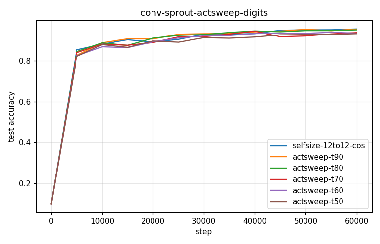
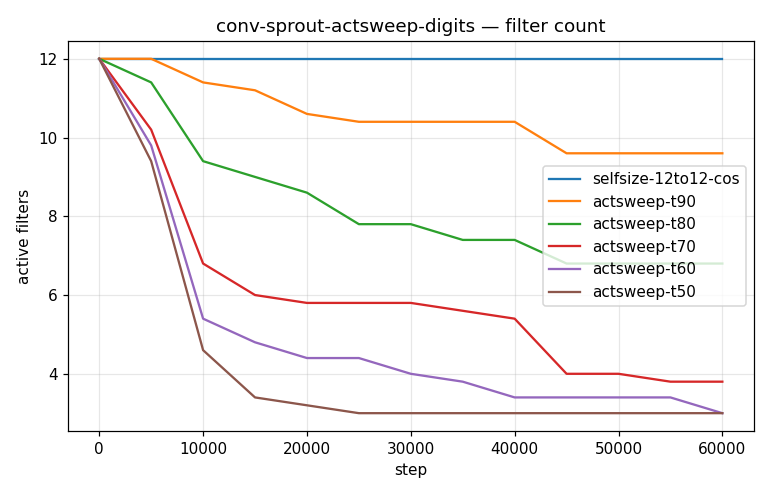
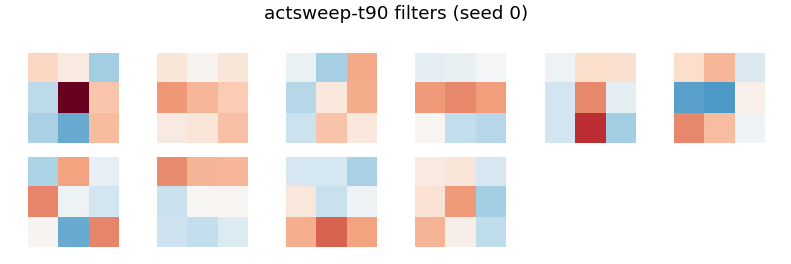
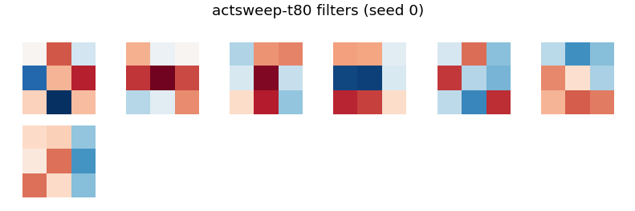
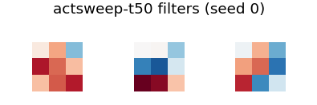

# Conv-SPROUT Phase 2 — conv-sprout-actsweep-digits

- **Dataset:** mnist  |  **Seeds:** 5  |  **Steps:** 60000  |  **Baseline:** selfsize-12to12-cos
- **Head:** sparse phasic (w32-sparse economy), conv 3x3 + ReLU + 2x2 maxpool

## Results (mean ± std across seeds)

| Arm | final test acc | max test acc | filters end | head synapses | conv grow/prune | verdict vs base |
|---|---|---|---|---|---|---|
| selfsize-12to12-cos | 0.955 ± 0.009 | 0.957 ± 0.009 | 12.0 | 2446 | 0.0/0.0 | (baseline) |
| actsweep-t90 | 0.954 ± 0.016 | 0.959 ± 0.011 | 9.6 | 2311 | 0.0/0.0 | ~ |
| actsweep-t80 | 0.951 ± 0.008 | 0.953 ± 0.007 | 6.8 | 1920 | 0.0/0.0 | DOWN |
| actsweep-t70 | 0.937 ± 0.017 | 0.952 ± 0.007 | 3.8 | 1248 | 0.0/0.0 | DOWN |
| actsweep-t60 | 0.935 ± 0.016 | 0.944 ± 0.010 | 3.0 | 1108 | 0.0/0.0 | DOWN |
| actsweep-t50 | 0.932 ± 0.010 | 0.935 ± 0.008 | 3.0 | 898 | 0.0/0.0 | DOWN |

Verdict = 95% seed-bootstrap CI of the final-test-acc difference vs the baseline (UP/DOWN/~).

### selfsize-12to12-cos learned filters

### actsweep-t90 learned filters

### actsweep-t80 learned filters

### actsweep-t70 learned filters

### actsweep-t60 learned filters

### actsweep-t50 learned filters

