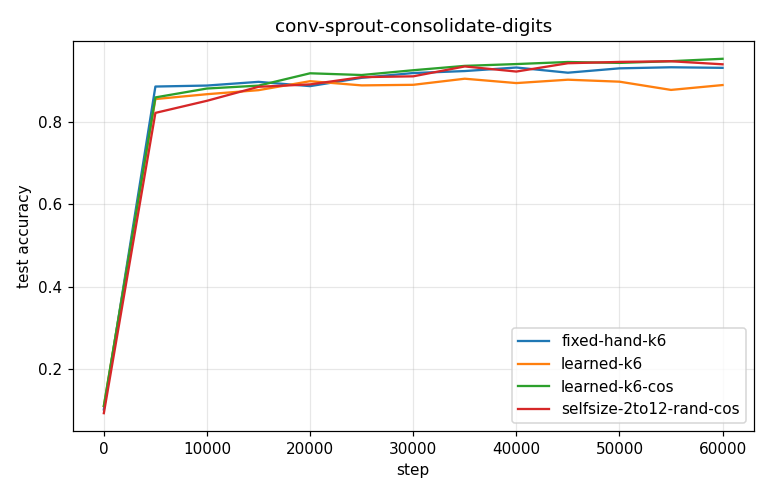
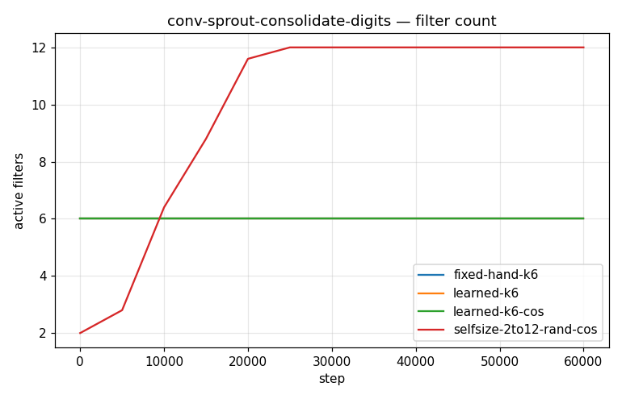
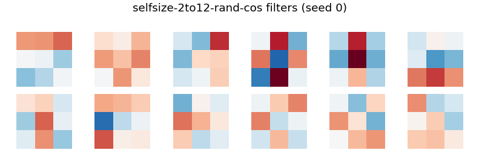

# Conv-SPROUT Phase 2 — conv-sprout-consolidate-digits

- **Dataset:** mnist  |  **Seeds:** 5  |  **Steps:** 60000  |  **Baseline:** fixed-hand-k6
- **Head:** sparse phasic (w32-sparse economy), conv 3x3 + ReLU + 2x2 maxpool

## Results (mean ± std across seeds)

| Arm | final test acc | max test acc | filters end | head synapses | conv grow/prune | verdict vs base |
|---|---|---|---|---|---|---|
| fixed-hand-k6 | 0.931 ± 0.012 | 0.939 ± 0.012 | 6.0 | 1243 | 0.0/0.0 | (baseline) |
| learned-k6 | 0.889 ± 0.042 | 0.928 ± 0.008 | 6.0 | 1302 | 0.0/0.0 | DOWN |
| learned-k6-cos | 0.953 ± 0.009 | 0.955 ± 0.006 | 6.0 | 1439 | 0.0/0.0 | UP |
| selfsize-2to12-rand-cos | 0.940 ± 0.013 | 0.952 ± 0.007 | 12.0 | 1659 | 10.2/0.2 | ~ |

Verdict = 95% seed-bootstrap CI of the final-test-acc difference vs the baseline (UP/DOWN/~).

### fixed-hand-k6 learned filters

### learned-k6 learned filters

### learned-k6-cos learned filters

### selfsize-2to12-rand-cos learned filters

