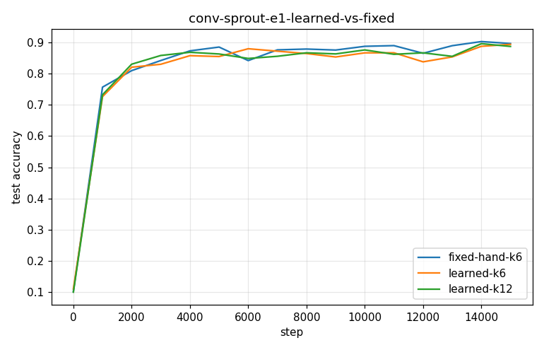

# Conv-SPROUT Phase 2 — conv-sprout-e1-learned-vs-fixed

- **Dataset:** mnist  |  **Seeds:** 5  |  **Steps:** 15000  |  **Baseline:** fixed-hand-k6
- **Head:** sparse phasic (w32-sparse economy), conv 3x3 + ReLU + 2x2 maxpool

## Results (mean ± std across seeds)

| Arm | final test acc | max test acc | filters end | head synapses | conv grow/prune | verdict vs base |
|---|---|---|---|---|---|---|
| fixed-hand-k6 | 0.897 ± 0.015 | 0.912 ± 0.008 | 6.0 | 2008 | 0.0/0.0 | (baseline) |
| learned-k6 | 0.894 ± 0.029 | 0.907 ± 0.018 | 6.0 | 2165 | 0.0/0.0 | ~ |
| learned-k12 | 0.888 ± 0.013 | 0.907 ± 0.007 | 12.0 | 3856 | 0.0/0.0 | ~ |

Verdict = 95% seed-bootstrap CI of the final-test-acc difference vs the baseline (UP/DOWN/~).

### fixed-hand-k6 learned filters

### learned-k6 learned filters

### learned-k12 learned filters

