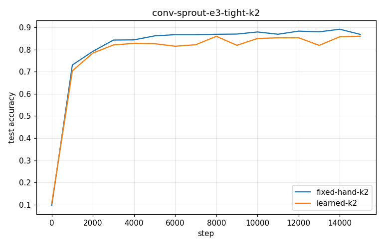
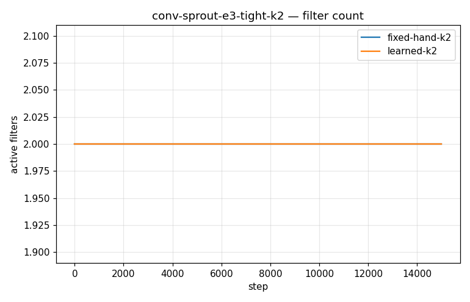
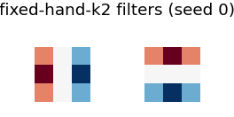
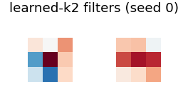

# Conv-SPROUT Phase 2 — conv-sprout-e3-tight-k2

- **Dataset:** mnist  |  **Seeds:** 5  |  **Steps:** 15000  |  **Baseline:** fixed-hand-k2
- **Head:** sparse phasic (w32-sparse economy), conv 3x3 + ReLU + 2x2 maxpool

## Results (mean ± std across seeds)

| Arm | final test acc | max test acc | filters end | head synapses | conv grow/prune | verdict vs base |
|---|---|---|---|---|---|---|
| fixed-hand-k2 | 0.868 ± 0.033 | 0.898 ± 0.009 | 2.0 | 829 | 0.0/0.0 | (baseline) |
| learned-k2 | 0.860 ± 0.023 | 0.877 ± 0.011 | 2.0 | 803 | 0.0/0.0 | ~ |

Verdict = 95% seed-bootstrap CI of the final-test-acc difference vs the baseline (UP/DOWN/~).

### fixed-hand-k2 learned filters

### learned-k2 learned filters

