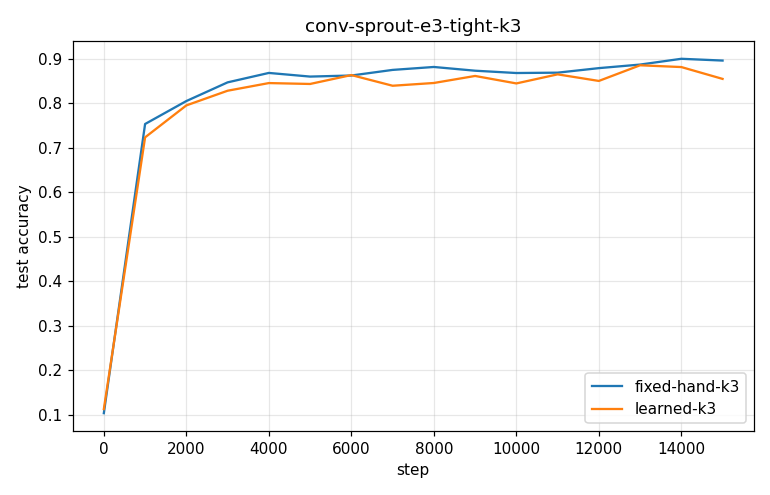
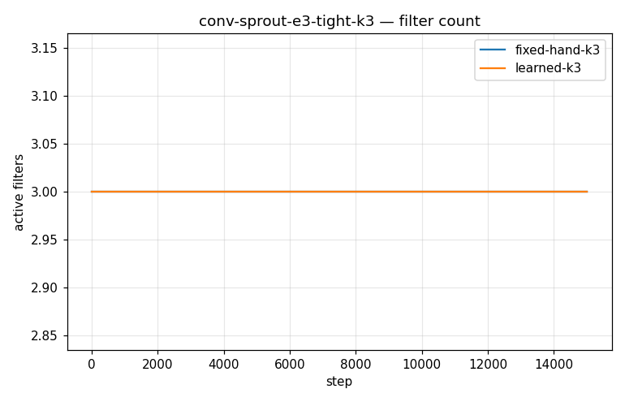
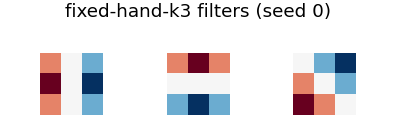
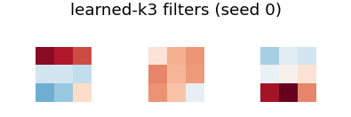

# Conv-SPROUT Phase 2 — conv-sprout-e3-tight-k3

- **Dataset:** mnist  |  **Seeds:** 5  |  **Steps:** 15000  |  **Baseline:** fixed-hand-k3
- **Head:** sparse phasic (w32-sparse economy), conv 3x3 + ReLU + 2x2 maxpool

## Results (mean ± std across seeds)

| Arm | final test acc | max test acc | filters end | head synapses | conv grow/prune | verdict vs base |
|---|---|---|---|---|---|---|
| fixed-hand-k3 | 0.896 ± 0.008 | 0.903 ± 0.012 | 3.0 | 1134 | 0.0/0.0 | (baseline) |
| learned-k3 | 0.855 ± 0.045 | 0.904 ± 0.013 | 3.0 | 1248 | 0.0/0.0 | DOWN |

Verdict = 95% seed-bootstrap CI of the final-test-acc difference vs the baseline (UP/DOWN/~).

### fixed-hand-k3 learned filters

### learned-k3 learned filters

