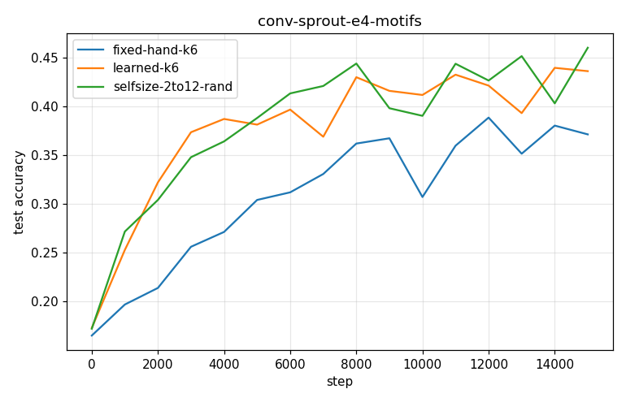
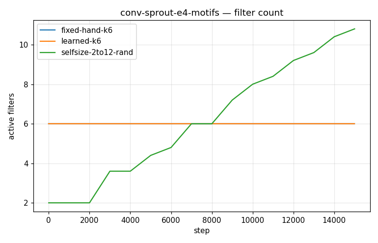
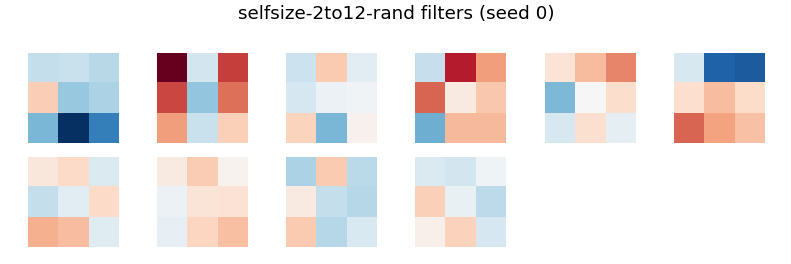

# Conv-SPROUT Phase 2 — conv-sprout-e4-motifs

- **Dataset:** motifs  |  **Seeds:** 5  |  **Steps:** 15000  |  **Baseline:** fixed-hand-k6
- **Head:** sparse phasic (w32-sparse economy), conv 3x3 + ReLU + 2x2 maxpool

## Results (mean ± std across seeds)

| Arm | final test acc | max test acc | filters end | head synapses | conv grow/prune | verdict vs base |
|---|---|---|---|---|---|---|
| fixed-hand-k6 | 0.371 ± 0.027 | 0.408 ± 0.006 | 6.0 | 1478 | 0.0/0.0 | (baseline) |
| learned-k6 | 0.436 ± 0.035 | 0.480 ± 0.010 | 6.0 | 1491 | 0.0/0.0 | UP |
| selfsize-2to12-rand | 0.460 ± 0.043 | 0.508 ± 0.017 | 10.8 | 1870 | 8.8/0.0 | UP |

Verdict = 95% seed-bootstrap CI of the final-test-acc difference vs the baseline (UP/DOWN/~).

### fixed-hand-k6 learned filters

### learned-k6 learned filters

### selfsize-2to12-rand learned filters

