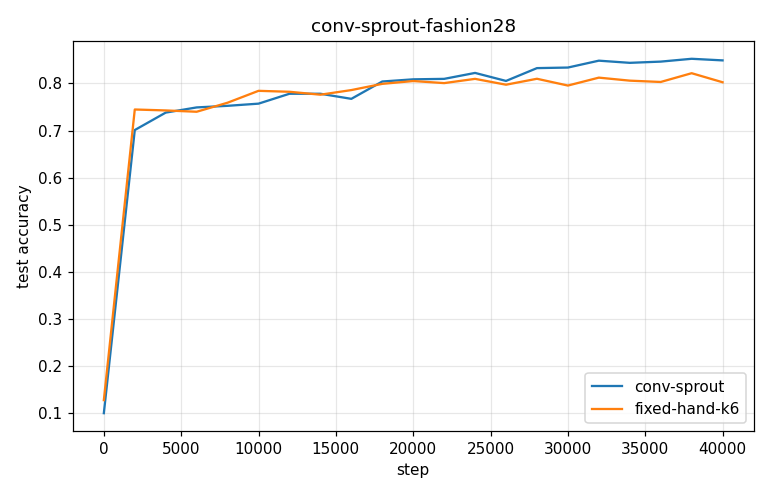
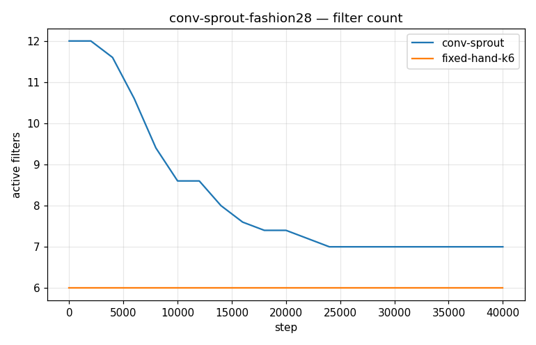
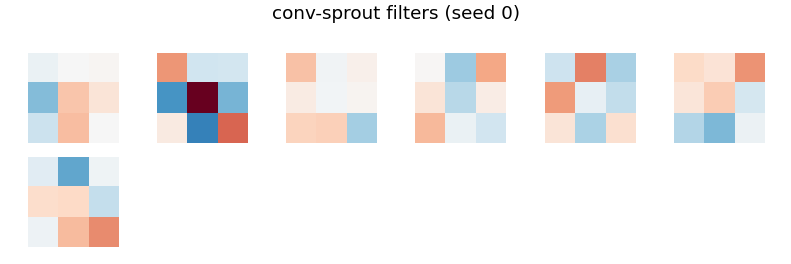

# Conv-SPROUT Phase 2 — conv-sprout-fashion28

- **Dataset:** fashion-full  |  **Seeds:** 5  |  **Steps:** 40000  |  **Baseline:** fixed-hand-k6
- **Head:** sparse phasic (w32-sparse economy), conv 3x3 + ReLU + 2x2 maxpool

## Results (mean ± std across seeds)

| Arm | final test acc | max test acc | filters end | head synapses | conv grow/prune | verdict vs base |
|---|---|---|---|---|---|---|
| conv-sprout | 0.849 ± 0.009 | 0.857 ± 0.007 | 7.0 | 5969 | 0.0/0.0 | UP |
| fixed-hand-k6 | 0.803 ± 0.013 | 0.827 ± 0.006 | 6.0 | 2877 | 0.0/0.0 | (baseline) |

Verdict = 95% seed-bootstrap CI of the final-test-acc difference vs the baseline (UP/DOWN/~).

### conv-sprout learned filters

### fixed-hand-k6 learned filters

