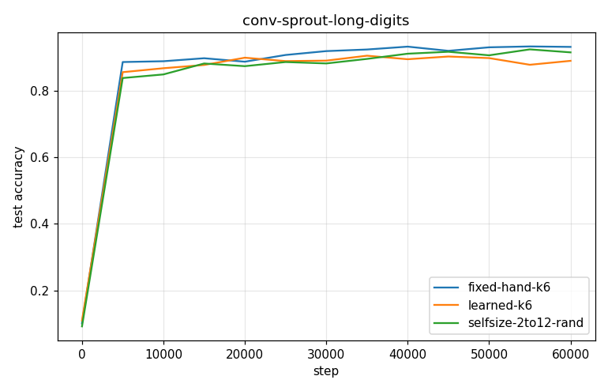
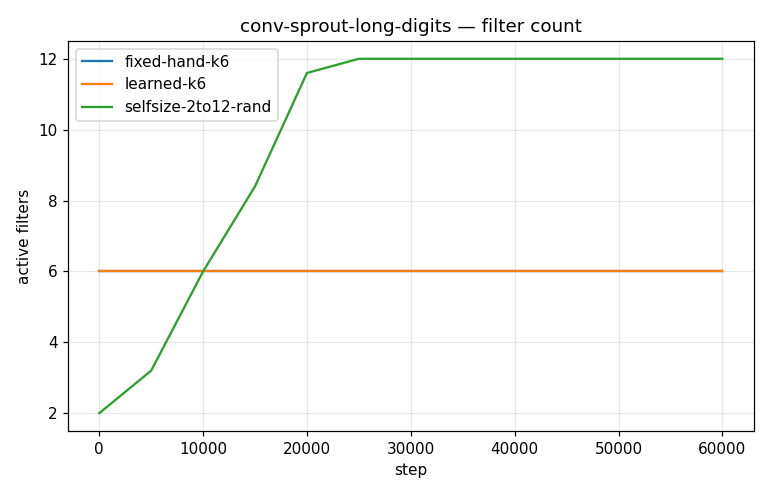
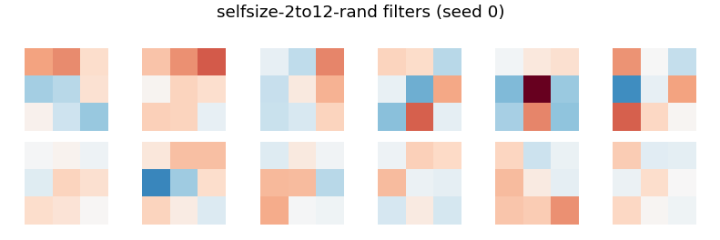

# Conv-SPROUT Phase 2 — conv-sprout-long-digits

- **Dataset:** mnist  |  **Seeds:** 5  |  **Steps:** 60000  |  **Baseline:** fixed-hand-k6
- **Head:** sparse phasic (w32-sparse economy), conv 3x3 + ReLU + 2x2 maxpool

## Results (mean ± std across seeds)

| Arm | final test acc | max test acc | filters end | head synapses | conv grow/prune | verdict vs base |
|---|---|---|---|---|---|---|
| fixed-hand-k6 | 0.931 ± 0.012 | 0.939 ± 0.012 | 6.0 | 1243 | 0.0/0.0 | (baseline) |
| learned-k6 | 0.889 ± 0.042 | 0.928 ± 0.008 | 6.0 | 1302 | 0.0/0.0 | DOWN |
| selfsize-2to12-rand | 0.915 ± 0.025 | 0.933 ± 0.007 | 12.0 | 1549 | 10.8/0.8 | DOWN |

Verdict = 95% seed-bootstrap CI of the final-test-acc difference vs the baseline (UP/DOWN/~).

### fixed-hand-k6 learned filters

### learned-k6 learned filters

### selfsize-2to12-rand learned filters

