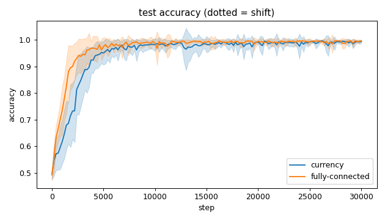
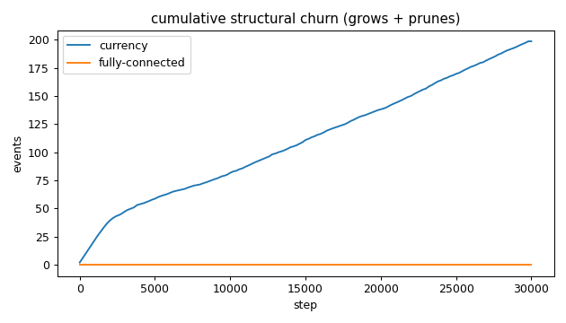
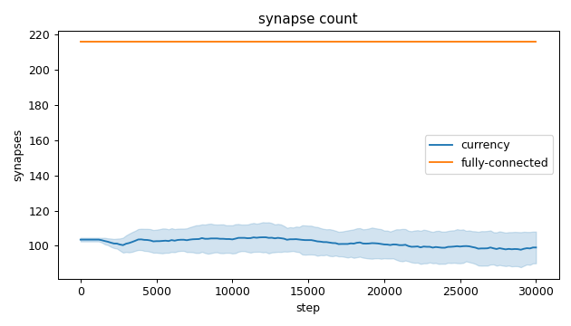
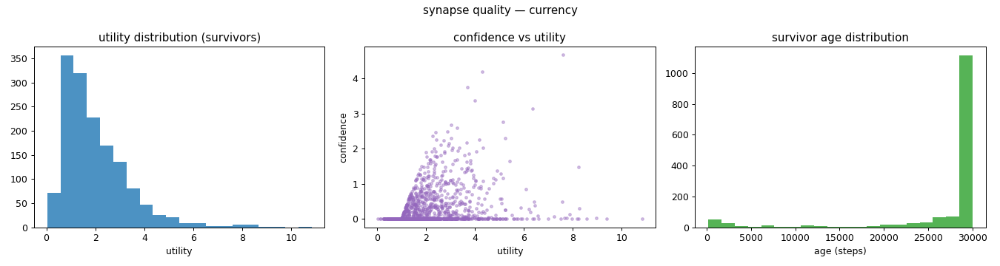
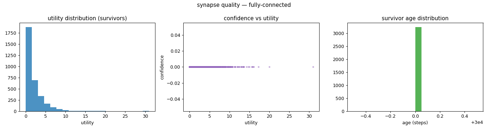
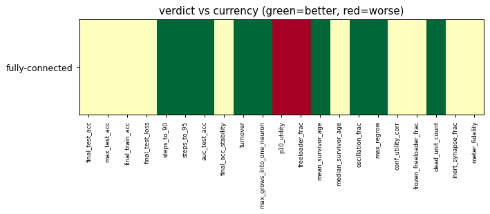

# Evaluation run: currency-vs-fullyconnected-speed

- **Date:** 2026-06-01 01:31:23
- **Variants:** currency, fully-connected  (baseline: currency)
- **Seeds:** 15  |  **Dataset:** spirals  |  **Steps:** 30000 (+0 shift)
- **Commit:** 22bef1c
- **Command:** `python evaluate.py --variants currency,fully-connected --seeds 15 --dataset spirals --steps 30000 --shift 0 --baseline currency --jobs 10 --no-cache --publish --run-name currency-vs-fullyconnected-speed`

## Key metrics

| Metric | What it means | currency (baseline) | fully-connected |
|---|---|---|---|
| final_test_acc ↑ | held-out accuracy at the end of the run | 0.994 ± 0.006 | 0.996 ± 0.003 ≈ |
| steps_to_90 ↓ | steps to first reach 90% test accuracy | 3374 ± 971.231 | 1801 ± 632.456 ▲ |
| steps_to_95 ↓ | steps to first reach 95% test accuracy | 4201 ± 1435 | 2508 ± 789.486 ▲ |
| auc_test_acc ↑ | area under the test-accuracy curve (speed + level) | 0.949 ± 0.014 | 0.970 ± 0.008 ▲ |
| synapse_count_end | live synapses at the end | 99.067 ± 9.022 | 216 ± 0 ≈ |
| effective_density | live edges as a fraction of fully-connected | 0.459 ± 0.042 | 1 ± 0 ≈ |
| max_grows_into_one_neuron ↓ | most times one neuron was grown into (churn) | 18.800 ± 5.729 | 0 ± 0 ▲ |
| oscillation_frac ↓ | fraction of grown edges grown ≥2× (thrash) | 0.277 ± 0.068 | 0 ± 0 ▲ |
| freeloader_frac ↓ | fraction of synapses below the prune-utility floor | 0.020 ± 0.016 | 0.229 ± 0.045 ▼ |
| conf_utility_corr ↑ | corr of confidence with real utility (calibration) | 0.322 ± 0.113 | — ± — ? |
| dead_unit_count ↓ | hidden neurons that never fire on test data | 4.067 ± 2.294 | 1.200 ± 0.909 ▲ |

## Full scorecard

| Metric | currency (baseline) | fully-connected |
|---|---|---|
| **Prediction performance** | | |
| final_test_acc ↑ | 0.994 ± 0.006 | 0.996 ± 0.003 ≈ |
| max_test_acc ↑ | 0.998 ± 0.001 | 0.999 ± 0.001 ≈ |
| final_train_acc ↑ | 0.996 ± 0.006 | 0.997 ± 0.003 ≈ |
| final_test_loss ↓ | 0.019 ± 0.012 | 0.013 ± 0.011 ≈ |
| **Training efficacy** | | |
| steps_to_90 ↓ | 3374 ± 971.231 | 1801 ± 632.456 ▲ |
| steps_to_95 ↓ | 4201 ± 1435 | 2508 ± 789.486 ▲ |
| auc_test_acc ↑ | 0.949 ± 0.014 | 0.970 ± 0.008 ▲ |
| final_acc_stability ↓ | 0.007 ± 0.005 | 0.008 ± 0.007 ≈ |
| **Synapse structure** | | |
| synapse_count_start | 103.533 ± 1.024 | 216 ± 0 ≈ |
| synapse_count_peak | 110.533 ± 5.714 | 216 ± 0 ≈ |
| synapse_count_end | 99.067 ± 9.022 | 216 ± 0 ≈ |
| n_grow_events | 98.067 ± 18.635 | 0 ± 0 ≈ |
| n_prune_events | 100.533 ± 20.536 | 0 ± 0 ≈ |
| distinct_neurons_grown | 12.333 ± 2.150 | 0 ± 0 ≈ |
| turnover ↓ | 1.963 ± 0.422 | 0 ± 0 ▲ |
| max_grows_into_one_neuron ↓ | 18.800 ± 5.729 | 0 ± 0 ▲ |
| mean_fan_in | 3.302 ± 0.301 | 7.200 ± 0.000 ≈ |
| mean_fan_out | 3.302 ± 0.301 | 7.200 ± 0.000 ≈ |
| effective_density | 0.459 ± 0.042 | 1 ± 0 ≈ |
| **Synapse quality** | | |
| p10_utility ↑ | 0.704 ± 0.063 | 0.247 ± 0.055 ▼ |
| freeloader_frac ↓ | 0.020 ± 0.016 | 0.229 ± 0.045 ▼ |
| mean_survivor_age ↑ | 26893 ± 784.922 | 30000 ± 0 ▲ |
| median_survivor_age ↑ | 30000 ± 0 | 30000 ± 0 ≈ |
| mean_pruned_lifespan | 3961 ± 779.769 | 0 ± 0 ≈ |
| oscillation_frac ↓ | 0.277 ± 0.068 | 0 ± 0 ▲ |
| max_regrow ↓ | 6.533 ± 2.247 | 0 ± 0 ▲ |
| conf_utility_corr ↑ | 0.322 ± 0.113 | — ± — ? |
| frozen_freeloader_frac ↓ | 0 ± 0 | 0 ± 0 ≈ |
| dead_unit_count ↓ | 4.067 ± 2.294 | 1.200 ± 0.909 ▲ |
| inert_synapse_frac ↓ | 0 ± 0 | 0 ± 0 ≈ |
| used_vs_allocated | 0.976 ± 0.089 | 1 ± 0 ≈ |
| **Signal sanity** | | |
| meter_fidelity ↑ | 0.711 ± 0.140 | — ± — ? |

Baseline: **currency**. ▲ better / ▼ worse / ≈ no clear difference vs baseline (95% bootstrap CI of the mean difference). Cells show mean ± std across seeds.

## Charts

### acc_curves

### churn_curves

### count_curves

### quality_currency

### quality_fully-connected

### verdict_heatmap

