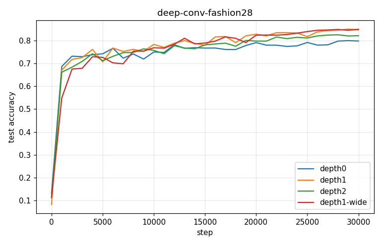

# Deep Conv-SPROUT — deep-conv-fashion28

- **Dataset:** fashion-full  |  **Seeds:** 5  |  **Steps:** 30000  |  **Baseline:** depth0
- **Each conv layer:** 3x3 filters + ReLU + 2x2 maxpool, gradient-as-currency (meter/confidence/cosine consolidation); shared phasic head.

## Results (mean ± std across seeds)

| Arm | final test acc | max test acc | train acc | head feat | conv params | head syn | wall s | verdict |
|---|---|---|---|---|---|---|---|---|
| depth0 | 0.799 ± 0.017 | 0.809 | 0.834 | 784 | 0 | 5698 | 869 | (baseline) |
| depth1 | 0.848 ± 0.018 | 0.855 | 0.884 | 1352 | 72 | 7440 | 1320 | UP |
| depth2 | 0.822 ± 0.016 | 0.831 | 0.851 | 400 | 1224 | 1735 | 455 | UP |
| depth1-wide | 0.850 ± 0.014 | 0.859 | 0.892 | 2704 | 144 | 13345 | 2449 | UP |

Verdict = 95% seed-bootstrap CI of the final-test-acc difference vs baseline (UP/DOWN/~).

