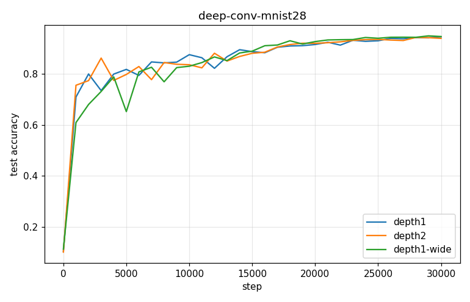

# Deep Conv-SPROUT — deep-conv-mnist28

- **Dataset:** mnist-full  |  **Seeds:** 5  |  **Steps:** 30000  |  **Baseline:** depth1
- **Each conv layer:** 3x3 filters + ReLU + 2x2 maxpool, gradient-as-currency (meter/confidence/cosine consolidation); shared phasic head.

## Results (mean ± std across seeds)

| Arm | final test acc | max test acc | train acc | head feat | conv params | head syn | wall s | verdict |
|---|---|---|---|---|---|---|---|---|
| depth1 | 0.944 ± 0.009 | 0.946 | 0.955 | 1352 | 72 | 6725 | 1186 | (baseline) |
| depth2 | 0.938 ± 0.012 | 0.945 | 0.951 | 400 | 1224 | 1257 | 362 | DOWN |
| depth1-wide | 0.946 ± 0.007 | 0.951 | 0.962 | 2704 | 144 | 10654 | 2147 | ~ |

Verdict = 95% seed-bootstrap CI of the final-test-acc difference vs baseline (UP/DOWN/~).

