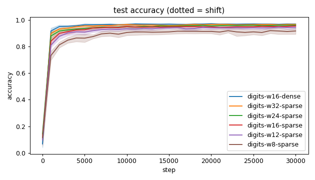
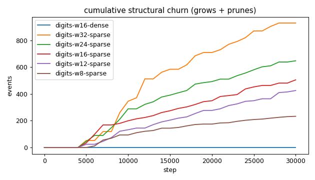
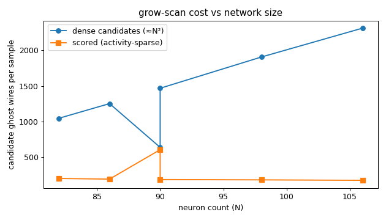
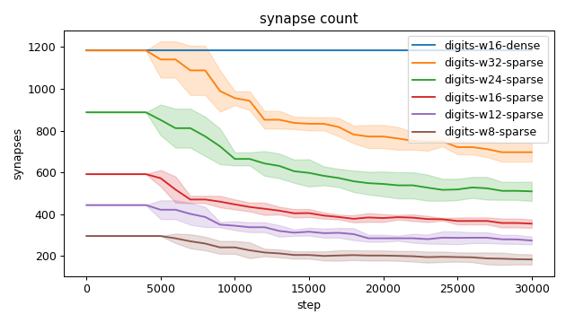
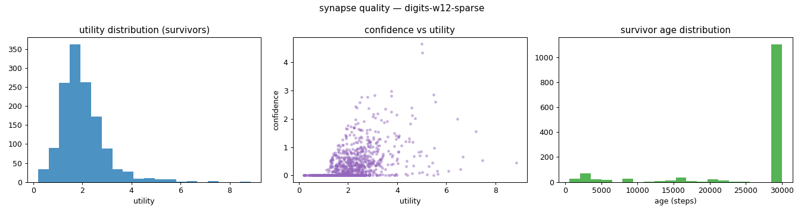
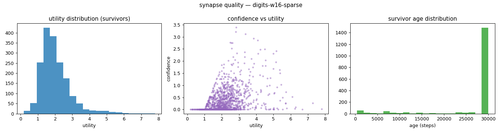
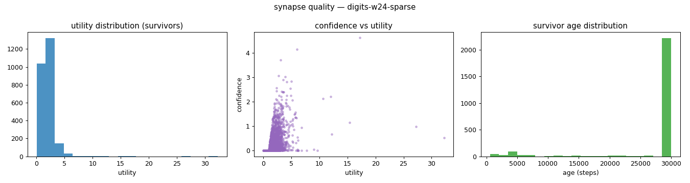
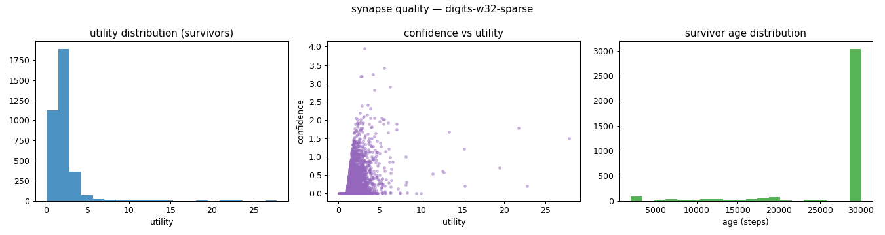
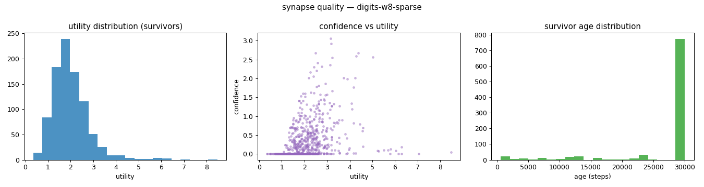
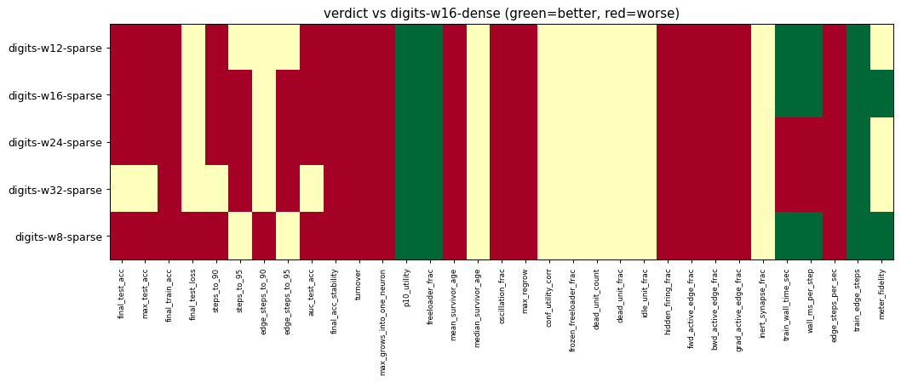

# Evaluation run: digits-budget-floor

- **Date:** 2026-06-14 15:53:40
- **Variants:** digits-w12-sparse, digits-w16-dense, digits-w16-sparse, digits-w24-sparse, digits-w32-sparse, digits-w8-sparse  (baseline: digits-w16-dense)
- **Seeds:** 5  |  **Dataset:** digits  |  **Steps:** 30000 (+0 shift)
- **Commit:** a58a48f
- **Command:** `python evaluate.py --variants digits-w16-dense,digits-w32-sparse,digits-w24-sparse,digits-w16-sparse,digits-w12-sparse,digits-w8-sparse --baseline digits-w16-dense --dataset digits --layers 64,16,10 --density 1.0 --seeds 5 --steps 30000 --record-every 1000 --no-cache --publish --run-name digits-budget-floor`

## Key metrics

| Metric | What it means | digits-w12-sparse | digits-w16-dense (baseline) | digits-w16-sparse | digits-w24-sparse | digits-w32-sparse | digits-w8-sparse |
|---|---|---|---|---|---|---|---|
| final_test_acc ↑ | held-out accuracy at the end of the run | 0.945 ± 0.013 ▼ | 0.970 ± 0.004 | 0.956 ± 0.007 ▼ | 0.962 ± 0.003 ▼ | 0.968 ± 0.007 ≈ | 0.918 ± 0.023 ▼ |
| steps_to_90 ↓ | steps to first reach 90% test accuracy | 3801 ± 1166 ▼ | 1201 ± 400 | 2801 ± 1600 ▼ | 2001 ± 632.456 ▼ | 1601 ± 489.898 ≈ | 10401 ± 3980 ▼ |
| steps_to_95 ↓ | steps to first reach 95% test accuracy | ∞ ± — ? | 2601 ± 1744 | 14201 ± 6400 ▼ | 8401 ± 3007 ▼ | 4801 ± 1327 ▼ | ∞ ± — ? |
| auc_test_acc ↑ | area under the test-accuracy curve (speed + level) | 0.915 ± 0.010 ▼ | 0.951 ± 0.004 | 0.927 ± 0.008 ▼ | 0.936 ± 0.006 ▼ | 0.945 ± 0.005 ≈ | 0.882 ± 0.016 ▼ |
| edge_steps_to_90 ↓ | live-edge training work to first reach 90% test accuracy | 1688444 ± 517928 ≈ | 1421984 ± 473600 | 1623293 ± 876401 ≈ | 1776888 ± 561621 ≈ | 1895584 ± 580039 ≈ | 2778882 ± 919947 ▼ |
| edge_steps_to_95 ↓ | live-edge training work to first reach 95% test accuracy | ∞ ± — ? | 3079584 ± 2064375 | 6992611 ± 2525023 ▼ | 6978349 ± 1991772 ▼ | 5649621 ± 1567047 ▼ | ∞ ± — ? |
| synapse_count_end | live synapses at the end | 274.600 ± 18.249 ≈ | 1184 ± 0 | 355.400 ± 20.126 ≈ | 509.800 ± 45.893 ≈ | 697 ± 45.135 ≈ | 184 ± 24.617 ≈ |
| effective_density | live edges as a fraction of fully-connected | 0.309 ± 0.021 ≈ | 1 ± 0 | 0.300 ± 0.017 ≈ | 0.287 ± 0.026 ≈ | 0.294 ± 0.019 ≈ | 0.311 ± 0.042 ≈ |
| avg_live_edges | time-average live edges during training | 339.907 ± 17.825 ≈ | 1184 ± 0 | 438.763 ± 7.247 ≈ | 652.422 ± 45.097 ≈ | 898.329 ± 31.123 ≈ | 228.380 ± 19.270 ≈ |
| train_edge_steps ↓ | cumulative live-edge steps over training | 10197560 ± 534767 ▲ | 35520000 ± 0 | 13163320 ± 217419 ▲ | 19573320 ± 1352959 ▲ | 26950760 ± 933716 ▲ | 6851640 ± 578107 ▲ |
| train_wall_time_sec ↓ | training-loop wall time only, excluding eval snapshots | 27.206 ± 1.024 ▲ | 45.463 ± 0.282 | 36.028 ± 0.682 ▲ | 53.984 ± 3.410 ▼ | 73.490 ± 2.288 ▼ | 19.077 ± 1.176 ▲ |
| wall_ms_per_step ↓ | training-loop milliseconds per SGD step | 0.907 ± 0.034 ▲ | 1.515 ± 0.009 | 1.201 ± 0.023 ▲ | 1.799 ± 0.114 ▼ | 2.450 ± 0.076 ▼ | 0.636 ± 0.039 ▲ |
| edge_steps_per_sec ↑ | live-edge steps processed per wall-clock second | 374676 ± 9057 ▼ | 781328 ± 4839 | 365385 ± 1908 ▼ | 362447 ± 3064 ▼ | 366712 ± 4143 ▼ | 358718 ± 9173 ▼ |
| ghost_dense_cost | candidate ghost wires the grow-scan must consider (~N²) | 1253 ± 18.249 ≈ | 640 ± 0 | 1469 ± 20.126 ≈ | 1906 ± 45.893 ≈ | 2311 ± 45.135 ≈ | 1048 ± 24.617 ≈ |
| ghost_pairs_scored | candidate wires actually scored after activity+demand pruning | 194.930 ± 4.445 ≈ | 607.632 ± 4.567 | 188.652 ± 5.553 ≈ | 184.649 ± 5.868 ≈ | 177.897 ± 5.498 ≈ | 204.340 ± 4.564 ≈ |
| mean_neuron_activation | avg hidden-neuron ReLU output on test data (neuron value) | 1.703 ± 0.135 ≈ | 3730 ± 7458 | 1.478 ± 0.083 ≈ | 1.206 ± 0.052 ≈ | 0.993 ± 0.053 ≈ | 2.118 ± 0.235 ≈ |
| dead_unit_frac ↓ | fraction of hidden neurons that never fire (scale-free) | 0 ± 0 ≈ | 0 ± 0 | 0 ± 0 ≈ | 0.008 ± 0.017 ≈ | 0 ± 0 ≈ | 0 ± 0 ≈ |
| hidden_firing_frac ↓ | fraction of hidden ReLUs active on test data | 0.542 ± 0.031 ▼ | 0.488 ± 0.011 | 0.534 ± 0.022 ▼ | 0.522 ± 0.008 ▼ | 0.502 ± 0.004 ▼ | 0.563 ± 0.025 ▼ |
| fwd_active_edge_frac ↓ | fraction of live edges whose pre neuron is active | 0.919 ± 0.008 ▼ | 0.888 ± 0.006 | 0.916 ± 0.005 ▼ | 0.912 ± 0.003 ▼ | 0.911 ± 0.004 ▼ | 0.916 ± 0.007 ▼ |
| bwd_active_edge_frac ↓ | fraction of live edges whose post delta is nonzero | 0.630 ± 0.029 ▼ | 0.557 ± 0.010 | 0.631 ± 0.012 ▼ | 0.620 ± 0.009 ▼ | 0.598 ± 0.012 ▼ | 0.673 ± 0.029 ▼ |
| grad_active_edge_frac ↓ | fraction of live edges with nonzero weight gradient | 0.548 ± 0.023 ▼ | 0.467 ± 0.011 | 0.548 ± 0.017 ▼ | 0.534 ± 0.007 ▼ | 0.512 ± 0.010 ▼ | 0.589 ± 0.028 ▼ |
| idle_unit_frac ↓ | fraction of hidden neurons dead OR outputless (not in service) | 0 ± 0 ≈ | 0 ± 0 | 0 ± 0 ≈ | 0.008 ± 0.017 ≈ | 0.013 ± 0.015 ≈ | 0 ± 0 ≈ |
| n_recycle_events | dead-unit recycles fired over the run (sleep recycling) | 0 ± 0 ≈ | 0 ± 0 | 0 ± 0 ≈ | 0 ± 0 ≈ | 0 ± 0 ≈ | 0 ± 0 ≈ |
| recycled_rehired_frac | of recycled units, fraction back in service at the end | — ± — ? | — ± — | — ± — ? | — ± — ? | — ± — ? | — ± — ? |
| n_startle_events | demand-spike hiring alarms fired (startle growth) | 0 ± 0 ≈ | 0 ± 0 | 0 ± 0 ≈ | 0 ± 0 ≈ | 0 ± 0 ≈ | 0 ± 0 ≈ |
| n_arousal_events | post-startle refinement windows that ran grow-only passes | 0 ± 0 ≈ | 0 ± 0 | 0 ± 0 ≈ | 0 ± 0 ≈ | 0 ± 0 ≈ | 0 ± 0 ≈ |
| max_grows_into_one_neuron ↓ | most times one neuron was grown into (churn) | 24.600 ± 10.538 ▼ | 0 ± 0 | 26 ± 8.626 ▼ | 25.800 ± 2.993 ▼ | 33 ± 12.066 ▼ | 14.800 ± 8.795 ▼ |
| oscillation_frac ↓ | fraction of grown edges grown ≥2× (thrash) | 0.058 ± 0.032 ▼ | 0 ± 0 | 0.027 ± 0.028 ▼ | 0.058 ± 0.030 ▼ | 0.051 ± 0.032 ▼ | 0.047 ± 0.059 ▼ |
| freeloader_frac ↓ | fraction of synapses below the prune-utility floor | 0.011 ± 0.009 ▲ | 0.139 ± 0.099 | 0.006 ± 0.008 ▲ | 0.018 ± 0.018 ▲ | 0.008 ± 0.006 ▲ | 0.005 ± 0.007 ▲ |
| conf_utility_corr ↑ | corr of confidence with real utility (calibration) | 0.494 ± 0.065 ? | — ± — | 0.438 ± 0.037 ? | 0.408 ± 0.058 ? | 0.350 ± 0.039 ? | 0.364 ± 0.083 ? |
| dead_unit_count ↓ | hidden neurons that never fire on test data | 0 ± 0 ≈ | 0 ± 0 | 0 ± 0 ≈ | 0.200 ± 0.400 ≈ | 0 ± 0 ≈ | 0 ± 0 ≈ |

## Full scorecard

| Metric | digits-w12-sparse | digits-w16-dense (baseline) | digits-w16-sparse | digits-w24-sparse | digits-w32-sparse | digits-w8-sparse |
|---|---|---|---|---|---|---|
| **Prediction performance** | | | | | | |
| final_test_acc ↑ | 0.945 ± 0.013 ▼ | 0.970 ± 0.004 | 0.956 ± 0.007 ▼ | 0.962 ± 0.003 ▼ | 0.968 ± 0.007 ≈ | 0.918 ± 0.023 ▼ |
| max_test_acc ↑ | 0.953 ± 0.009 ▼ | 0.975 ± 0.004 | 0.961 ± 0.007 ▼ | 0.965 ± 0.007 ▼ | 0.974 ± 0.005 ≈ | 0.929 ± 0.019 ▼ |
| final_train_acc ↑ | 0.988 ± 0.005 ▼ | 1 ± 0 | 0.995 ± 0.001 ▼ | 0.999 ± 0.002 ▼ | 0.999 ± 0.001 ▼ | 0.958 ± 0.011 ▼ |
| final_test_loss ↓ | 0.212 ± 0.054 ≈ | 0.169 ± 0.075 | 0.172 ± 0.028 ≈ | 0.170 ± 0.029 ≈ | 0.143 ± 0.050 ≈ | 0.291 ± 0.074 ▼ |
| **Training efficacy** | | | | | | |
| steps_to_90 ↓ | 3801 ± 1166 ▼ | 1201 ± 400 | 2801 ± 1600 ▼ | 2001 ± 632.456 ▼ | 1601 ± 489.898 ≈ | 10401 ± 3980 ▼ |
| steps_to_95 ↓ | ∞ ± — ? | 2601 ± 1744 | 14201 ± 6400 ▼ | 8401 ± 3007 ▼ | 4801 ± 1327 ▼ | ∞ ± — ? |
| edge_steps_to_90 ↓ | 1688444 ± 517928 ≈ | 1421984 ± 473600 | 1623293 ± 876401 ≈ | 1776888 ± 561621 ≈ | 1895584 ± 580039 ≈ | 2778882 ± 919947 ▼ |
| edge_steps_to_95 ↓ | ∞ ± — ? | 3079584 ± 2064375 | 6992611 ± 2525023 ▼ | 6978349 ± 1991772 ▼ | 5649621 ± 1567047 ▼ | ∞ ± — ? |
| auc_test_acc ↑ | 0.915 ± 0.010 ▼ | 0.951 ± 0.004 | 0.927 ± 0.008 ▼ | 0.936 ± 0.006 ▼ | 0.945 ± 0.005 ≈ | 0.882 ± 0.016 ▼ |
| final_acc_stability ↓ | 0.005 ± 0.001 ▼ | 0.002 ± 0.000 | 0.005 ± 0.001 ▼ | 0.004 ± 0.001 ▼ | 0.004 ± 0.001 ▼ | 0.009 ± 0.001 ▼ |
| **Synapse structure** | | | | | | |
| synapse_count_start | 444.200 ± 0.400 ≈ | 1184 ± 0 | 592.200 ± 0.400 ≈ | 888 ± 0 ≈ | 1184 ± 0 ≈ | 296.200 ± 0.400 ≈ |
| synapse_count_peak | 444.200 ± 0.400 ≈ | 1184 ± 0 | 592.200 ± 0.400 ≈ | 888 ± 0 ≈ | 1184 ± 0 ≈ | 297.200 ± 2.400 ≈ |
| synapse_count_end | 274.600 ± 18.249 ≈ | 1184 ± 0 | 355.400 ± 20.126 ≈ | 509.800 ± 45.893 ≈ | 697 ± 45.135 ≈ | 184 ± 24.617 ≈ |
| n_grow_events | 127.800 ± 64.369 ≈ | 0 ± 0 | 134 ± 32.441 ≈ | 134.400 ± 39.813 ≈ | 220.800 ± 35.005 ≈ | 60.400 ± 34.413 ≈ |
| n_prune_events | 297.400 ± 48.500 ≈ | 0 ± 0 | 370.800 ± 36.466 ≈ | 512.600 ± 79.663 ≈ | 707.800 ± 61.882 ≈ | 172.600 ± 18.161 ≈ |
| n_startle_events | 0 ± 0 ≈ | 0 ± 0 | 0 ± 0 ≈ | 0 ± 0 ≈ | 0 ± 0 ≈ | 0 ± 0 ≈ |
| n_arousal_events | 0 ± 0 ≈ | 0 ± 0 | 0 ± 0 ≈ | 0 ± 0 ≈ | 0 ± 0 ≈ | 0 ± 0 ≈ |
| distinct_neurons_grown | 14.600 ± 2.577 ≈ | 0 ± 0 | 16.400 ± 1.497 ≈ | 18.800 ± 3.370 ≈ | 20.200 ± 3.429 ≈ | 12.200 ± 1.600 ≈ |
| turnover ↓ | 1.242 ± 0.277 ▼ | 0 ± 0 | 1.152 ± 0.165 ▼ | 1.006 ± 0.241 ▼ | 1.035 ± 0.118 ▼ | 1.012 ± 0.141 ▼ |
| max_grows_into_one_neuron ↓ | 24.600 ± 10.538 ▼ | 0 ± 0 | 26 ± 8.626 ▼ | 25.800 ± 2.993 ▼ | 33 ± 12.066 ▼ | 14.800 ± 8.795 ▼ |
| mean_fan_in | 12.482 ± 0.830 ≈ | 45.538 ± 0 | 13.669 ± 0.774 ≈ | 14.994 ± 1.350 ≈ | 16.595 ± 1.075 ≈ | 10.222 ± 1.368 ≈ |
| mean_fan_out | 3.613 ± 0.240 ≈ | 14.800 ± 0 | 4.442 ± 0.252 ≈ | 5.793 ± 0.522 ≈ | 7.260 ± 0.470 ≈ | 2.556 ± 0.342 ≈ |
| effective_density | 0.309 ± 0.021 ≈ | 1 ± 0 | 0.300 ± 0.017 ≈ | 0.287 ± 0.026 ≈ | 0.294 ± 0.019 ≈ | 0.311 ± 0.042 ≈ |
| avg_live_edges | 339.907 ± 17.825 ≈ | 1184 ± 0 | 438.763 ± 7.247 ≈ | 652.422 ± 45.097 ≈ | 898.329 ± 31.123 ≈ | 228.380 ± 19.270 ≈ |
| **Synapse quality** | | | | | | |
| p10_utility ↑ | 1.090 ± 0.142 ▲ | 0.461 ± 0.164 | 1.142 ± 0.056 ▲ | 1.069 ± 0.117 ▲ | 1.066 ± 0.042 ▲ | 1.191 ± 0.087 ▲ |
| freeloader_frac ↓ | 0.011 ± 0.009 ▲ | 0.139 ± 0.099 | 0.006 ± 0.008 ▲ | 0.018 ± 0.018 ▲ | 0.008 ± 0.006 ▲ | 0.005 ± 0.007 ▲ |
| mean_survivor_age ↑ | 26073 ± 1279 ▼ | 30000 ± 0 | 27017 ± 1221 ▼ | 27299 ± 1155 ▼ | 27809 ± 501.045 ▼ | 27389 ± 585.432 ▼ |
| median_survivor_age ↑ | 30000 ± 0 ≈ | 30000 ± 0 | 30000 ± 0 ≈ | 30000 ± 0 ≈ | 30000 ± 0 ≈ | 30000 ± 0 ≈ |
| mean_pruned_lifespan | 10414 ± 1220 ≈ | 0 ± 0 | 9702 ± 570.850 ≈ | 11258 ± 1625 ≈ | 10693 ± 382.467 ≈ | 10607 ± 446.119 ≈ |
| oscillation_frac ↓ | 0.058 ± 0.032 ▼ | 0 ± 0 | 0.027 ± 0.028 ▼ | 0.058 ± 0.030 ▼ | 0.051 ± 0.032 ▼ | 0.047 ± 0.059 ▼ |
| max_regrow ↓ | 1 ± 0.632 ▼ | 0 ± 0 | 1.200 ± 0.748 ▼ | 1 ± 0 ▼ | 1 ± 0 ▼ | 0.800 ± 0.748 ▼ |
| conf_utility_corr ↑ | 0.494 ± 0.065 ? | — ± — | 0.438 ± 0.037 ? | 0.408 ± 0.058 ? | 0.350 ± 0.039 ? | 0.364 ± 0.083 ? |
| frozen_freeloader_frac ↓ | 0 ± 0 ≈ | 0 ± 0 | 0 ± 0 ≈ | 0 ± 0 ≈ | 0 ± 0 ≈ | 0 ± 0 ≈ |
| dead_unit_count ↓ | 0 ± 0 ≈ | 0 ± 0 | 0 ± 0 ≈ | 0.200 ± 0.400 ≈ | 0 ± 0 ≈ | 0 ± 0 ≈ |
| dead_unit_frac ↓ | 0 ± 0 ≈ | 0 ± 0 | 0 ± 0 ≈ | 0.008 ± 0.017 ≈ | 0 ± 0 ≈ | 0 ± 0 ≈ |
| idle_unit_frac ↓ | 0 ± 0 ≈ | 0 ± 0 | 0 ± 0 ≈ | 0.008 ± 0.017 ≈ | 0.013 ± 0.015 ≈ | 0 ± 0 ≈ |
| mean_neuron_activation | 1.703 ± 0.135 ≈ | 3730 ± 7458 | 1.478 ± 0.083 ≈ | 1.206 ± 0.052 ≈ | 0.993 ± 0.053 ≈ | 2.118 ± 0.235 ≈ |
| hidden_firing_frac ↓ | 0.542 ± 0.031 ▼ | 0.488 ± 0.011 | 0.534 ± 0.022 ▼ | 0.522 ± 0.008 ▼ | 0.502 ± 0.004 ▼ | 0.563 ± 0.025 ▼ |
| fwd_active_edge_frac ↓ | 0.919 ± 0.008 ▼ | 0.888 ± 0.006 | 0.916 ± 0.005 ▼ | 0.912 ± 0.003 ▼ | 0.911 ± 0.004 ▼ | 0.916 ± 0.007 ▼ |
| bwd_active_edge_frac ↓ | 0.630 ± 0.029 ▼ | 0.557 ± 0.010 | 0.631 ± 0.012 ▼ | 0.620 ± 0.009 ▼ | 0.598 ± 0.012 ▼ | 0.673 ± 0.029 ▼ |
| grad_active_edge_frac ↓ | 0.548 ± 0.023 ▼ | 0.467 ± 0.011 | 0.548 ± 0.017 ▼ | 0.534 ± 0.007 ▼ | 0.512 ± 0.010 ▼ | 0.589 ± 0.028 ▼ |
| inert_synapse_frac ↓ | 0 ± 0 ≈ | 0 ± 0 | 0 ± 0 ≈ | 0 ± 0 ≈ | 0 ± 0 ≈ | 0 ± 0 ≈ |
| used_vs_allocated | 0.618 ± 0.041 ≈ | 1 ± 0 | 0.600 ± 0.034 ≈ | 0.574 ± 0.052 ≈ | 0.589 ± 0.038 ≈ | 0.621 ± 0.082 ≈ |
| n_recycle_events | 0 ± 0 ≈ | 0 ± 0 | 0 ± 0 ≈ | 0 ± 0 ≈ | 0 ± 0 ≈ | 0 ± 0 ≈ |
| recycled_rehired_frac | — ± — ? | — ± — | — ± — ? | — ± — ? | — ± — ? | — ± — ? |
| **Compute cost** | | | | | | |
| train_wall_time_sec ↓ | 27.206 ± 1.024 ▲ | 45.463 ± 0.282 | 36.028 ± 0.682 ▲ | 53.984 ± 3.410 ▼ | 73.490 ± 2.288 ▼ | 19.077 ± 1.176 ▲ |
| wall_ms_per_step ↓ | 0.907 ± 0.034 ▲ | 1.515 ± 0.009 | 1.201 ± 0.023 ▲ | 1.799 ± 0.114 ▼ | 2.450 ± 0.076 ▼ | 0.636 ± 0.039 ▲ |
| edge_steps_per_sec ↑ | 374676 ± 9057 ▼ | 781328 ± 4839 | 365385 ± 1908 ▼ | 362447 ± 3064 ▼ | 366712 ± 4143 ▼ | 358718 ± 9173 ▼ |
| train_edge_steps ↓ | 10197560 ± 534767 ▲ | 35520000 ± 0 | 13163320 ± 217419 ▲ | 19573320 ± 1352959 ▲ | 26950760 ± 933716 ▲ | 6851640 ± 578107 ▲ |
| ghost_dense_cost | 1253 ± 18.249 ≈ | 640 ± 0 | 1469 ± 20.126 ≈ | 1906 ± 45.893 ≈ | 2311 ± 45.135 ≈ | 1048 ± 24.617 ≈ |
| ghost_pairs_scored | 194.930 ± 4.445 ≈ | 607.632 ± 4.567 | 188.652 ± 5.553 ≈ | 184.649 ± 5.868 ≈ | 177.897 ± 5.498 ≈ | 204.340 ± 4.564 ≈ |
| **Signal sanity** | | | | | | |
| meter_fidelity ↑ | 0.419 ± 0.210 ≈ | 0.315 ± 0.293 | 0.618 ± 0.113 ▲ | 0.352 ± 0.206 ≈ | 0.437 ± 0.272 ≈ | 0.760 ± 0.064 ▲ |

Baseline: **digits-w16-dense**. ▲ better / ▼ worse / ≈ no clear difference vs baseline (95% bootstrap CI of the mean difference). Cells show mean ± std across seeds.

## Charts

### acc_curves

### churn_curves

### cost_scaling

### count_curves

### quality_digits-w12-sparse

### quality_digits-w16-dense

### quality_digits-w16-sparse

### quality_digits-w24-sparse

### quality_digits-w32-sparse

### quality_digits-w8-sparse

### verdict_heatmap

