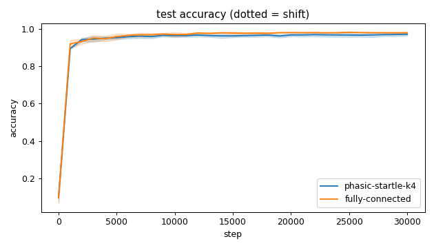
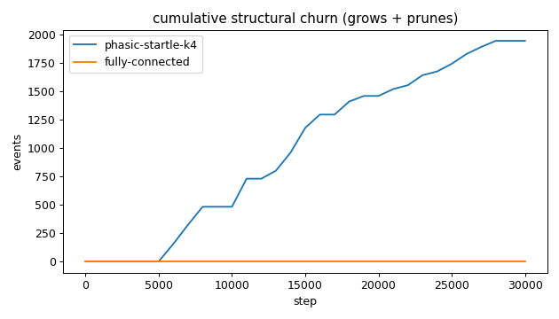
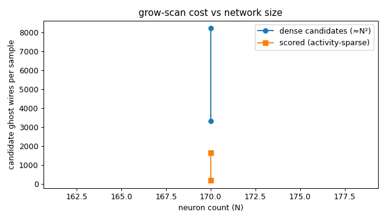
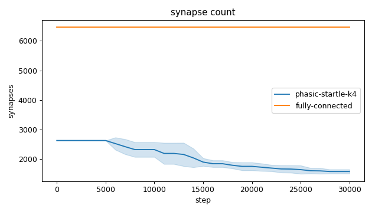
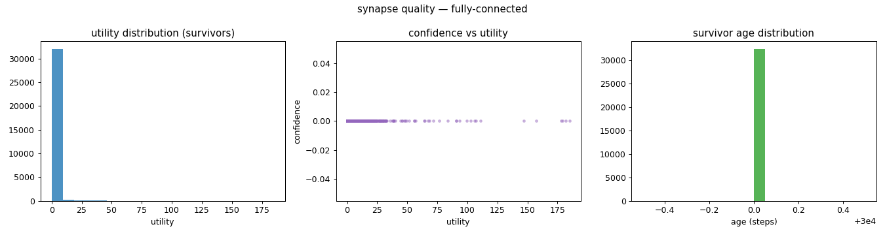
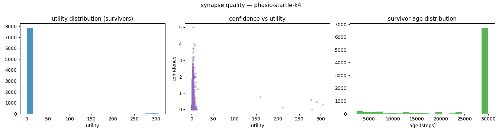
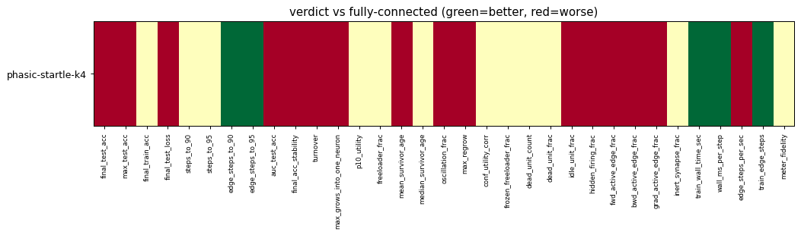

# Evaluation run: digits-sparse-vs-fc

- **Date:** 2026-06-13 12:34:45
- **Variants:** fully-connected, phasic-startle-k4  (baseline: fully-connected)
- **Seeds:** 5  |  **Dataset:** digits  |  **Steps:** 30000 (+0 shift)
- **Commit:** bac0108
- **Command:** `python evaluate.py --variants phasic-startle-k4,fully-connected --baseline fully-connected --dataset digits --layers 64,64,32,10 --seeds 5 --steps 30000 --record-every 1000 --no-cache --publish --run-name digits-sparse-vs-fc`

## Key metrics

| Metric | What it means | fully-connected (baseline) | phasic-startle-k4 |
|---|---|---|---|
| final_test_acc ↑ | held-out accuracy at the end of the run | 0.979 ± 0.001 | 0.971 ± 0.008 ▼ |
| steps_to_90 ↓ | steps to first reach 90% test accuracy | 1201 ± 400 | 1801 ± 400 ≈ |
| steps_to_95 ↓ | steps to first reach 95% test accuracy | 4001 ± 1265 | 5001 ± 1414 ≈ |
| auc_test_acc ↑ | area under the test-accuracy curve (speed + level) | 0.956 ± 0.002 | 0.946 ± 0.006 ▼ |
| edge_steps_to_90 ↓ | live-edge training work to first reach 90% test accuracy | 7763264 ± 2585600 | 4729426 ± 1050400 ▲ |
| edge_steps_to_95 ↓ | live-edge training work to first reach 95% test accuracy | 25862464 ± 8176385 | 13132626 ± 3713725 ▲ |
| synapse_count_end | live synapses at the end | 6464 ± 0 | 1577 ± 71.203 ≈ |
| effective_density | live edges as a fraction of fully-connected | 1 ± 0 | 0.244 ± 0.011 ≈ |
| avg_live_edges | time-average live edges during training | 6464 ± 0 | 2046 ± 134.813 ≈ |
| train_edge_steps ↓ | cumulative live-edge steps over training | 193920000 ± 0 | 61373920 ± 4044523 ▲ |
| train_wall_time_sec ↓ | training-loop wall time only, excluding eval snapshots | 235.625 ± 0.847 | 181.153 ± 11.058 ▲ |
| wall_ms_per_step ↓ | training-loop milliseconds per SGD step | 7.854 ± 0.028 | 6.038 ± 0.369 ▲ |
| edge_steps_per_sec ↑ | live-edge steps processed per wall-clock second | 823014 ± 2960 | 338714 ± 3849 ▼ |
| ghost_dense_cost | candidate ghost wires the grow-scan must consider (~N²) | 3328 ± 0 | 8215 ± 71.203 ≈ |
| ghost_pairs_scored | candidate wires actually scored after activity+demand pruning | 1648 ± 108.917 | 202.421 ± 8.599 ≈ |
| mean_neuron_activation | avg hidden-neuron ReLU output on test data (neuron value) | 3331 ± 6659 | 1144 ± 2286 ≈ |
| dead_unit_frac ↓ | fraction of hidden neurons that never fire (scale-free) | 0.006 ± 0.008 | 0.015 ± 0.008 ≈ |
| hidden_firing_frac ↓ | fraction of hidden ReLUs active on test data | 0.439 ± 0.020 | 0.521 ± 0.012 ▼ |
| fwd_active_edge_frac ↓ | fraction of live edges whose pre neuron is active | 0.769 ± 0.007 | 0.837 ± 0.006 ▼ |
| bwd_active_edge_frac ↓ | fraction of live edges whose post delta is nonzero | 0.467 ± 0.019 | 0.568 ± 0.010 ▼ |
| grad_active_edge_frac ↓ | fraction of live edges with nonzero weight gradient | 0.357 ± 0.015 | 0.464 ± 0.010 ▼ |
| idle_unit_frac ↓ | fraction of hidden neurons dead OR outputless (not in service) | 0.006 ± 0.008 | 0.021 ± 0.007 ▼ |
| n_recycle_events | dead-unit recycles fired over the run (sleep recycling) | 0 ± 0 | 0 ± 0 ≈ |
| recycled_rehired_frac | of recycled units, fraction back in service at the end | — ± — | — ± — ? |
| n_startle_events | demand-spike hiring alarms fired (startle growth) | 0 ± 0 | 0 ± 0 ≈ |
| n_arousal_events | post-startle refinement windows that ran grow-only passes | 0 ± 0 | 0 ± 0 ≈ |
| max_grows_into_one_neuron ↓ | most times one neuron was grown into (churn) | 0 ± 0 | 55 ± 13.446 ▼ |
| oscillation_frac ↓ | fraction of grown edges grown ≥2× (thrash) | 0 ± 0 | 0.050 ± 0.029 ▼ |
| freeloader_frac ↓ | fraction of synapses below the prune-utility floor | 0.129 ± 0.083 | 0.051 ± 0.094 ≈ |
| conf_utility_corr ↑ | corr of confidence with real utility (calibration) | — ± — | 0.229 ± 0.115 ? |
| dead_unit_count ↓ | hidden neurons that never fire on test data | 0.600 ± 0.800 | 1.400 ± 0.800 ≈ |

## Full scorecard

| Metric | fully-connected (baseline) | phasic-startle-k4 |
|---|---|---|
| **Prediction performance** | | |
| final_test_acc ↑ | 0.979 ± 0.001 | 0.971 ± 0.008 ▼ |
| max_test_acc ↑ | 0.983 ± 0.002 | 0.973 ± 0.008 ▼ |
| final_train_acc ↑ | 1 ± 0 | 1 ± 0 ≈ |
| final_test_loss ↓ | 0.126 ± 0.042 | 0.207 ± 0.063 ▼ |
| **Training efficacy** | | |
| steps_to_90 ↓ | 1201 ± 400 | 1801 ± 400 ≈ |
| steps_to_95 ↓ | 4001 ± 1265 | 5001 ± 1414 ≈ |
| edge_steps_to_90 ↓ | 7763264 ± 2585600 | 4729426 ± 1050400 ▲ |
| edge_steps_to_95 ↓ | 25862464 ± 8176385 | 13132626 ± 3713725 ▲ |
| auc_test_acc ↑ | 0.956 ± 0.002 | 0.946 ± 0.006 ▼ |
| final_acc_stability ↓ | 0.001 ± 0.001 | 0.003 ± 0.002 ▼ |
| **Synapse structure** | | |
| synapse_count_start | 6464 ± 0 | 2626 ± 0 ≈ |
| synapse_count_peak | 6464 ± 0 | 2626 ± 0 ≈ |
| synapse_count_end | 6464 ± 0 | 1577 ± 71.203 ≈ |
| n_grow_events | 0 ± 0 | 446.400 ± 133.657 ≈ |
| n_prune_events | 0 ± 0 | 1495 ± 188.144 ≈ |
| n_startle_events | 0 ± 0 | 0 ± 0 ≈ |
| n_arousal_events | 0 ± 0 | 0 ± 0 ≈ |
| distinct_neurons_grown | 0 ± 0 | 30 ± 6.782 ≈ |
| turnover ↓ | 0 ± 0 | 0.961 ± 0.207 ▼ |
| max_grows_into_one_neuron ↓ | 0 ± 0 | 55 ± 13.446 ▼ |
| mean_fan_in | 60.981 ± 0.000 | 14.881 ± 0.672 ≈ |
| mean_fan_out | 40.400 ± 0 | 9.859 ± 0.445 ≈ |
| effective_density | 1 ± 0 | 0.244 ± 0.011 ≈ |
| avg_live_edges | 6464 ± 0 | 2046 ± 134.813 ≈ |
| **Synapse quality** | | |
| p10_utility ↑ | 0.467 ± 0.152 | 0.876 ± 0.397 ≈ |
| freeloader_frac ↓ | 0.129 ± 0.083 | 0.051 ± 0.094 ≈ |
| mean_survivor_age ↑ | 30000 ± 0 | 27173 ± 755.027 ▼ |
| median_survivor_age ↑ | 30000 ± 0 | 30000 ± 0 ≈ |
| mean_pruned_lifespan | 0 ± 0 | 12729 ± 3134 ≈ |
| oscillation_frac ↓ | 0 ± 0 | 0.050 ± 0.029 ▼ |
| max_regrow ↓ | 0 ± 0 | 1.200 ± 0.400 ▼ |
| conf_utility_corr ↑ | — ± — | 0.229 ± 0.115 ? |
| frozen_freeloader_frac ↓ | 0 ± 0 | 0 ± 0 ≈ |
| dead_unit_count ↓ | 0.600 ± 0.800 | 1.400 ± 0.800 ≈ |
| dead_unit_frac ↓ | 0.006 ± 0.008 | 0.015 ± 0.008 ≈ |
| idle_unit_frac ↓ | 0.006 ± 0.008 | 0.021 ± 0.007 ▼ |
| mean_neuron_activation | 3331 ± 6659 | 1144 ± 2286 ≈ |
| hidden_firing_frac ↓ | 0.439 ± 0.020 | 0.521 ± 0.012 ▼ |
| fwd_active_edge_frac ↓ | 0.769 ± 0.007 | 0.837 ± 0.006 ▼ |
| bwd_active_edge_frac ↓ | 0.467 ± 0.019 | 0.568 ± 0.010 ▼ |
| grad_active_edge_frac ↓ | 0.357 ± 0.015 | 0.464 ± 0.010 ▼ |
| inert_synapse_frac ↓ | 0 ± 0 | 0 ± 0 ≈ |
| used_vs_allocated | 1 ± 0 | 0.601 ± 0.027 ≈ |
| n_recycle_events | 0 ± 0 | 0 ± 0 ≈ |
| recycled_rehired_frac | — ± — | — ± — ? |
| **Compute cost** | | |
| train_wall_time_sec ↓ | 235.625 ± 0.847 | 181.153 ± 11.058 ▲ |
| wall_ms_per_step ↓ | 7.854 ± 0.028 | 6.038 ± 0.369 ▲ |
| edge_steps_per_sec ↑ | 823014 ± 2960 | 338714 ± 3849 ▼ |
| train_edge_steps ↓ | 193920000 ± 0 | 61373920 ± 4044523 ▲ |
| ghost_dense_cost | 3328 ± 0 | 8215 ± 71.203 ≈ |
| ghost_pairs_scored | 1648 ± 108.917 | 202.421 ± 8.599 ≈ |
| **Signal sanity** | | |
| meter_fidelity ↑ | 0.309 ± 0.207 | 0.421 ± 0.261 ≈ |

Baseline: **fully-connected**. ▲ better / ▼ worse / ≈ no clear difference vs baseline (95% bootstrap CI of the mean difference). Cells show mean ± std across seeds.

## Charts

### acc_curves

### churn_curves

### cost_scaling

### count_curves

### quality_fully-connected

### quality_phasic-startle-k4

### verdict_heatmap

