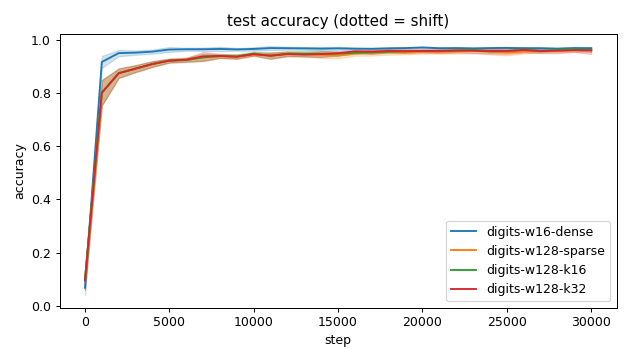
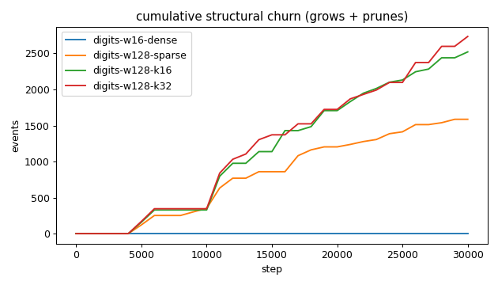
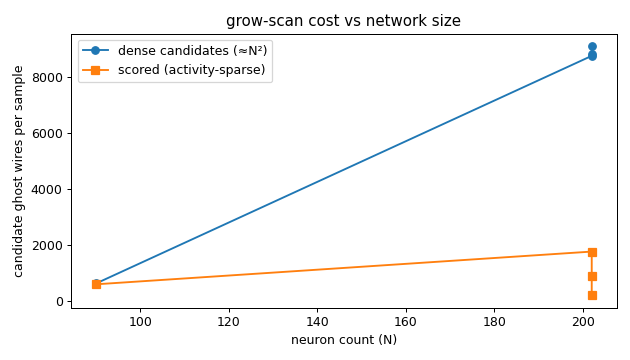
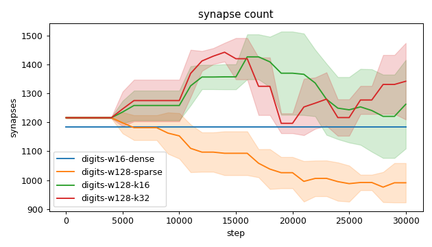
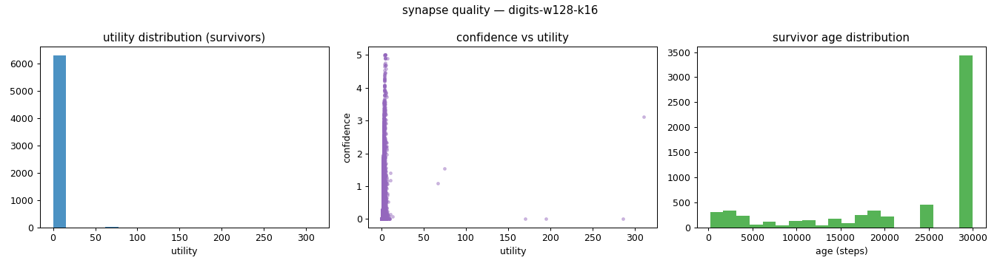
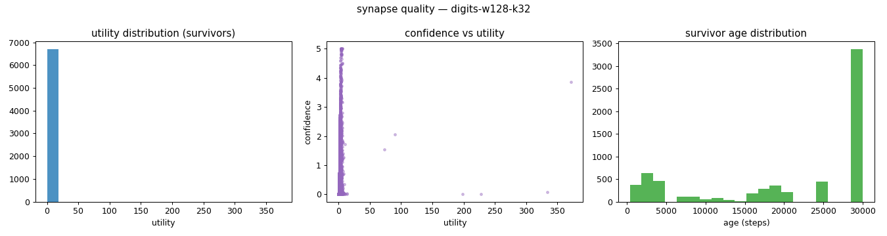
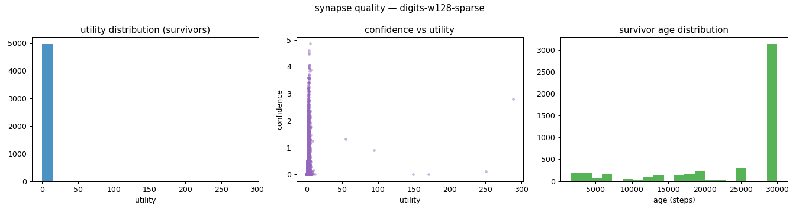
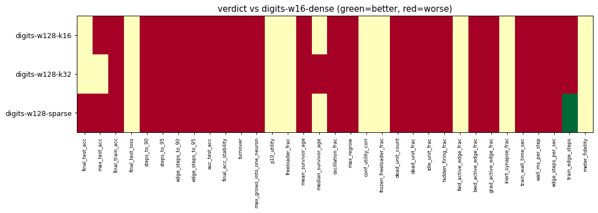

# Evaluation run: digits-w128-kscale

- **Date:** 2026-06-13 14:55:53
- **Variants:** digits-w128-k16, digits-w128-k32, digits-w128-sparse, digits-w16-dense  (baseline: digits-w16-dense)
- **Seeds:** 5  |  **Dataset:** digits  |  **Steps:** 30000 (+0 shift)
- **Commit:** 5bf30cb
- **Command:** `python evaluate.py --variants digits-w16-dense,digits-w128-sparse,digits-w128-k16,digits-w128-k32 --baseline digits-w16-dense --dataset digits --layers 64,16,10 --density 1.0 --seeds 5 --steps 30000 --record-every 1000 --no-cache --publish --run-name digits-w128-kscale`

## Key metrics

| Metric | What it means | digits-w128-k16 | digits-w128-k32 | digits-w128-sparse | digits-w16-dense (baseline) |
|---|---|---|---|---|---|
| final_test_acc ↑ | held-out accuracy at the end of the run | 0.963 ± 0.007 ≈ | 0.962 ± 0.013 ≈ | 0.963 ± 0.007 ▼ | 0.970 ± 0.004 |
| steps_to_90 ↓ | steps to first reach 90% test accuracy | 4201 ± 748.331 ▼ | 4201 ± 748.331 ▼ | 4201 ± 748.331 ▼ | 1201 ± 400 |
| steps_to_95 ↓ | steps to first reach 95% test accuracy | 13001 ± 4000 ▼ | 12801 ± 3311 ▼ | 14201 ± 4167 ▼ | 2601 ± 1744 |
| auc_test_acc ↑ | area under the test-accuracy curve (speed + level) | 0.927 ± 0.005 ▼ | 0.927 ± 0.007 ▼ | 0.925 ± 0.008 ▼ | 0.951 ± 0.004 |
| edge_steps_to_90 ↓ | live-edge training work to first reach 90% test accuracy | 5107036 ± 906929 ▼ | 5107046 ± 906940 ▼ | 5106998 ± 906889 ▼ | 1421984 ± 473600 |
| edge_steps_to_95 ↓ | live-edge training work to first reach 95% test accuracy | 16429506 ± 5182545 ▼ | 16332725 ± 4292805 ▼ | 16677442 ± 4945771 ▼ | 3079584 ± 2064375 |
| synapse_count_end | live synapses at the end | 1262 ± 152.967 ≈ | 1342 ± 132.128 ≈ | 991.200 ± 67.992 ≈ | 1184 ± 0 |
| effective_density | live edges as a fraction of fully-connected | 0.133 ± 0.016 ≈ | 0.142 ± 0.014 ≈ | 0.105 ± 0.007 ≈ | 1 ± 0 |
| avg_live_edges | time-average live edges during training | 1292 ± 41.514 ≈ | 1290 ± 26.317 ≈ | 1090 ± 39.332 ≈ | 1184 ± 0 |
| train_edge_steps ↓ | cumulative live-edge steps over training | 38746480 ± 1245464 ▼ | 38703640 ± 789522 ▼ | 32693600 ± 1180012 ▲ | 35520000 ± 0 |
| train_wall_time_sec ↓ | training-loop wall time only, excluding eval snapshots | 111.147 ± 3.283 ▼ | 100.885 ± 1.869 ▼ | 94.501 ± 3.052 ▼ | 48.086 ± 0.385 |
| wall_ms_per_step ↓ | training-loop milliseconds per SGD step | 3.705 ± 0.109 ▼ | 3.363 ± 0.062 ▼ | 3.150 ± 0.102 ▼ | 1.603 ± 0.013 |
| edge_steps_per_sec ↑ | live-edge steps processed per wall-clock second | 348582 ± 1373 ▼ | 383659 ± 4928 ▼ | 345922 ± 2252 ▼ | 738718 ± 5903 |
| ghost_dense_cost | candidate ghost wires the grow-scan must consider (~N²) | 8850 ± 152.967 ≈ | 8770 ± 132.128 ≈ | 9121 ± 67.992 ≈ | 640 ± 0 |
| ghost_pairs_scored | candidate wires actually scored after activity+demand pruning | 898.759 ± 25.526 ≈ | 1777 ± 49.774 ≈ | 221.194 ± 11.555 ≈ | 607.632 ± 4.567 |
| mean_neuron_activation | avg hidden-neuron ReLU output on test data (neuron value) | 1546 ± 3091 ≈ | 1546 ± 3091 ≈ | 1546 ± 3091 ≈ | 3730 ± 7458 |
| dead_unit_frac ↓ | fraction of hidden neurons that never fire (scale-free) | 0.005 ± 0.004 ▼ | 0.005 ± 0.004 ▼ | 0.006 ± 0.006 ▼ | 0 ± 0 |
| hidden_firing_frac ↓ | fraction of hidden ReLUs active on test data | 0.522 ± 0.010 ▼ | 0.522 ± 0.010 ▼ | 0.521 ± 0.007 ▼ | 0.488 ± 0.011 |
| fwd_active_edge_frac ↓ | fraction of live edges whose pre neuron is active | 0.885 ± 0.007 ≈ | 0.889 ± 0.009 ≈ | 0.889 ± 0.006 ≈ | 0.888 ± 0.006 |
| bwd_active_edge_frac ↓ | fraction of live edges whose post delta is nonzero | 0.666 ± 0.006 ▼ | 0.661 ± 0.011 ▼ | 0.639 ± 0.013 ▼ | 0.557 ± 0.010 |
| grad_active_edge_frac ↓ | fraction of live edges with nonzero weight gradient | 0.559 ± 0.006 ▼ | 0.558 ± 0.010 ▼ | 0.538 ± 0.010 ▼ | 0.467 ± 0.011 |
| idle_unit_frac ↓ | fraction of hidden neurons dead OR outputless (not in service) | 0.156 ± 0.016 ▼ | 0.164 ± 0.023 ▼ | 0.208 ± 0.056 ▼ | 0 ± 0 |
| n_recycle_events | dead-unit recycles fired over the run (sleep recycling) | 0 ± 0 ≈ | 0 ± 0 ≈ | 0 ± 0 ≈ | 0 ± 0 |
| recycled_rehired_frac | of recycled units, fraction back in service at the end | — ± — ? | — ± — ? | — ± — ? | — ± — |
| n_startle_events | demand-spike hiring alarms fired (startle growth) | 0 ± 0 ≈ | 0 ± 0 ≈ | 0 ± 0 ≈ | 0 ± 0 |
| n_arousal_events | post-startle refinement windows that ran grow-only passes | 0 ± 0 ≈ | 0 ± 0 ≈ | 0 ± 0 ≈ | 0 ± 0 |
| max_grows_into_one_neuron ↓ | most times one neuron was grown into (churn) | 126.200 ± 40.172 ▼ | 140.600 ± 24.047 ▼ | 89 ± 14.464 ▼ | 0 ± 0 |
| oscillation_frac ↓ | fraction of grown edges grown ≥2× (thrash) | 0.081 ± 0.045 ▼ | 0.105 ± 0.054 ▼ | 0.039 ± 0.018 ▼ | 0 ± 0 |
| freeloader_frac ↓ | fraction of synapses below the prune-utility floor | 0.086 ± 0.123 ≈ | 0.110 ± 0.146 ≈ | 0.084 ± 0.118 ≈ | 0.139 ± 0.099 |
| conf_utility_corr ↑ | corr of confidence with real utility (calibration) | 0.298 ± 0.112 ? | 0.327 ± 0.129 ? | 0.220 ± 0.080 ? | — ± — |
| dead_unit_count ↓ | hidden neurons that never fire on test data | 0.600 ± 0.490 ▼ | 0.600 ± 0.490 ▼ | 0.800 ± 0.748 ▼ | 0 ± 0 |

## Full scorecard

| Metric | digits-w128-k16 | digits-w128-k32 | digits-w128-sparse | digits-w16-dense (baseline) |
|---|---|---|---|---|
| **Prediction performance** | | | | |
| final_test_acc ↑ | 0.963 ± 0.007 ≈ | 0.962 ± 0.013 ≈ | 0.963 ± 0.007 ▼ | 0.970 ± 0.004 |
| max_test_acc ↑ | 0.968 ± 0.003 ▼ | 0.969 ± 0.007 ≈ | 0.965 ± 0.007 ▼ | 0.975 ± 0.004 |
| final_train_acc ↑ | 0.999 ± 0.001 ▼ | 0.999 ± 0.000 ▼ | 0.998 ± 0.002 ▼ | 1 ± 0 |
| final_test_loss ↓ | 0.155 ± 0.044 ≈ | 0.147 ± 0.043 ≈ | 0.150 ± 0.051 ≈ | 0.169 ± 0.075 |
| **Training efficacy** | | | | |
| steps_to_90 ↓ | 4201 ± 748.331 ▼ | 4201 ± 748.331 ▼ | 4201 ± 748.331 ▼ | 1201 ± 400 |
| steps_to_95 ↓ | 13001 ± 4000 ▼ | 12801 ± 3311 ▼ | 14201 ± 4167 ▼ | 2601 ± 1744 |
| edge_steps_to_90 ↓ | 5107036 ± 906929 ▼ | 5107046 ± 906940 ▼ | 5106998 ± 906889 ▼ | 1421984 ± 473600 |
| edge_steps_to_95 ↓ | 16429506 ± 5182545 ▼ | 16332725 ± 4292805 ▼ | 16677442 ± 4945771 ▼ | 3079584 ± 2064375 |
| auc_test_acc ↑ | 0.927 ± 0.005 ▼ | 0.927 ± 0.007 ▼ | 0.925 ± 0.008 ▼ | 0.951 ± 0.004 |
| final_acc_stability ↓ | 0.004 ± 0.001 ▼ | 0.004 ± 0.001 ▼ | 0.005 ± 0.001 ▼ | 0.002 ± 0.000 |
| **Synapse structure** | | | | |
| synapse_count_start | 1216 ± 2.135 ≈ | 1216 ± 2.135 ≈ | 1216 ± 2.135 ≈ | 1184 ± 0 |
| synapse_count_peak | 1456 ± 47.238 ≈ | 1464 ± 21.420 ≈ | 1216 ± 2.135 ≈ | 1184 ± 0 |
| synapse_count_end | 1262 ± 152.967 ≈ | 1342 ± 132.128 ≈ | 991.200 ± 67.992 ≈ | 1184 ± 0 |
| n_grow_events | 1284 ± 296.571 ≈ | 1431 ± 220.915 ≈ | 680.800 ± 95.386 ≈ | 0 ± 0 |
| n_prune_events | 1237 ± 156.279 ≈ | 1305 ± 229.622 ≈ | 905.400 ± 130.281 ≈ | 0 ± 0 |
| n_startle_events | 0 ± 0 ≈ | 0 ± 0 ≈ | 0 ± 0 ≈ | 0 ± 0 |
| n_arousal_events | 0 ± 0 ≈ | 0 ± 0 ≈ | 0 ± 0 ≈ | 0 ± 0 |
| distinct_neurons_grown | 59.600 ± 7.338 ≈ | 69 ± 7.457 ≈ | 30.400 ± 6.216 ≈ | 0 ± 0 |
| turnover ↓ | 1.947 ± 0.310 ▼ | 2.120 ± 0.338 ▼ | 1.462 ± 0.247 ▼ | 0 ± 0 |
| max_grows_into_one_neuron ↓ | 126.200 ± 40.172 ▼ | 140.600 ± 24.047 ▼ | 89 ± 14.464 ▼ | 0 ± 0 |
| mean_fan_in | 9.146 ± 1.108 ≈ | 9.722 ± 0.957 ≈ | 7.183 ± 0.493 ≈ | 45.538 ± 0 |
| mean_fan_out | 6.574 ± 0.797 ≈ | 6.987 ± 0.688 ≈ | 5.162 ± 0.354 ≈ | 14.800 ± 0 |
| effective_density | 0.133 ± 0.016 ≈ | 0.142 ± 0.014 ≈ | 0.105 ± 0.007 ≈ | 1 ± 0 |
| avg_live_edges | 1292 ± 41.514 ≈ | 1290 ± 26.317 ≈ | 1090 ± 39.332 ≈ | 1184 ± 0 |
| **Synapse quality** | | | | |
| p10_utility ↑ | 0.760 ± 0.363 ≈ | 0.698 ± 0.355 ≈ | 0.788 ± 0.378 ≈ | 0.461 ± 0.164 |
| freeloader_frac ↓ | 0.086 ± 0.123 ≈ | 0.110 ± 0.146 ≈ | 0.084 ± 0.118 ≈ | 0.139 ± 0.099 |
| mean_survivor_age ↑ | 22312 ± 2126 ▼ | 20843 ± 1690 ▼ | 24003 ± 514.196 ▼ | 30000 ± 0 |
| median_survivor_age ↑ | 26480 ± 4763 ≈ | 25839 ± 3844 ▼ | 30000 ± 0 ≈ | 30000 ± 0 |
| mean_pruned_lifespan | 8944 ± 1106 ≈ | 8568 ± 1077 ≈ | 10082 ± 1877 ≈ | 0 ± 0 |
| oscillation_frac ↓ | 0.081 ± 0.045 ▼ | 0.105 ± 0.054 ▼ | 0.039 ± 0.018 ▼ | 0 ± 0 |
| max_regrow ↓ | 1.800 ± 0.748 ▼ | 2 ± 0.632 ▼ | 1.200 ± 0.400 ▼ | 0 ± 0 |
| conf_utility_corr ↑ | 0.298 ± 0.112 ? | 0.327 ± 0.129 ? | 0.220 ± 0.080 ? | — ± — |
| frozen_freeloader_frac ↓ | 0 ± 0 ≈ | 0 ± 0 ≈ | 0 ± 0 ≈ | 0 ± 0 |
| dead_unit_count ↓ | 0.600 ± 0.490 ▼ | 0.600 ± 0.490 ▼ | 0.800 ± 0.748 ▼ | 0 ± 0 |
| dead_unit_frac ↓ | 0.005 ± 0.004 ▼ | 0.005 ± 0.004 ▼ | 0.006 ± 0.006 ▼ | 0 ± 0 |
| idle_unit_frac ↓ | 0.156 ± 0.016 ▼ | 0.164 ± 0.023 ▼ | 0.208 ± 0.056 ▼ | 0 ± 0 |
| mean_neuron_activation | 1546 ± 3091 ≈ | 1546 ± 3091 ≈ | 1546 ± 3091 ≈ | 3730 ± 7458 |
| hidden_firing_frac ↓ | 0.522 ± 0.010 ▼ | 0.522 ± 0.010 ▼ | 0.521 ± 0.007 ▼ | 0.488 ± 0.011 |
| fwd_active_edge_frac ↓ | 0.885 ± 0.007 ≈ | 0.889 ± 0.009 ≈ | 0.889 ± 0.006 ≈ | 0.888 ± 0.006 |
| bwd_active_edge_frac ↓ | 0.666 ± 0.006 ▼ | 0.661 ± 0.011 ▼ | 0.639 ± 0.013 ▼ | 0.557 ± 0.010 |
| grad_active_edge_frac ↓ | 0.559 ± 0.006 ▼ | 0.558 ± 0.010 ▼ | 0.538 ± 0.010 ▼ | 0.467 ± 0.011 |
| inert_synapse_frac ↓ | 0 ± 0 ≈ | 0 ± 0 ≈ | 0 ± 0 ≈ | 0 ± 0 |
| used_vs_allocated | 1.038 ± 0.125 ≈ | 1.104 ± 0.110 ≈ | 0.815 ± 0.056 ≈ | 1 ± 0 |
| n_recycle_events | 0 ± 0 ≈ | 0 ± 0 ≈ | 0 ± 0 ≈ | 0 ± 0 |
| recycled_rehired_frac | — ± — ? | — ± — ? | — ± — ? | — ± — |
| **Compute cost** | | | | |
| train_wall_time_sec ↓ | 111.147 ± 3.283 ▼ | 100.885 ± 1.869 ▼ | 94.501 ± 3.052 ▼ | 48.086 ± 0.385 |
| wall_ms_per_step ↓ | 3.705 ± 0.109 ▼ | 3.363 ± 0.062 ▼ | 3.150 ± 0.102 ▼ | 1.603 ± 0.013 |
| edge_steps_per_sec ↑ | 348582 ± 1373 ▼ | 383659 ± 4928 ▼ | 345922 ± 2252 ▼ | 738718 ± 5903 |
| train_edge_steps ↓ | 38746480 ± 1245464 ▼ | 38703640 ± 789522 ▼ | 32693600 ± 1180012 ▲ | 35520000 ± 0 |
| ghost_dense_cost | 8850 ± 152.967 ≈ | 8770 ± 132.128 ≈ | 9121 ± 67.992 ≈ | 640 ± 0 |
| ghost_pairs_scored | 898.759 ± 25.526 ≈ | 1777 ± 49.774 ≈ | 221.194 ± 11.555 ≈ | 607.632 ± 4.567 |
| **Signal sanity** | | | | |
| meter_fidelity ↑ | 0.581 ± 0.261 ≈ | 0.465 ± 0.220 ≈ | 0.601 ± 0.302 ≈ | 0.315 ± 0.293 |

Baseline: **digits-w16-dense**. ▲ better / ▼ worse / ≈ no clear difference vs baseline (95% bootstrap CI of the mean difference). Cells show mean ± std across seeds.

## Charts

### acc_curves

### churn_curves

### cost_scaling

### count_curves

### quality_digits-w128-k16

### quality_digits-w128-k32

### quality_digits-w128-sparse

### quality_digits-w16-dense

### verdict_heatmap

