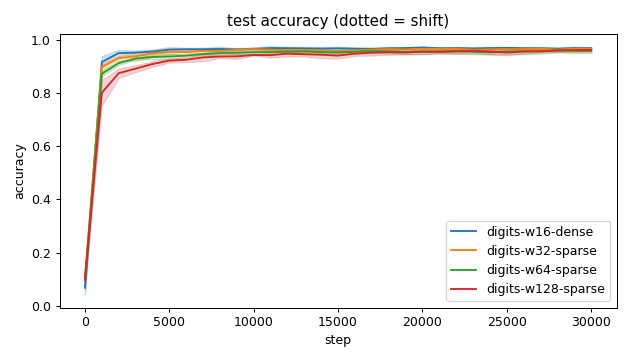
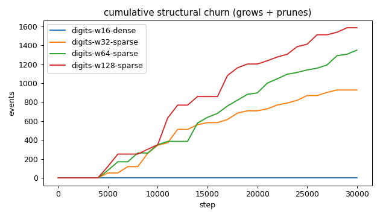
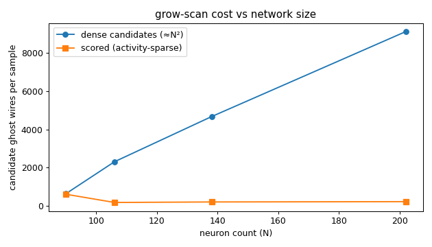
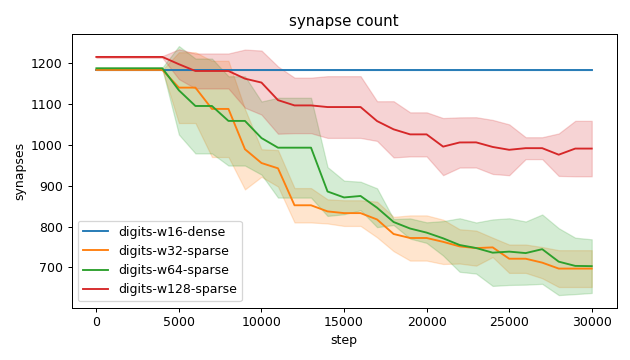
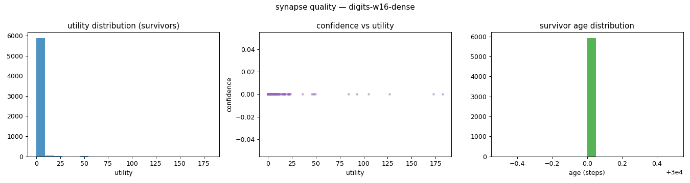
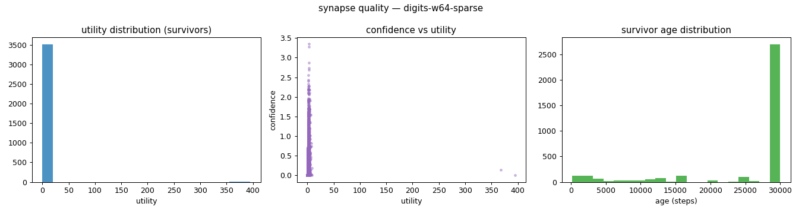
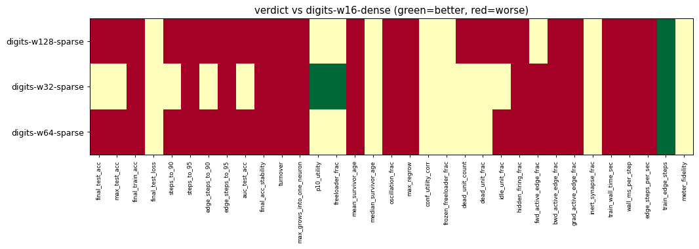

# Evaluation run: digits-width-sweep-constant-compute

- **Date:** 2026-06-13 12:55:29
- **Variants:** digits-w128-sparse, digits-w16-dense, digits-w32-sparse, digits-w64-sparse  (baseline: digits-w16-dense)
- **Seeds:** 5  |  **Dataset:** digits  |  **Steps:** 30000 (+0 shift)
- **Commit:** 8eb291b
- **Command:** `python evaluate.py --variants digits-w16-dense,digits-w32-sparse,digits-w64-sparse,digits-w128-sparse --baseline digits-w16-dense --dataset digits --layers 64,16,10 --density 1.0 --seeds 5 --steps 30000 --record-every 1000 --no-cache --publish --run-name digits-width-sweep-constant-compute`

## Key metrics

| Metric | What it means | digits-w128-sparse | digits-w16-dense (baseline) | digits-w32-sparse | digits-w64-sparse |
|---|---|---|---|---|---|
| final_test_acc ↑ | held-out accuracy at the end of the run | 0.963 ± 0.007 ▼ | 0.970 ± 0.004 | 0.968 ± 0.007 ≈ | 0.960 ± 0.008 ▼ |
| steps_to_90 ↓ | steps to first reach 90% test accuracy | 4201 ± 748.331 ▼ | 1201 ± 400 | 1601 ± 489.898 ≈ | 2001 ± 0 ▼ |
| steps_to_95 ↓ | steps to first reach 95% test accuracy | 14201 ± 4167 ▼ | 2601 ± 1744 | 4801 ± 1327 ▼ | 12001 ± 8025 ▼ |
| auc_test_acc ↑ | area under the test-accuracy curve (speed + level) | 0.925 ± 0.008 ▼ | 0.951 ± 0.004 | 0.945 ± 0.005 ≈ | 0.935 ± 0.006 ▼ |
| edge_steps_to_90 ↓ | live-edge training work to first reach 90% test accuracy | 5106998 ± 906889 ▼ | 1421984 ± 473600 | 1895584 ± 580039 ≈ | 2377188 ± 3797 ▼ |
| edge_steps_to_95 ↓ | live-edge training work to first reach 95% test accuracy | 16677442 ± 4945771 ▼ | 3079584 ± 2064375 | 5649621 ± 1567047 ▼ | 12770853 ± 7244436 ▼ |
| synapse_count_end | live synapses at the end | 991.200 ± 67.992 ≈ | 1184 ± 0 | 697 ± 45.135 ≈ | 703 ± 65.775 ≈ |
| effective_density | live edges as a fraction of fully-connected | 0.105 ± 0.007 ≈ | 1 ± 0 | 0.294 ± 0.019 ≈ | 0.148 ± 0.014 ≈ |
| avg_live_edges | time-average live edges during training | 1090 ± 39.332 ≈ | 1184 ± 0 | 898.329 ± 31.123 ≈ | 921.269 ± 52.660 ≈ |
| train_edge_steps ↓ | cumulative live-edge steps over training | 32693600 ± 1180012 ▲ | 35520000 ± 0 | 26950760 ± 933716 ▲ | 27639000 ± 1579862 ▲ |
| train_wall_time_sec ↓ | training-loop wall time only, excluding eval snapshots | 86.478 ± 3.018 ▼ | 48.613 ± 0.836 | 79.095 ± 2.230 ▼ | 79.115 ± 3.954 ▼ |
| wall_ms_per_step ↓ | training-loop milliseconds per SGD step | 2.883 ± 0.101 ▼ | 1.620 ± 0.028 | 2.636 ± 0.074 ▼ | 2.637 ± 0.132 ▼ |
| edge_steps_per_sec ↑ | live-edge steps processed per wall-clock second | 378084 ± 5488 ▼ | 730887 ± 12489 | 340742 ± 6913 ▼ | 349220 ± 3181 ▼ |
| ghost_dense_cost | candidate ghost wires the grow-scan must consider (~N²) | 9121 ± 67.992 ≈ | 640 ± 0 | 2311 ± 45.135 ≈ | 4673 ± 65.775 ≈ |
| ghost_pairs_scored | candidate wires actually scored after activity+demand pruning | 221.194 ± 11.555 ≈ | 607.632 ± 4.567 | 177.897 ± 5.498 ≈ | 204.705 ± 7.067 ≈ |
| mean_neuron_activation | avg hidden-neuron ReLU output on test data (neuron value) | 1546 ± 3091 ≈ | 3730 ± 7458 | 0.993 ± 0.053 ≈ | 444.756 ± 887.974 ≈ |
| dead_unit_frac ↓ | fraction of hidden neurons that never fire (scale-free) | 0.006 ± 0.006 ▼ | 0 ± 0 | 0 ± 0 ≈ | 0.009 ± 0.012 ≈ |
| hidden_firing_frac ↓ | fraction of hidden ReLUs active on test data | 0.521 ± 0.007 ▼ | 0.488 ± 0.011 | 0.502 ± 0.004 ▼ | 0.525 ± 0.008 ▼ |
| fwd_active_edge_frac ↓ | fraction of live edges whose pre neuron is active | 0.889 ± 0.006 ≈ | 0.888 ± 0.006 | 0.911 ± 0.004 ▼ | 0.908 ± 0.005 ▼ |
| bwd_active_edge_frac ↓ | fraction of live edges whose post delta is nonzero | 0.639 ± 0.013 ▼ | 0.557 ± 0.010 | 0.598 ± 0.012 ▼ | 0.618 ± 0.014 ▼ |
| grad_active_edge_frac ↓ | fraction of live edges with nonzero weight gradient | 0.538 ± 0.010 ▼ | 0.467 ± 0.011 | 0.512 ± 0.010 ▼ | 0.532 ± 0.013 ▼ |
| idle_unit_frac ↓ | fraction of hidden neurons dead OR outputless (not in service) | 0.208 ± 0.056 ▼ | 0 ± 0 | 0.013 ± 0.015 ≈ | 0.128 ± 0.050 ▼ |
| n_recycle_events | dead-unit recycles fired over the run (sleep recycling) | 0 ± 0 ≈ | 0 ± 0 | 0 ± 0 ≈ | 0 ± 0 ≈ |
| recycled_rehired_frac | of recycled units, fraction back in service at the end | — ± — ? | — ± — | — ± — ? | — ± — ? |
| n_startle_events | demand-spike hiring alarms fired (startle growth) | 0 ± 0 ≈ | 0 ± 0 | 0 ± 0 ≈ | 0 ± 0 ≈ |
| n_arousal_events | post-startle refinement windows that ran grow-only passes | 0 ± 0 ≈ | 0 ± 0 | 0 ± 0 ≈ | 0 ± 0 ≈ |
| max_grows_into_one_neuron ↓ | most times one neuron was grown into (churn) | 89 ± 14.464 ▼ | 0 ± 0 | 33 ± 12.066 ▼ | 59.400 ± 20.723 ▼ |
| oscillation_frac ↓ | fraction of grown edges grown ≥2× (thrash) | 0.039 ± 0.018 ▼ | 0 ± 0 | 0.051 ± 0.032 ▼ | 0.089 ± 0.034 ▼ |
| freeloader_frac ↓ | fraction of synapses below the prune-utility floor | 0.084 ± 0.118 ≈ | 0.139 ± 0.099 | 0.008 ± 0.006 ▲ | 0.063 ± 0.119 ≈ |
| conf_utility_corr ↑ | corr of confidence with real utility (calibration) | 0.220 ± 0.080 ? | — ± — | 0.350 ± 0.039 ? | 0.223 ± 0.115 ? |
| dead_unit_count ↓ | hidden neurons that never fire on test data | 0.800 ± 0.748 ▼ | 0 ± 0 | 0 ± 0 ≈ | 0.600 ± 0.800 ≈ |

## Full scorecard

| Metric | digits-w128-sparse | digits-w16-dense (baseline) | digits-w32-sparse | digits-w64-sparse |
|---|---|---|---|---|
| **Prediction performance** | | | | |
| final_test_acc ↑ | 0.963 ± 0.007 ▼ | 0.970 ± 0.004 | 0.968 ± 0.007 ≈ | 0.960 ± 0.008 ▼ |
| max_test_acc ↑ | 0.965 ± 0.007 ▼ | 0.975 ± 0.004 | 0.974 ± 0.005 ≈ | 0.965 ± 0.007 ▼ |
| final_train_acc ↑ | 0.998 ± 0.002 ▼ | 1 ± 0 | 0.999 ± 0.001 ▼ | 0.998 ± 0.002 ▼ |
| final_test_loss ↓ | 0.150 ± 0.051 ≈ | 0.169 ± 0.075 | 0.143 ± 0.050 ≈ | 0.181 ± 0.091 ≈ |
| **Training efficacy** | | | | |
| steps_to_90 ↓ | 4201 ± 748.331 ▼ | 1201 ± 400 | 1601 ± 489.898 ≈ | 2001 ± 0 ▼ |
| steps_to_95 ↓ | 14201 ± 4167 ▼ | 2601 ± 1744 | 4801 ± 1327 ▼ | 12001 ± 8025 ▼ |
| edge_steps_to_90 ↓ | 5106998 ± 906889 ▼ | 1421984 ± 473600 | 1895584 ± 580039 ≈ | 2377188 ± 3797 ▼ |
| edge_steps_to_95 ↓ | 16677442 ± 4945771 ▼ | 3079584 ± 2064375 | 5649621 ± 1567047 ▼ | 12770853 ± 7244436 ▼ |
| auc_test_acc ↑ | 0.925 ± 0.008 ▼ | 0.951 ± 0.004 | 0.945 ± 0.005 ≈ | 0.935 ± 0.006 ▼ |
| final_acc_stability ↓ | 0.005 ± 0.001 ▼ | 0.002 ± 0.000 | 0.004 ± 0.001 ▼ | 0.003 ± 0.001 ▼ |
| **Synapse structure** | | | | |
| synapse_count_start | 1216 ± 2.135 ≈ | 1184 ± 0 | 1184 ± 0 ≈ | 1188 ± 1.897 ≈ |
| synapse_count_peak | 1216 ± 2.135 ≈ | 1184 ± 0 | 1184 ± 0 ≈ | 1188 ± 1.897 ≈ |
| synapse_count_end | 991.200 ± 67.992 ≈ | 1184 ± 0 | 697 ± 45.135 ≈ | 703 ± 65.775 ≈ |
| n_grow_events | 680.800 ± 95.386 ≈ | 0 ± 0 | 220.800 ± 35.005 ≈ | 432.400 ± 144.005 ≈ |
| n_prune_events | 905.400 ± 130.281 ≈ | 0 ± 0 | 707.800 ± 61.882 ≈ | 917.400 ± 125.772 ≈ |
| n_startle_events | 0 ± 0 ≈ | 0 ± 0 | 0 ± 0 ≈ | 0 ± 0 ≈ |
| n_arousal_events | 0 ± 0 ≈ | 0 ± 0 | 0 ± 0 ≈ | 0 ± 0 ≈ |
| distinct_neurons_grown | 30.400 ± 6.216 ≈ | 0 ± 0 | 20.200 ± 3.429 ≈ | 26.400 ± 2.577 ≈ |
| turnover ↓ | 1.462 ± 0.247 ▼ | 0 ± 0 | 1.035 ± 0.118 ▼ | 1.464 ± 0.270 ▼ |
| max_grows_into_one_neuron ↓ | 89 ± 14.464 ▼ | 0 ± 0 | 33 ± 12.066 ▼ | 59.400 ± 20.723 ▼ |
| mean_fan_in | 7.183 ± 0.493 ≈ | 45.538 ± 0 | 16.595 ± 1.075 ≈ | 9.500 ± 0.889 ≈ |
| mean_fan_out | 5.162 ± 0.354 ≈ | 14.800 ± 0 | 7.260 ± 0.470 ≈ | 5.492 ± 0.514 ≈ |
| effective_density | 0.105 ± 0.007 ≈ | 1 ± 0 | 0.294 ± 0.019 ≈ | 0.148 ± 0.014 ≈ |
| avg_live_edges | 1090 ± 39.332 ≈ | 1184 ± 0 | 898.329 ± 31.123 ≈ | 921.269 ± 52.660 ≈ |
| **Synapse quality** | | | | |
| p10_utility ↑ | 0.788 ± 0.378 ≈ | 0.461 ± 0.164 | 1.066 ± 0.042 ▲ | 0.896 ± 0.424 ≈ |
| freeloader_frac ↓ | 0.084 ± 0.118 ≈ | 0.139 ± 0.099 | 0.008 ± 0.006 ▲ | 0.063 ± 0.119 ≈ |
| mean_survivor_age ↑ | 24003 ± 514.196 ▼ | 30000 ± 0 | 27809 ± 501.045 ▼ | 25562 ± 1073 ▼ |
| median_survivor_age ↑ | 30000 ± 0 ≈ | 30000 ± 0 | 30000 ± 0 ≈ | 30000 ± 0 ≈ |
| mean_pruned_lifespan | 10082 ± 1877 ≈ | 0 ± 0 | 10693 ± 382.467 ≈ | 10762 ± 1992 ≈ |
| oscillation_frac ↓ | 0.039 ± 0.018 ▼ | 0 ± 0 | 0.051 ± 0.032 ▼ | 0.089 ± 0.034 ▼ |
| max_regrow ↓ | 1.200 ± 0.400 ▼ | 0 ± 0 | 1 ± 0 ▼ | 1.600 ± 0.490 ▼ |
| conf_utility_corr ↑ | 0.220 ± 0.080 ? | — ± — | 0.350 ± 0.039 ? | 0.223 ± 0.115 ? |
| frozen_freeloader_frac ↓ | 0 ± 0 ≈ | 0 ± 0 | 0 ± 0 ≈ | 0 ± 0 ≈ |
| dead_unit_count ↓ | 0.800 ± 0.748 ▼ | 0 ± 0 | 0 ± 0 ≈ | 0.600 ± 0.800 ≈ |
| dead_unit_frac ↓ | 0.006 ± 0.006 ▼ | 0 ± 0 | 0 ± 0 ≈ | 0.009 ± 0.012 ≈ |
| idle_unit_frac ↓ | 0.208 ± 0.056 ▼ | 0 ± 0 | 0.013 ± 0.015 ≈ | 0.128 ± 0.050 ▼ |
| mean_neuron_activation | 1546 ± 3091 ≈ | 3730 ± 7458 | 0.993 ± 0.053 ≈ | 444.756 ± 887.974 ≈ |
| hidden_firing_frac ↓ | 0.521 ± 0.007 ▼ | 0.488 ± 0.011 | 0.502 ± 0.004 ▼ | 0.525 ± 0.008 ▼ |
| fwd_active_edge_frac ↓ | 0.889 ± 0.006 ≈ | 0.888 ± 0.006 | 0.911 ± 0.004 ▼ | 0.908 ± 0.005 ▼ |
| bwd_active_edge_frac ↓ | 0.639 ± 0.013 ▼ | 0.557 ± 0.010 | 0.598 ± 0.012 ▼ | 0.618 ± 0.014 ▼ |
| grad_active_edge_frac ↓ | 0.538 ± 0.010 ▼ | 0.467 ± 0.011 | 0.512 ± 0.010 ▼ | 0.532 ± 0.013 ▼ |
| inert_synapse_frac ↓ | 0 ± 0 ≈ | 0 ± 0 | 0 ± 0 ≈ | 0 ± 0 ≈ |
| used_vs_allocated | 0.815 ± 0.056 ≈ | 1 ± 0 | 0.589 ± 0.038 ≈ | 0.592 ± 0.055 ≈ |
| n_recycle_events | 0 ± 0 ≈ | 0 ± 0 | 0 ± 0 ≈ | 0 ± 0 ≈ |
| recycled_rehired_frac | — ± — ? | — ± — | — ± — ? | — ± — ? |
| **Compute cost** | | | | |
| train_wall_time_sec ↓ | 86.478 ± 3.018 ▼ | 48.613 ± 0.836 | 79.095 ± 2.230 ▼ | 79.115 ± 3.954 ▼ |
| wall_ms_per_step ↓ | 2.883 ± 0.101 ▼ | 1.620 ± 0.028 | 2.636 ± 0.074 ▼ | 2.637 ± 0.132 ▼ |
| edge_steps_per_sec ↑ | 378084 ± 5488 ▼ | 730887 ± 12489 | 340742 ± 6913 ▼ | 349220 ± 3181 ▼ |
| train_edge_steps ↓ | 32693600 ± 1180012 ▲ | 35520000 ± 0 | 26950760 ± 933716 ▲ | 27639000 ± 1579862 ▲ |
| ghost_dense_cost | 9121 ± 67.992 ≈ | 640 ± 0 | 2311 ± 45.135 ≈ | 4673 ± 65.775 ≈ |
| ghost_pairs_scored | 221.194 ± 11.555 ≈ | 607.632 ± 4.567 | 177.897 ± 5.498 ≈ | 204.705 ± 7.067 ≈ |
| **Signal sanity** | | | | |
| meter_fidelity ↑ | 0.601 ± 0.302 ≈ | 0.315 ± 0.293 | 0.437 ± 0.272 ≈ | 0.518 ± 0.286 ≈ |

Baseline: **digits-w16-dense**. ▲ better / ▼ worse / ≈ no clear difference vs baseline (95% bootstrap CI of the mean difference). Cells show mean ± std across seeds.

## Charts

### acc_curves

### churn_curves

### cost_scaling

### count_curves

### quality_digits-w128-sparse

### quality_digits-w16-dense

### quality_digits-w32-sparse

### quality_digits-w64-sparse

### verdict_heatmap

