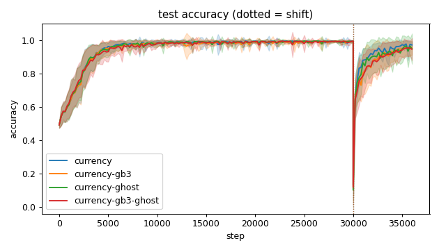
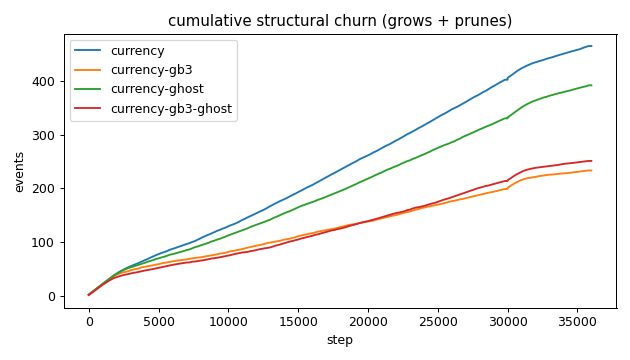
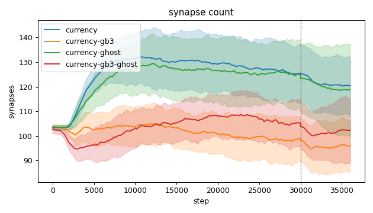
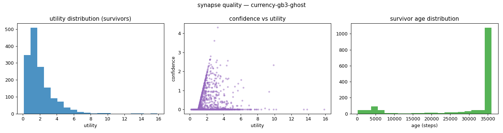
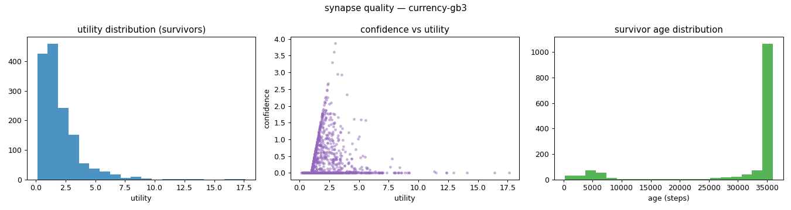
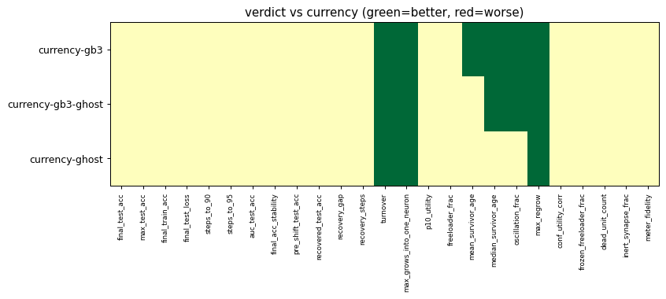

# Evaluation run: gb3-ghost-combo-shift

- **Date:** 2026-06-01 00:40:14
- **Variants:** currency, currency-gb3, currency-gb3-ghost, currency-ghost  (baseline: currency)
- **Seeds:** 15  |  **Dataset:** spirals  |  **Steps:** 30000 (+6000 shift)
- **Commit:** 9a90555
- **Command:** `python evaluate.py --variants currency,currency-gb3,currency-ghost,currency-gb3-ghost --seeds 15 --baseline currency --jobs 10 --no-cache --publish --shift 6000 --run-name gb3-ghost-combo-shift`

## Key metrics

| Metric | What it means | currency (baseline) | currency-gb3 | currency-gb3-ghost | currency-ghost |
|---|---|---|---|---|---|
| final_test_acc ↑ | held-out accuracy at the end of the run | 0.972 ± 0.022 | 0.955 ± 0.042 ≈ | 0.946 ± 0.066 ≈ | 0.949 ± 0.091 ≈ |
| pre_shift_test_acc ↑ | test accuracy just before the concept shift | 0.996 ± 0.003 | 0.994 ± 0.006 ≈ | 0.996 ± 0.003 ≈ | 0.994 ± 0.006 ≈ |
| recovered_test_acc ↑ | test accuracy at the end, after the label swap | 0.972 ± 0.022 | 0.955 ± 0.042 ≈ | 0.946 ± 0.066 ≈ | 0.949 ± 0.091 ≈ |
| auc_test_acc ↑ | area under the test-accuracy curve (speed + level) | 0.945 ± 0.011 | 0.936 ± 0.018 ≈ | 0.935 ± 0.017 ≈ | 0.940 ± 0.017 ≈ |
| max_grows_into_one_neuron ↓ | most times one neuron was grown into (churn) | 39.067 ± 6.049 | 20.333 ± 5.546 ▲ | 19.533 ± 4.209 ▲ | 26.733 ± 3.549 ▲ |
| oscillation_frac ↓ | fraction of grown edges grown ≥2× (thrash) | 0.381 ± 0.058 | 0.275 ± 0.062 ▲ | 0.324 ± 0.087 ▲ | 0.385 ± 0.037 ≈ |
| freeloader_frac ↓ | fraction of synapses below the prune-utility floor | 0.016 ± 0.009 | 0.021 ± 0.017 ≈ | 0.022 ± 0.015 ≈ | 0.019 ± 0.022 ≈ |
| conf_utility_corr ↑ | corr of confidence with real utility (calibration) | 0.125 ± 0.099 | 0.066 ± 0.074 ≈ | 0.123 ± 0.110 ≈ | 0.141 ± 0.128 ≈ |
| dead_unit_count ↓ | hidden neurons that never fire on test data | 5.400 ± 2.752 | 6.133 ± 2.986 ≈ | 5.467 ± 3.180 ≈ | 5.267 ± 3.395 ≈ |

## Full scorecard

| Metric | currency (baseline) | currency-gb3 | currency-gb3-ghost | currency-ghost |
|---|---|---|---|---|
| **Prediction performance** | | | | |
| final_test_acc ↑ | 0.972 ± 0.022 | 0.955 ± 0.042 ≈ | 0.946 ± 0.066 ≈ | 0.949 ± 0.091 ≈ |
| max_test_acc ↑ | 0.998 ± 0.002 | 0.999 ± 0.001 ≈ | 0.999 ± 0.001 ≈ | 0.999 ± 0.001 ≈ |
| final_train_acc ↑ | 0.973 ± 0.024 | 0.958 ± 0.041 ≈ | 0.949 ± 0.067 ≈ | 0.950 ± 0.092 ≈ |
| final_test_loss ↓ | 0.088 ± 0.047 | 0.134 ± 0.099 ≈ | 0.216 ± 0.377 ≈ | 0.165 ± 0.220 ≈ |
| **Training efficacy** | | | | |
| steps_to_90 ↓ | 3174 ± 775.858 | 3374 ± 971.231 ≈ | 3601 ± 1229 ≈ | 3228 ± 885.036 ≈ |
| steps_to_95 ↓ | 3921 ± 1117 | 4201 ± 1435 ≈ | 4668 ± 1788 ≈ | 4121 ± 1193 ≈ |
| auc_test_acc ↑ | 0.945 ± 0.011 | 0.936 ± 0.018 ≈ | 0.935 ± 0.017 ≈ | 0.940 ± 0.017 ≈ |
| final_acc_stability ↓ | 0.025 ± 0.017 | 0.021 ± 0.012 ≈ | 0.036 ± 0.024 ≈ | 0.037 ± 0.029 ≈ |
| pre_shift_test_acc ↑ | 0.996 ± 0.003 | 0.994 ± 0.006 ≈ | 0.996 ± 0.003 ≈ | 0.994 ± 0.006 ≈ |
| recovered_test_acc ↑ | 0.972 ± 0.022 | 0.955 ± 0.042 ≈ | 0.946 ± 0.066 ≈ | 0.949 ± 0.091 ≈ |
| recovery_gap ↓ | 0.023 ± 0.022 | 0.039 ± 0.043 ≈ | 0.049 ± 0.066 ≈ | 0.045 ± 0.090 ≈ |
| recovery_steps ↓ | ∞ ± — | ∞ ± — ? | ∞ ± — ? | ∞ ± — ? |
| **Synapse structure** | | | | |
| synapse_count_start | 103.533 ± 1.024 | 103.533 ± 1.024 ≈ | 102.733 ± 1.340 ≈ | 103.467 ± 1.024 ≈ |
| synapse_count_peak | 137.133 ± 10.269 | 110.533 ± 5.714 ≈ | 114.667 ± 7.049 ≈ | 135.400 ± 12.360 ≈ |
| synapse_count_end | 120.400 ± 11.808 | 95.933 ± 10.427 ≈ | 102.267 ± 13.289 ≈ | 118.800 ± 18.695 ≈ |
| n_grow_events | 241.733 ± 25.215 | 113.733 ± 23.182 ≈ | 125.800 ± 23.716 ≈ | 204.400 ± 23.403 ≈ |
| n_prune_events | 222.867 ± 25.332 | 119.333 ± 19.784 ≈ | 125.067 ± 24.206 ≈ | 187.133 ± 10.385 ≈ |
| distinct_neurons_grown | 15 ± 2.066 | 13.133 ± 2.579 ≈ | 13.533 ± 1.707 ≈ | 15.067 ± 1.914 ≈ |
| turnover ↓ | 3.733 ± 0.469 | 2.322 ± 0.445 ▲ | 2.429 ± 0.429 ▲ | 3.205 ± 0.243 ▲ |
| max_grows_into_one_neuron ↓ | 39.067 ± 6.049 | 20.333 ± 5.546 ▲ | 19.533 ± 4.209 ▲ | 26.733 ± 3.549 ▲ |
| mean_fan_in | 4.013 ± 0.394 | 3.198 ± 0.348 ≈ | 3.409 ± 0.443 ≈ | 3.960 ± 0.623 ≈ |
| mean_fan_out | 4.013 ± 0.394 | 3.198 ± 0.348 ≈ | 3.409 ± 0.443 ≈ | 3.960 ± 0.623 ≈ |
| effective_density | 0.557 ± 0.055 | 0.444 ± 0.048 ≈ | 0.473 ± 0.062 ≈ | 0.550 ± 0.087 ≈ |
| **Synapse quality** | | | | |
| p10_utility ↑ | 0.679 ± 0.053 | 0.674 ± 0.063 ≈ | 0.682 ± 0.082 ≈ | 0.660 ± 0.087 ≈ |
| freeloader_frac ↓ | 0.016 ± 0.009 | 0.021 ± 0.017 ≈ | 0.022 ± 0.015 ≈ | 0.019 ± 0.022 ≈ |
| mean_survivor_age ↑ | 29741 ± 1904 | 31009 ± 1747 ▲ | 29995 ± 1642 ≈ | 29641 ± 2254 ≈ |
| median_survivor_age ↑ | 35893 ± 262.257 | 36000 ± 0 ▲ | 36000 ± 0 ▲ | 35940 ± 224.749 ≈ |
| mean_pruned_lifespan | 4207 ± 679.931 | 5728 ± 1111 ≈ | 5448 ± 998.483 ≈ | 4984 ± 737.316 ≈ |
| oscillation_frac ↓ | 0.381 ± 0.058 | 0.275 ± 0.062 ▲ | 0.324 ± 0.087 ▲ | 0.385 ± 0.037 ≈ |
| max_regrow ↓ | 11.333 ± 2.300 | 6.933 ± 2.144 ▲ | 4.800 ± 1.327 ▲ | 6.467 ± 1.024 ▲ |
| conf_utility_corr ↑ | 0.125 ± 0.099 | 0.066 ± 0.074 ≈ | 0.123 ± 0.110 ≈ | 0.141 ± 0.128 ≈ |
| frozen_freeloader_frac ↓ | 0 ± 0 | 0 ± 0 ≈ | 0 ± 0 ≈ | 0 ± 0 ≈ |
| dead_unit_count ↓ | 5.400 ± 2.752 | 6.133 ± 2.986 ≈ | 5.467 ± 3.180 ≈ | 5.267 ± 3.395 ≈ |
| inert_synapse_frac ↓ | 0 ± 0 | 0 ± 0 ≈ | 0 ± 0 ≈ | 0 ± 0 ≈ |
| used_vs_allocated | 1.186 ± 0.114 | 0.945 ± 0.100 ≈ | 1.007 ± 0.129 ≈ | 1.169 ± 0.176 ≈ |
| **Signal sanity** | | | | |
| meter_fidelity ↑ | 0.871 ± 0.118 | 0.932 ± 0.080 ≈ | 0.888 ± 0.081 ≈ | 0.844 ± 0.130 ≈ |

Baseline: **currency**. ▲ better / ▼ worse / ≈ no clear difference vs baseline (95% bootstrap CI of the mean difference). Cells show mean ± std across seeds.

## Charts

### acc_curves

### churn_curves

### count_curves

### quality_currency-gb3-ghost

### quality_currency-gb3

### quality_currency-ghost

### quality_currency

### verdict_heatmap

