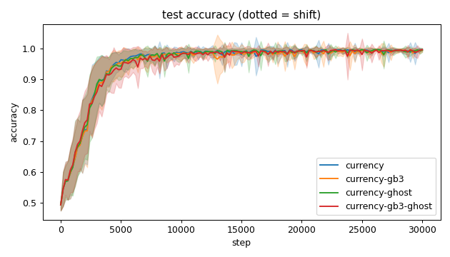
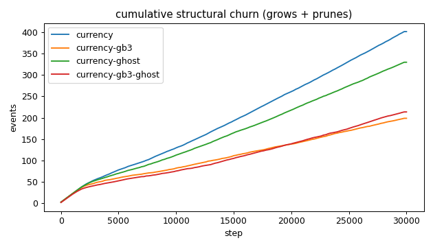
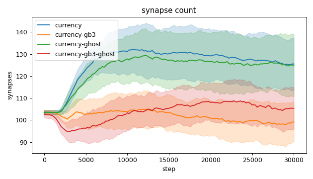
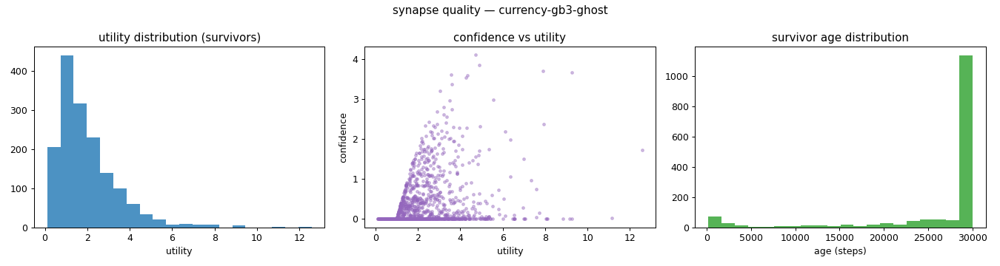
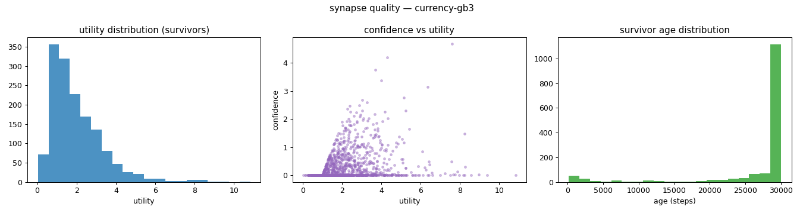
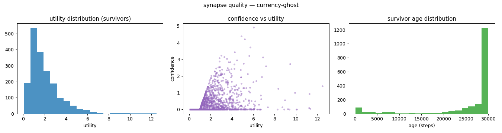
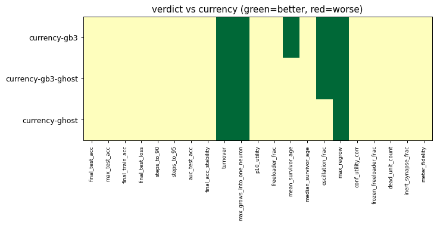

# Evaluation run: gb3-ghost-combo

- **Date:** 2026-06-01 00:36:51
- **Variants:** currency, currency-gb3, currency-gb3-ghost, currency-ghost  (baseline: currency)
- **Seeds:** 15  |  **Dataset:** spirals  |  **Steps:** 30000 (+0 shift)
- **Commit:** 9a90555
- **Command:** `python evaluate.py --variants currency,currency-gb3,currency-ghost,currency-gb3-ghost --seeds 15 --baseline currency --jobs 10 --no-cache --publish --run-name gb3-ghost-combo`

## Key metrics

| Metric | What it means | currency (baseline) | currency-gb3 | currency-gb3-ghost | currency-ghost |
|---|---|---|---|---|---|
| final_test_acc ↑ | held-out accuracy at the end of the run | 0.996 ± 0.003 | 0.994 ± 0.006 ≈ | 0.996 ± 0.003 ≈ | 0.994 ± 0.006 ≈ |
| auc_test_acc ↑ | area under the test-accuracy curve (speed + level) | 0.953 ± 0.011 | 0.949 ± 0.014 ≈ | 0.949 ± 0.015 ≈ | 0.952 ± 0.012 ≈ |
| max_grows_into_one_neuron ↓ | most times one neuron was grown into (churn) | 37.600 ± 5.690 | 18.800 ± 5.729 ▲ | 16.667 ± 2.959 ▲ | 25.133 ± 3.263 ▲ |
| oscillation_frac ↓ | fraction of grown edges grown ≥2× (thrash) | 0.368 ± 0.066 | 0.277 ± 0.068 ▲ | 0.309 ± 0.093 ▲ | 0.376 ± 0.051 ≈ |
| freeloader_frac ↓ | fraction of synapses below the prune-utility floor | 0.032 ± 0.029 | 0.020 ± 0.016 ≈ | 0.027 ± 0.032 ≈ | 0.041 ± 0.034 ≈ |
| conf_utility_corr ↑ | corr of confidence with real utility (calibration) | 0.314 ± 0.125 | 0.322 ± 0.113 ≈ | 0.328 ± 0.110 ≈ | 0.347 ± 0.111 ≈ |
| dead_unit_count ↓ | hidden neurons that never fire on test data | 3.600 ± 1.993 | 4.067 ± 2.294 ≈ | 3.867 ± 2.217 ≈ | 3.600 ± 2.245 ≈ |

## Full scorecard

| Metric | currency (baseline) | currency-gb3 | currency-gb3-ghost | currency-ghost |
|---|---|---|---|---|
| **Prediction performance** | | | | |
| final_test_acc ↑ | 0.996 ± 0.003 | 0.994 ± 0.006 ≈ | 0.996 ± 0.003 ≈ | 0.994 ± 0.006 ≈ |
| max_test_acc ↑ | 0.998 ± 0.002 | 0.998 ± 0.001 ≈ | 0.999 ± 0.001 ≈ | 0.999 ± 0.001 ≈ |
| final_train_acc ↑ | 0.998 ± 0.002 | 0.996 ± 0.006 ≈ | 0.998 ± 0.002 ≈ | 0.997 ± 0.004 ≈ |
| final_test_loss ↓ | 0.015 ± 0.008 | 0.019 ± 0.012 ≈ | 0.017 ± 0.007 ≈ | 0.022 ± 0.022 ≈ |
| **Training efficacy** | | | | |
| steps_to_90 ↓ | 3174 ± 775.858 | 3374 ± 971.231 ≈ | 3601 ± 1229 ≈ | 3228 ± 885.036 ≈ |
| steps_to_95 ↓ | 3921 ± 1117 | 4201 ± 1435 ≈ | 4668 ± 1788 ≈ | 4121 ± 1193 ≈ |
| auc_test_acc ↑ | 0.953 ± 0.011 | 0.949 ± 0.014 ≈ | 0.949 ± 0.015 ≈ | 0.952 ± 0.012 ≈ |
| final_acc_stability ↓ | 0.010 ± 0.013 | 0.007 ± 0.005 ≈ | 0.007 ± 0.008 ≈ | 0.007 ± 0.006 ≈ |
| **Synapse structure** | | | | |
| synapse_count_start | 103.533 ± 1.024 | 103.533 ± 1.024 ≈ | 102.733 ± 1.340 ≈ | 103.467 ± 1.024 ≈ |
| synapse_count_peak | 136.667 ± 9.964 | 110.533 ± 5.714 ≈ | 114.467 ± 6.849 ≈ | 134.467 ± 11.882 ≈ |
| synapse_count_end | 125.467 ± 11.916 | 99.067 ± 9.022 ≈ | 105.333 ± 9.513 ≈ | 124.933 ± 14.158 ≈ |
| n_grow_events | 212.933 ± 20.038 | 98.067 ± 18.635 ≈ | 108.667 ± 19.909 ≈ | 176.733 ± 16.114 ≈ |
| n_prune_events | 189 ± 19.339 | 100.533 ± 20.536 ≈ | 104.867 ± 21.077 ≈ | 153.333 ± 13.573 ≈ |
| distinct_neurons_grown | 14.200 ± 2.286 | 12.333 ± 2.150 ≈ | 12.933 ± 1.769 ≈ | 14.333 ± 1.578 ≈ |
| turnover ↓ | 3.215 ± 0.399 | 1.963 ± 0.422 ▲ | 2.062 ± 0.385 ▲ | 2.697 ± 0.281 ▲ |
| max_grows_into_one_neuron ↓ | 37.600 ± 5.690 | 18.800 ± 5.729 ▲ | 16.667 ± 2.959 ▲ | 25.133 ± 3.263 ▲ |
| mean_fan_in | 4.182 ± 0.397 | 3.302 ± 0.301 ≈ | 3.511 ± 0.317 ≈ | 4.164 ± 0.472 ≈ |
| mean_fan_out | 4.182 ± 0.397 | 3.302 ± 0.301 ≈ | 3.511 ± 0.317 ≈ | 4.164 ± 0.472 ≈ |
| effective_density | 0.581 ± 0.055 | 0.459 ± 0.042 ≈ | 0.488 ± 0.044 ≈ | 0.578 ± 0.066 ≈ |
| **Synapse quality** | | | | |
| p10_utility ↑ | 0.671 ± 0.072 | 0.704 ± 0.063 ≈ | 0.691 ± 0.104 ≈ | 0.673 ± 0.107 ≈ |
| freeloader_frac ↓ | 0.032 ± 0.029 | 0.020 ± 0.016 ≈ | 0.027 ± 0.032 ≈ | 0.041 ± 0.034 ≈ |
| mean_survivor_age ↑ | 26217 ± 867.733 | 26893 ± 784.922 ▲ | 26195 ± 725.090 ≈ | 26055 ± 717.225 ≈ |
| median_survivor_age ↑ | 29986 ± 50.104 | 30000 ± 0 ≈ | 30000 ± 0 ≈ | 30000 ± 0.249 ≈ |
| mean_pruned_lifespan | 2580 ± 424.471 | 3961 ± 779.769 ≈ | 3425 ± 853.967 ≈ | 2882 ± 424.722 ≈ |
| oscillation_frac ↓ | 0.368 ± 0.066 | 0.277 ± 0.068 ▲ | 0.309 ± 0.093 ▲ | 0.376 ± 0.051 ≈ |
| max_regrow ↓ | 11 ± 2.422 | 6.533 ± 2.247 ▲ | 4.200 ± 1.470 ▲ | 6.200 ± 1.046 ▲ |
| conf_utility_corr ↑ | 0.314 ± 0.125 | 0.322 ± 0.113 ≈ | 0.328 ± 0.110 ≈ | 0.347 ± 0.111 ≈ |
| frozen_freeloader_frac ↓ | 0 ± 0 | 0 ± 0 ≈ | 0 ± 0 ≈ | 0 ± 0 ≈ |
| dead_unit_count ↓ | 3.600 ± 1.993 | 4.067 ± 2.294 ≈ | 3.867 ± 2.217 ≈ | 3.600 ± 2.245 ≈ |
| inert_synapse_frac ↓ | 0 ± 0 | 0 ± 0 ≈ | 0 ± 0 ≈ | 0 ± 0 ≈ |
| used_vs_allocated | 1.236 ± 0.118 | 0.976 ± 0.089 ≈ | 1.037 ± 0.093 ≈ | 1.230 ± 0.138 ≈ |
| **Signal sanity** | | | | |
| meter_fidelity ↑ | 0.657 ± 0.260 | 0.711 ± 0.140 ≈ | 0.686 ± 0.240 ≈ | 0.686 ± 0.115 ≈ |

Baseline: **currency**. ▲ better / ▼ worse / ≈ no clear difference vs baseline (95% bootstrap CI of the mean difference). Cells show mean ± std across seeds.

## Charts

### acc_curves

### churn_curves

### count_curves

### quality_currency-gb3-ghost

### quality_currency-gb3

### quality_currency-ghost

### quality_currency

### verdict_heatmap

