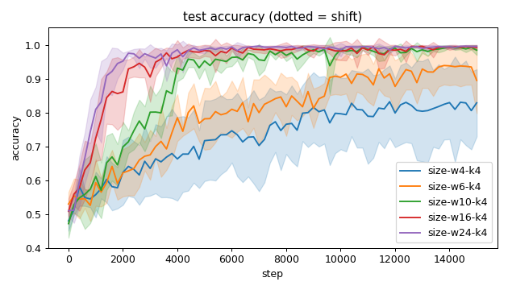
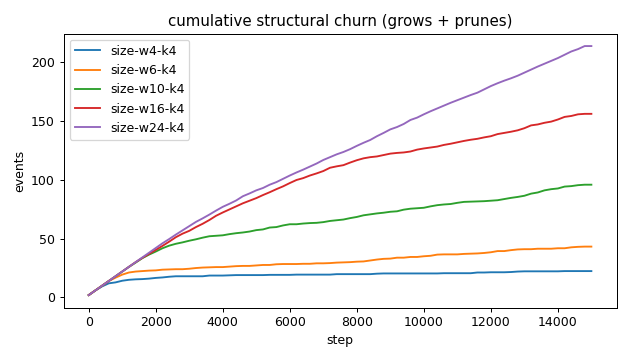
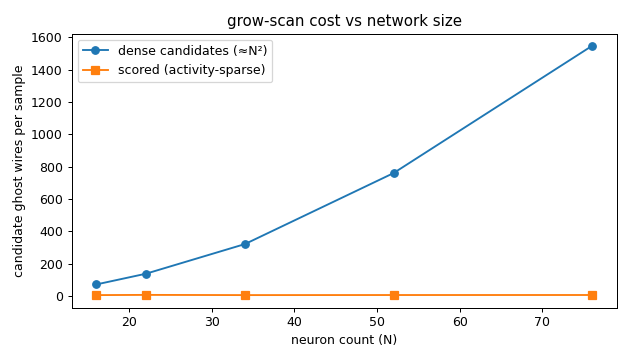
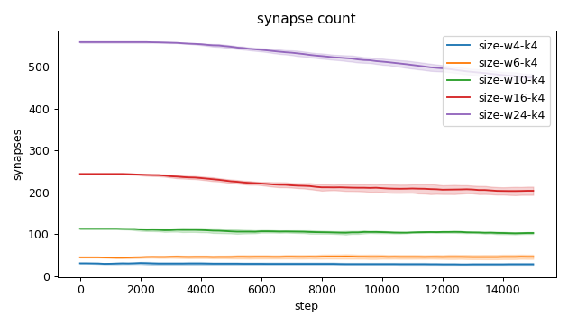
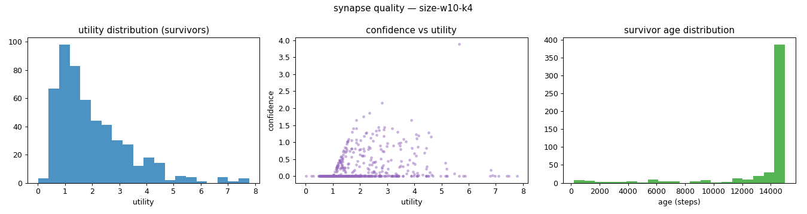
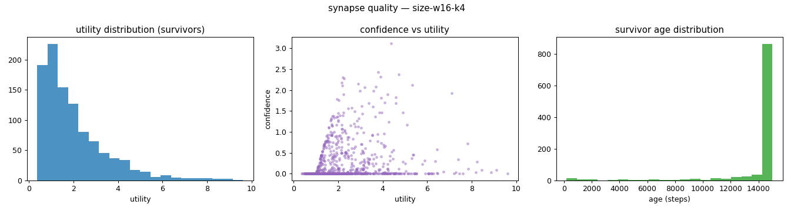
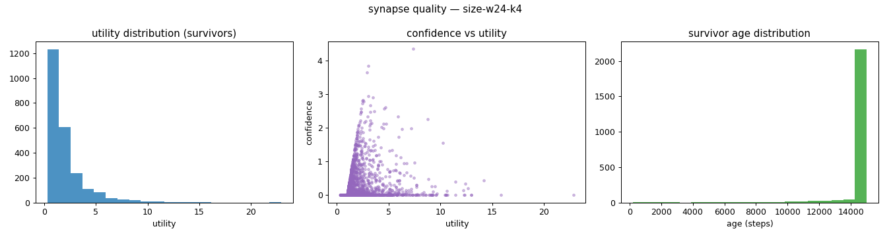
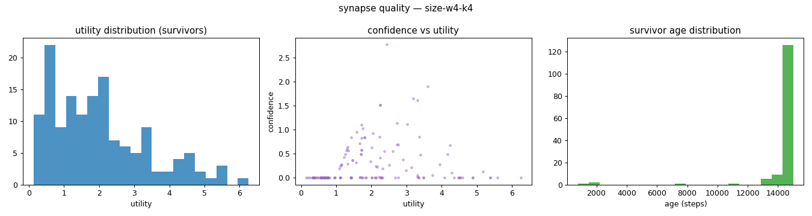
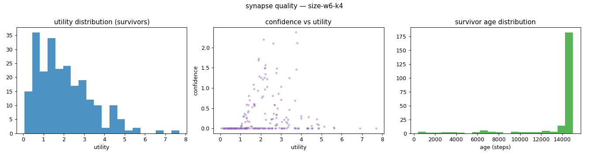
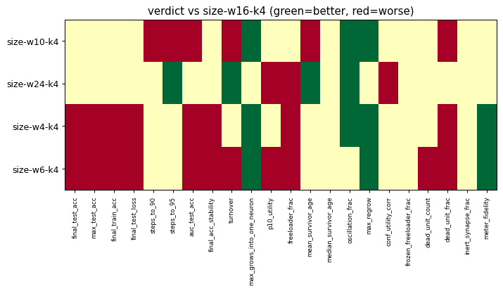

# Evaluation run: grow-scan-demand-gating

- **Date:** 2026-06-01 22:50:17
- **Variants:** size-w10-k4, size-w16-k4, size-w24-k4, size-w4-k4, size-w6-k4  (baseline: size-w16-k4)
- **Seeds:** 5  |  **Dataset:** spirals  |  **Steps:** 15000 (+0 shift)
- **Commit:** c976a06
- **Command:** `python evaluate.py --variants size-w4-k4,size-w6-k4,size-w10-k4,size-w16-k4,size-w24-k4 --baseline size-w16-k4 --seeds 5 --dataset spirals --steps 15000 --jobs 6 --no-cache --publish --run-name grow-scan-demand-gating`

## Key metrics

| Metric | What it means | size-w10-k4 | size-w16-k4 (baseline) | size-w24-k4 | size-w4-k4 | size-w6-k4 |
|---|---|---|---|---|---|---|
| final_test_acc ↑ | held-out accuracy at the end of the run | 0.984 ± 0.014 ≈ | 0.993 ± 0.007 | 0.996 ± 0.003 ≈ | 0.829 ± 0.100 ▼ | 0.895 ± 0.097 ▼ |
| steps_to_90 ↓ | steps to first reach 90% test accuracy | 3761 ± 427.083 ▼ | 2001 ± 669.328 | 1401 ± 334.664 ≈ | ∞ ± — ? | ∞ ± — ? |
| steps_to_95 ↓ | steps to first reach 95% test accuracy | 4281 ± 348.712 ▼ | 2521 ± 754.718 | 1761 ± 344.093 ▲ | ∞ ± — ? | ∞ ± — ? |
| auc_test_acc ↑ | area under the test-accuracy curve (speed + level) | 0.898 ± 0.013 ▼ | 0.944 ± 0.018 | 0.958 ± 0.008 ≈ | 0.730 ± 0.091 ▼ | 0.801 ± 0.032 ▼ |
| synapse_count_end | live synapses at the end | 103.200 ± 2.315 ≈ | 204 ± 9.737 | 474 ± 8.967 ≈ | 29 ± 3.162 ≈ | 46.800 ± 4.956 ≈ |
| effective_density | live edges as a fraction of fully-connected | 0.430 ± 0.010 ≈ | 0.354 ± 0.017 | 0.380 ± 0.007 ≈ | 0.604 ± 0.066 ≈ | 0.487 ± 0.052 ≈ |
| ghost_dense_cost | candidate ghost wires the grow-scan must consider (~N²) | 320.800 ± 2.315 ≈ | 760 ± 9.737 | 1546 ± 8.967 ≈ | 71 ± 3.162 ≈ | 137.200 ± 4.956 ≈ |
| ghost_pairs_scored | candidate wires actually scored after activity+demand pruning | 4.995 ± 1.555 ≈ | 5.413 ± 3.269 | 5.566 ± 0.724 ≈ | 4.976 ± 1.998 ≈ | 6.208 ± 2.164 ≈ |
| mean_neuron_activation | avg hidden-neuron ReLU output on test data (neuron value) | 0.437 ± 0.099 ≈ | 0.389 ± 0.039 | 0.353 ± 0.043 ≈ | 0.310 ± 0.216 ≈ | 0.396 ± 0.219 ≈ |
| dead_unit_frac ↓ | fraction of hidden neurons that never fire (scale-free) | 0.160 ± 0.074 ▼ | 0.062 ± 0.029 | 0.050 ± 0.021 ≈ | 0.383 ± 0.187 ▼ | 0.311 ± 0.114 ▼ |
| max_grows_into_one_neuron ↓ | most times one neuron was grown into (churn) | 9 ± 1.265 ▲ | 13.400 ± 2.498 | 15.400 ± 2.498 ≈ | 4.200 ± 1.166 ▲ | 5.800 ± 1.600 ▲ |
| oscillation_frac ↓ | fraction of grown edges grown ≥2× (thrash) | 0.036 ± 0.018 ▲ | 0.139 ± 0.040 | 0.080 ± 0.036 ▲ | 0.015 ± 0.031 ▲ | 0.090 ± 0.081 ≈ |
| freeloader_frac ↓ | fraction of synapses below the prune-utility floor | 0.010 ± 0.011 ≈ | 0.004 ± 0.003 | 0.045 ± 0.010 ▼ | 0.092 ± 0.069 ▼ | 0.093 ± 0.033 ▼ |
| conf_utility_corr ↑ | corr of confidence with real utility (calibration) | 0.237 ± 0.132 ≈ | 0.240 ± 0.027 | 0.171 ± 0.058 ▼ | 0.169 ± 0.105 ≈ | 0.166 ± 0.082 ≈ |
| dead_unit_count ↓ | hidden neurons that never fire on test data | 4.800 ± 2.227 ≈ | 3 ± 1.414 | 3.600 ± 1.497 ≈ | 4.600 ± 2.245 ≈ | 5.600 ± 2.059 ▼ |

## Full scorecard

| Metric | size-w10-k4 | size-w16-k4 (baseline) | size-w24-k4 | size-w4-k4 | size-w6-k4 |
|---|---|---|---|---|---|
| **Prediction performance** | | | | | |
| final_test_acc ↑ | 0.984 ± 0.014 ≈ | 0.993 ± 0.007 | 0.996 ± 0.003 ≈ | 0.829 ± 0.100 ▼ | 0.895 ± 0.097 ▼ |
| max_test_acc ↑ | 0.997 ± 0.002 ≈ | 0.998 ± 0.002 | 0.998 ± 0.002 ≈ | 0.853 ± 0.106 ▼ | 0.954 ± 0.051 ▼ |
| final_train_acc ↑ | 0.982 ± 0.022 ≈ | 0.995 ± 0.008 | 0.998 ± 0.004 ≈ | 0.824 ± 0.099 ▼ | 0.893 ± 0.105 ▼ |
| final_test_loss ↓ | 0.047 ± 0.030 ≈ | 0.023 ± 0.024 | 0.015 ± 0.010 ≈ | 0.354 ± 0.170 ▼ | 0.310 ± 0.245 ▼ |
| **Training efficacy** | | | | | |
| steps_to_90 ↓ | 3761 ± 427.083 ▼ | 2001 ± 669.328 | 1401 ± 334.664 ≈ | ∞ ± — ? | ∞ ± — ? |
| steps_to_95 ↓ | 4281 ± 348.712 ▼ | 2521 ± 754.718 | 1761 ± 344.093 ▲ | ∞ ± — ? | ∞ ± — ? |
| auc_test_acc ↑ | 0.898 ± 0.013 ▼ | 0.944 ± 0.018 | 0.958 ± 0.008 ≈ | 0.730 ± 0.091 ▼ | 0.801 ± 0.032 ▼ |
| final_acc_stability ↓ | 0.009 ± 0.002 ≈ | 0.005 ± 0.005 | 0.002 ± 0.001 ≈ | 0.027 ± 0.016 ▼ | 0.030 ± 0.025 ▼ |
| **Synapse structure** | | | | | |
| synapse_count_start | 113.400 ± 1.200 ≈ | 244 ± 0.894 | 558.400 ± 1.744 ≈ | 31.400 ± 0.490 ≈ | 45.600 ± 0.490 ≈ |
| synapse_count_peak | 114.200 ± 2.040 ≈ | 244 ± 0.894 | 558.400 ± 1.744 ≈ | 33.200 ± 1.600 ≈ | 50.800 ± 2.993 ≈ |
| synapse_count_end | 103.200 ± 2.315 ≈ | 204 ± 9.737 | 474 ± 8.967 ≈ | 29 ± 3.162 ≈ | 46.800 ± 4.956 ≈ |
| n_grow_events | 43.800 ± 7.414 ≈ | 59 ± 6.986 | 65.600 ± 10.307 ≈ | 11 ± 2.966 ≈ | 23.200 ± 4.354 ≈ |
| n_prune_events | 52 ± 5.831 ≈ | 97 ± 6.293 | 148 ± 0 ≈ | 11.400 ± 1.855 ≈ | 20 ± 3.162 ≈ |
| distinct_neurons_grown | 10 ± 2.280 ≈ | 11.400 ± 1.200 | 11 ± 2.098 ≈ | 3.800 ± 1.720 ≈ | 6.800 ± 1.720 ≈ |
| turnover ↓ | 0.895 ± 0.128 ▼ | 0.707 ± 0.037 | 0.406 ± 0.016 ▲ | 0.750 ± 0.111 ≈ | 0.927 ± 0.079 ▼ |
| max_grows_into_one_neuron ↓ | 9 ± 1.265 ▲ | 13.400 ± 2.498 | 15.400 ± 2.498 ≈ | 4.200 ± 1.166 ▲ | 5.800 ± 1.600 ▲ |
| mean_fan_in | 3.225 ± 0.072 ≈ | 4.080 ± 0.195 | 6.405 ± 0.121 ≈ | 2.071 ± 0.226 ≈ | 2.340 ± 0.248 ≈ |
| mean_fan_out | 3.225 ± 0.072 ≈ | 4.080 ± 0.195 | 6.405 ± 0.121 ≈ | 2.071 ± 0.226 ≈ | 2.340 ± 0.248 ≈ |
| effective_density | 0.430 ± 0.010 ≈ | 0.354 ± 0.017 | 0.380 ± 0.007 ≈ | 0.604 ± 0.066 ≈ | 0.487 ± 0.052 ≈ |
| **Synapse quality** | | | | | |
| p10_utility ↑ | 0.724 ± 0.080 ≈ | 0.679 ± 0.026 | 0.600 ± 0.025 ▼ | 0.615 ± 0.205 ≈ | 0.510 ± 0.121 ▼ |
| freeloader_frac ↓ | 0.010 ± 0.011 ≈ | 0.004 ± 0.003 | 0.045 ± 0.010 ▼ | 0.092 ± 0.069 ▼ | 0.093 ± 0.033 ▼ |
| mean_survivor_age ↑ | 13640 ± 463.595 ▼ | 14249 ± 107.661 | 14614 ± 124.167 ▲ | 14503 ± 487.607 ≈ | 13771 ± 670.245 ≈ |
| median_survivor_age ↑ | 15000 ± 0 ≈ | 15000 ± 0 | 15000 ± 0 ≈ | 15000 ± 0 ≈ | 15000 ± 0 ≈ |
| mean_pruned_lifespan | 3883 ± 323.972 ≈ | 4178 ± 408.914 | 6543 ± 293.463 ≈ | 2694 ± 1232 ≈ | 2691 ± 709.462 ≈ |
| oscillation_frac ↓ | 0.036 ± 0.018 ▲ | 0.139 ± 0.040 | 0.080 ± 0.036 ▲ | 0.015 ± 0.031 ▲ | 0.090 ± 0.081 ≈ |
| max_regrow ↓ | 1.600 ± 1.020 ▲ | 3.400 ± 0.490 | 2.800 ± 0.748 ≈ | 0.200 ± 0.400 ▲ | 1.200 ± 0.748 ▲ |
| conf_utility_corr ↑ | 0.237 ± 0.132 ≈ | 0.240 ± 0.027 | 0.171 ± 0.058 ▼ | 0.169 ± 0.105 ≈ | 0.166 ± 0.082 ≈ |
| frozen_freeloader_frac ↓ | 0 ± 0 ≈ | 0 ± 0 | 0 ± 0 ≈ | 0 ± 0 ≈ | 0 ± 0 ≈ |
| dead_unit_count ↓ | 4.800 ± 2.227 ≈ | 3 ± 1.414 | 3.600 ± 1.497 ≈ | 4.600 ± 2.245 ≈ | 5.600 ± 2.059 ▼ |
| dead_unit_frac ↓ | 0.160 ± 0.074 ▼ | 0.062 ± 0.029 | 0.050 ± 0.021 ≈ | 0.383 ± 0.187 ▼ | 0.311 ± 0.114 ▼ |
| mean_neuron_activation | 0.437 ± 0.099 ≈ | 0.389 ± 0.039 | 0.353 ± 0.043 ≈ | 0.310 ± 0.216 ≈ | 0.396 ± 0.219 ≈ |
| inert_synapse_frac ↓ | 0 ± 0 ≈ | 0 ± 0 | 0 ± 0 ≈ | 0 ± 0 ≈ | 0 ± 0 ≈ |
| used_vs_allocated | 0.927 ± 0.024 ≈ | 0.843 ± 0.039 | 0.852 ± 0.018 ≈ | 0.987 ± 0.110 ≈ | 1.075 ± 0.123 ≈ |
| **Compute cost** | | | | | |
| ghost_dense_cost | 320.800 ± 2.315 ≈ | 760 ± 9.737 | 1546 ± 8.967 ≈ | 71 ± 3.162 ≈ | 137.200 ± 4.956 ≈ |
| ghost_pairs_scored | 4.995 ± 1.555 ≈ | 5.413 ± 3.269 | 5.566 ± 0.724 ≈ | 4.976 ± 1.998 ≈ | 6.208 ± 2.164 ≈ |
| **Signal sanity** | | | | | |
| meter_fidelity ↑ | 0.791 ± 0.143 ≈ | 0.765 ± 0.110 | 0.767 ± 0.084 ≈ | 0.975 ± 0.025 ▲ | 0.907 ± 0.083 ▲ |

Baseline: **size-w16-k4**. ▲ better / ▼ worse / ≈ no clear difference vs baseline (95% bootstrap CI of the mean difference). Cells show mean ± std across seeds.

## Charts

### acc_curves

### churn_curves

### cost_scaling

### count_curves

### quality_size-w10-k4

### quality_size-w16-k4

### quality_size-w24-k4

### quality_size-w4-k4

### quality_size-w6-k4

### verdict_heatmap

