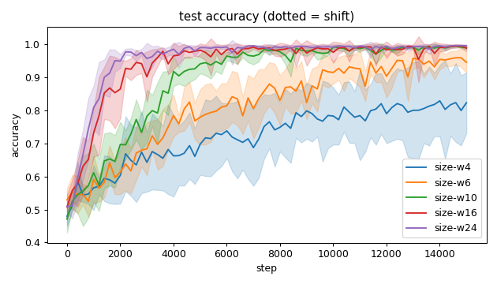
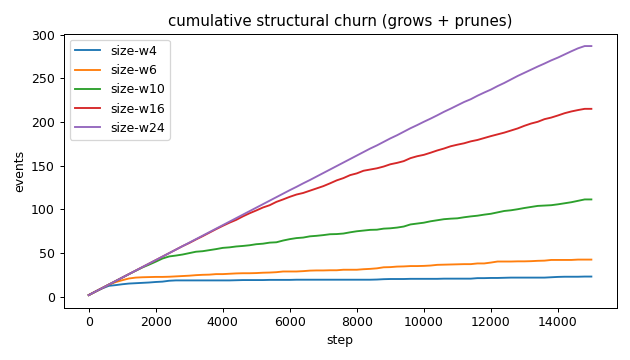
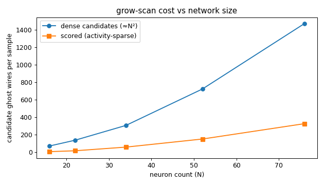
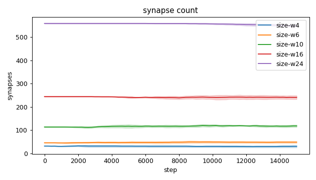
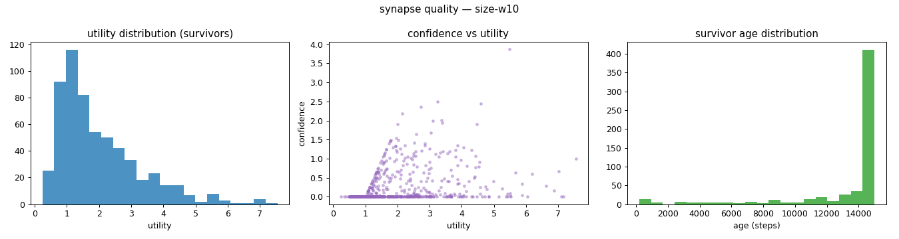
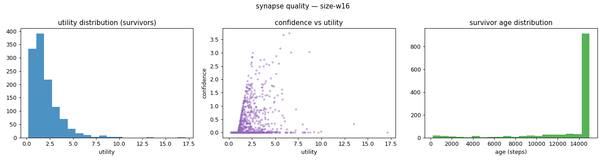
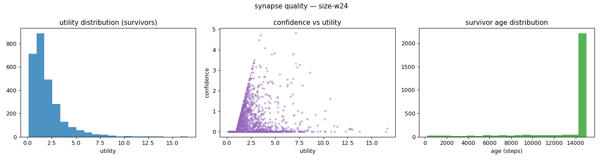
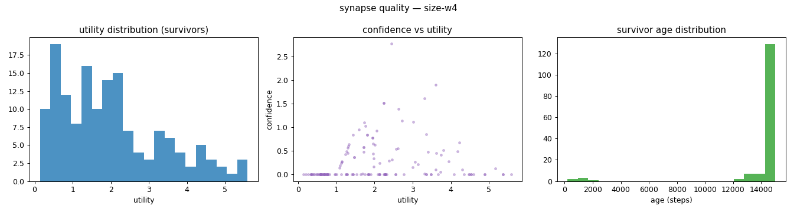
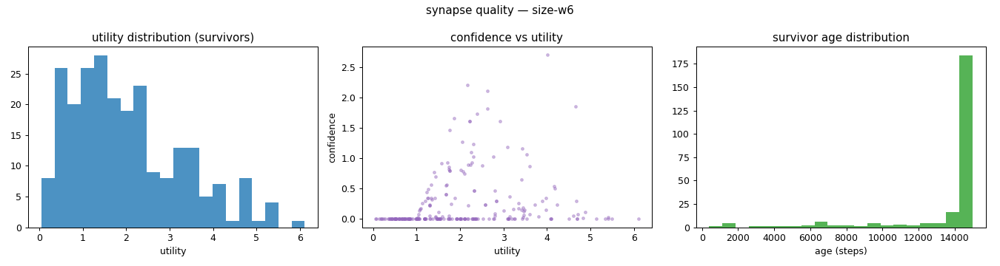
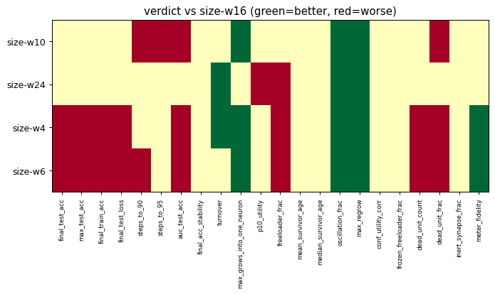

# Evaluation run: grow-scan-scaling

- **Date:** 2026-06-01 22:45:20
- **Variants:** size-w10, size-w16, size-w24, size-w4, size-w6  (baseline: size-w16)
- **Seeds:** 5  |  **Dataset:** spirals  |  **Steps:** 15000 (+0 shift)
- **Commit:** b846e87
- **Command:** `python evaluate.py --variants size-w4,size-w6,size-w10,size-w16,size-w24 --baseline size-w16 --seeds 5 --dataset spirals --steps 15000 --jobs 6 --no-cache --publish --run-name grow-scan-scaling`

## Key metrics

| Metric | What it means | size-w10 | size-w16 (baseline) | size-w24 | size-w4 | size-w6 |
|---|---|---|---|---|---|---|
| final_test_acc ↑ | held-out accuracy at the end of the run | 0.990 ± 0.006 ≈ | 0.989 ± 0.010 | 0.996 ± 0.002 ≈ | 0.823 ± 0.092 ▼ | 0.946 ± 0.031 ▼ |
| steps_to_90 ↓ | steps to first reach 90% test accuracy | 3721 ± 448.999 ▼ | 1801 ± 606.630 | 1361 ± 265.330 ≈ | ∞ ± — ? | 8161 ± 2330 ▼ |
| steps_to_95 ↓ | steps to first reach 95% test accuracy | 4601 ± 593.296 ▼ | 2481 ± 785.875 | 1761 ± 344.093 ≈ | ∞ ± — ? | ∞ ± — ? |
| auc_test_acc ↑ | area under the test-accuracy curve (speed + level) | 0.897 ± 0.010 ▼ | 0.943 ± 0.018 | 0.959 ± 0.007 ≈ | 0.724 ± 0.083 ▼ | 0.814 ± 0.033 ▼ |
| synapse_count_end | live synapses at the end | 118 ± 5.060 ≈ | 240.600 ± 8.015 | 547.200 ± 6.853 ≈ | 30.200 ± 5.036 ≈ | 48.200 ± 4.261 ≈ |
| effective_density | live edges as a fraction of fully-connected | 0.492 ± 0.021 ≈ | 0.418 ± 0.014 | 0.438 ± 0.005 ≈ | 0.629 ± 0.105 ≈ | 0.502 ± 0.044 ≈ |
| ghost_dense_cost | candidate ghost wires the grow-scan must consider (~N²) | 306 ± 5.060 ≈ | 723.400 ± 8.015 | 1473 ± 6.853 ≈ | 69.800 ± 5.036 ≈ | 135.800 ± 4.261 ≈ |
| ghost_pairs_scored | candidate wires actually scored after activity+demand pruning | 57.128 ± 25.076 ≈ | 149.784 ± 16.920 | 325.765 ± 31.388 ≈ | 5.054 ± 1.829 ≈ | 15.082 ± 10.892 ≈ |
| mean_neuron_activation | avg hidden-neuron ReLU output on test data (neuron value) | 0.429 ± 0.123 ≈ | 0.363 ± 0.020 | 0.330 ± 0.030 ≈ | 0.282 ± 0.180 ≈ | 0.370 ± 0.176 ≈ |
| dead_unit_frac ↓ | fraction of hidden neurons that never fire (scale-free) | 0.140 ± 0.080 ▼ | 0.063 ± 0.029 | 0.050 ± 0.017 ≈ | 0.433 ± 0.122 ▼ | 0.311 ± 0.114 ▼ |
| max_grows_into_one_neuron ↓ | most times one neuron was grown into (churn) | 11.200 ± 1.720 ▲ | 16.600 ± 5.238 | 17.800 ± 2.400 ≈ | 4.600 ± 1.020 ▲ | 6.400 ± 1.200 ▲ |
| oscillation_frac ↓ | fraction of grown edges grown ≥2× (thrash) | 0.079 ± 0.031 ▲ | 0.142 ± 0.031 | 0.058 ± 0.024 ▲ | 0.011 ± 0.022 ▲ | 0.056 ± 0.068 ▲ |
| freeloader_frac ↓ | fraction of synapses below the prune-utility floor | 0.008 ± 0.009 ≈ | 0.011 ± 0.017 | 0.046 ± 0.015 ▼ | 0.091 ± 0.070 ▼ | 0.078 ± 0.049 ▼ |
| conf_utility_corr ↑ | corr of confidence with real utility (calibration) | 0.293 ± 0.084 ≈ | 0.303 ± 0.056 | 0.237 ± 0.076 ≈ | 0.194 ± 0.125 ≈ | 0.205 ± 0.101 ≈ |
| dead_unit_count ↓ | hidden neurons that never fire on test data | 4.200 ± 2.400 ≈ | 3 ± 1.414 | 3.600 ± 1.200 ≈ | 5.200 ± 1.470 ▼ | 5.600 ± 2.059 ▼ |

## Full scorecard

| Metric | size-w10 | size-w16 (baseline) | size-w24 | size-w4 | size-w6 |
|---|---|---|---|---|---|
| **Prediction performance** | | | | | |
| final_test_acc ↑ | 0.990 ± 0.006 ≈ | 0.989 ± 0.010 | 0.996 ± 0.002 ≈ | 0.823 ± 0.092 ▼ | 0.946 ± 0.031 ▼ |
| max_test_acc ↑ | 0.997 ± 0.002 ≈ | 0.997 ± 0.003 | 0.998 ± 0.002 ≈ | 0.848 ± 0.100 ▼ | 0.971 ± 0.022 ▼ |
| final_train_acc ↑ | 0.991 ± 0.011 ≈ | 0.991 ± 0.011 | 0.997 ± 0.004 ≈ | 0.821 ± 0.094 ▼ | 0.947 ± 0.032 ▼ |
| final_test_loss ↓ | 0.029 ± 0.014 ≈ | 0.033 ± 0.030 | 0.012 ± 0.006 ≈ | 0.369 ± 0.149 ▼ | 0.238 ± 0.133 ▼ |
| **Training efficacy** | | | | | |
| steps_to_90 ↓ | 3721 ± 448.999 ▼ | 1801 ± 606.630 | 1361 ± 265.330 ≈ | ∞ ± — ? | 8161 ± 2330 ▼ |
| steps_to_95 ↓ | 4601 ± 593.296 ▼ | 2481 ± 785.875 | 1761 ± 344.093 ≈ | ∞ ± — ? | ∞ ± — ? |
| auc_test_acc ↑ | 0.897 ± 0.010 ▼ | 0.943 ± 0.018 | 0.959 ± 0.007 ≈ | 0.724 ± 0.083 ▼ | 0.814 ± 0.033 ▼ |
| final_acc_stability ↓ | 0.006 ± 0.004 ≈ | 0.018 ± 0.020 | 0.005 ± 0.004 ≈ | 0.028 ± 0.015 ≈ | 0.021 ± 0.012 ≈ |
| **Synapse structure** | | | | | |
| synapse_count_start | 113.400 ± 1.200 ≈ | 244 ± 0.894 | 558.400 ± 1.744 ≈ | 31.400 ± 0.490 ≈ | 45.600 ± 0.490 ≈ |
| synapse_count_peak | 123.400 ± 2.800 ≈ | 247.800 ± 4.167 | 558.400 ± 1.744 ≈ | 34 ± 2.828 ≈ | 51.200 ± 3.868 ≈ |
| synapse_count_end | 118 ± 5.060 ≈ | 240.600 ± 8.015 | 547.200 ± 6.853 ≈ | 30.200 ± 5.036 ≈ | 48.200 ± 4.261 ≈ |
| n_grow_events | 59 ± 10.139 ≈ | 106.800 ± 9.847 | 138.800 ± 7.782 ≈ | 12 ± 4.336 ≈ | 23.600 ± 5.571 ≈ |
| n_prune_events | 52.400 ± 4.841 ≈ | 108.200 ± 7.909 | 148 ± 0 ≈ | 11.200 ± 2.040 ≈ | 19 ± 3.347 ≈ |
| distinct_neurons_grown | 11.800 ± 1.327 ≈ | 16.600 ± 3.007 | 22.200 ± 0.748 ≈ | 3.600 ± 1.356 ≈ | 6.400 ± 1.744 ≈ |
| turnover ↓ | 0.958 ± 0.134 ≈ | 0.889 ± 0.063 | 0.516 ± 0.013 ▲ | 0.760 ± 0.110 ▲ | 0.895 ± 0.127 ≈ |
| max_grows_into_one_neuron ↓ | 11.200 ± 1.720 ▲ | 16.600 ± 5.238 | 17.800 ± 2.400 ≈ | 4.600 ± 1.020 ▲ | 6.400 ± 1.200 ▲ |
| mean_fan_in | 3.688 ± 0.158 ≈ | 4.812 ± 0.160 | 7.395 ± 0.093 ≈ | 2.157 ± 0.360 ≈ | 2.410 ± 0.213 ≈ |
| mean_fan_out | 3.688 ± 0.158 ≈ | 4.812 ± 0.160 | 7.395 ± 0.093 ≈ | 2.157 ± 0.360 ≈ | 2.410 ± 0.213 ≈ |
| effective_density | 0.492 ± 0.021 ≈ | 0.418 ± 0.014 | 0.438 ± 0.005 ≈ | 0.629 ± 0.105 ≈ | 0.502 ± 0.044 ≈ |
| **Synapse quality** | | | | | |
| p10_utility ↑ | 0.733 ± 0.043 ≈ | 0.711 ± 0.059 | 0.617 ± 0.040 ▼ | 0.607 ± 0.192 ≈ | 0.596 ± 0.224 ≈ |
| freeloader_frac ↓ | 0.008 ± 0.009 ≈ | 0.011 ± 0.017 | 0.046 ± 0.015 ▼ | 0.091 ± 0.070 ▼ | 0.078 ± 0.049 ▼ |
| mean_survivor_age ↑ | 13324 ± 550.586 ≈ | 13560 ± 214.305 | 13673 ± 102.515 ≈ | 14340 ± 781.729 ≈ | 13758 ± 613.913 ≈ |
| median_survivor_age ↑ | 15000 ± 0 ≈ | 15000 ± 0 | 15000 ± 0 ≈ | 15000 ± 0 ≈ | 15000 ± 0 ≈ |
| mean_pruned_lifespan | 3414 ± 583.293 ≈ | 3348 ± 358.192 | 5843 ± 285.015 ≈ | 2628 ± 1120 ≈ | 2483 ± 865.462 ≈ |
| oscillation_frac ↓ | 0.079 ± 0.031 ▲ | 0.142 ± 0.031 | 0.058 ± 0.024 ▲ | 0.011 ± 0.022 ▲ | 0.056 ± 0.068 ▲ |
| max_regrow ↓ | 1.600 ± 0.800 ▲ | 3.400 ± 0.490 | 2.200 ± 0.400 ▲ | 0.200 ± 0.400 ▲ | 0.800 ± 1.166 ▲ |
| conf_utility_corr ↑ | 0.293 ± 0.084 ≈ | 0.303 ± 0.056 | 0.237 ± 0.076 ≈ | 0.194 ± 0.125 ≈ | 0.205 ± 0.101 ≈ |
| frozen_freeloader_frac ↓ | 0 ± 0 ≈ | 0 ± 0 | 0 ± 0 ≈ | 0 ± 0 ≈ | 0 ± 0 ≈ |
| dead_unit_count ↓ | 4.200 ± 2.400 ≈ | 3 ± 1.414 | 3.600 ± 1.200 ≈ | 5.200 ± 1.470 ▼ | 5.600 ± 2.059 ▼ |
| dead_unit_frac ↓ | 0.140 ± 0.080 ▼ | 0.063 ± 0.029 | 0.050 ± 0.017 ≈ | 0.433 ± 0.122 ▼ | 0.311 ± 0.114 ▼ |
| mean_neuron_activation | 0.429 ± 0.123 ≈ | 0.363 ± 0.020 | 0.330 ± 0.030 ≈ | 0.282 ± 0.180 ≈ | 0.370 ± 0.176 ≈ |
| inert_synapse_frac ↓ | 0 ± 0 ≈ | 0 ± 0 | 0 ± 0 ≈ | 0 ± 0 ≈ | 0 ± 0 ≈ |
| used_vs_allocated | 1.060 ± 0.054 ≈ | 0.994 ± 0.031 | 0.983 ± 0.014 ≈ | 1.028 ± 0.177 ≈ | 1.106 ± 0.107 ≈ |
| **Compute cost** | | | | | |
| ghost_dense_cost | 306 ± 5.060 ≈ | 723.400 ± 8.015 | 1473 ± 6.853 ≈ | 69.800 ± 5.036 ≈ | 135.800 ± 4.261 ≈ |
| ghost_pairs_scored | 57.128 ± 25.076 ≈ | 149.784 ± 16.920 | 325.765 ± 31.388 ≈ | 5.054 ± 1.829 ≈ | 15.082 ± 10.892 ≈ |
| **Signal sanity** | | | | | |
| meter_fidelity ↑ | 0.791 ± 0.046 ≈ | 0.648 ± 0.222 | 0.747 ± 0.081 ≈ | 0.975 ± 0.023 ▲ | 0.904 ± 0.087 ▲ |

Baseline: **size-w16**. ▲ better / ▼ worse / ≈ no clear difference vs baseline (95% bootstrap CI of the mean difference). Cells show mean ± std across seeds.

## Charts

### acc_curves

### churn_curves

### cost_scaling

### count_curves

### quality_size-w10

### quality_size-w16

### quality_size-w24

### quality_size-w4

### quality_size-w6

### verdict_heatmap

