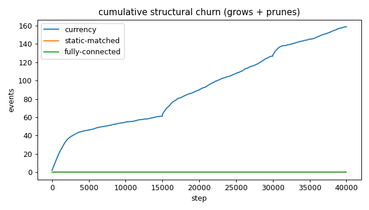
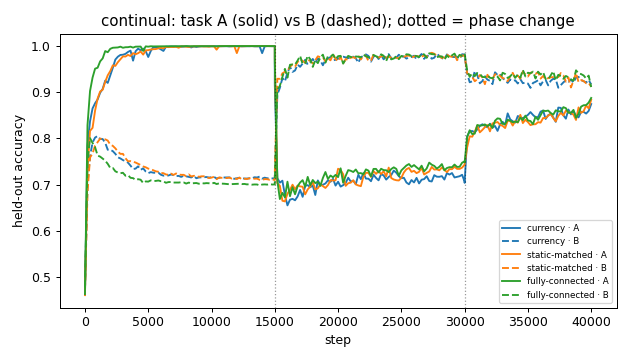
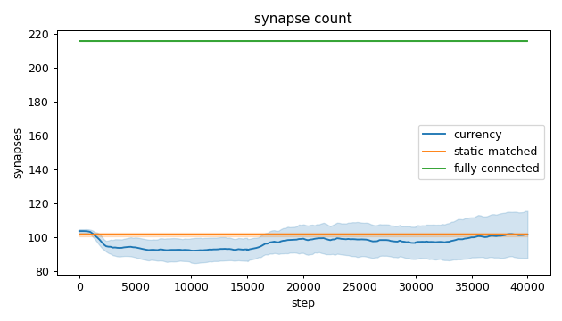
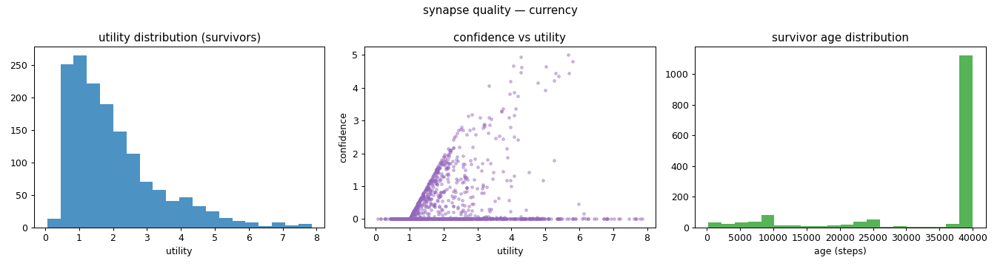
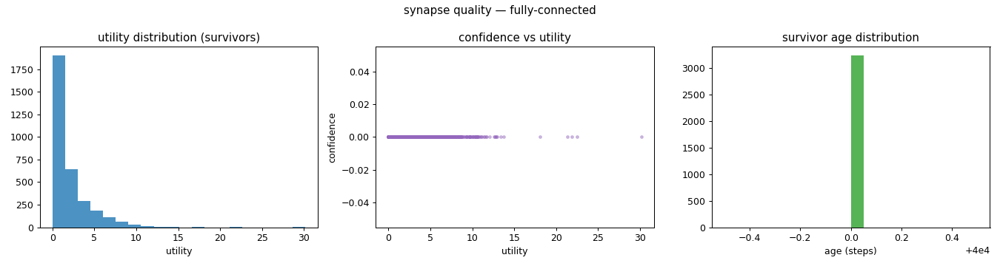
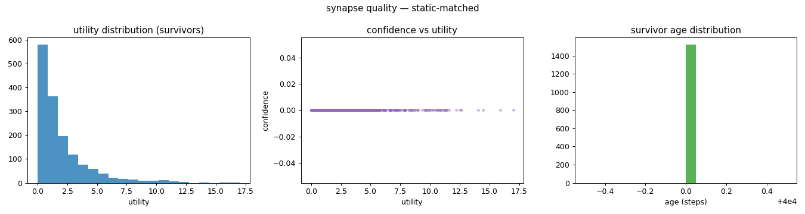
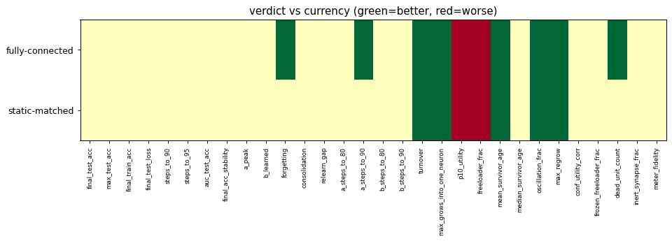

# Evaluation run: matched-synapse-count-secondtask

- **Date:** 2026-06-01 09:16:31
- **Variants:** currency, fully-connected, static-matched  (baseline: currency)
- **Seeds:** 15  |  **Dataset:** spirals  |  **Steps:** 30000 (+0 shift)
- **Commit:** af74331
- **Command:** `python evaluate.py --variants currency,static-matched,fully-connected --seeds 15 --dataset spirals --regime continual --baseline currency --jobs 10 --no-cache --publish --run-name matched-synapse-count-secondtask`

## Key metrics

| Metric | What it means | currency (baseline) | fully-connected | static-matched |
|---|---|---|---|---|
| final_test_acc ↑ | held-out accuracy at the end of the run | 0.895 ± 0.011 | 0.899 ± 0.029 ≈ | 0.898 ± 0.021 ≈ |
| steps_to_90 ↓ | steps to first reach 90% test accuracy | ∞ ± — | ∞ ± — ? | ∞ ± — ? |
| steps_to_95 ↓ | steps to first reach 95% test accuracy | ∞ ± — | ∞ ± — ? | ∞ ± — ? |
| auc_test_acc ↑ | area under the test-accuracy curve (speed + level) | 0.854 ± 0.013 | 0.859 ± 0.007 ≈ | 0.857 ± 0.014 ≈ |
| a_peak ↑ | accuracy on task A at the end of phase A (its peak) | 0.999 ± 0.002 | 0.999 ± 0.001 ≈ | 0.999 ± 0.001 ≈ |
| a_steps_to_90 ↓ | steps into phase A to reach 90% on task A (first-task speed) | 1360 ± 678.036 | 533.333 ± 202.210 ▲ | 1507 ± 1119 ≈ |
| b_learned ↑ | accuracy on task B at the end of phase B (forward learning) | 0.981 ± 0.011 | 0.983 ± 0.006 ≈ | 0.978 ± 0.011 ≈ |
| b_steps_to_90 ↓ | steps into phase B to reach 90% on task B (second-task speed) | 413.333 ± 305.214 | 306.667 ± 143.604 ≈ | 360 ± 401.331 ≈ |
| forgetting ↓ | task A accuracy lost while learning B (lower=better) | 0.293 ± 0.089 | 0.249 ± 0.024 ▲ | 0.256 ± 0.044 ≈ |
| consolidation ↑ | min(A, B) accuracy after interleaved A+B (holds both?) | 0.862 ± 0.028 | 0.868 ± 0.036 ≈ | 0.868 ± 0.022 ≈ |
| synapse_count_end | live synapses at the end | 101.467 ± 13.952 | 216 ± 0 ≈ | 101.533 ± 1.024 ≈ |
| effective_density | live edges as a fraction of fully-connected | 0.470 ± 0.065 | 1 ± 0 ≈ | 0.470 ± 0.005 ≈ |
| max_grows_into_one_neuron ↓ | most times one neuron was grown into (churn) | 13.733 ± 2.999 | 0 ± 0 ▲ | 0 ± 0 ▲ |
| oscillation_frac ↓ | fraction of grown edges grown ≥2× (thrash) | 0.201 ± 0.064 | 0 ± 0 ▲ | 0 ± 0 ▲ |
| freeloader_frac ↓ | fraction of synapses below the prune-utility floor | 0.011 ± 0.013 | 0.239 ± 0.036 ▼ | 0.221 ± 0.056 ▼ |
| conf_utility_corr ↑ | corr of confidence with real utility (calibration) | 0.225 ± 0.092 | — ± — ? | — ± — ? |
| dead_unit_count ↓ | hidden neurons that never fire on test data | 4 ± 2.449 | 1.267 ± 1.526 ▲ | 2.533 ± 1.258 ≈ |

## Full scorecard

| Metric | currency (baseline) | fully-connected | static-matched |
|---|---|---|---|
| **Prediction performance** | | | |
| final_test_acc ↑ | 0.895 ± 0.011 | 0.899 ± 0.029 ≈ | 0.898 ± 0.021 ≈ |
| max_test_acc ↑ | 0.907 ± 0.015 | 0.919 ± 0.020 ≈ | 0.912 ± 0.013 ≈ |
| final_train_acc ↑ | 0.899 ± 0.015 | 0.899 ± 0.029 ≈ | 0.899 ± 0.023 ≈ |
| final_test_loss ↓ | 0.213 ± 0.018 | 0.209 ± 0.043 ≈ | 0.211 ± 0.040 ≈ |
| **Training efficacy** | | | |
| steps_to_90 ↓ | ∞ ± — | ∞ ± — ? | ∞ ± — ? |
| steps_to_95 ↓ | ∞ ± — | ∞ ± — ? | ∞ ± — ? |
| auc_test_acc ↑ | 0.854 ± 0.013 | 0.859 ± 0.007 ≈ | 0.857 ± 0.014 ≈ |
| final_acc_stability ↓ | 0.010 ± 0.004 | 0.013 ± 0.006 ≈ | 0.013 ± 0.004 ≈ |
| **Continual learning** | | | |
| a_peak ↑ | 0.999 ± 0.002 | 0.999 ± 0.001 ≈ | 0.999 ± 0.001 ≈ |
| b_learned ↑ | 0.981 ± 0.011 | 0.983 ± 0.006 ≈ | 0.978 ± 0.011 ≈ |
| forgetting ↓ | 0.293 ± 0.089 | 0.249 ± 0.024 ▲ | 0.256 ± 0.044 ≈ |
| consolidation ↑ | 0.862 ± 0.028 | 0.868 ± 0.036 ≈ | 0.868 ± 0.022 ≈ |
| relearn_gap ↓ | 0.125 ± 0.043 | 0.112 ± 0.055 ≈ | 0.116 ± 0.037 ≈ |
| a_steps_to_80 ↓ | 400 ± 263.312 | 266.667 ± 94.281 ≈ | 466.667 ± 289.060 ≈ |
| a_steps_to_90 ↓ | 1360 ± 678.036 | 533.333 ± 202.210 ▲ | 1507 ± 1119 ≈ |
| b_steps_to_80 ↓ | 200 ± 0 | 200 ± 0 ≈ | 186.667 ± 49.889 ≈ |
| b_steps_to_90 ↓ | 413.333 ± 305.214 | 306.667 ± 143.604 ≈ | 360 ± 401.331 ≈ |
| **Synapse structure** | | | |
| synapse_count_start | 103.533 ± 1.024 | 216 ± 0 ≈ | 101.533 ± 1.024 ≈ |
| synapse_count_peak | 108.867 ± 7.051 | 216 ± 0 ≈ | 101.533 ± 1.024 ≈ |
| synapse_count_end | 101.467 ± 13.952 | 216 ± 0 ≈ | 101.533 ± 1.024 ≈ |
| n_grow_events | 79.333 ± 22.407 | 0 ± 0 ≈ | 0 ± 0 ≈ |
| n_prune_events | 79.400 ± 17.966 | 0 ± 0 ≈ | 0 ± 0 ≈ |
| distinct_neurons_grown | 13.133 ± 2.680 | 0 ± 0 ≈ | 0 ± 0 ≈ |
| turnover ↓ | 1.640 ± 0.356 | 0 ± 0 ▲ | 0 ± 0 ▲ |
| max_grows_into_one_neuron ↓ | 13.733 ± 2.999 | 0 ± 0 ▲ | 0 ± 0 ▲ |
| mean_fan_in | 3.382 ± 0.465 | 7.200 ± 0.000 ≈ | 3.384 ± 0.034 ≈ |
| mean_fan_out | 3.382 ± 0.465 | 7.200 ± 0.000 ≈ | 3.384 ± 0.034 ≈ |
| effective_density | 0.470 ± 0.065 | 1 ± 0 ≈ | 0.470 ± 0.005 ≈ |
| **Synapse quality** | | | |
| p10_utility ↑ | 0.720 ± 0.083 | 0.225 ± 0.038 ▼ | 0.251 ± 0.062 ▼ |
| freeloader_frac ↓ | 0.011 ± 0.013 | 0.239 ± 0.036 ▼ | 0.221 ± 0.056 ▼ |
| mean_survivor_age ↑ | 33566 ± 2164 | 40000 ± 0 ▲ | 40000 ± 0 ▲ |
| median_survivor_age ↑ | 40000 ± 0 | 40000 ± 0 ≈ | 40000 ± 0 ≈ |
| mean_pruned_lifespan | 6222 ± 977.508 | 0 ± 0 ≈ | 0 ± 0 ≈ |
| oscillation_frac ↓ | 0.201 ± 0.064 | 0 ± 0 ▲ | 0 ± 0 ▲ |
| max_regrow ↓ | 4.267 ± 1.611 | 0 ± 0 ▲ | 0 ± 0 ▲ |
| conf_utility_corr ↑ | 0.225 ± 0.092 | — ± — ? | — ± — ? |
| frozen_freeloader_frac ↓ | 0 ± 0 | 0 ± 0 ≈ | 0 ± 0 ≈ |
| dead_unit_count ↓ | 4 ± 2.449 | 1.267 ± 1.526 ▲ | 2.533 ± 1.258 ≈ |
| inert_synapse_frac ↓ | 0 ± 0 | 0 ± 0 ≈ | 0 ± 0 ≈ |
| used_vs_allocated | 0.999 ± 0.135 | 1 ± 0 ≈ | 1 ± 0 ≈ |
| **Signal sanity** | | | |
| meter_fidelity ↑ | 0.962 ± 0.041 | — ± — ? | — ± — ? |

Baseline: **currency**. ▲ better / ▼ worse / ≈ no clear difference vs baseline (95% bootstrap CI of the mean difference). Cells show mean ± std across seeds.

## Charts

### churn_curves

### continual_curves

### count_curves

### quality_currency

### quality_fully-connected

### quality_static-matched

### verdict_heatmap

