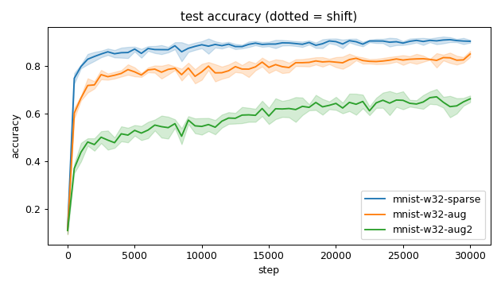
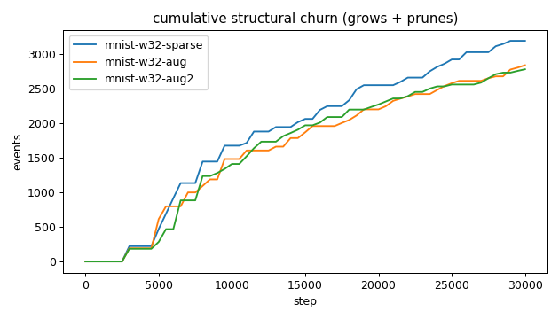
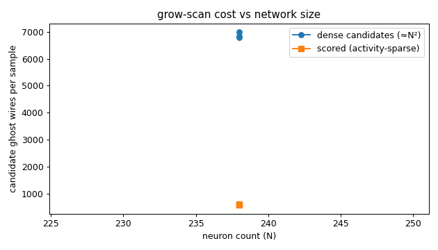
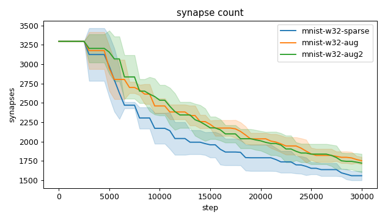
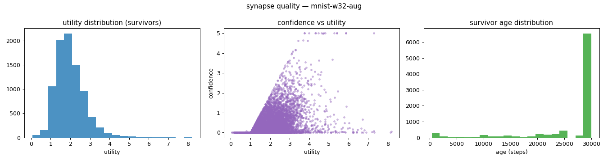
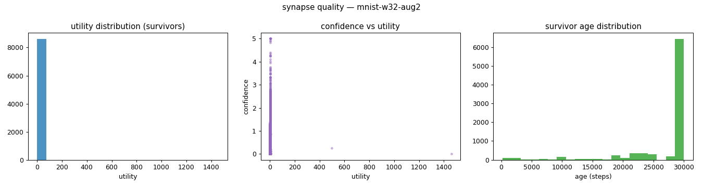
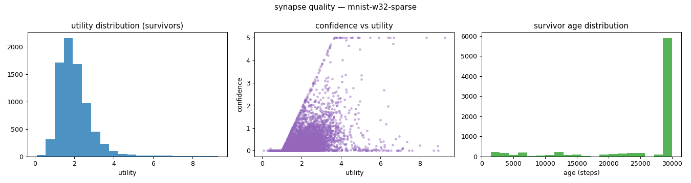
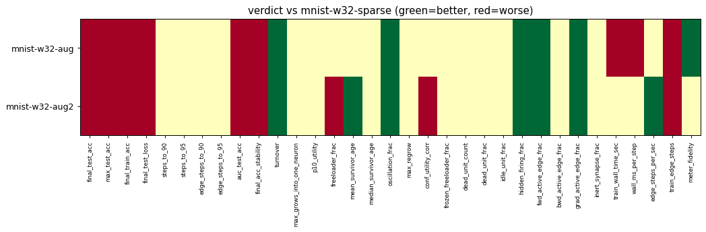

# Evaluation run: mnist-shift-augmentation

- **Date:** 2026-06-19 11:38:14
- **Variants:** mnist-w32-aug, mnist-w32-aug2, mnist-w32-sparse  (baseline: mnist-w32-sparse)
- **Seeds:** 5  |  **Dataset:** mnist  |  **Steps:** 30000 (+0 shift)
- **Commit:** 483a6b5
- **Command:** `python evaluate.py --variants mnist-w32-sparse,mnist-w32-aug,mnist-w32-aug2 --seeds 5 --dataset mnist --steps 30000 --points 12000 --train-eval-cap 2000 --record-every 500 --no-cache --baseline mnist-w32-sparse --jobs 8 --publish --run-name mnist-shift-augmentation`

## Key metrics

| Metric | What it means | mnist-w32-aug | mnist-w32-aug2 | mnist-w32-sparse (baseline) |
|---|---|---|---|---|
| final_test_acc ↑ | held-out accuracy at the end of the run | 0.850 ± 0.013 ▼ | 0.662 ± 0.014 ▼ | 0.903 ± 0.006 |
| steps_to_90 ↓ | steps to first reach 90% test accuracy | ∞ ± — ? | ∞ ± — ? | 14901 ± 5580 |
| steps_to_95 ↓ | steps to first reach 95% test accuracy | ∞ ± — ? | ∞ ± — ? | ∞ ± — |
| auc_test_acc ↑ | area under the test-accuracy curve (speed + level) | 0.788 ± 0.009 ▼ | 0.583 ± 0.010 ▼ | 0.876 ± 0.010 |
| edge_steps_to_90 ↓ | live-edge training work to first reach 90% test accuracy | ∞ ± — ? | ∞ ± — ? | 38086779 ± 11272425 |
| edge_steps_to_95 ↓ | live-edge training work to first reach 95% test accuracy | ∞ ± — ? | ∞ ± — ? | ∞ ± — |
| synapse_count_end | live synapses at the end | 1754 ± 48.164 ≈ | 1723 ± 118.987 ≈ | 1560 ± 59.831 |
| effective_density | live edges as a fraction of fully-connected | 0.266 ± 0.007 ≈ | 0.261 ± 0.018 ≈ | 0.237 ± 0.009 |
| avg_live_edges | time-average live edges during training | 2362 ± 73.046 ≈ | 2370 ± 134.079 ≈ | 2158 ± 103.528 |
| train_edge_steps ↓ | cumulative live-edge steps over training | 70859400 ± 2191454 ▼ | 71089240 ± 4022503 ▼ | 64738800 ± 3105950 |
| train_wall_time_sec ↓ | training-loop wall time only, excluding eval snapshots | 170.147 ± 4.861 ▼ | 160.050 ± 7.779 ≈ | 160.241 ± 7.700 |
| wall_ms_per_step ↓ | training-loop milliseconds per SGD step | 5.671 ± 0.162 ▼ | 5.335 ± 0.259 ≈ | 5.341 ± 0.257 |
| edge_steps_per_sec ↑ | live-edge steps processed per wall-clock second | 416813 ± 17733 ≈ | 443997 ± 4048 ▲ | 404024 ± 3736 |
| ghost_dense_cost | candidate ghost wires the grow-scan must consider (~N²) | 6798 ± 48.164 ≈ | 6829 ± 118.987 ≈ | 6992 ± 59.831 |
| ghost_pairs_scored | candidate wires actually scored after activity+demand pruning | 586.842 ± 5.724 ≈ | 592.305 ± 9.022 ≈ | 606.813 ± 2.488 |
| mean_neuron_activation | avg hidden-neuron ReLU output on test data (neuron value) | 0.771 ± 0.031 ≈ | 5097 ± 10193 ≈ | 0.995 ± 0.033 |
| dead_unit_frac ↓ | fraction of hidden neurons that never fire (scale-free) | 0 ± 0 ≈ | 0.006 ± 0.013 ≈ | 0 ± 0 |
| hidden_firing_frac ↓ | fraction of hidden ReLUs active on test data | 0.401 ± 0.011 ▲ | 0.375 ± 0.012 ▲ | 0.447 ± 0.008 |
| fwd_active_edge_frac ↓ | fraction of live edges whose pre neuron is active | 0.928 ± 0.006 ▲ | 0.921 ± 0.006 ▲ | 0.937 ± 0.004 |
| bwd_active_edge_frac ↓ | fraction of live edges whose post delta is nonzero | 0.581 ± 0.004 ≈ | 0.574 ± 0.024 ≈ | 0.590 ± 0.014 |
| grad_active_edge_frac ↓ | fraction of live edges with nonzero weight gradient | 0.513 ± 0.004 ▲ | 0.501 ± 0.019 ▲ | 0.528 ± 0.015 |
| idle_unit_frac ↓ | fraction of hidden neurons dead OR outputless (not in service) | 0 ± 0 ≈ | 0.006 ± 0.013 ≈ | 0 ± 0 |
| n_recycle_events | dead-unit recycles fired over the run (sleep recycling) | 0 ± 0 ≈ | 0 ± 0 ≈ | 0 ± 0 |
| recycled_rehired_frac | of recycled units, fraction back in service at the end | — ± — ? | — ± — ? | — ± — |
| n_startle_events | demand-spike hiring alarms fired (startle growth) | 0 ± 0 ≈ | 0 ± 0 ≈ | 0 ± 0 |
| n_arousal_events | post-startle refinement windows that ran grow-only passes | 0 ± 0 ≈ | 0 ± 0 ≈ | 0 ± 0 |
| max_grows_into_one_neuron ↓ | most times one neuron was grown into (churn) | 104.800 ± 6.046 ≈ | 94 ± 10.296 ≈ | 99.600 ± 15.160 |
| oscillation_frac ↓ | fraction of grown edges grown ≥2× (thrash) | 0.025 ± 0.010 ▲ | 0.029 ± 0.013 ▲ | 0.046 ± 0.015 |
| freeloader_frac ↓ | fraction of synapses below the prune-utility floor | 0.006 ± 0.004 ≈ | 0.061 ± 0.112 ▼ | 0.002 ± 0.002 |
| conf_utility_corr ↑ | corr of confidence with real utility (calibration) | 0.433 ± 0.023 ≈ | 0.306 ± 0.155 ▼ | 0.465 ± 0.051 |
| dead_unit_count ↓ | hidden neurons that never fire on test data | 0 ± 0 ≈ | 0.200 ± 0.400 ≈ | 0 ± 0 |

## Full scorecard

| Metric | mnist-w32-aug | mnist-w32-aug2 | mnist-w32-sparse (baseline) |
|---|---|---|---|
| **Prediction performance** | | | |
| final_test_acc ↑ | 0.850 ± 0.013 ▼ | 0.662 ± 0.014 ▼ | 0.903 ± 0.006 |
| max_test_acc ↑ | 0.859 ± 0.008 ▼ | 0.699 ± 0.015 ▼ | 0.916 ± 0.010 |
| final_train_acc ↑ | 0.842 ± 0.019 ▼ | 0.663 ± 0.020 ▼ | 0.927 ± 0.008 |
| final_test_loss ↓ | 0.481 ± 0.040 ▼ | 1.095 ± 0.081 ▼ | 0.351 ± 0.059 |
| **Training efficacy** | | | |
| steps_to_90 ↓ | ∞ ± — ? | ∞ ± — ? | 14901 ± 5580 |
| steps_to_95 ↓ | ∞ ± — ? | ∞ ± — ? | ∞ ± — |
| edge_steps_to_90 ↓ | ∞ ± — ? | ∞ ± — ? | 38086779 ± 11272425 |
| edge_steps_to_95 ↓ | ∞ ± — ? | ∞ ± — ? | ∞ ± — |
| auc_test_acc ↑ | 0.788 ± 0.009 ▼ | 0.583 ± 0.010 ▼ | 0.876 ± 0.010 |
| final_acc_stability ↓ | 0.017 ± 0.005 ▼ | 0.025 ± 0.009 ▼ | 0.007 ± 0.002 |
| **Synapse structure** | | | |
| synapse_count_start | 3296 ± 0 ≈ | 3296 ± 0 ≈ | 3296 ± 0 |
| synapse_count_peak | 3296 ± 0 ≈ | 3296 ± 0 ≈ | 3296 ± 0 |
| synapse_count_end | 1754 ± 48.164 ≈ | 1723 ± 118.987 ≈ | 1560 ± 59.831 |
| n_grow_events | 649 ± 48.588 ≈ | 604.200 ± 105.298 ≈ | 728.600 ± 67.212 |
| n_prune_events | 2191 ± 75.399 ≈ | 2177 ± 217.333 ≈ | 2464 ± 66.988 |
| n_startle_events | 0 ± 0 ≈ | 0 ± 0 ≈ | 0 ± 0 |
| n_arousal_events | 0 ± 0 ≈ | 0 ± 0 ≈ | 0 ± 0 |
| distinct_neurons_grown | 33.200 ± 2.315 ≈ | 33.800 ± 3.187 ≈ | 30.600 ± 0.800 |
| turnover ↓ | 1.204 ± 0.080 ▲ | 1.185 ± 0.198 ▲ | 1.483 ± 0.079 |
| max_grows_into_one_neuron ↓ | 104.800 ± 6.046 ≈ | 94 ± 10.296 ≈ | 99.600 ± 15.160 |
| mean_fan_in | 41.757 ± 1.147 ≈ | 41.024 ± 2.833 ≈ | 37.148 ± 1.425 |
| mean_fan_out | 7.692 ± 0.211 ≈ | 7.557 ± 0.522 ≈ | 6.843 ± 0.262 |
| effective_density | 0.266 ± 0.007 ≈ | 0.261 ± 0.018 ≈ | 0.237 ± 0.009 |
| avg_live_edges | 2362 ± 73.046 ≈ | 2370 ± 134.079 ≈ | 2158 ± 103.528 |
| **Synapse quality** | | | |
| p10_utility ↑ | 1.173 ± 0.024 ≈ | 0.978 ± 0.407 ≈ | 1.160 ± 0.026 |
| freeloader_frac ↓ | 0.006 ± 0.004 ≈ | 0.061 ± 0.112 ▼ | 0.002 ± 0.002 |
| mean_survivor_age ↑ | 26605 ± 683.824 ≈ | 27056 ± 456.477 ▲ | 26060 ± 347.857 |
| median_survivor_age ↑ | 30000 ± 0 ≈ | 30000 ± 0 ≈ | 30000 ± 0 |
| mean_pruned_lifespan | 11069 ± 678.620 ≈ | 11324 ± 1445 ≈ | 9780 ± 914.730 |
| oscillation_frac ↓ | 0.025 ± 0.010 ▲ | 0.029 ± 0.013 ▲ | 0.046 ± 0.015 |
| max_regrow ↓ | 1.600 ± 0.490 ≈ | 1.600 ± 0.490 ≈ | 1.400 ± 0.490 |
| conf_utility_corr ↑ | 0.433 ± 0.023 ≈ | 0.306 ± 0.155 ▼ | 0.465 ± 0.051 |
| frozen_freeloader_frac ↓ | 0 ± 0 ≈ | 0 ± 0 ≈ | 0 ± 0 |
| dead_unit_count ↓ | 0 ± 0 ≈ | 0.200 ± 0.400 ≈ | 0 ± 0 |
| dead_unit_frac ↓ | 0 ± 0 ≈ | 0.006 ± 0.013 ≈ | 0 ± 0 |
| idle_unit_frac ↓ | 0 ± 0 ≈ | 0.006 ± 0.013 ≈ | 0 ± 0 |
| mean_neuron_activation | 0.771 ± 0.031 ≈ | 5097 ± 10193 ≈ | 0.995 ± 0.033 |
| hidden_firing_frac ↓ | 0.401 ± 0.011 ▲ | 0.375 ± 0.012 ▲ | 0.447 ± 0.008 |
| fwd_active_edge_frac ↓ | 0.928 ± 0.006 ▲ | 0.921 ± 0.006 ▲ | 0.937 ± 0.004 |
| bwd_active_edge_frac ↓ | 0.581 ± 0.004 ≈ | 0.574 ± 0.024 ≈ | 0.590 ± 0.014 |
| grad_active_edge_frac ↓ | 0.513 ± 0.004 ▲ | 0.501 ± 0.019 ▲ | 0.528 ± 0.015 |
| inert_synapse_frac ↓ | 0 ± 0 ≈ | 0 ± 0 ≈ | 0 ± 0 |
| used_vs_allocated | 0.532 ± 0.015 ≈ | 0.523 ± 0.036 ≈ | 0.473 ± 0.018 |
| n_recycle_events | 0 ± 0 ≈ | 0 ± 0 ≈ | 0 ± 0 |
| recycled_rehired_frac | — ± — ? | — ± — ? | — ± — |
| **Compute cost** | | | |
| train_wall_time_sec ↓ | 170.147 ± 4.861 ▼ | 160.050 ± 7.779 ≈ | 160.241 ± 7.700 |
| wall_ms_per_step ↓ | 5.671 ± 0.162 ▼ | 5.335 ± 0.259 ≈ | 5.341 ± 0.257 |
| edge_steps_per_sec ↑ | 416813 ± 17733 ≈ | 443997 ± 4048 ▲ | 404024 ± 3736 |
| train_edge_steps ↓ | 70859400 ± 2191454 ▼ | 71089240 ± 4022503 ▼ | 64738800 ± 3105950 |
| ghost_dense_cost | 6798 ± 48.164 ≈ | 6829 ± 118.987 ≈ | 6992 ± 59.831 |
| ghost_pairs_scored | 586.842 ± 5.724 ≈ | 592.305 ± 9.022 ≈ | 606.813 ± 2.488 |
| **Signal sanity** | | | |
| meter_fidelity ↑ | 0.772 ± 0.035 ▲ | 0.621 ± 0.322 ≈ | 0.640 ± 0.022 |

Baseline: **mnist-w32-sparse**. ▲ better / ▼ worse / ≈ no clear difference vs baseline (95% bootstrap CI of the mean difference). Cells show mean ± std across seeds.

## Charts

### acc_curves

### churn_curves

### cost_scaling

### count_curves

### quality_mnist-w32-aug

### quality_mnist-w32-aug2

### quality_mnist-w32-sparse

### verdict_heatmap

