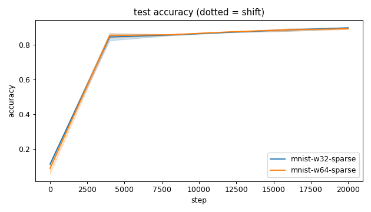
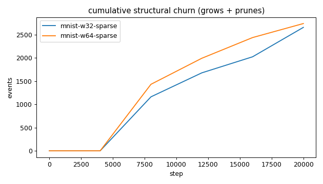
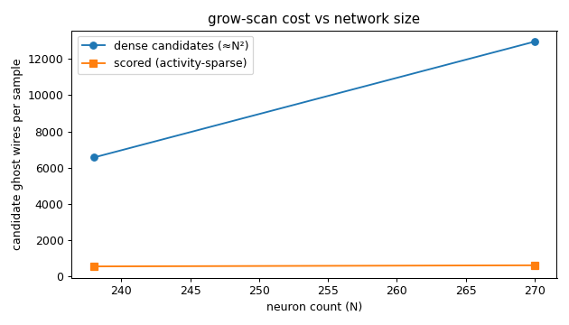
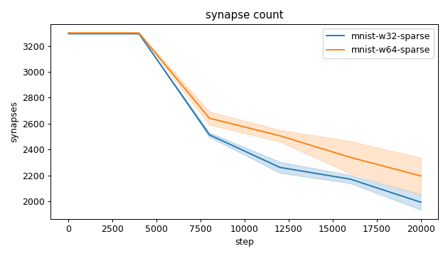
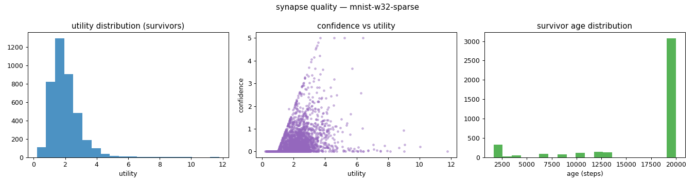
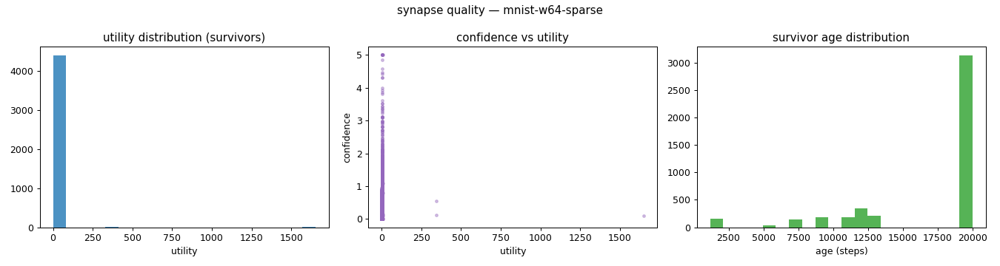
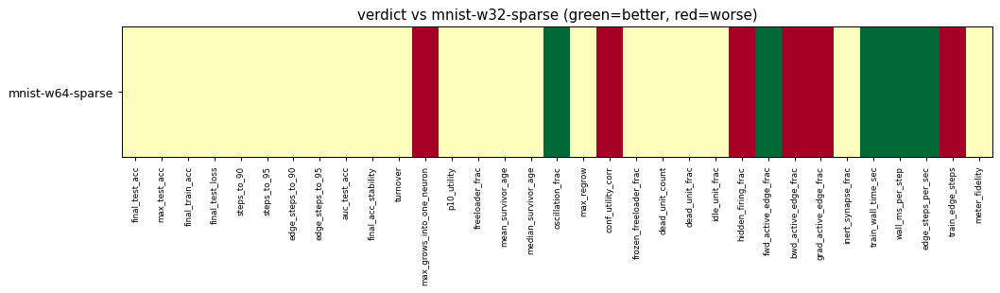

# Evaluation run: mnist14-array-backend-demo

- **Date:** 2026-06-14 23:07:32
- **Variants:** mnist-w32-sparse, mnist-w64-sparse  (baseline: mnist-w32-sparse)
- **Seeds:** 2  |  **Dataset:** mnist14  |  **Steps:** 20000 (+0 shift)
- **Commit:** 694c205
- **Command:** `python evaluate.py --variants mnist-w32-sparse,mnist-w64-sparse --baseline mnist-w32-sparse --dataset mnist14 --backend array --seeds 2 --steps 20000 --points 6000 --train-eval-cap 2000 --record-every 4000 --no-cache --publish --run-name mnist14-array-backend-demo`

## Key metrics

| Metric | What it means | mnist-w32-sparse (baseline) | mnist-w64-sparse |
|---|---|---|---|
| final_test_acc ↑ | held-out accuracy at the end of the run | 0.897 ± 0.005 | 0.893 ± 0.003 ≈ |
| steps_to_90 ↓ | steps to first reach 90% test accuracy | ∞ ± — | ∞ ± — ? |
| steps_to_95 ↓ | steps to first reach 95% test accuracy | ∞ ± — | ∞ ± — ? |
| auc_test_acc ↑ | area under the test-accuracy curve (speed + level) | 0.793 ± 0.005 | 0.792 ± 0.000 ≈ |
| edge_steps_to_90 ↓ | live-edge training work to first reach 90% test accuracy | ∞ ± — | ∞ ± — ? |
| edge_steps_to_95 ↓ | live-edge training work to first reach 95% test accuracy | ∞ ± — | ∞ ± — ? |
| synapse_count_end | live synapses at the end | 1992 ± 59 | 2196 ± 140 ≈ |
| effective_density | live edges as a fraction of fully-connected | 0.302 ± 0.009 | 0.167 ± 0.011 ≈ |
| avg_live_edges | time-average live edges during training | 2628 ± 9.056 | 2750 ± 67.669 ≈ |
| train_edge_steps ↓ | cumulative live-edge steps over training | 52564604 ± 181130 | 55011244 ± 1353438 ▼ |
| train_wall_time_sec ↓ | training-loop wall time only, excluding eval snapshots | 2.821 ± 0.005 | 2.792 ± 0.006 ▲ |
| wall_ms_per_step ↓ | training-loop milliseconds per SGD step | 0.141 ± 0.000 | 0.140 ± 0.000 ▲ |
| edge_steps_per_sec ↑ | live-edge steps processed per wall-clock second | 18634669 ± 31477 | 19705676 ± 444121 ▲ |
| ghost_dense_cost | candidate ghost wires the grow-scan must consider (~N²) | 6560 ± 59 | 12948 ± 140 ≈ |
| ghost_pairs_scored | candidate wires actually scored after activity+demand pruning | 560.098 ± 2.488 | 621.363 ± 10.197 ≈ |
| mean_neuron_activation | avg hidden-neuron ReLU output on test data (neuron value) | 1.070 ± 0.019 | 2242 ± 2241 ≈ |
| dead_unit_frac ↓ | fraction of hidden neurons that never fire (scale-free) | 0 ± 0 | 0 ± 0 ≈ |
| hidden_firing_frac ↓ | fraction of hidden ReLUs active on test data | 0.467 ± 0.010 | 0.505 ± 0.009 ▼ |
| fwd_active_edge_frac ↓ | fraction of live edges whose pre neuron is active | 0.947 ± 0.000 | 0.929 ± 0.003 ▲ |
| bwd_active_edge_frac ↓ | fraction of live edges whose post delta is nonzero | 0.577 ± 0.009 | 0.623 ± 0.009 ▼ |
| grad_active_edge_frac ↓ | fraction of live edges with nonzero weight gradient | 0.526 ± 0.009 | 0.559 ± 0.012 ▼ |
| idle_unit_frac ↓ | fraction of hidden neurons dead OR outputless (not in service) | 0 ± 0 | 0 ± 0 ≈ |
| n_recycle_events | dead-unit recycles fired over the run (sleep recycling) | 0 ± 0 | 0 ± 0 ≈ |
| recycled_rehired_frac | of recycled units, fraction back in service at the end | — ± — | — ± — ? |
| n_startle_events | demand-spike hiring alarms fired (startle growth) | 0 ± 0 | 0 ± 0 ≈ |
| n_arousal_events | post-startle refinement windows that ran grow-only passes | 0 ± 0 | 0 ± 0 ≈ |
| max_grows_into_one_neuron ↓ | most times one neuron was grown into (churn) | 89.500 ± 2.500 | 132 ± 13 ▼ |
| oscillation_frac ↓ | fraction of grown edges grown ≥2× (thrash) | 0.052 ± 0.016 | 0.019 ± 0.012 ▲ |
| freeloader_frac ↓ | fraction of synapses below the prune-utility floor | 0.006 ± 0.003 | 0.144 ± 0.141 ≈ |
| conf_utility_corr ↑ | corr of confidence with real utility (calibration) | 0.396 ± 0.005 | 0.189 ± 0.180 ▼ |
| dead_unit_count ↓ | hidden neurons that never fire on test data | 0 ± 0 | 0 ± 0 ≈ |

## Full scorecard

| Metric | mnist-w32-sparse (baseline) | mnist-w64-sparse |
|---|---|---|
| **Prediction performance** | | |
| final_test_acc ↑ | 0.897 ± 0.005 | 0.893 ± 0.003 ≈ |
| max_test_acc ↑ | 0.897 ± 0.005 | 0.895 ± 0.001 ≈ |
| final_train_acc ↑ | 0.930 ± 0.013 | 0.925 ± 0.005 ≈ |
| final_test_loss ↓ | 0.398 ± 0.049 | 0.440 ± 0.035 ≈ |
| **Training efficacy** | | |
| steps_to_90 ↓ | ∞ ± — | ∞ ± — ? |
| steps_to_95 ↓ | ∞ ± — | ∞ ± — ? |
| edge_steps_to_90 ↓ | ∞ ± — | ∞ ± — ? |
| edge_steps_to_95 ↓ | ∞ ± — | ∞ ± — ? |
| auc_test_acc ↑ | 0.793 ± 0.005 | 0.792 ± 0.000 ≈ |
| final_acc_stability ↓ | 0.283 ± 0.001 | 0.293 ± 0.012 ≈ |
| **Synapse structure** | | |
| synapse_count_start | 3296 ± 0 | 3302 ± 1.500 ≈ |
| synapse_count_peak | 3296 ± 0 | 3302 ± 1.500 ≈ |
| synapse_count_end | 1992 ± 59 | 2196 ± 140 ≈ |
| n_grow_events | 677 ± 78 | 817.500 ± 81.500 ≈ |
| n_prune_events | 1981 ± 19 | 1923 ± 60 ≈ |
| n_startle_events | 0 ± 0 | 0 ± 0 ≈ |
| n_arousal_events | 0 ± 0 | 0 ± 0 ≈ |
| distinct_neurons_grown | 28.500 ± 0.500 | 34 ± 1 ≈ |
| turnover ↓ | 1.027 ± 0.033 | 1.010 ± 0.014 ≈ |
| max_grows_into_one_neuron ↓ | 89.500 ± 2.500 | 132 ± 13 ▼ |
| mean_fan_in | 47.429 ± 1.405 | 29.676 ± 1.892 ≈ |
| mean_fan_out | 8.737 ± 0.259 | 8.446 ± 0.538 ≈ |
| effective_density | 0.302 ± 0.009 | 0.167 ± 0.011 ≈ |
| avg_live_edges | 2628 ± 9.056 | 2750 ± 67.669 ≈ |
| **Synapse quality** | | |
| p10_utility ↑ | 1.094 ± 0.034 | 0.646 ± 0.484 ≈ |
| freeloader_frac ↓ | 0.006 ± 0.003 | 0.144 ± 0.141 ≈ |
| mean_survivor_age ↑ | 17045 ± 338.937 | 17070 ± 335.875 ≈ |
| median_survivor_age ↑ | 20000 ± 0 | 20000 ± 0 ≈ |
| mean_pruned_lifespan | 9406 ± 165.637 | 9142 ± 129.830 ≈ |
| oscillation_frac ↓ | 0.052 ± 0.016 | 0.019 ± 0.012 ▲ |
| max_regrow ↓ | 1.500 ± 0.500 | 1 ± 0 ≈ |
| conf_utility_corr ↑ | 0.396 ± 0.005 | 0.189 ± 0.180 ▼ |
| frozen_freeloader_frac ↓ | 0 ± 0 | 0 ± 0 ≈ |
| dead_unit_count ↓ | 0 ± 0 | 0 ± 0 ≈ |
| dead_unit_frac ↓ | 0 ± 0 | 0 ± 0 ≈ |
| idle_unit_frac ↓ | 0 ± 0 | 0 ± 0 ≈ |
| mean_neuron_activation | 1.070 ± 0.019 | 2242 ± 2241 ≈ |
| hidden_firing_frac ↓ | 0.467 ± 0.010 | 0.505 ± 0.009 ▼ |
| fwd_active_edge_frac ↓ | 0.947 ± 0.000 | 0.929 ± 0.003 ▲ |
| bwd_active_edge_frac ↓ | 0.577 ± 0.009 | 0.623 ± 0.009 ▼ |
| grad_active_edge_frac ↓ | 0.526 ± 0.009 | 0.559 ± 0.012 ▼ |
| inert_synapse_frac ↓ | 0 ± 0 | 0 ± 0 ≈ |
| used_vs_allocated | 0.604 ± 0.018 | 0.665 ± 0.043 ≈ |
| n_recycle_events | 0 ± 0 | 0 ± 0 ≈ |
| recycled_rehired_frac | — ± — | — ± — ? |
| **Compute cost** | | |
| train_wall_time_sec ↓ | 2.821 ± 0.005 | 2.792 ± 0.006 ▲ |
| wall_ms_per_step ↓ | 0.141 ± 0.000 | 0.140 ± 0.000 ▲ |
| edge_steps_per_sec ↑ | 18634669 ± 31477 | 19705676 ± 444121 ▲ |
| train_edge_steps ↓ | 52564604 ± 181130 | 55011244 ± 1353438 ▼ |
| ghost_dense_cost | 6560 ± 59 | 12948 ± 140 ≈ |
| ghost_pairs_scored | 560.098 ± 2.488 | 621.363 ± 10.197 ≈ |
| **Signal sanity** | | |
| meter_fidelity ↑ | 0.602 ± 0.111 | 0.354 ± 0.365 ≈ |

Baseline: **mnist-w32-sparse**. ▲ better / ▼ worse / ≈ no clear difference vs baseline (95% bootstrap CI of the mean difference). Cells show mean ± std across seeds.

## Charts

### acc_curves

### churn_curves

### cost_scaling

### count_curves

### quality_mnist-w32-sparse

### quality_mnist-w64-sparse

### verdict_heatmap

