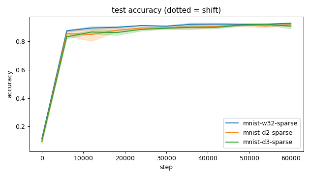
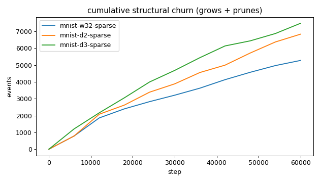
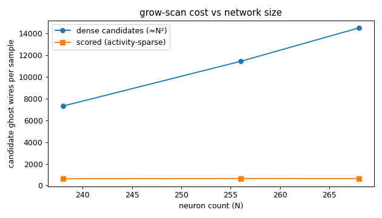
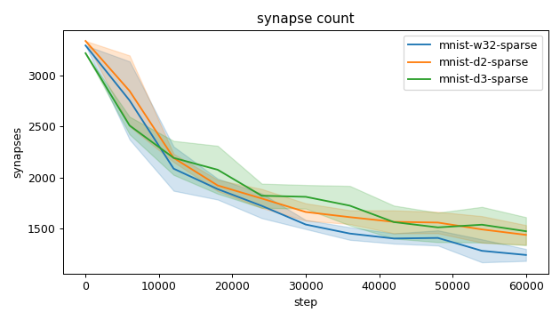
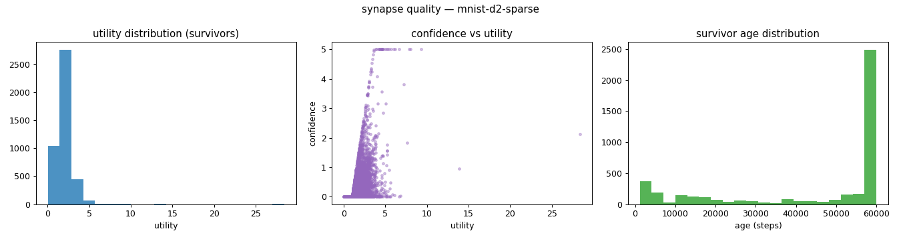
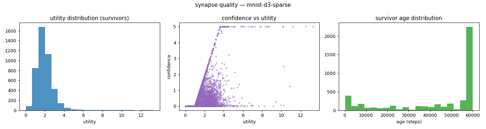
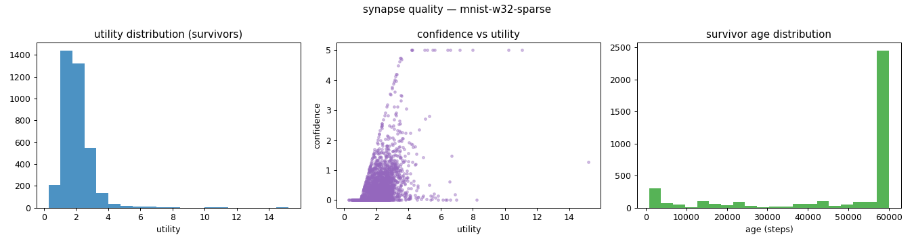
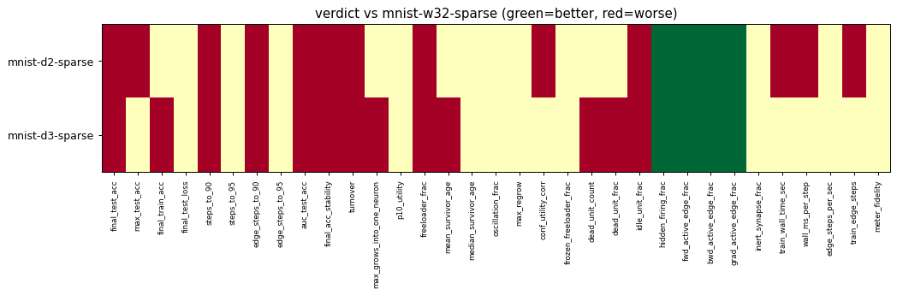

# Evaluation run: mnist14-depth-sweep

- **Date:** 2026-06-14 19:31:31
- **Variants:** mnist-d2-sparse, mnist-d3-sparse, mnist-w32-sparse  (baseline: mnist-w32-sparse)
- **Seeds:** 3  |  **Dataset:** mnist14  |  **Steps:** 60000 (+0 shift)
- **Commit:** 1a94418
- **Command:** `python evaluate.py --variants mnist-w32-sparse,mnist-d2-sparse,mnist-d3-sparse --baseline mnist-w32-sparse --dataset mnist14 --layers 196,16,10 --density 1.0 --seeds 3 --steps 60000 --record-every 6000 --points 12000 --train-eval-cap 2000 --no-cache --publish --run-name mnist14-depth-sweep`

## Key metrics

| Metric | What it means | mnist-d2-sparse | mnist-d3-sparse | mnist-w32-sparse (baseline) |
|---|---|---|---|---|
| final_test_acc ↑ | held-out accuracy at the end of the run | 0.917 ± 0.007 ▼ | 0.908 ± 0.016 ▼ | 0.929 ± 0.004 |
| steps_to_90 ↓ | steps to first reach 90% test accuracy | 30001 ± 4899 ▼ | 38001 ± 7483 ▼ | 18001 ± 4899 |
| steps_to_95 ↓ | steps to first reach 95% test accuracy | ∞ ± — ? | ∞ ± — ? | ∞ ± — |
| auc_test_acc ↑ | area under the test-accuracy curve (speed + level) | 0.851 ± 0.009 ▼ | 0.848 ± 0.004 ▼ | 0.870 ± 0.004 |
| edge_steps_to_90 ↓ | live-edge training work to first reach 90% test accuracy | 67325903 ± 7526306 ▼ | 83006584 ± 16900398 ▼ | 43449902 ± 7185527 |
| edge_steps_to_95 ↓ | live-edge training work to first reach 95% test accuracy | ∞ ± — ? | ∞ ± — ? | ∞ ± — |
| synapse_count_end | live synapses at the end | 1439 ± 95.711 ≈ | 1475 ± 137.737 ≈ | 1242 ± 58.589 |
| effective_density | live edges as a fraction of fully-connected | 0.215 ± 0.014 ≈ | 0.229 ± 0.021 ≈ | 0.188 ± 0.009 |
| avg_live_edges | time-average live edges during training | 1910 ± 56.510 ≈ | 1943 ± 149.653 ≈ | 1778 ± 33.699 |
| train_edge_steps ↓ | cumulative live-edge steps over training | 114600788 ± 3390676 ▼ | 116580646 ± 8979303 ≈ | 106670067 ± 2021965 |
| train_wall_time_sec ↓ | training-loop wall time only, excluding eval snapshots | 621.615 ± 12.121 ▼ | 627.475 ± 36.649 ≈ | 582.061 ± 15.605 |
| wall_ms_per_step ↓ | training-loop milliseconds per SGD step | 10.360 ± 0.202 ▼ | 10.458 ± 0.611 ≈ | 9.701 ± 0.260 |
| edge_steps_per_sec ↑ | live-edge steps processed per wall-clock second | 184324 ± 1868 ≈ | 185583 ± 3645 ≈ | 183325 ± 3239 |
| ghost_dense_cost | candidate ghost wires the grow-scan must consider (~N²) | 11421 ± 95.711 ≈ | 14497 ± 137.737 ≈ | 7310 ± 58.589 |
| ghost_pairs_scored | candidate wires actually scored after activity+demand pruning | 646.259 ± 14.769 ≈ | 642.104 ± 19.514 ≈ | 631.577 ± 6.126 |
| mean_neuron_activation | avg hidden-neuron ReLU output on test data (neuron value) | 0.773 ± 0.065 ≈ | 0.529 ± 0.053 ≈ | 0.913 ± 0.055 |
| dead_unit_frac ↓ | fraction of hidden neurons that never fire (scale-free) | 0.060 ± 0.049 ≈ | 0.194 ± 0.060 ▼ | 0 ± 0 |
| hidden_firing_frac ↓ | fraction of hidden ReLUs active on test data | 0.334 ± 0.031 ▲ | 0.270 ± 0.024 ▲ | 0.417 ± 0.022 |
| fwd_active_edge_frac ↓ | fraction of live edges whose pre neuron is active | 0.864 ± 0.008 ▲ | 0.839 ± 0.007 ▲ | 0.930 ± 0.002 |
| bwd_active_edge_frac ↓ | fraction of live edges whose post delta is nonzero | 0.525 ± 0.013 ▲ | 0.550 ± 0.005 ▲ | 0.602 ± 0.007 |
| grad_active_edge_frac ↓ | fraction of live edges with nonzero weight gradient | 0.439 ± 0.014 ▲ | 0.459 ± 0.011 ▲ | 0.531 ± 0.008 |
| idle_unit_frac ↓ | fraction of hidden neurons dead OR outputless (not in service) | 0.067 ± 0.041 ▼ | 0.194 ± 0.060 ▼ | 0 ± 0 |
| n_recycle_events | dead-unit recycles fired over the run (sleep recycling) | 0 ± 0 ≈ | 0 ± 0 ≈ | 0 ± 0 |
| recycled_rehired_frac | of recycled units, fraction back in service at the end | — ± — ? | — ± — ? | — ± — |
| n_startle_events | demand-spike hiring alarms fired (startle growth) | 0.667 ± 0.471 ≈ | 1 ± 0.816 ≈ | 0 ± 0 |
| n_arousal_events | post-startle refinement windows that ran grow-only passes | 0 ± 0 ≈ | 0 ± 0 ≈ | 0 ± 0 |
| max_grows_into_one_neuron ↓ | most times one neuron was grown into (churn) | 177.667 ± 11.898 ≈ | 212 ± 18.457 ▼ | 162 ± 27.604 |
| oscillation_frac ↓ | fraction of grown edges grown ≥2× (thrash) | 0.158 ± 0.018 ≈ | 0.157 ± 0.024 ≈ | 0.148 ± 0.030 |
| freeloader_frac ↓ | fraction of synapses below the prune-utility floor | 0.010 ± 0.005 ▼ | 0.012 ± 0.004 ▼ | 0.002 ± 0.001 |
| conf_utility_corr ↑ | corr of confidence with real utility (calibration) | 0.446 ± 0.014 ▼ | 0.440 ± 0.074 ≈ | 0.514 ± 0.017 |
| dead_unit_count ↓ | hidden neurons that never fire on test data | 3 ± 2.449 ≈ | 12 ± 3.742 ▼ | 0 ± 0 |

## Full scorecard

| Metric | mnist-d2-sparse | mnist-d3-sparse | mnist-w32-sparse (baseline) |
|---|---|---|---|
| **Prediction performance** | | | |
| final_test_acc ↑ | 0.917 ± 0.007 ▼ | 0.908 ± 0.016 ▼ | 0.929 ± 0.004 |
| max_test_acc ↑ | 0.919 ± 0.009 ▼ | 0.923 ± 0.007 ≈ | 0.931 ± 0.006 |
| final_train_acc ↑ | 0.938 ± 0.005 ≈ | 0.923 ± 0.013 ▼ | 0.942 ± 0.003 |
| final_test_loss ↓ | 0.303 ± 0.042 ≈ | 0.311 ± 0.048 ≈ | 0.297 ± 0.023 |
| **Training efficacy** | | | |
| steps_to_90 ↓ | 30001 ± 4899 ▼ | 38001 ± 7483 ▼ | 18001 ± 4899 |
| steps_to_95 ↓ | ∞ ± — ? | ∞ ± — ? | ∞ ± — |
| edge_steps_to_90 ↓ | 67325903 ± 7526306 ▼ | 83006584 ± 16900398 ▼ | 43449902 ± 7185527 |
| edge_steps_to_95 ↓ | ∞ ± — ? | ∞ ± — ? | ∞ ± — |
| auc_test_acc ↑ | 0.851 ± 0.009 ▼ | 0.848 ± 0.004 ▼ | 0.870 ± 0.004 |
| final_acc_stability ↓ | 0.026 ± 0.007 ▼ | 0.028 ± 0.005 ▼ | 0.016 ± 0.003 |
| **Synapse structure** | | | |
| synapse_count_start | 3340 ± 0 ≈ | 3220 ± 0 ≈ | 3296 ± 0 |
| synapse_count_peak | 3340 ± 0 ≈ | 3220 ± 0 ≈ | 3296 ± 0 |
| synapse_count_end | 1439 ± 95.711 ≈ | 1475 ± 137.737 ≈ | 1242 ± 58.589 |
| n_grow_events | 2468 ± 169.428 ≈ | 2869 ± 682.400 ≈ | 1611 ± 161.897 |
| n_prune_events | 4369 ± 121.526 ≈ | 4615 ± 566.461 ≈ | 3665 ± 157.114 |
| n_startle_events | 0.667 ± 0.471 ≈ | 1 ± 0.816 ≈ | 0 ± 0 |
| n_arousal_events | 0 ± 0 ≈ | 0 ± 0 ≈ | 0 ± 0 |
| distinct_neurons_grown | 53 ± 0 ≈ | 56 ± 2.828 ≈ | 38 ± 0.816 |
| turnover ↓ | 3.514 ± 0.218 ▼ | 3.823 ± 0.478 ▼ | 2.888 ± 0.092 |
| max_grows_into_one_neuron ↓ | 177.667 ± 11.898 ≈ | 212 ± 18.457 ▼ | 162 ± 27.604 |
| mean_fan_in | 23.983 ± 1.595 ≈ | 20.481 ± 1.913 ≈ | 29.571 ± 1.395 |
| mean_fan_out | 5.850 ± 0.389 ≈ | 5.716 ± 0.534 ≈ | 5.447 ± 0.257 |
| effective_density | 0.215 ± 0.014 ≈ | 0.229 ± 0.021 ≈ | 0.188 ± 0.009 |
| avg_live_edges | 1910 ± 56.510 ≈ | 1943 ± 149.653 ≈ | 1778 ± 33.699 |
| **Synapse quality** | | | |
| p10_utility ↑ | 1.132 ± 0.049 ≈ | 1.108 ± 0.026 ≈ | 1.158 ± 0.089 |
| freeloader_frac ↓ | 0.010 ± 0.005 ▼ | 0.012 ± 0.004 ▼ | 0.002 ± 0.001 |
| mean_survivor_age ↑ | 45004 ± 651.284 ≈ | 43901 ± 552.394 ▼ | 47948 ± 2909 |
| median_survivor_age ↑ | 60000 ± 0 ≈ | 56799 ± 2269 ≈ | 60000 ± 0 |
| mean_pruned_lifespan | 11427 ± 420.069 ≈ | 11366 ± 1230 ≈ | 12821 ± 1203 |
| oscillation_frac ↓ | 0.158 ± 0.018 ≈ | 0.157 ± 0.024 ≈ | 0.148 ± 0.030 |
| max_regrow ↓ | 3 ± 0 ≈ | 3.667 ± 0.471 ≈ | 3.333 ± 0.471 |
| conf_utility_corr ↑ | 0.446 ± 0.014 ▼ | 0.440 ± 0.074 ≈ | 0.514 ± 0.017 |
| frozen_freeloader_frac ↓ | 0 ± 0 ≈ | 0 ± 0 ≈ | 0 ± 0 |
| dead_unit_count ↓ | 3 ± 2.449 ≈ | 12 ± 3.742 ▼ | 0 ± 0 |
| dead_unit_frac ↓ | 0.060 ± 0.049 ≈ | 0.194 ± 0.060 ▼ | 0 ± 0 |
| idle_unit_frac ↓ | 0.067 ± 0.041 ▼ | 0.194 ± 0.060 ▼ | 0 ± 0 |
| mean_neuron_activation | 0.773 ± 0.065 ≈ | 0.529 ± 0.053 ≈ | 0.913 ± 0.055 |
| hidden_firing_frac ↓ | 0.334 ± 0.031 ▲ | 0.270 ± 0.024 ▲ | 0.417 ± 0.022 |
| fwd_active_edge_frac ↓ | 0.864 ± 0.008 ▲ | 0.839 ± 0.007 ▲ | 0.930 ± 0.002 |
| bwd_active_edge_frac ↓ | 0.525 ± 0.013 ▲ | 0.550 ± 0.005 ▲ | 0.602 ± 0.007 |
| grad_active_edge_frac ↓ | 0.439 ± 0.014 ▲ | 0.459 ± 0.011 ▲ | 0.531 ± 0.008 |
| inert_synapse_frac ↓ | 0 ± 0 ≈ | 0 ± 0 ≈ | 0 ± 0 |
| used_vs_allocated | 0.431 ± 0.029 ≈ | 0.458 ± 0.043 ≈ | 0.377 ± 0.018 |
| n_recycle_events | 0 ± 0 ≈ | 0 ± 0 ≈ | 0 ± 0 |
| recycled_rehired_frac | — ± — ? | — ± — ? | — ± — |
| **Compute cost** | | | |
| train_wall_time_sec ↓ | 621.615 ± 12.121 ▼ | 627.475 ± 36.649 ≈ | 582.061 ± 15.605 |
| wall_ms_per_step ↓ | 10.360 ± 0.202 ▼ | 10.458 ± 0.611 ≈ | 9.701 ± 0.260 |
| edge_steps_per_sec ↑ | 184324 ± 1868 ≈ | 185583 ± 3645 ≈ | 183325 ± 3239 |
| train_edge_steps ↓ | 114600788 ± 3390676 ▼ | 116580646 ± 8979303 ≈ | 106670067 ± 2021965 |
| ghost_dense_cost | 11421 ± 95.711 ≈ | 14497 ± 137.737 ≈ | 7310 ± 58.589 |
| ghost_pairs_scored | 646.259 ± 14.769 ≈ | 642.104 ± 19.514 ≈ | 631.577 ± 6.126 |
| **Signal sanity** | | | |
| meter_fidelity ↑ | 0.515 ± 0.100 ≈ | 0.606 ± 0.105 ≈ | 0.501 ± 0.132 |

Baseline: **mnist-w32-sparse**. ▲ better / ▼ worse / ≈ no clear difference vs baseline (95% bootstrap CI of the mean difference). Cells show mean ± std across seeds.

## Charts

### acc_curves

### churn_curves

### cost_scaling

### count_curves

### quality_mnist-d2-sparse

### quality_mnist-d3-sparse

### quality_mnist-w32-sparse

### verdict_heatmap

