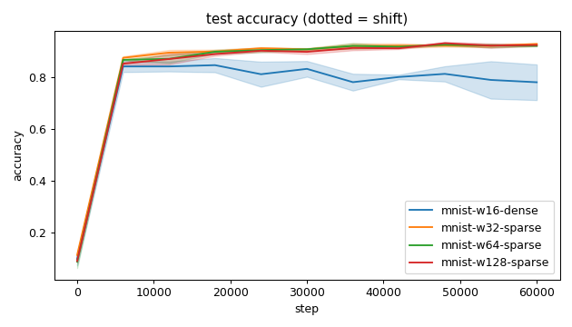
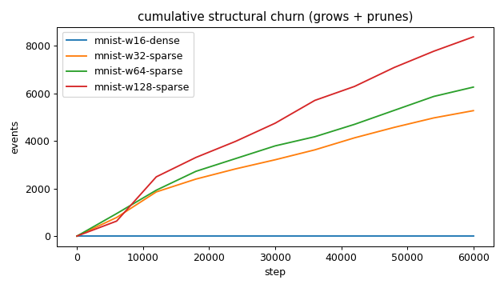
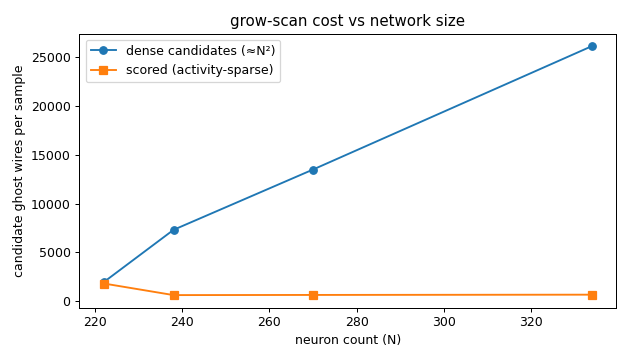
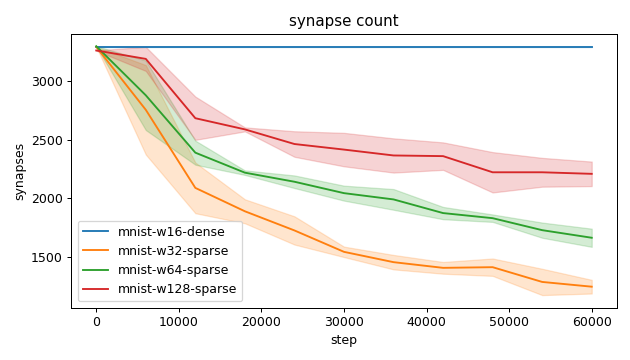
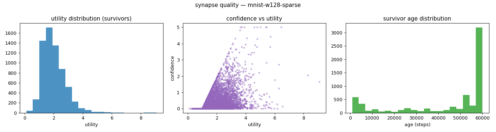
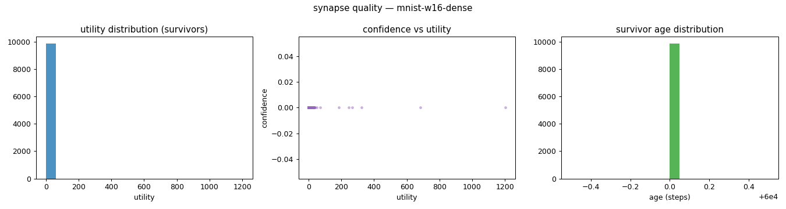
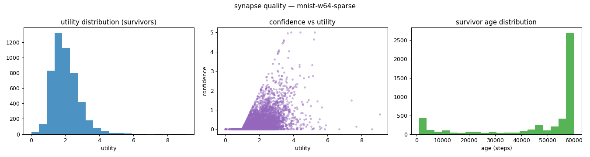
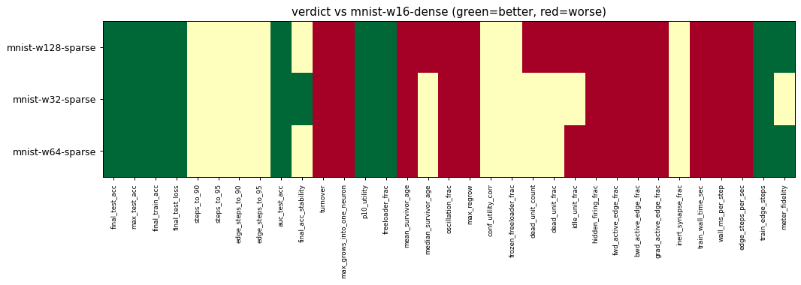

# Evaluation run: mnist14-scale-12k-60k

- **Date:** 2026-06-14 17:06:48
- **Variants:** mnist-w128-sparse, mnist-w16-dense, mnist-w32-sparse, mnist-w64-sparse  (baseline: mnist-w16-dense)
- **Seeds:** 3  |  **Dataset:** mnist14  |  **Steps:** 60000 (+0 shift)
- **Commit:** f7dac6c
- **Command:** `python evaluate.py --variants mnist-w16-dense,mnist-w32-sparse,mnist-w64-sparse,mnist-w128-sparse --baseline mnist-w16-dense --dataset mnist14 --layers 196,16,10 --density 1.0 --seeds 3 --steps 60000 --record-every 6000 --points 12000 --train-eval-cap 2000 --no-cache --publish --run-name mnist14-scale-12k-60k`

## Key metrics

| Metric | What it means | mnist-w128-sparse | mnist-w16-dense (baseline) | mnist-w32-sparse | mnist-w64-sparse |
|---|---|---|---|---|---|
| final_test_acc ↑ | held-out accuracy at the end of the run | 0.925 ± 0.004 ▲ | 0.781 ± 0.069 | 0.929 ± 0.004 ▲ | 0.922 ± 0.002 ▲ |
| steps_to_90 ↓ | steps to first reach 90% test accuracy | 28001 ± 5657 ? | ∞ ± — | 18001 ± 4899 ? | 24001 ± 4899 ? |
| steps_to_95 ↓ | steps to first reach 95% test accuracy | ∞ ± — ? | ∞ ± — | ∞ ± — ? | ∞ ± — ? |
| auc_test_acc ↑ | area under the test-accuracy curve (speed + level) | 0.860 ± 0.004 ▲ | 0.780 ± 0.031 | 0.870 ± 0.004 ▲ | 0.864 ± 0.003 ▲ |
| edge_steps_to_90 ↓ | live-edge training work to first reach 90% test accuracy | 77609038 ± 13733967 ? | ∞ ± — | 43449902 ± 7185527 ? | 61723500 ± 12521171 ? |
| edge_steps_to_95 ↓ | live-edge training work to first reach 95% test accuracy | ∞ ± — ? | ∞ ± — | ∞ ± — ? | ∞ ± — ? |
| synapse_count_end | live synapses at the end | 2208 ± 104.990 ≈ | 3296 ± 0 | 1242 ± 58.589 ≈ | 1661 ± 77.927 ≈ |
| effective_density | live edges as a fraction of fully-connected | 0.084 ± 0.004 ≈ | 1 ± 0 | 0.188 ± 0.009 ≈ | 0.126 ± 0.006 ≈ |
| avg_live_edges | time-average live edges during training | 2532 ± 86.654 ≈ | 3296 ± 0 | 1778 ± 33.699 ≈ | 2162 ± 60.612 ≈ |
| train_edge_steps ↓ | cumulative live-edge steps over training | 151893600 ± 5199301 ▲ | 197760000 ± 0 | 106670067 ± 2021965 ▲ | 129724067 ± 3636790 ▲ |
| train_wall_time_sec ↓ | training-loop wall time only, excluding eval snapshots | 344.101 ± 38.092 ▼ | 250.205 ± 2.152 | 304.203 ± 2.572 ▼ | 356.200 ± 8.651 ▼ |
| wall_ms_per_step ↓ | training-loop milliseconds per SGD step | 5.735 ± 0.635 ▼ | 4.170 ± 0.036 | 5.070 ± 0.043 ▼ | 5.937 ± 0.144 ▼ |
| edge_steps_per_sec ↑ | live-edge steps processed per wall-clock second | 447316 ± 54460 ▼ | 790450 ± 6835 | 350626 ± 3835 ▼ | 364158 ± 2189 ▼ |
| ghost_dense_cost | candidate ghost wires the grow-scan must consider (~N²) | 26120 ± 104.990 ≈ | 1960 ± 0 | 7310 ± 58.589 ≈ | 13483 ± 77.927 ≈ |
| ghost_pairs_scored | candidate wires actually scored after activity+demand pruning | 674.999 ± 8.842 ≈ | 1819 ± 18.123 | 631.577 ± 6.126 ≈ | 647.767 ± 4.895 ≈ |
| mean_neuron_activation | avg hidden-neuron ReLU output on test data (neuron value) | 0.504 ± 0.006 ≈ | 50363 ± 71221 | 0.913 ± 0.055 ≈ | 0.686 ± 0.006 ≈ |
| dead_unit_frac ↓ | fraction of hidden neurons that never fire (scale-free) | 0.018 ± 0.010 ▼ | 0 ± 0 | 0 ± 0 ≈ | 0.016 ± 0.013 ≈ |
| hidden_firing_frac ↓ | fraction of hidden ReLUs active on test data | 0.466 ± 0.019 ▼ | 0.180 ± 0.059 | 0.417 ± 0.022 ▼ | 0.451 ± 0.014 ▼ |
| fwd_active_edge_frac ↓ | fraction of live edges whose pre neuron is active | 0.913 ± 0.003 ▼ | 0.904 ± 0.001 | 0.930 ± 0.002 ▼ | 0.922 ± 0.004 ▼ |
| bwd_active_edge_frac ↓ | fraction of live edges whose post delta is nonzero | 0.625 ± 0.016 ▼ | 0.219 ± 0.057 | 0.602 ± 0.007 ▼ | 0.640 ± 0.014 ▼ |
| grad_active_edge_frac ↓ | fraction of live edges with nonzero weight gradient | 0.546 ± 0.013 ▼ | 0.169 ± 0.055 | 0.531 ± 0.008 ▼ | 0.565 ± 0.014 ▼ |
| idle_unit_frac ↓ | fraction of hidden neurons dead OR outputless (not in service) | 0.161 ± 0.029 ▼ | 0 ± 0 | 0 ± 0 ≈ | 0.057 ± 0.015 ▼ |
| n_recycle_events | dead-unit recycles fired over the run (sleep recycling) | 0 ± 0 ≈ | 0 ± 0 | 0 ± 0 ≈ | 0 ± 0 ≈ |
| recycled_rehired_frac | of recycled units, fraction back in service at the end | — ± — ? | — ± — | — ± — ? | — ± — ? |
| n_startle_events | demand-spike hiring alarms fired (startle growth) | 0 ± 0 ≈ | 0 ± 0 | 0 ± 0 ≈ | 0 ± 0 ≈ |
| n_arousal_events | post-startle refinement windows that ran grow-only passes | 0 ± 0 ≈ | 0 ± 0 | 0 ± 0 ≈ | 0 ± 0 ≈ |
| max_grows_into_one_neuron ↓ | most times one neuron was grown into (churn) | 300.333 ± 66.785 ▼ | 0 ± 0 | 162 ± 27.604 ▼ | 167 ± 18.833 ▼ |
| oscillation_frac ↓ | fraction of grown edges grown ≥2× (thrash) | 0.181 ± 0.009 ▼ | 0 ± 0 | 0.148 ± 0.030 ▼ | 0.126 ± 0.020 ▼ |
| freeloader_frac ↓ | fraction of synapses below the prune-utility floor | 0.004 ± 0.001 ▲ | 0.288 ± 0.095 | 0.002 ± 0.001 ▲ | 0.008 ± 0.005 ▲ |
| conf_utility_corr ↑ | corr of confidence with real utility (calibration) | 0.396 ± 0.010 ? | — ± — | 0.514 ± 0.017 ? | 0.474 ± 0.031 ? |
| dead_unit_count ↓ | hidden neurons that never fire on test data | 2.333 ± 1.247 ▼ | 0 ± 0 | 0 ± 0 ≈ | 1 ± 0.816 ≈ |

## Full scorecard

| Metric | mnist-w128-sparse | mnist-w16-dense (baseline) | mnist-w32-sparse | mnist-w64-sparse |
|---|---|---|---|---|
| **Prediction performance** | | | | |
| final_test_acc ↑ | 0.925 ± 0.004 ▲ | 0.781 ± 0.069 | 0.929 ± 0.004 ▲ | 0.922 ± 0.002 ▲ |
| max_test_acc ↑ | 0.933 ± 0.003 ▲ | 0.854 ± 0.023 | 0.931 ± 0.006 ▲ | 0.929 ± 0.002 ▲ |
| final_train_acc ↑ | 0.943 ± 0.006 ▲ | 0.784 ± 0.074 | 0.942 ± 0.003 ▲ | 0.942 ± 0.004 ▲ |
| final_test_loss ↓ | 0.289 ± 0.040 ▲ | 1.339 ± 0.394 | 0.297 ± 0.023 ▲ | 0.301 ± 0.031 ▲ |
| **Training efficacy** | | | | |
| steps_to_90 ↓ | 28001 ± 5657 ? | ∞ ± — | 18001 ± 4899 ? | 24001 ± 4899 ? |
| steps_to_95 ↓ | ∞ ± — ? | ∞ ± — | ∞ ± — ? | ∞ ± — ? |
| edge_steps_to_90 ↓ | 77609038 ± 13733967 ? | ∞ ± — | 43449902 ± 7185527 ? | 61723500 ± 12521171 ? |
| edge_steps_to_95 ↓ | ∞ ± — ? | ∞ ± — | ∞ ± — ? | ∞ ± — ? |
| auc_test_acc ↑ | 0.860 ± 0.004 ▲ | 0.780 ± 0.031 | 0.870 ± 0.004 ▲ | 0.864 ± 0.003 ▲ |
| final_acc_stability ↓ | 0.025 ± 0.002 ≈ | 0.030 ± 0.012 | 0.016 ± 0.003 ▲ | 0.021 ± 0.001 ≈ |
| **Synapse structure** | | | | |
| synapse_count_start | 3265 ± 1.247 ≈ | 3296 ± 0 | 3296 ± 0 ≈ | 3301 ± 1.247 ≈ |
| synapse_count_peak | 3265 ± 1.247 ≈ | 3296 ± 0 | 3296 ± 0 ≈ | 3301 ± 1.247 ≈ |
| synapse_count_end | 2208 ± 104.990 ≈ | 3296 ± 0 | 1242 ± 58.589 ≈ | 1661 ± 77.927 ≈ |
| n_grow_events | 3662 ± 146.495 ≈ | 0 ± 0 | 1611 ± 161.897 ≈ | 2313 ± 106.921 ≈ |
| n_prune_events | 4718 ± 195.790 ≈ | 0 ± 0 | 3665 ± 157.114 ≈ | 3953 ± 52.130 ≈ |
| n_startle_events | 0 ± 0 ≈ | 0 ± 0 | 0 ± 0 ≈ | 0 ± 0 ≈ |
| n_arousal_events | 0 ± 0 ≈ | 0 ± 0 | 0 ± 0 ≈ | 0 ± 0 ≈ |
| distinct_neurons_grown | 64 ± 4.320 ≈ | 0 ± 0 | 38 ± 0.816 ≈ | 50.667 ± 3.682 ≈ |
| turnover ↓ | 3.298 ± 0.192 ▼ | 0 ± 0 | 2.888 ± 0.092 ▼ | 2.868 ± 0.092 ▼ |
| max_grows_into_one_neuron ↓ | 300.333 ± 66.785 ▼ | 0 ± 0 | 162 ± 27.604 ▼ | 167 ± 18.833 ▼ |
| mean_fan_in | 16.002 ± 0.761 ≈ | 126.769 ± 0 | 29.571 ± 1.395 ≈ | 22.446 ± 1.053 ≈ |
| mean_fan_out | 6.816 ± 0.324 ≈ | 15.547 ± 0 | 5.447 ± 0.257 ≈ | 6.388 ± 0.300 ≈ |
| effective_density | 0.084 ± 0.004 ≈ | 1 ± 0 | 0.188 ± 0.009 ≈ | 0.126 ± 0.006 ≈ |
| avg_live_edges | 2532 ± 86.654 ≈ | 3296 ± 0 | 1778 ± 33.699 ≈ | 2162 ± 60.612 ≈ |
| **Synapse quality** | | | | |
| p10_utility ↑ | 1.163 ± 0.012 ▲ | 0.155 ± 0.055 | 1.158 ± 0.089 ▲ | 1.159 ± 0.049 ▲ |
| freeloader_frac ↓ | 0.004 ± 0.001 ▲ | 0.288 ± 0.095 | 0.002 ± 0.001 ▲ | 0.008 ± 0.005 ▲ |
| mean_survivor_age ↑ | 44336 ± 697.335 ▼ | 60000 ± 0 | 47948 ± 2909 ▼ | 47237 ± 2194 ▼ |
| median_survivor_age ↑ | 52932 ± 1611 ▼ | 60000 ± 0 | 60000 ± 0 ≈ | 60000 ± 0 ≈ |
| mean_pruned_lifespan | 11438 ± 234.681 ≈ | 0 ± 0 | 12821 ± 1203 ≈ | 13018 ± 1021 ≈ |
| oscillation_frac ↓ | 0.181 ± 0.009 ▼ | 0 ± 0 | 0.148 ± 0.030 ▼ | 0.126 ± 0.020 ▼ |
| max_regrow ↓ | 4 ± 0.816 ▼ | 0 ± 0 | 3.333 ± 0.471 ▼ | 3 ± 0 ▼ |
| conf_utility_corr ↑ | 0.396 ± 0.010 ? | — ± — | 0.514 ± 0.017 ? | 0.474 ± 0.031 ? |
| frozen_freeloader_frac ↓ | 0 ± 0 ≈ | 0 ± 0 | 0 ± 0 ≈ | 0 ± 0 ≈ |
| dead_unit_count ↓ | 2.333 ± 1.247 ▼ | 0 ± 0 | 0 ± 0 ≈ | 1 ± 0.816 ≈ |
| dead_unit_frac ↓ | 0.018 ± 0.010 ▼ | 0 ± 0 | 0 ± 0 ≈ | 0.016 ± 0.013 ≈ |
| idle_unit_frac ↓ | 0.161 ± 0.029 ▼ | 0 ± 0 | 0 ± 0 ≈ | 0.057 ± 0.015 ▼ |
| mean_neuron_activation | 0.504 ± 0.006 ≈ | 50363 ± 71221 | 0.913 ± 0.055 ≈ | 0.686 ± 0.006 ≈ |
| hidden_firing_frac ↓ | 0.466 ± 0.019 ▼ | 0.180 ± 0.059 | 0.417 ± 0.022 ▼ | 0.451 ± 0.014 ▼ |
| fwd_active_edge_frac ↓ | 0.913 ± 0.003 ▼ | 0.904 ± 0.001 | 0.930 ± 0.002 ▼ | 0.922 ± 0.004 ▼ |
| bwd_active_edge_frac ↓ | 0.625 ± 0.016 ▼ | 0.219 ± 0.057 | 0.602 ± 0.007 ▼ | 0.640 ± 0.014 ▼ |
| grad_active_edge_frac ↓ | 0.546 ± 0.013 ▼ | 0.169 ± 0.055 | 0.531 ± 0.008 ▼ | 0.565 ± 0.014 ▼ |
| inert_synapse_frac ↓ | 0 ± 0 ≈ | 0 ± 0 | 0 ± 0 ≈ | 0 ± 0 ≈ |
| used_vs_allocated | 0.676 ± 0.032 ≈ | 1 ± 0 | 0.377 ± 0.018 ≈ | 0.503 ± 0.024 ≈ |
| n_recycle_events | 0 ± 0 ≈ | 0 ± 0 | 0 ± 0 ≈ | 0 ± 0 ≈ |
| recycled_rehired_frac | — ± — ? | — ± — | — ± — ? | — ± — ? |
| **Compute cost** | | | | |
| train_wall_time_sec ↓ | 344.101 ± 38.092 ▼ | 250.205 ± 2.152 | 304.203 ± 2.572 ▼ | 356.200 ± 8.651 ▼ |
| wall_ms_per_step ↓ | 5.735 ± 0.635 ▼ | 4.170 ± 0.036 | 5.070 ± 0.043 ▼ | 5.937 ± 0.144 ▼ |
| edge_steps_per_sec ↑ | 447316 ± 54460 ▼ | 790450 ± 6835 | 350626 ± 3835 ▼ | 364158 ± 2189 ▼ |
| train_edge_steps ↓ | 151893600 ± 5199301 ▲ | 197760000 ± 0 | 106670067 ± 2021965 ▲ | 129724067 ± 3636790 ▲ |
| ghost_dense_cost | 26120 ± 104.990 ≈ | 1960 ± 0 | 7310 ± 58.589 ≈ | 13483 ± 77.927 ≈ |
| ghost_pairs_scored | 674.999 ± 8.842 ≈ | 1819 ± 18.123 | 631.577 ± 6.126 ≈ | 647.767 ± 4.895 ≈ |
| **Signal sanity** | | | | |
| meter_fidelity ↑ | 0.661 ± 0.064 ▲ | 0.273 ± 0.210 | 0.501 ± 0.132 ≈ | 0.619 ± 0.045 ▲ |

Baseline: **mnist-w16-dense**. ▲ better / ▼ worse / ≈ no clear difference vs baseline (95% bootstrap CI of the mean difference). Cells show mean ± std across seeds.

## Charts

### acc_curves

### churn_curves

### cost_scaling

### count_curves

### quality_mnist-w128-sparse

### quality_mnist-w16-dense

### quality_mnist-w32-sparse

### quality_mnist-w64-sparse

### verdict_heatmap

