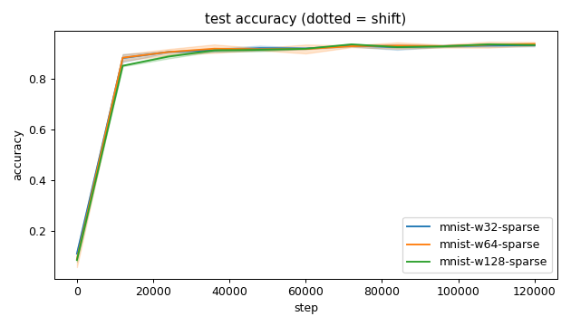
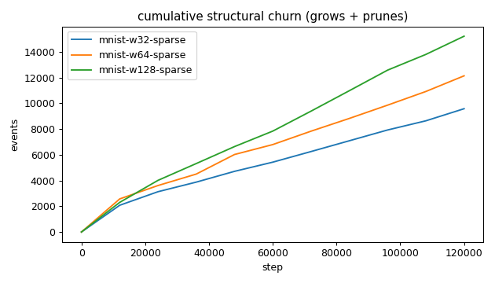
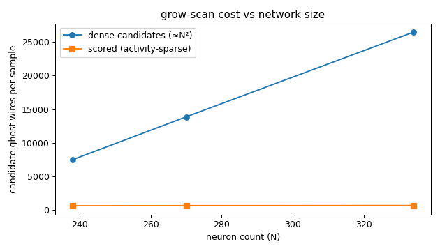
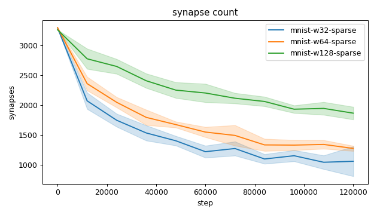
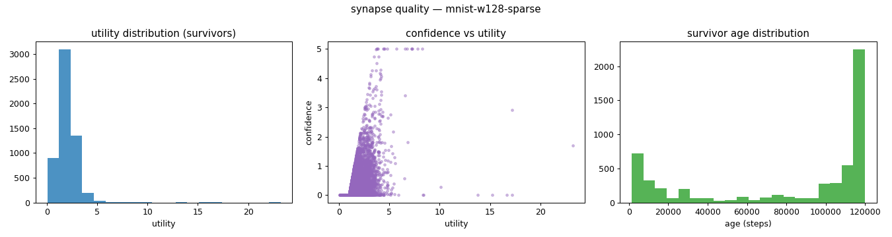
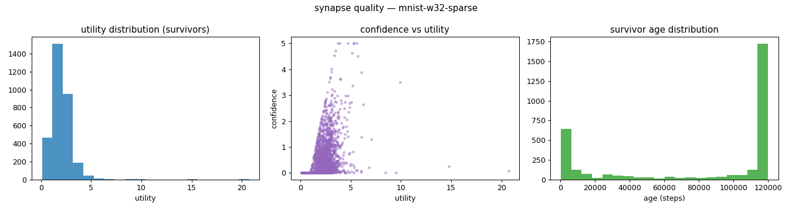
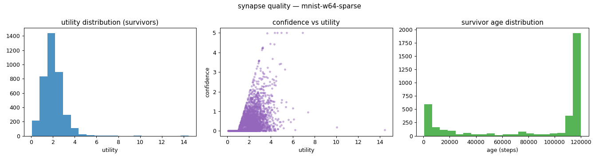
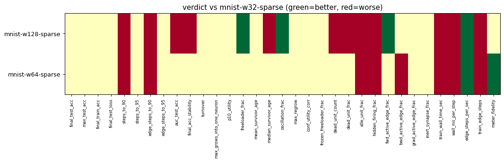

# Evaluation run: mnist14-scale-24k-120k

- **Date:** 2026-06-14 17:44:10
- **Variants:** mnist-w128-sparse, mnist-w32-sparse, mnist-w64-sparse  (baseline: mnist-w32-sparse)
- **Seeds:** 3  |  **Dataset:** mnist14  |  **Steps:** 120000 (+0 shift)
- **Commit:** 9b76fc4
- **Command:** `python evaluate.py --variants mnist-w32-sparse,mnist-w64-sparse,mnist-w128-sparse --baseline mnist-w32-sparse --dataset mnist14 --layers 196,16,10 --density 1.0 --seeds 3 --steps 120000 --record-every 12000 --points 24000 --train-eval-cap 2000 --no-cache --publish --run-name mnist14-scale-24k-120k`

## Key metrics

| Metric | What it means | mnist-w128-sparse | mnist-w32-sparse (baseline) | mnist-w64-sparse |
|---|---|---|---|---|
| final_test_acc ↑ | held-out accuracy at the end of the run | 0.931 ± 0.001 ≈ | 0.931 ± 0.005 | 0.935 ± 0.007 ≈ |
| steps_to_90 ↓ | steps to first reach 90% test accuracy | 36001 ± 0 ▼ | 20001 ± 5657 | 32001 ± 5657 ▼ |
| steps_to_95 ↓ | steps to first reach 95% test accuracy | ∞ ± — ? | ∞ ± — | ∞ ± — ? |
| auc_test_acc ↑ | area under the test-accuracy curve (speed + level) | 0.870 ± 0.001 ▼ | 0.876 ± 0.002 | 0.876 ± 0.008 ≈ |
| edge_steps_to_90 ↓ | live-edge training work to first reach 90% test accuracy | 99433676 ± 2220829 ▼ | 47609240 ± 9783397 | 76302375 ± 11386573 ▼ |
| edge_steps_to_95 ↓ | live-edge training work to first reach 95% test accuracy | ∞ ± — ? | ∞ ± — | ∞ ± — ? |
| synapse_count_end | live synapses at the end | 1866 ± 105.718 ≈ | 1059 ± 250.364 | 1275 ± 43.290 ≈ |
| effective_density | live edges as a fraction of fully-connected | 0.071 ± 0.004 ≈ | 0.161 ± 0.038 | 0.097 ± 0.003 ≈ |
| avg_live_edges | time-average live edges during training | 2289 ± 71.693 ≈ | 1457 ± 95.402 | 1730 ± 73.047 ≈ |
| train_edge_steps ↓ | cumulative live-edge steps over training | 274683800 ± 8603274 ▼ | 174834333 ± 11448287 | 207558867 ± 8765733 ▼ |
| train_wall_time_sec ↓ | training-loop wall time only, excluding eval snapshots | 670.314 ± 21.222 ▼ | 462.845 ± 24.430 | 538.143 ± 17.235 ▼ |
| wall_ms_per_step ↓ | training-loop milliseconds per SGD step | 5.586 ± 0.177 ▼ | 3.857 ± 0.204 | 4.484 ± 0.144 ▼ |
| edge_steps_per_sec ↑ | live-edge steps processed per wall-clock second | 409790 ± 1065 ▲ | 377492 ± 4974 | 385571 ± 3876 ▲ |
| ghost_dense_cost | candidate ghost wires the grow-scan must consider (~N²) | 26462 ± 105.718 ≈ | 7493 ± 250.364 | 13869 ± 43.290 ≈ |
| ghost_pairs_scored | candidate wires actually scored after activity+demand pruning | 693.093 ± 4.892 ≈ | 654.634 ± 21.236 | 682.214 ± 2.204 ≈ |
| mean_neuron_activation | avg hidden-neuron ReLU output on test data (neuron value) | 0.458 ± 0.006 ≈ | 0.814 ± 0.042 | 0.594 ± 0.034 ≈ |
| dead_unit_frac ↓ | fraction of hidden neurons that never fire (scale-free) | 0.036 ± 0.013 ▼ | 0.010 ± 0.015 | 0.036 ± 0.032 ≈ |
| hidden_firing_frac ↓ | fraction of hidden ReLUs active on test data | 0.415 ± 0.001 ▼ | 0.385 ± 0.017 | 0.426 ± 0.023 ▼ |
| fwd_active_edge_frac ↓ | fraction of live edges whose pre neuron is active | 0.910 ± 0.003 ▲ | 0.923 ± 0.008 | 0.916 ± 0.002 ≈ |
| bwd_active_edge_frac ↓ | fraction of live edges whose post delta is nonzero | 0.589 ± 0.018 ≈ | 0.611 ± 0.015 | 0.631 ± 0.007 ▼ |
| grad_active_edge_frac ↓ | fraction of live edges with nonzero weight gradient | 0.505 ± 0.018 ≈ | 0.534 ± 0.022 | 0.549 ± 0.008 ≈ |
| idle_unit_frac ↓ | fraction of hidden neurons dead OR outputless (not in service) | 0.216 ± 0.046 ▼ | 0.010 ± 0.015 | 0.109 ± 0.026 ▼ |
| n_recycle_events | dead-unit recycles fired over the run (sleep recycling) | 0 ± 0 ≈ | 0 ± 0 | 0 ± 0 ≈ |
| recycled_rehired_frac | of recycled units, fraction back in service at the end | — ± — ? | — ± — | — ± — ? |
| n_startle_events | demand-spike hiring alarms fired (startle growth) | 0 ± 0 ≈ | 0 ± 0 | 0 ± 0 ≈ |
| n_arousal_events | post-startle refinement windows that ran grow-only passes | 0 ± 0 ≈ | 0 ± 0 | 0 ± 0 ≈ |
| max_grows_into_one_neuron ↓ | most times one neuron was grown into (churn) | 358.667 ± 85.846 ≈ | 328 ± 32.259 | 364.667 ± 37.862 ≈ |
| oscillation_frac ↓ | fraction of grown edges grown ≥2× (thrash) | 0.328 ± 0.023 ▲ | 0.367 ± 0.025 | 0.342 ± 0.028 ≈ |
| freeloader_frac ↓ | fraction of synapses below the prune-utility floor | 0.009 ± 0.006 ▲ | 0.019 ± 0.005 | 0.025 ± 0.014 ≈ |
| conf_utility_corr ↑ | corr of confidence with real utility (calibration) | 0.419 ± 0.069 ≈ | 0.479 ± 0.084 | 0.480 ± 0.018 ≈ |
| dead_unit_count ↓ | hidden neurons that never fire on test data | 4.667 ± 1.700 ▼ | 0.333 ± 0.471 | 2.333 ± 2.055 ≈ |

## Full scorecard

| Metric | mnist-w128-sparse | mnist-w32-sparse (baseline) | mnist-w64-sparse |
|---|---|---|---|
| **Prediction performance** | | | |
| final_test_acc ↑ | 0.931 ± 0.001 ≈ | 0.931 ± 0.005 | 0.935 ± 0.007 ≈ |
| max_test_acc ↑ | 0.937 ± 0.000 ≈ | 0.933 ± 0.004 | 0.938 ± 0.009 ≈ |
| final_train_acc ↑ | 0.947 ± 0.005 ≈ | 0.941 ± 0.003 | 0.945 ± 0.002 ≈ |
| final_test_loss ↓ | 0.242 ± 0.005 ≈ | 0.271 ± 0.029 | 0.253 ± 0.024 ≈ |
| **Training efficacy** | | | |
| steps_to_90 ↓ | 36001 ± 0 ▼ | 20001 ± 5657 | 32001 ± 5657 ▼ |
| steps_to_95 ↓ | ∞ ± — ? | ∞ ± — | ∞ ± — ? |
| edge_steps_to_90 ↓ | 99433676 ± 2220829 ▼ | 47609240 ± 9783397 | 76302375 ± 11386573 ▼ |
| edge_steps_to_95 ↓ | ∞ ± — ? | ∞ ± — | ∞ ± — ? |
| auc_test_acc ↑ | 0.870 ± 0.001 ▼ | 0.876 ± 0.002 | 0.876 ± 0.008 ≈ |
| final_acc_stability ↓ | 0.025 ± 0.001 ▼ | 0.016 ± 0.004 | 0.016 ± 0.003 ≈ |
| **Synapse structure** | | | |
| synapse_count_start | 3265 ± 1.247 ≈ | 3296 ± 0 | 3301 ± 1.247 ≈ |
| synapse_count_peak | 3265 ± 1.247 ≈ | 3296 ± 0 | 3301 ± 1.247 ≈ |
| synapse_count_end | 1866 ± 105.718 ≈ | 1059 ± 250.364 | 1275 ± 43.290 ≈ |
| n_grow_events | 6910 ± 789.587 ≈ | 3673 ± 410.886 | 5056 ± 399.734 ≈ |
| n_prune_events | 8309 ± 741.807 ≈ | 5910 ± 420.611 | 7083 ± 435.456 ≈ |
| n_startle_events | 0 ± 0 ≈ | 0 ± 0 | 0 ± 0 ≈ |
| n_arousal_events | 0 ± 0 ≈ | 0 ± 0 | 0 ± 0 ≈ |
| distinct_neurons_grown | 79.667 ± 3.300 ≈ | 39.667 ± 1.247 | 57.667 ± 1.700 ≈ |
| turnover ↓ | 6.557 ± 0.493 ≈ | 6.272 ± 0.757 | 6.877 ± 0.749 ≈ |
| max_grows_into_one_neuron ↓ | 358.667 ± 85.846 ≈ | 328 ± 32.259 | 364.667 ± 37.862 ≈ |
| mean_fan_in | 13.524 ± 0.766 ≈ | 25.214 ± 5.961 | 17.230 ± 0.585 ≈ |
| mean_fan_out | 5.760 ± 0.326 ≈ | 4.645 ± 1.098 | 4.904 ± 0.166 ≈ |
| effective_density | 0.071 ± 0.004 ≈ | 0.161 ± 0.038 | 0.097 ± 0.003 ≈ |
| avg_live_edges | 2289 ± 71.693 ≈ | 1457 ± 95.402 | 1730 ± 73.047 ≈ |
| **Synapse quality** | | | |
| p10_utility ↑ | 1.081 ± 0.043 ≈ | 1.032 ± 0.174 | 1.018 ± 0.146 ≈ |
| freeloader_frac ↓ | 0.009 ± 0.006 ▲ | 0.019 ± 0.005 | 0.025 ± 0.014 ≈ |
| mean_survivor_age ↑ | 81074 ± 4319 ≈ | 82120 ± 7569 | 82907 ± 1120 ≈ |
| median_survivor_age ↑ | 108866 ± 3030 ▼ | 117800 ± 3112 | 113732 ± 1482 ≈ |
| mean_pruned_lifespan | 14970 ± 871.106 ≈ | 15259 ± 1032 | 14488 ± 1758 ≈ |
| oscillation_frac ↓ | 0.328 ± 0.023 ▲ | 0.367 ± 0.025 | 0.342 ± 0.028 ≈ |
| max_regrow ↓ | 5.333 ± 0.471 ≈ | 5.667 ± 0.471 | 6 ± 0 ≈ |
| conf_utility_corr ↑ | 0.419 ± 0.069 ≈ | 0.479 ± 0.084 | 0.480 ± 0.018 ≈ |
| frozen_freeloader_frac ↓ | 0 ± 0 ≈ | 0 ± 0 | 0 ± 0 ≈ |
| dead_unit_count ↓ | 4.667 ± 1.700 ▼ | 0.333 ± 0.471 | 2.333 ± 2.055 ≈ |
| dead_unit_frac ↓ | 0.036 ± 0.013 ▼ | 0.010 ± 0.015 | 0.036 ± 0.032 ≈ |
| idle_unit_frac ↓ | 0.216 ± 0.046 ▼ | 0.010 ± 0.015 | 0.109 ± 0.026 ▼ |
| mean_neuron_activation | 0.458 ± 0.006 ≈ | 0.814 ± 0.042 | 0.594 ± 0.034 ≈ |
| hidden_firing_frac ↓ | 0.415 ± 0.001 ▼ | 0.385 ± 0.017 | 0.426 ± 0.023 ▼ |
| fwd_active_edge_frac ↓ | 0.910 ± 0.003 ▲ | 0.923 ± 0.008 | 0.916 ± 0.002 ≈ |
| bwd_active_edge_frac ↓ | 0.589 ± 0.018 ≈ | 0.611 ± 0.015 | 0.631 ± 0.007 ▼ |
| grad_active_edge_frac ↓ | 0.505 ± 0.018 ≈ | 0.534 ± 0.022 | 0.549 ± 0.008 ≈ |
| inert_synapse_frac ↓ | 0 ± 0 ≈ | 0 ± 0 | 0 ± 0 ≈ |
| used_vs_allocated | 0.572 ± 0.032 ≈ | 0.321 ± 0.076 | 0.386 ± 0.013 ≈ |
| n_recycle_events | 0 ± 0 ≈ | 0 ± 0 | 0 ± 0 ≈ |
| recycled_rehired_frac | — ± — ? | — ± — | — ± — ? |
| **Compute cost** | | | |
| train_wall_time_sec ↓ | 670.314 ± 21.222 ▼ | 462.845 ± 24.430 | 538.143 ± 17.235 ▼ |
| wall_ms_per_step ↓ | 5.586 ± 0.177 ▼ | 3.857 ± 0.204 | 4.484 ± 0.144 ▼ |
| edge_steps_per_sec ↑ | 409790 ± 1065 ▲ | 377492 ± 4974 | 385571 ± 3876 ▲ |
| train_edge_steps ↓ | 274683800 ± 8603274 ▼ | 174834333 ± 11448287 | 207558867 ± 8765733 ▼ |
| ghost_dense_cost | 26462 ± 105.718 ≈ | 7493 ± 250.364 | 13869 ± 43.290 ≈ |
| ghost_pairs_scored | 693.093 ± 4.892 ≈ | 654.634 ± 21.236 | 682.214 ± 2.204 ≈ |
| **Signal sanity** | | | |
| meter_fidelity ↑ | 0.519 ± 0.157 ≈ | 0.500 ± 0.051 | 0.599 ± 0.004 ▲ |

Baseline: **mnist-w32-sparse**. ▲ better / ▼ worse / ≈ no clear difference vs baseline (95% bootstrap CI of the mean difference). Cells show mean ± std across seeds.

## Charts

### acc_curves

### churn_curves

### cost_scaling

### count_curves

### quality_mnist-w128-sparse

### quality_mnist-w32-sparse

### quality_mnist-w64-sparse

### verdict_heatmap

