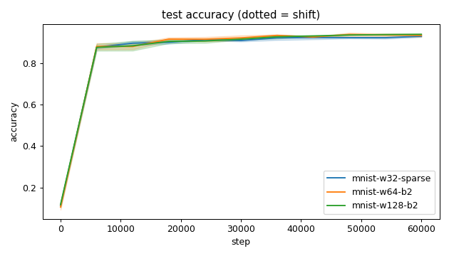
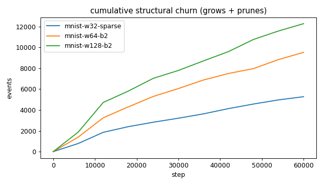
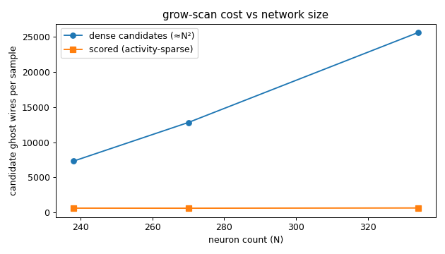
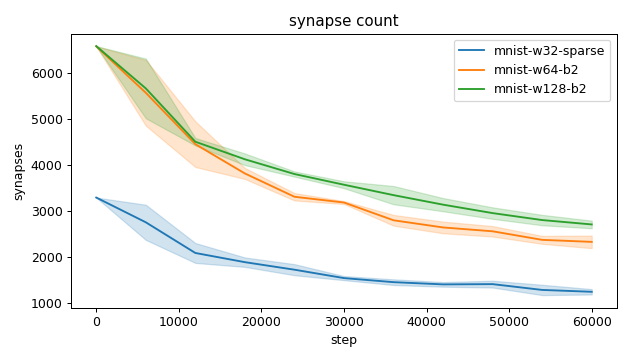
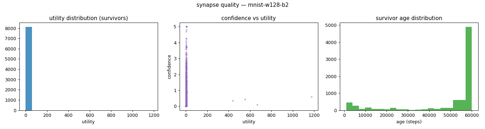
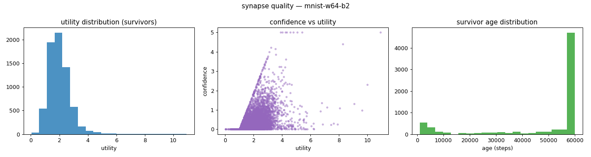
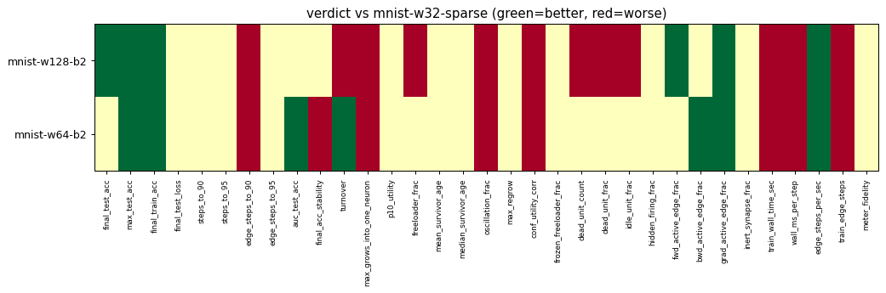

# Evaluation run: mnist14-widen-budget

- **Date:** 2026-06-14 17:55:58
- **Variants:** mnist-w128-b2, mnist-w32-sparse, mnist-w64-b2  (baseline: mnist-w32-sparse)
- **Seeds:** 3  |  **Dataset:** mnist14  |  **Steps:** 60000 (+0 shift)
- **Commit:** 8224933
- **Command:** `python evaluate.py --variants mnist-w32-sparse,mnist-w64-b2,mnist-w128-b2 --baseline mnist-w32-sparse --dataset mnist14 --layers 196,16,10 --density 1.0 --seeds 3 --steps 60000 --record-every 6000 --points 12000 --train-eval-cap 2000 --no-cache --publish --run-name mnist14-widen-budget`

## Key metrics

| Metric | What it means | mnist-w128-b2 | mnist-w32-sparse (baseline) | mnist-w64-b2 |
|---|---|---|---|---|
| final_test_acc ↑ | held-out accuracy at the end of the run | 0.938 ± 0.002 ▲ | 0.929 ± 0.004 | 0.933 ± 0.007 ≈ |
| steps_to_90 ↓ | steps to first reach 90% test accuracy | 20001 ± 7483 ≈ | 18001 ± 4899 | 18001 ± 0 ≈ |
| steps_to_95 ↓ | steps to first reach 95% test accuracy | ∞ ± — ? | ∞ ± — | ∞ ± — ? |
| auc_test_acc ↑ | area under the test-accuracy curve (speed + level) | 0.874 ± 0.006 ≈ | 0.870 ± 0.004 | 0.876 ± 0.002 ▲ |
| edge_steps_to_90 ↓ | live-edge training work to first reach 90% test accuracy | 101147892 ± 29372485 ▼ | 43449902 ± 7185527 | 93040655 ± 4589087 ▼ |
| edge_steps_to_95 ↓ | live-edge training work to first reach 95% test accuracy | ∞ ± — ? | ∞ ± — | ∞ ± — ? |
| synapse_count_end | live synapses at the end | 2710 ± 83.359 ≈ | 1242 ± 58.589 | 2330 ± 136.714 ≈ |
| effective_density | live edges as a fraction of fully-connected | 0.103 ± 0.003 ≈ | 0.188 ± 0.009 | 0.177 ± 0.010 ≈ |
| avg_live_edges | time-average live edges during training | 3885 ± 61.644 ≈ | 1778 ± 33.699 | 3540 ± 52.880 ≈ |
| train_edge_steps ↓ | cumulative live-edge steps over training | 233125600 ± 3698680 ▼ | 106670067 ± 2021965 | 212424301 ± 3172850 ▼ |
| train_wall_time_sec ↓ | training-loop wall time only, excluding eval snapshots | 545.636 ± 10.480 ▼ | 278.977 ± 2.952 | 500.716 ± 9.985 ▼ |
| wall_ms_per_step ↓ | training-loop milliseconds per SGD step | 9.094 ± 0.175 ▼ | 4.650 ± 0.049 | 8.345 ± 0.166 ▼ |
| edge_steps_per_sec ↑ | live-edge steps processed per wall-clock second | 427283 ± 1623 ▲ | 382333 ± 3748 | 424359 ± 8313 ▲ |
| ghost_dense_cost | candidate ghost wires the grow-scan must consider (~N²) | 25618 ± 83.359 ≈ | 7310 ± 58.589 | 12814 ± 136.714 ≈ |
| ghost_pairs_scored | candidate wires actually scored after activity+demand pruning | 655.692 ± 6.286 ≈ | 631.577 ± 6.126 | 621.726 ± 11.102 ≈ |
| mean_neuron_activation | avg hidden-neuron ReLU output on test data (neuron value) | 6788 ± 9599 ≈ | 0.913 ± 0.055 | 0.765 ± 0.026 ≈ |
| dead_unit_frac ↓ | fraction of hidden neurons that never fire (scale-free) | 0.010 ± 0.004 ▼ | 0 ± 0 | 0 ± 0 ≈ |
| hidden_firing_frac ↓ | fraction of hidden ReLUs active on test data | 0.433 ± 0.008 ≈ | 0.417 ± 0.022 | 0.425 ± 0.009 ≈ |
| fwd_active_edge_frac ↓ | fraction of live edges whose pre neuron is active | 0.907 ± 0.002 ▲ | 0.930 ± 0.002 | 0.931 ± 0.002 ≈ |
| bwd_active_edge_frac ↓ | fraction of live edges whose post delta is nonzero | 0.603 ± 0.006 ≈ | 0.602 ± 0.007 | 0.569 ± 0.017 ▲ |
| grad_active_edge_frac ↓ | fraction of live edges with nonzero weight gradient | 0.517 ± 0.006 ▲ | 0.531 ± 0.008 | 0.501 ± 0.017 ▲ |
| idle_unit_frac ↓ | fraction of hidden neurons dead OR outputless (not in service) | 0.104 ± 0.021 ▼ | 0 ± 0 | 0.005 ± 0.007 ≈ |
| n_recycle_events | dead-unit recycles fired over the run (sleep recycling) | 0 ± 0 ≈ | 0 ± 0 | 0 ± 0 ≈ |
| recycled_rehired_frac | of recycled units, fraction back in service at the end | — ± — ? | — ± — | — ± — ? |
| n_startle_events | demand-spike hiring alarms fired (startle growth) | 0 ± 0 ≈ | 0 ± 0 | 0.333 ± 0.471 ≈ |
| n_arousal_events | post-startle refinement windows that ran grow-only passes | 0 ± 0 ≈ | 0 ± 0 | 0 ± 0 ≈ |
| max_grows_into_one_neuron ↓ | most times one neuron was grown into (churn) | 325 ± 23.509 ▼ | 162 ± 27.604 | 200.667 ± 13.123 ▼ |
| oscillation_frac ↓ | fraction of grown edges grown ≥2× (thrash) | 0.220 ± 0.014 ▼ | 0.148 ± 0.030 | 0.210 ± 0.025 ▼ |
| freeloader_frac ↓ | fraction of synapses below the prune-utility floor | 0.081 ± 0.109 ▼ | 0.002 ± 0.001 | 0.004 ± 0.001 ≈ |
| conf_utility_corr ↑ | corr of confidence with real utility (calibration) | 0.274 ± 0.176 ▼ | 0.514 ± 0.017 | 0.456 ± 0.042 ▼ |
| dead_unit_count ↓ | hidden neurons that never fire on test data | 1.333 ± 0.471 ▼ | 0 ± 0 | 0 ± 0 ≈ |

## Full scorecard

| Metric | mnist-w128-b2 | mnist-w32-sparse (baseline) | mnist-w64-b2 |
|---|---|---|---|
| **Prediction performance** | | | |
| final_test_acc ↑ | 0.938 ± 0.002 ▲ | 0.929 ± 0.004 | 0.933 ± 0.007 ≈ |
| max_test_acc ↑ | 0.940 ± 0.000 ▲ | 0.931 ± 0.006 | 0.942 ± 0.004 ▲ |
| final_train_acc ↑ | 0.956 ± 0.007 ▲ | 0.942 ± 0.003 | 0.954 ± 0.002 ▲ |
| final_test_loss ↓ | 0.276 ± 0.050 ≈ | 0.297 ± 0.023 | 0.297 ± 0.048 ≈ |
| **Training efficacy** | | | |
| steps_to_90 ↓ | 20001 ± 7483 ≈ | 18001 ± 4899 | 18001 ± 0 ≈ |
| steps_to_95 ↓ | ∞ ± — ? | ∞ ± — | ∞ ± — ? |
| edge_steps_to_90 ↓ | 101147892 ± 29372485 ▼ | 43449902 ± 7185527 | 93040655 ± 4589087 ▼ |
| edge_steps_to_95 ↓ | ∞ ± — ? | ∞ ± — | ∞ ± — ? |
| auc_test_acc ↑ | 0.874 ± 0.006 ≈ | 0.870 ± 0.004 | 0.876 ± 0.002 ▲ |
| final_acc_stability ↓ | 0.022 ± 0.006 ≈ | 0.016 ± 0.003 | 0.022 ± 0.004 ▼ |
| **Synapse structure** | | | |
| synapse_count_start | 6597 ± 1.247 ≈ | 3296 ± 0 | 6592 ± 0 ≈ |
| synapse_count_peak | 6597 ± 1.247 ≈ | 3296 ± 0 | 6592 ± 0 ≈ |
| synapse_count_end | 2710 ± 83.359 ≈ | 1242 ± 58.589 | 2330 ± 136.714 ≈ |
| n_grow_events | 4200 ± 120.594 ≈ | 1611 ± 161.897 | 2634 ± 143.292 ≈ |
| n_prune_events | 8087 ± 96.003 ≈ | 3665 ± 157.114 | 6896 ± 279.610 ≈ |
| n_startle_events | 0 ± 0 ≈ | 0 ± 0 | 0.333 ± 0.471 ≈ |
| n_arousal_events | 0 ± 0 ≈ | 0 ± 0 | 0 ± 0 ≈ |
| distinct_neurons_grown | 64.667 ± 2.625 ≈ | 38 ± 0.816 | 56.333 ± 1.247 ≈ |
| turnover ↓ | 3.125 ± 0.074 ▼ | 2.888 ± 0.092 | 2.645 ± 0.135 ▲ |
| max_grows_into_one_neuron ↓ | 325 ± 23.509 ▼ | 162 ± 27.604 | 200.667 ± 13.123 ▼ |
| mean_fan_in | 19.638 ± 0.604 ≈ | 29.571 ± 1.395 | 31.486 ± 1.847 ≈ |
| mean_fan_out | 8.364 ± 0.257 ≈ | 5.447 ± 0.257 | 8.962 ± 0.526 ≈ |
| effective_density | 0.103 ± 0.003 ≈ | 0.188 ± 0.009 | 0.177 ± 0.010 ≈ |
| avg_live_edges | 3885 ± 61.644 ≈ | 1778 ± 33.699 | 3540 ± 52.880 ≈ |
| **Synapse quality** | | | |
| p10_utility ↑ | 0.816 ± 0.454 ≈ | 1.158 ± 0.089 | 1.171 ± 0.020 ≈ |
| freeloader_frac ↓ | 0.081 ± 0.109 ▼ | 0.002 ± 0.001 | 0.004 ± 0.001 ≈ |
| mean_survivor_age ↑ | 49039 ± 820.625 ≈ | 47948 ± 2909 | 48485 ± 547.850 ≈ |
| median_survivor_age ↑ | 60000 ± 0 ≈ | 60000 ± 0 | 60000 ± 0 ≈ |
| mean_pruned_lifespan | 12389 ± 333.356 ≈ | 12821 ± 1203 | 14431 ± 274.916 ≈ |
| oscillation_frac ↓ | 0.220 ± 0.014 ▼ | 0.148 ± 0.030 | 0.210 ± 0.025 ▼ |
| max_regrow ↓ | 4 ± 0.816 ≈ | 3.333 ± 0.471 | 3.333 ± 0.471 ≈ |
| conf_utility_corr ↑ | 0.274 ± 0.176 ▼ | 0.514 ± 0.017 | 0.456 ± 0.042 ▼ |
| frozen_freeloader_frac ↓ | 0 ± 0 ≈ | 0 ± 0 | 0 ± 0 ≈ |
| dead_unit_count ↓ | 1.333 ± 0.471 ▼ | 0 ± 0 | 0 ± 0 ≈ |
| dead_unit_frac ↓ | 0.010 ± 0.004 ▼ | 0 ± 0 | 0 ± 0 ≈ |
| idle_unit_frac ↓ | 0.104 ± 0.021 ▼ | 0 ± 0 | 0.005 ± 0.007 ≈ |
| mean_neuron_activation | 6788 ± 9599 ≈ | 0.913 ± 0.055 | 0.765 ± 0.026 ≈ |
| hidden_firing_frac ↓ | 0.433 ± 0.008 ≈ | 0.417 ± 0.022 | 0.425 ± 0.009 ≈ |
| fwd_active_edge_frac ↓ | 0.907 ± 0.002 ▲ | 0.930 ± 0.002 | 0.931 ± 0.002 ≈ |
| bwd_active_edge_frac ↓ | 0.603 ± 0.006 ≈ | 0.602 ± 0.007 | 0.569 ± 0.017 ▲ |
| grad_active_edge_frac ↓ | 0.517 ± 0.006 ▲ | 0.531 ± 0.008 | 0.501 ± 0.017 ▲ |
| inert_synapse_frac ↓ | 0 ± 0 ≈ | 0 ± 0 | 0 ± 0 ≈ |
| used_vs_allocated | 0.411 ± 0.013 ≈ | 0.377 ± 0.018 | 0.353 ± 0.021 ≈ |
| n_recycle_events | 0 ± 0 ≈ | 0 ± 0 | 0 ± 0 ≈ |
| recycled_rehired_frac | — ± — ? | — ± — | — ± — ? |
| **Compute cost** | | | |
| train_wall_time_sec ↓ | 545.636 ± 10.480 ▼ | 278.977 ± 2.952 | 500.716 ± 9.985 ▼ |
| wall_ms_per_step ↓ | 9.094 ± 0.175 ▼ | 4.650 ± 0.049 | 8.345 ± 0.166 ▼ |
| edge_steps_per_sec ↑ | 427283 ± 1623 ▲ | 382333 ± 3748 | 424359 ± 8313 ▲ |
| train_edge_steps ↓ | 233125600 ± 3698680 ▼ | 106670067 ± 2021965 | 212424301 ± 3172850 ▼ |
| ghost_dense_cost | 25618 ± 83.359 ≈ | 7310 ± 58.589 | 12814 ± 136.714 ≈ |
| ghost_pairs_scored | 655.692 ± 6.286 ≈ | 631.577 ± 6.126 | 621.726 ± 11.102 ≈ |
| **Signal sanity** | | | |
| meter_fidelity ↑ | 0.382 ± 0.314 ≈ | 0.501 ± 0.132 | 0.473 ± 0.077 ≈ |

Baseline: **mnist-w32-sparse**. ▲ better / ▼ worse / ≈ no clear difference vs baseline (95% bootstrap CI of the mean difference). Cells show mean ± std across seeds.

## Charts

### acc_curves

### churn_curves

### cost_scaling

### count_curves

### quality_mnist-w128-b2

### quality_mnist-w32-sparse

### quality_mnist-w64-b2

### verdict_heatmap

