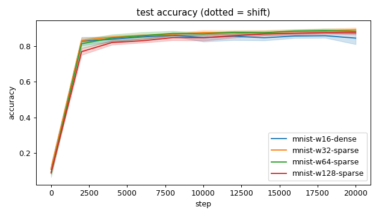
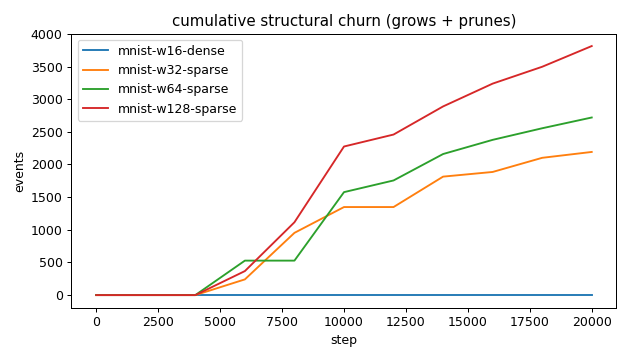
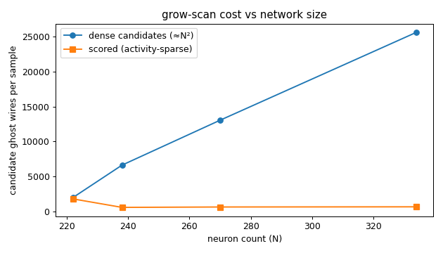
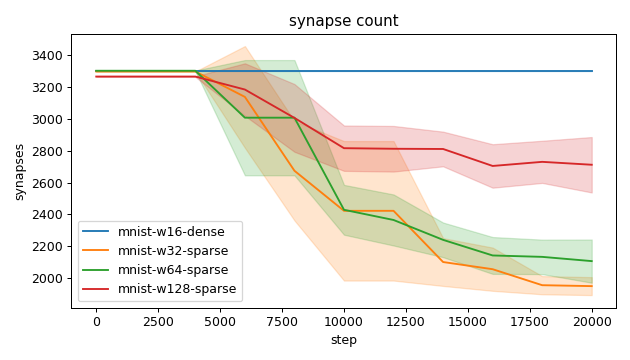
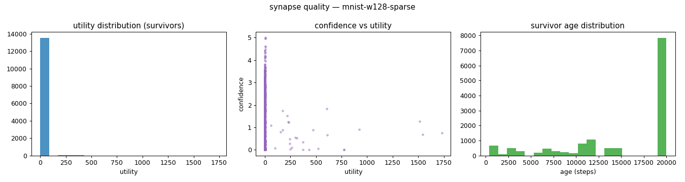
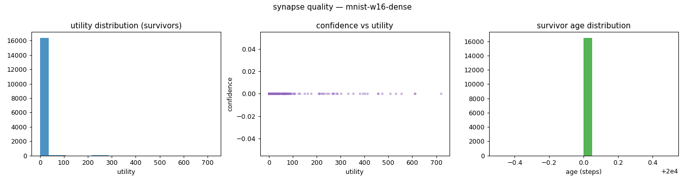
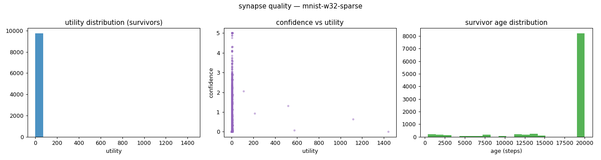
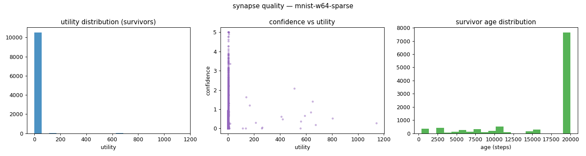
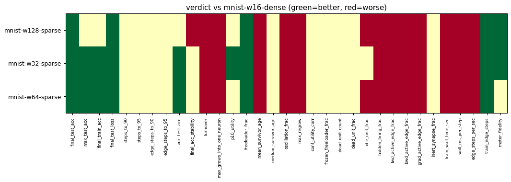

# Evaluation run: mnist14-width-sweep

- **Date:** 2026-06-14 16:36:57
- **Variants:** mnist-w128-sparse, mnist-w16-dense, mnist-w32-sparse, mnist-w64-sparse  (baseline: mnist-w16-dense)
- **Seeds:** 5  |  **Dataset:** mnist14  |  **Steps:** 20000 (+0 shift)
- **Commit:** 447ca55
- **Command:** `python evaluate.py --variants mnist-w16-dense,mnist-w32-sparse,mnist-w64-sparse,mnist-w128-sparse --baseline mnist-w16-dense --dataset mnist14 --layers 196,16,10 --density 1.0 --seeds 5 --steps 20000 --record-every 2000 --points 3000 --no-cache --publish --run-name mnist14-width-sweep`

## Key metrics

| Metric | What it means | mnist-w128-sparse | mnist-w16-dense (baseline) | mnist-w32-sparse | mnist-w64-sparse |
|---|---|---|---|---|---|
| final_test_acc ↑ | held-out accuracy at the end of the run | 0.876 ± 0.010 ▲ | 0.845 ± 0.034 | 0.893 ± 0.012 ▲ | 0.884 ± 0.011 ▲ |
| steps_to_90 ↓ | steps to first reach 90% test accuracy | ∞ ± — ? | ∞ ± — | ∞ ± — ? | ∞ ± — ? |
| steps_to_95 ↓ | steps to first reach 95% test accuracy | ∞ ± — ? | ∞ ± — | ∞ ± — ? | ∞ ± — ? |
| auc_test_acc ↑ | area under the test-accuracy curve (speed + level) | 0.808 ± 0.008 ≈ | 0.813 ± 0.011 | 0.831 ± 0.008 ▲ | 0.827 ± 0.011 ▲ |
| edge_steps_to_90 ↓ | live-edge training work to first reach 90% test accuracy | ∞ ± — ? | ∞ ± — | ∞ ± — ? | ∞ ± — ? |
| edge_steps_to_95 ↓ | live-edge training work to first reach 95% test accuracy | ∞ ± — ? | ∞ ± — | ∞ ± — ? | ∞ ± — ? |
| synapse_count_end | live synapses at the end | 2711 ± 173.723 ≈ | 3296 ± 0 | 1951 ± 56.252 ≈ | 2107 ± 135.320 ≈ |
| effective_density | live edges as a fraction of fully-connected | 0.103 ± 0.007 ≈ | 1 ± 0 | 0.296 ± 0.009 ≈ | 0.160 ± 0.010 ≈ |
| avg_live_edges | time-average live edges during training | 2958 ± 67.274 ≈ | 3296 ± 0 | 2600 ± 151.819 ≈ | 2672 ± 139.573 ≈ |
| train_edge_steps ↓ | cumulative live-edge steps over training | 59154600 ± 1345540 ▲ | 65920000 ± 0 | 52008520 ± 3036535 ▲ | 53434160 ± 2791596 ▲ |
| train_wall_time_sec ↓ | training-loop wall time only, excluding eval snapshots | 153.326 ± 2.758 ▼ | 84.570 ± 0.837 | 147.426 ± 7.605 ▼ | 151.931 ± 6.802 ▼ |
| wall_ms_per_step ↓ | training-loop milliseconds per SGD step | 7.666 ± 0.138 ▼ | 4.228 ± 0.042 | 7.371 ± 0.380 ▼ | 7.596 ± 0.340 ▼ |
| edge_steps_per_sec ↑ | live-edge steps processed per wall-clock second | 385807 ± 5112 ▼ | 779553 ± 7738 | 352669 ± 3161 ▼ | 351583 ± 2981 ▼ |
| ghost_dense_cost | candidate ghost wires the grow-scan must consider (~N²) | 25617 ± 173.723 ≈ | 1960 ± 0 | 6601 ± 56.252 ≈ | 13037 ± 135.320 ≈ |
| ghost_pairs_scored | candidate wires actually scored after activity+demand pruning | 630.265 ± 15.696 ≈ | 1765 ± 11.574 | 548.576 ± 10.075 ≈ | 605.815 ± 5.357 ≈ |
| mean_neuron_activation | avg hidden-neuron ReLU output on test data (neuron value) | 58390 ± 37804 ≈ | 246190 ± 133294 | 17965 ± 26837 ≈ | 37323 ± 28843 ≈ |
| dead_unit_frac ↓ | fraction of hidden neurons that never fire (scale-free) | 0 ± 0 ≈ | 0 ± 0 | 0 ± 0 ≈ | 0 ± 0 ≈ |
| hidden_firing_frac ↓ | fraction of hidden ReLUs active on test data | 0.507 ± 0.009 ▼ | 0.422 ± 0.020 | 0.489 ± 0.012 ▼ | 0.505 ± 0.010 ▼ |
| fwd_active_edge_frac ↓ | fraction of live edges whose pre neuron is active | 0.907 ± 0.004 ▼ | 0.882 ± 0.003 | 0.945 ± 0.003 ▼ | 0.927 ± 0.005 ▼ |
| bwd_active_edge_frac ↓ | fraction of live edges whose post delta is nonzero | 0.635 ± 0.008 ▼ | 0.450 ± 0.019 | 0.578 ± 0.020 ▼ | 0.609 ± 0.016 ▼ |
| grad_active_edge_frac ↓ | fraction of live edges with nonzero weight gradient | 0.558 ± 0.009 ▼ | 0.384 ± 0.019 | 0.527 ± 0.019 ▼ | 0.546 ± 0.017 ▼ |
| idle_unit_frac ↓ | fraction of hidden neurons dead OR outputless (not in service) | 0.086 ± 0.043 ▼ | 0 ± 0 | 0 ± 0 ≈ | 0.034 ± 0.025 ▼ |
| n_recycle_events | dead-unit recycles fired over the run (sleep recycling) | 0 ± 0 ≈ | 0 ± 0 | 0 ± 0 ≈ | 0 ± 0 ≈ |
| recycled_rehired_frac | of recycled units, fraction back in service at the end | — ± — ? | — ± — | — ± — ? | — ± — ? |
| n_startle_events | demand-spike hiring alarms fired (startle growth) | 0 ± 0 ≈ | 0 ± 0 | 0 ± 0 ≈ | 0 ± 0 ≈ |
| n_arousal_events | post-startle refinement windows that ran grow-only passes | 0 ± 0 ≈ | 0 ± 0 | 0 ± 0 ≈ | 0 ± 0 ≈ |
| max_grows_into_one_neuron ↓ | most times one neuron was grown into (churn) | 158 ± 10.257 ▼ | 0 ± 0 | 67.200 ± 19.333 ▼ | 99.200 ± 15.587 ▼ |
| oscillation_frac ↓ | fraction of grown edges grown ≥2× (thrash) | 0.022 ± 0.010 ▼ | 0 ± 0 | 0.015 ± 0.019 ▼ | 0.022 ± 0.019 ▼ |
| freeloader_frac ↓ | fraction of synapses below the prune-utility floor | 0.322 ± 0.022 ▲ | 0.376 ± 0.006 | 0.112 ± 0.132 ▲ | 0.229 ± 0.112 ▲ |
| conf_utility_corr ↑ | corr of confidence with real utility (calibration) | 0.038 ± 0.012 ? | — ± — | 0.255 ± 0.188 ? | 0.119 ± 0.152 ? |
| dead_unit_count ↓ | hidden neurons that never fire on test data | 0 ± 0 ≈ | 0 ± 0 | 0 ± 0 ≈ | 0 ± 0 ≈ |

## Full scorecard

| Metric | mnist-w128-sparse | mnist-w16-dense (baseline) | mnist-w32-sparse | mnist-w64-sparse |
|---|---|---|---|---|
| **Prediction performance** | | | | |
| final_test_acc ↑ | 0.876 ± 0.010 ▲ | 0.845 ± 0.034 | 0.893 ± 0.012 ▲ | 0.884 ± 0.011 ▲ |
| max_test_acc ↑ | 0.881 ± 0.006 ≈ | 0.872 ± 0.010 | 0.894 ± 0.009 ▲ | 0.891 ± 0.007 ▲ |
| final_train_acc ↑ | 0.938 ± 0.006 ≈ | 0.912 ± 0.041 | 0.964 ± 0.005 ▲ | 0.951 ± 0.003 ▲ |
| final_test_loss ↓ | 0.551 ± 0.027 ▲ | 1.020 ± 0.537 | 0.480 ± 0.046 ▲ | 0.458 ± 0.043 ▲ |
| **Training efficacy** | | | | |
| steps_to_90 ↓ | ∞ ± — ? | ∞ ± — | ∞ ± — ? | ∞ ± — ? |
| steps_to_95 ↓ | ∞ ± — ? | ∞ ± — | ∞ ± — ? | ∞ ± — ? |
| edge_steps_to_90 ↓ | ∞ ± — ? | ∞ ± — | ∞ ± — ? | ∞ ± — ? |
| edge_steps_to_95 ↓ | ∞ ± — ? | ∞ ± — | ∞ ± — ? | ∞ ± — ? |
| auc_test_acc ↑ | 0.808 ± 0.008 ≈ | 0.813 ± 0.011 | 0.831 ± 0.008 ▲ | 0.827 ± 0.011 ▲ |
| final_acc_stability ↓ | 0.033 ± 0.004 ▼ | 0.016 ± 0.006 | 0.019 ± 0.001 ≈ | 0.022 ± 0.006 ≈ |
| **Synapse structure** | | | | |
| synapse_count_start | 3264 ± 1.939 ≈ | 3296 ± 0 | 3296 ± 0 ≈ | 3301 ± 1.356 ≈ |
| synapse_count_peak | 3264 ± 1.939 ≈ | 3296 ± 0 | 3296 ± 0 ≈ | 3301 ± 1.356 ≈ |
| synapse_count_end | 2711 ± 173.723 ≈ | 3296 ± 0 | 1951 ± 56.252 ≈ | 2107 ± 135.320 ≈ |
| n_grow_events | 1630 ± 137.220 ≈ | 0 ± 0 | 423.200 ± 186.106 ≈ | 763 ± 126.797 ≈ |
| n_prune_events | 2183 ± 210.017 ≈ | 0 ± 0 | 1769 ± 216.744 ≈ | 1956 ± 152.186 ≈ |
| n_startle_events | 0 ± 0 ≈ | 0 ± 0 | 0 ± 0 ≈ | 0 ± 0 ≈ |
| n_arousal_events | 0 ± 0 ≈ | 0 ± 0 | 0 ± 0 ≈ | 0 ± 0 ≈ |
| distinct_neurons_grown | 41.400 ± 4.030 ≈ | 0 ± 0 | 24 ± 3.033 ≈ | 32.400 ± 3.323 ≈ |
| turnover ↓ | 1.291 ± 0.131 ▼ | 0 ± 0 | 0.852 ± 0.185 ▼ | 1.023 ± 0.113 ▼ |
| max_grows_into_one_neuron ↓ | 158 ± 10.257 ▼ | 0 ± 0 | 67.200 ± 19.333 ▼ | 99.200 ± 15.587 ▼ |
| mean_fan_in | 19.648 ± 1.259 ≈ | 126.769 ± 0.000 | 46.443 ± 1.339 ≈ | 28.478 ± 1.829 ≈ |
| mean_fan_out | 8.369 ± 0.536 ≈ | 15.547 ± 0.000 | 8.555 ± 0.247 ≈ | 8.105 ± 0.520 ≈ |
| effective_density | 0.103 ± 0.007 ≈ | 1 ± 0 | 0.296 ± 0.009 ≈ | 0.160 ± 0.010 ≈ |
| avg_live_edges | 2958 ± 67.274 ≈ | 3296 ± 0 | 2600 ± 151.819 ≈ | 2672 ± 139.573 ≈ |
| **Synapse quality** | | | | |
| p10_utility ↑ | 0.115 ± 0.022 ≈ | 0.120 ± 0.005 | 0.716 ± 0.479 ▲ | 0.328 ± 0.393 ≈ |
| freeloader_frac ↓ | 0.322 ± 0.022 ▲ | 0.376 ± 0.006 | 0.112 ± 0.132 ▲ | 0.229 ± 0.112 ▲ |
| mean_survivor_age ↑ | 15152 ± 600.162 ▼ | 20000 ± 0 | 18066 ± 928.557 ▼ | 16630 ± 274.849 ▼ |
| median_survivor_age ↑ | 20000 ± 0 ≈ | 20000 ± 0 | 20000 ± 0 ≈ | 20000 ± 0 ≈ |
| mean_pruned_lifespan | 8396 ± 1373 ≈ | 0 ± 0 | 9653 ± 2150 ≈ | 9490 ± 1410 ≈ |
| oscillation_frac ↓ | 0.022 ± 0.010 ▼ | 0 ± 0 | 0.015 ± 0.019 ▼ | 0.022 ± 0.019 ▼ |
| max_regrow ↓ | 1.200 ± 0.400 ▼ | 0 ± 0 | 0.800 ± 0.400 ▼ | 1.200 ± 0.400 ▼ |
| conf_utility_corr ↑ | 0.038 ± 0.012 ? | — ± — | 0.255 ± 0.188 ? | 0.119 ± 0.152 ? |
| frozen_freeloader_frac ↓ | 0 ± 0 ≈ | 0 ± 0 | 0 ± 0 ≈ | 0 ± 0 ≈ |
| dead_unit_count ↓ | 0 ± 0 ≈ | 0 ± 0 | 0 ± 0 ≈ | 0 ± 0 ≈ |
| dead_unit_frac ↓ | 0 ± 0 ≈ | 0 ± 0 | 0 ± 0 ≈ | 0 ± 0 ≈ |
| idle_unit_frac ↓ | 0.086 ± 0.043 ▼ | 0 ± 0 | 0 ± 0 ≈ | 0.034 ± 0.025 ▼ |
| mean_neuron_activation | 58390 ± 37804 ≈ | 246190 ± 133294 | 17965 ± 26837 ≈ | 37323 ± 28843 ≈ |
| hidden_firing_frac ↓ | 0.507 ± 0.009 ▼ | 0.422 ± 0.020 | 0.489 ± 0.012 ▼ | 0.505 ± 0.010 ▼ |
| fwd_active_edge_frac ↓ | 0.907 ± 0.004 ▼ | 0.882 ± 0.003 | 0.945 ± 0.003 ▼ | 0.927 ± 0.005 ▼ |
| bwd_active_edge_frac ↓ | 0.635 ± 0.008 ▼ | 0.450 ± 0.019 | 0.578 ± 0.020 ▼ | 0.609 ± 0.016 ▼ |
| grad_active_edge_frac ↓ | 0.558 ± 0.009 ▼ | 0.384 ± 0.019 | 0.527 ± 0.019 ▼ | 0.546 ± 0.017 ▼ |
| inert_synapse_frac ↓ | 0 ± 0 ≈ | 0 ± 0 | 0 ± 0 ≈ | 0 ± 0 ≈ |
| used_vs_allocated | 0.831 ± 0.053 ≈ | 1 ± 0 | 0.592 ± 0.017 ≈ | 0.638 ± 0.041 ≈ |
| n_recycle_events | 0 ± 0 ≈ | 0 ± 0 | 0 ± 0 ≈ | 0 ± 0 ≈ |
| recycled_rehired_frac | — ± — ? | — ± — | — ± — ? | — ± — ? |
| **Compute cost** | | | | |
| train_wall_time_sec ↓ | 153.326 ± 2.758 ▼ | 84.570 ± 0.837 | 147.426 ± 7.605 ▼ | 151.931 ± 6.802 ▼ |
| wall_ms_per_step ↓ | 7.666 ± 0.138 ▼ | 4.228 ± 0.042 | 7.371 ± 0.380 ▼ | 7.596 ± 0.340 ▼ |
| edge_steps_per_sec ↑ | 385807 ± 5112 ▼ | 779553 ± 7738 | 352669 ± 3161 ▼ | 351583 ± 2981 ▼ |
| train_edge_steps ↓ | 59154600 ± 1345540 ▲ | 65920000 ± 0 | 52008520 ± 3036535 ▲ | 53434160 ± 2791596 ▲ |
| ghost_dense_cost | 25617 ± 173.723 ≈ | 1960 ± 0 | 6601 ± 56.252 ≈ | 13037 ± 135.320 ≈ |
| ghost_pairs_scored | 630.265 ± 15.696 ≈ | 1765 ± 11.574 | 548.576 ± 10.075 ≈ | 605.815 ± 5.357 ≈ |
| **Signal sanity** | | | | |
| meter_fidelity ↑ | -0.010 ± 0.006 ▲ | -0.021 ± 0.013 | 0.436 ± 0.360 ▲ | 0.116 ± 0.269 ≈ |

Baseline: **mnist-w16-dense**. ▲ better / ▼ worse / ≈ no clear difference vs baseline (95% bootstrap CI of the mean difference). Cells show mean ± std across seeds.

## Charts

### acc_curves

### churn_curves

### cost_scaling

### count_curves

### quality_mnist-w128-sparse

### quality_mnist-w16-dense

### quality_mnist-w32-sparse

### quality_mnist-w64-sparse

### verdict_heatmap

