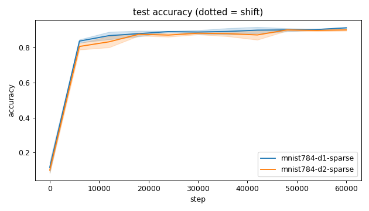
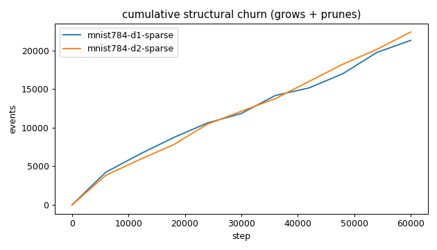
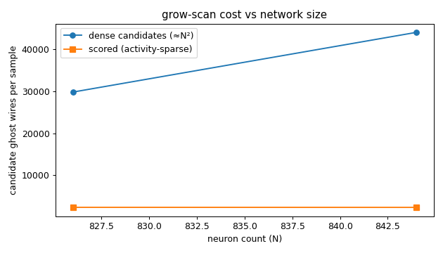
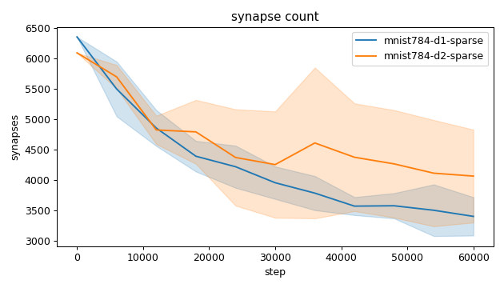
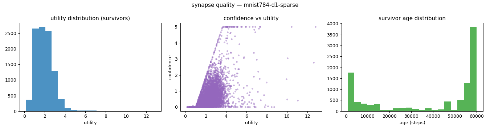
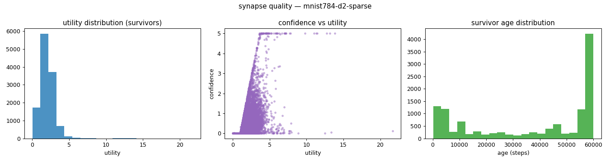
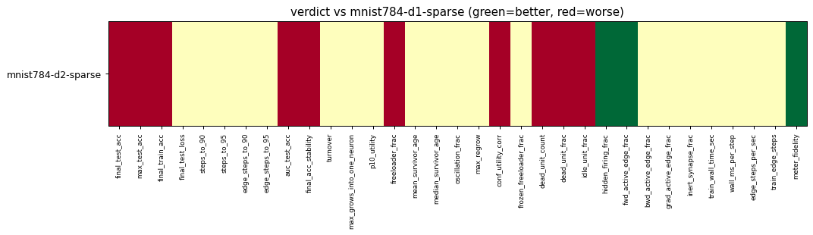

# Evaluation run: mnist784-depth-1v2

- **Date:** 2026-06-14 19:58:28
- **Variants:** mnist784-d1-sparse, mnist784-d2-sparse  (baseline: mnist784-d1-sparse)
- **Seeds:** 3  |  **Dataset:** mnist  |  **Steps:** 60000 (+0 shift)
- **Commit:** ead2772
- **Command:** `python evaluate.py --variants mnist784-d1-sparse,mnist784-d2-sparse --baseline mnist784-d1-sparse --dataset mnist --layers 784,32,10 --density 0.25 --seeds 3 --steps 60000 --record-every 6000 --points 12000 --train-eval-cap 2000 --no-cache --publish --run-name mnist784-depth-1v2`

## Key metrics

| Metric | What it means | mnist784-d1-sparse (baseline) | mnist784-d2-sparse |
|---|---|---|---|
| final_test_acc ↑ | held-out accuracy at the end of the run | 0.914 ± 0.004 | 0.902 ± 0.005 ▼ |
| steps_to_90 ↓ | steps to first reach 90% test accuracy | 38001 ± 14967 | ∞ ± — ? |
| steps_to_95 ↓ | steps to first reach 95% test accuracy | ∞ ± — | ∞ ± — ? |
| auc_test_acc ↑ | area under the test-accuracy curve (speed + level) | 0.848 ± 0.009 | 0.833 ± 0.010 ▼ |
| edge_steps_to_90 ↓ | live-edge training work to first reach 90% test accuracy | 173672261 ± 62693453 | ∞ ± — ? |
| edge_steps_to_95 ↓ | live-edge training work to first reach 95% test accuracy | ∞ ± — | ∞ ± — ? |
| synapse_count_end | live synapses at the end | 3401 ± 315.694 | 4064 ± 764.600 ≈ |
| effective_density | live edges as a fraction of fully-connected | 0.134 ± 0.012 | 0.167 ± 0.031 ≈ |
| avg_live_edges | time-average live edges during training | 4191 ± 156.562 | 4627 ± 652.419 ≈ |
| train_edge_steps ↓ | cumulative live-edge steps over training | 251459533 ± 9393897 | 277652501 ± 39145784 ≈ |
| train_wall_time_sec ↓ | training-loop wall time only, excluding eval snapshots | 543.313 ± 18.237 | 596.581 ± 77.856 ≈ |
| wall_ms_per_step ↓ | training-loop milliseconds per SGD step | 9.055 ± 0.304 | 9.943 ± 1.298 ≈ |
| edge_steps_per_sec ↑ | live-edge steps processed per wall-clock second | 462767 ± 1817 | 464743 ± 5442 ≈ |
| ghost_dense_cost | candidate ghost wires the grow-scan must consider (~N²) | 29847 ± 315.694 | 44076 ± 764.600 ≈ |
| ghost_pairs_scored | candidate wires actually scored after activity+demand pruning | 2369 ± 44.887 | 2358 ± 86.313 ≈ |
| mean_neuron_activation | avg hidden-neuron ReLU output on test data (neuron value) | 1.147 ± 0.047 | 0.832 ± 0.079 ≈ |
| dead_unit_frac ↓ | fraction of hidden neurons that never fire (scale-free) | 0 ± 0 | 0.073 ± 0.034 ▼ |
| hidden_firing_frac ↓ | fraction of hidden ReLUs active on test data | 0.382 ± 0.017 | 0.289 ± 0.011 ▲ |
| fwd_active_edge_frac ↓ | fraction of live edges whose pre neuron is active | 0.971 ± 0.003 | 0.943 ± 0.006 ▲ |
| bwd_active_edge_frac ↓ | fraction of live edges whose post delta is nonzero | 0.609 ± 0.012 | 0.612 ± 0.034 ≈ |
| grad_active_edge_frac ↓ | fraction of live edges with nonzero weight gradient | 0.580 ± 0.012 | 0.573 ± 0.029 ≈ |
| idle_unit_frac ↓ | fraction of hidden neurons dead OR outputless (not in service) | 0.010 ± 0.015 | 0.100 ± 0.049 ▼ |
| n_recycle_events | dead-unit recycles fired over the run (sleep recycling) | 0 ± 0 | 0 ± 0 ≈ |
| recycled_rehired_frac | of recycled units, fraction back in service at the end | — ± — | — ± — ? |
| n_startle_events | demand-spike hiring alarms fired (startle growth) | 0 ± 0 | 3.333 ± 2.055 ≈ |
| n_arousal_events | post-startle refinement windows that ran grow-only passes | 0 ± 0 | 0 ± 0 ≈ |
| max_grows_into_one_neuron ↓ | most times one neuron was grown into (churn) | 647 ± 60.017 | 656.667 ± 48.058 ≈ |
| oscillation_frac ↓ | fraction of grown edges grown ≥2× (thrash) | 0.200 ± 0.034 | 0.173 ± 0.020 ≈ |
| freeloader_frac ↓ | fraction of synapses below the prune-utility floor | 0.004 ± 0.002 | 0.030 ± 0.015 ▼ |
| conf_utility_corr ↑ | corr of confidence with real utility (calibration) | 0.583 ± 0.008 | 0.506 ± 0.027 ▼ |
| dead_unit_count ↓ | hidden neurons that never fire on test data | 0 ± 0 | 3.667 ± 1.700 ▼ |

## Full scorecard

| Metric | mnist784-d1-sparse (baseline) | mnist784-d2-sparse |
|---|---|---|
| **Prediction performance** | | |
| final_test_acc ↑ | 0.914 ± 0.004 | 0.902 ± 0.005 ▼ |
| max_test_acc ↑ | 0.918 ± 0.006 | 0.903 ± 0.005 ▼ |
| final_train_acc ↑ | 0.943 ± 0.008 | 0.929 ± 0.008 ▼ |
| final_test_loss ↓ | 0.520 ± 0.092 | 0.571 ± 0.149 ≈ |
| **Training efficacy** | | |
| steps_to_90 ↓ | 38001 ± 14967 | ∞ ± — ? |
| steps_to_95 ↓ | ∞ ± — | ∞ ± — ? |
| edge_steps_to_90 ↓ | 173672261 ± 62693453 | ∞ ± — ? |
| edge_steps_to_95 ↓ | ∞ ± — | ∞ ± — ? |
| auc_test_acc ↑ | 0.848 ± 0.009 | 0.833 ± 0.010 ▼ |
| final_acc_stability ↓ | 0.023 ± 0.002 | 0.031 ± 0.006 ▼ |
| **Synapse structure** | | |
| synapse_count_start | 6354 ± 0.943 | 6091 ± 0.471 ≈ |
| synapse_count_peak | 6354 ± 0.943 | 6111 ± 28.052 ≈ |
| synapse_count_end | 3401 ± 315.694 | 4064 ± 764.600 ≈ |
| n_grow_events | 9171 ± 1353 | 10176 ± 1635 ≈ |
| n_prune_events | 12123 ± 1063 | 12204 ± 965.954 ≈ |
| n_startle_events | 0 ± 0 | 3.333 ± 2.055 ≈ |
| n_arousal_events | 0 ± 0 | 0 ± 0 ≈ |
| distinct_neurons_grown | 40.333 ± 0.943 | 53.333 ± 0.943 ≈ |
| turnover ↓ | 4.969 ± 0.503 | 4.806 ± 0.328 ≈ |
| max_grows_into_one_neuron ↓ | 647 ± 60.017 | 656.667 ± 48.058 ≈ |
| mean_fan_in | 80.984 ± 7.517 | 67.733 ± 12.743 ≈ |
| mean_fan_out | 4.168 ± 0.387 | 4.873 ± 0.917 ≈ |
| effective_density | 0.134 ± 0.012 | 0.167 ± 0.031 ≈ |
| avg_live_edges | 4191 ± 156.562 | 4627 ± 652.419 ≈ |
| **Synapse quality** | | |
| p10_utility ↑ | 1.038 ± 0.108 | 0.933 ± 0.149 ≈ |
| freeloader_frac ↓ | 0.004 ± 0.002 | 0.030 ± 0.015 ▼ |
| mean_survivor_age ↑ | 39194 ± 3265 | 37048 ± 408.629 ≈ |
| median_survivor_age ↑ | 53732 ± 1543 | 50066 ± 5045 ≈ |
| mean_pruned_lifespan | 9875 ± 676.988 | 10455 ± 896.239 ≈ |
| oscillation_frac ↓ | 0.200 ± 0.034 | 0.173 ± 0.020 ≈ |
| max_regrow ↓ | 4 ± 0 | 4.333 ± 0.471 ≈ |
| conf_utility_corr ↑ | 0.583 ± 0.008 | 0.506 ± 0.027 ▼ |
| frozen_freeloader_frac ↓ | 0 ± 0 | 0 ± 0 ≈ |
| dead_unit_count ↓ | 0 ± 0 | 3.667 ± 1.700 ▼ |
| dead_unit_frac ↓ | 0 ± 0 | 0.073 ± 0.034 ▼ |
| idle_unit_frac ↓ | 0.010 ± 0.015 | 0.100 ± 0.049 ▼ |
| mean_neuron_activation | 1.147 ± 0.047 | 0.832 ± 0.079 ≈ |
| hidden_firing_frac ↓ | 0.382 ± 0.017 | 0.289 ± 0.011 ▲ |
| fwd_active_edge_frac ↓ | 0.971 ± 0.003 | 0.943 ± 0.006 ▲ |
| bwd_active_edge_frac ↓ | 0.609 ± 0.012 | 0.612 ± 0.034 ≈ |
| grad_active_edge_frac ↓ | 0.580 ± 0.012 | 0.573 ± 0.029 ≈ |
| inert_synapse_frac ↓ | 0 ± 0 | 0 ± 0 ≈ |
| used_vs_allocated | 0.535 ± 0.050 | 0.667 ± 0.126 ≈ |
| n_recycle_events | 0 ± 0 | 0 ± 0 ≈ |
| recycled_rehired_frac | — ± — | — ± — ? |
| **Compute cost** | | |
| train_wall_time_sec ↓ | 543.313 ± 18.237 | 596.581 ± 77.856 ≈ |
| wall_ms_per_step ↓ | 9.055 ± 0.304 | 9.943 ± 1.298 ≈ |
| edge_steps_per_sec ↑ | 462767 ± 1817 | 464743 ± 5442 ≈ |
| train_edge_steps ↓ | 251459533 ± 9393897 | 277652501 ± 39145784 ≈ |
| ghost_dense_cost | 29847 ± 315.694 | 44076 ± 764.600 ≈ |
| ghost_pairs_scored | 2369 ± 44.887 | 2358 ± 86.313 ≈ |
| **Signal sanity** | | |
| meter_fidelity ↑ | 0.453 ± 0.014 | 0.541 ± 0.083 ▲ |

Baseline: **mnist784-d1-sparse**. ▲ better / ▼ worse / ≈ no clear difference vs baseline (95% bootstrap CI of the mean difference). Cells show mean ± std across seeds.

## Charts

### acc_curves

### churn_curves

### cost_scaling

### count_curves

### quality_mnist784-d1-sparse

### quality_mnist784-d2-sparse

### verdict_heatmap

