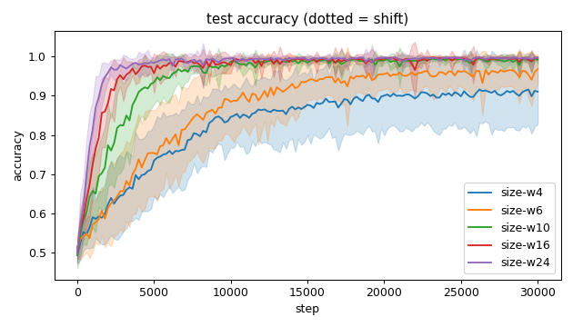
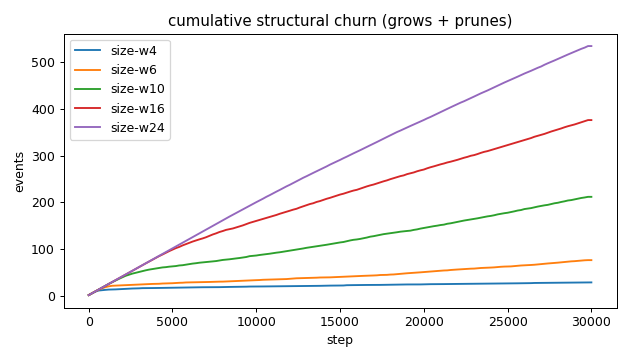
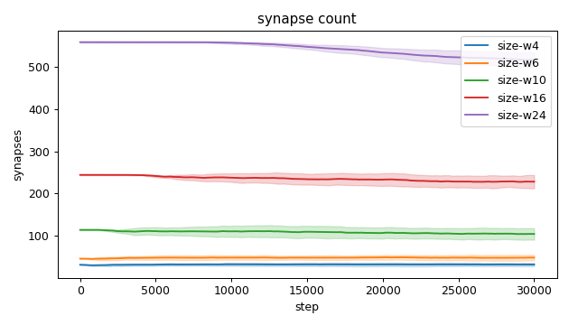
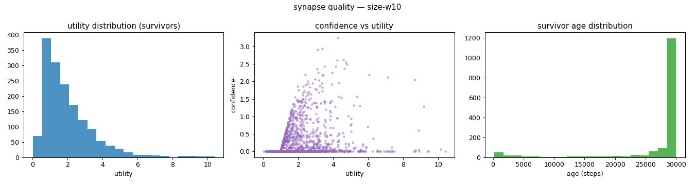
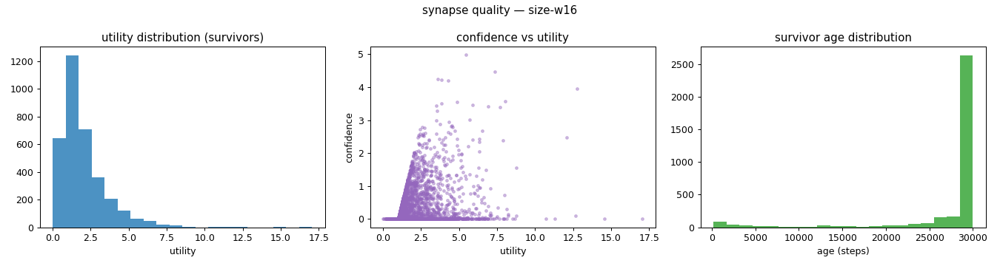
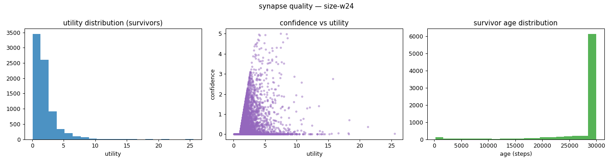
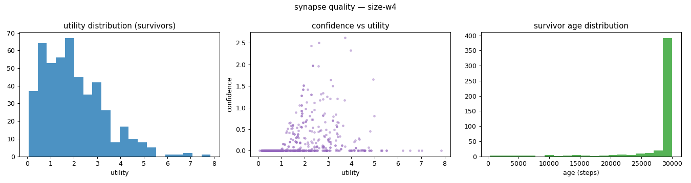
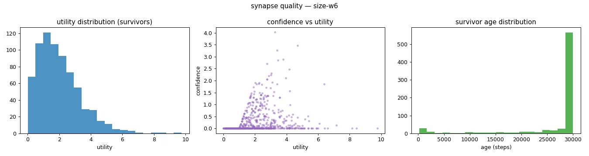
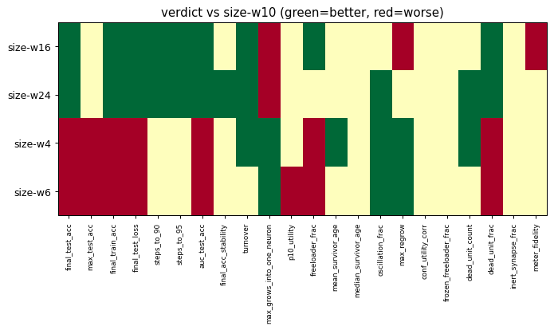

# Evaluation run: neuron-width-sweep

- **Date:** 2026-06-01 16:48:22
- **Variants:** size-w10, size-w16, size-w24, size-w4, size-w6  (baseline: size-w10)
- **Seeds:** 15  |  **Dataset:** spirals  |  **Steps:** 30000 (+0 shift)
- **Commit:** 43ec1f0
- **Command:** `python evaluate.py --variants size-w4,size-w6,size-w10,size-w16,size-w24 --seeds 15 --dataset spirals --steps 30000 --baseline size-w10 --jobs 10 --no-cache --publish --run-name neuron-width-sweep`

## Key metrics

| Metric | What it means | size-w10 (baseline) | size-w16 | size-w24 | size-w4 | size-w6 |
|---|---|---|---|---|---|---|
| final_test_acc ↑ | held-out accuracy at the end of the run | 0.991 ± 0.009 | 0.996 ± 0.003 ▲ | 0.997 ± 0.003 ▲ | 0.910 ± 0.083 ▼ | 0.968 ± 0.037 ▼ |
| steps_to_90 ↓ | steps to first reach 90% test accuracy | 3481 ± 1273 | 1908 ± 431.226 ▲ | 1348 ± 287.209 ▲ | ∞ ± — ? | ∞ ± — ? |
| steps_to_95 ↓ | steps to first reach 95% test accuracy | 4374 ± 1356 | 2561 ± 620.537 ▲ | 1814 ± 422.479 ▲ | ∞ ± — ? | ∞ ± — ? |
| auc_test_acc ↑ | area under the test-accuracy curve (speed + level) | 0.948 ± 0.016 | 0.967 ± 0.009 ▲ | 0.977 ± 0.005 ▲ | 0.830 ± 0.071 ▼ | 0.872 ± 0.053 ▼ |
| synapse_count_end | live synapses at the end | 104.267 ± 13.596 | 228.067 ± 15.737 ≈ | 516.667 ± 17.040 ≈ | 31.867 ± 3.862 ≈ | 48.267 ± 6.628 ≈ |
| effective_density | live edges as a fraction of fully-connected | 0.434 ± 0.057 | 0.396 ± 0.027 ≈ | 0.414 ± 0.014 ≈ | 0.664 ± 0.080 ≈ | 0.503 ± 0.069 ≈ |
| mean_neuron_activation | avg hidden-neuron ReLU output on test data (neuron value) | 0.415 ± 0.113 | 0.396 ± 0.055 ≈ | 0.331 ± 0.051 ≈ | 0.477 ± 0.265 ≈ | 0.380 ± 0.174 ≈ |
| dead_unit_frac ↓ | fraction of hidden neurons that never fire (scale-free) | 0.189 ± 0.087 | 0.089 ± 0.054 ▲ | 0.044 ± 0.020 ▲ | 0.300 ± 0.166 ▼ | 0.326 ± 0.154 ▼ |
| max_grows_into_one_neuron ↓ | most times one neuron was grown into (churn) | 20.533 ± 6.217 | 26.667 ± 6.488 ▼ | 27.333 ± 3.048 ▼ | 5.467 ± 1.147 ▲ | 11 ± 5.669 ▲ |
| oscillation_frac ↓ | fraction of grown edges grown ≥2× (thrash) | 0.266 ± 0.088 | 0.290 ± 0.034 ≈ | 0.217 ± 0.023 ▲ | 0.041 ± 0.047 ▲ | 0.157 ± 0.103 ▲ |
| freeloader_frac ↓ | fraction of synapses below the prune-utility floor | 0.028 ± 0.026 | 0.011 ± 0.010 ▲ | 0.021 ± 0.015 ≈ | 0.093 ± 0.060 ▼ | 0.101 ± 0.052 ▼ |
| conf_utility_corr ↑ | corr of confidence with real utility (calibration) | 0.262 ± 0.071 | 0.325 ± 0.106 ≈ | 0.254 ± 0.077 ≈ | 0.226 ± 0.098 ≈ | 0.248 ± 0.119 ≈ |
| dead_unit_count ↓ | hidden neurons that never fire on test data | 5.667 ± 2.625 | 4.267 ± 2.568 ≈ | 3.133 ± 1.454 ▲ | 3.600 ± 1.993 ▲ | 5.867 ± 2.778 ≈ |

## Full scorecard

| Metric | size-w10 (baseline) | size-w16 | size-w24 | size-w4 | size-w6 |
|---|---|---|---|---|---|
| **Prediction performance** | | | | | |
| final_test_acc ↑ | 0.991 ± 0.009 | 0.996 ± 0.003 ▲ | 0.997 ± 0.003 ▲ | 0.910 ± 0.083 ▼ | 0.968 ± 0.037 ▼ |
| max_test_acc ↑ | 0.998 ± 0.002 | 0.999 ± 0.001 ≈ | 0.999 ± 0.001 ≈ | 0.932 ± 0.078 ▼ | 0.977 ± 0.034 ▼ |
| final_train_acc ↑ | 0.993 ± 0.008 | 0.998 ± 0.002 ▲ | 0.997 ± 0.003 ▲ | 0.913 ± 0.082 ▼ | 0.971 ± 0.039 ▼ |
| final_test_loss ↓ | 0.029 ± 0.025 | 0.013 ± 0.007 ▲ | 0.012 ± 0.008 ▲ | 0.217 ± 0.142 ▼ | 0.106 ± 0.080 ▼ |
| **Training efficacy** | | | | | |
| steps_to_90 ↓ | 3481 ± 1273 | 1908 ± 431.226 ▲ | 1348 ± 287.209 ▲ | ∞ ± — ? | ∞ ± — ? |
| steps_to_95 ↓ | 4374 ± 1356 | 2561 ± 620.537 ▲ | 1814 ± 422.479 ▲ | ∞ ± — ? | ∞ ± — ? |
| auc_test_acc ↑ | 0.948 ± 0.016 | 0.967 ± 0.009 ▲ | 0.977 ± 0.005 ▲ | 0.830 ± 0.071 ▼ | 0.872 ± 0.053 ▼ |
| final_acc_stability ↓ | 0.012 ± 0.012 | 0.006 ± 0.012 ≈ | 0.005 ± 0.005 ▲ | 0.015 ± 0.014 ≈ | 0.019 ± 0.024 ≈ |
| **Synapse structure** | | | | | |
| synapse_count_start | 114 ± 0.966 | 244.133 ± 0.806 ≈ | 558.267 ± 1.389 ≈ | 31.400 ± 0.800 ≈ | 45.800 ± 0.833 ≈ |
| synapse_count_peak | 120.600 ± 6.364 | 248 ± 5.586 ≈ | 558.267 ± 1.389 ≈ | 34.867 ± 3.008 ≈ | 52.600 ± 5.327 ≈ |
| synapse_count_end | 104.267 ± 13.596 | 228.067 ± 15.737 ≈ | 516.667 ± 17.040 ≈ | 31.867 ± 3.862 ≈ | 48.267 ± 6.628 ≈ |
| n_grow_events | 102.133 ± 33.382 | 181 ± 22.911 ≈ | 247.333 ± 26.150 ≈ | 15.800 ± 4.607 ≈ | 40.600 ± 21.676 ≈ |
| n_prune_events | 109.867 ± 27.837 | 195.067 ± 20.974 ≈ | 286.933 ± 13.299 ≈ | 13.333 ± 2.867 ≈ | 36.133 ± 16.516 ≈ |
| distinct_neurons_grown | 13.133 ± 3.096 | 18.533 ± 3.180 ≈ | 26.133 ± 3.384 ≈ | 4.800 ± 1.558 ≈ | 7.267 ± 2.620 ≈ |
| turnover ↓ | 1.937 ± 0.468 | 1.602 ± 0.180 ▲ | 0.984 ± 0.060 ▲ | 0.909 ± 0.175 ▲ | 1.549 ± 0.633 ≈ |
| max_grows_into_one_neuron ↓ | 20.533 ± 6.217 | 26.667 ± 6.488 ▼ | 27.333 ± 3.048 ▼ | 5.467 ± 1.147 ▲ | 11 ± 5.669 ▲ |
| mean_fan_in | 3.258 ± 0.425 | 4.561 ± 0.315 ≈ | 6.982 ± 0.230 ≈ | 2.276 ± 0.276 ≈ | 2.413 ± 0.331 ≈ |
| mean_fan_out | 3.258 ± 0.425 | 4.561 ± 0.315 ≈ | 6.982 ± 0.230 ≈ | 2.276 ± 0.276 ≈ | 2.413 ± 0.331 ≈ |
| effective_density | 0.434 ± 0.057 | 0.396 ± 0.027 ≈ | 0.414 ± 0.014 ≈ | 0.664 ± 0.080 ≈ | 0.503 ± 0.069 ≈ |
| **Synapse quality** | | | | | |
| p10_utility ↑ | 0.682 ± 0.102 | 0.715 ± 0.057 ≈ | 0.672 ± 0.047 ≈ | 0.634 ± 0.236 ≈ | 0.545 ± 0.184 ▼ |
| freeloader_frac ↓ | 0.028 ± 0.026 | 0.011 ± 0.010 ▲ | 0.021 ± 0.015 ≈ | 0.093 ± 0.060 ▼ | 0.101 ± 0.052 ▼ |
| mean_survivor_age ↑ | 27237 ± 988.191 | 27371 ± 566.458 ≈ | 27549 ± 446.479 ≈ | 28198 ± 1217 ▲ | 27088 ± 1653 ≈ |
| median_survivor_age ↑ | 30000 ± 0 | 30000 ± 0 ≈ | 30000 ± 0 ≈ | 30000 ± 0 ≈ | 30000 ± 0.249 ≈ |
| mean_pruned_lifespan | 3892 ± 644.699 | 4183 ± 711.567 ≈ | 7195 ± 511.687 ≈ | 4610 ± 1743 ≈ | 4177 ± 1814 ≈ |
| oscillation_frac ↓ | 0.266 ± 0.088 | 0.290 ± 0.034 ≈ | 0.217 ± 0.023 ▲ | 0.041 ± 0.047 ▲ | 0.157 ± 0.103 ▲ |
| max_regrow ↓ | 7.267 ± 2.265 | 8.867 ± 1.996 ▼ | 6.667 ± 0.943 ≈ | 0.933 ± 1.236 ▲ | 4.200 ± 3.525 ▲ |
| conf_utility_corr ↑ | 0.262 ± 0.071 | 0.325 ± 0.106 ≈ | 0.254 ± 0.077 ≈ | 0.226 ± 0.098 ≈ | 0.248 ± 0.119 ≈ |
| frozen_freeloader_frac ↓ | 0 ± 0 | 0 ± 0 ≈ | 0 ± 0 ≈ | 0 ± 0 ≈ | 0 ± 0 ≈ |
| dead_unit_count ↓ | 5.667 ± 2.625 | 4.267 ± 2.568 ≈ | 3.133 ± 1.454 ▲ | 3.600 ± 1.993 ▲ | 5.867 ± 2.778 ≈ |
| dead_unit_frac ↓ | 0.189 ± 0.087 | 0.089 ± 0.054 ▲ | 0.044 ± 0.020 ▲ | 0.300 ± 0.166 ▼ | 0.326 ± 0.154 ▼ |
| mean_neuron_activation | 0.415 ± 0.113 | 0.396 ± 0.055 ≈ | 0.331 ± 0.051 ≈ | 0.477 ± 0.265 ≈ | 0.380 ± 0.174 ≈ |
| inert_synapse_frac ↓ | 0 ± 0 | 0 ± 0 ≈ | 0 ± 0 ≈ | 0 ± 0 ≈ | 0 ± 0 ≈ |
| used_vs_allocated | 0.931 ± 0.124 | 0.942 ± 0.064 ≈ | 0.929 ± 0.031 ≈ | 1.084 ± 0.132 ≈ | 1.102 ± 0.151 ≈ |
| **Signal sanity** | | | | | |
| meter_fidelity ↑ | 0.806 ± 0.083 | 0.674 ± 0.200 ▼ | 0.747 ± 0.167 ≈ | 0.873 ± 0.121 ≈ | 0.798 ± 0.224 ≈ |

Baseline: **size-w10**. ▲ better / ▼ worse / ≈ no clear difference vs baseline (95% bootstrap CI of the mean difference). Cells show mean ± std across seeds.

## Charts

### acc_curves

### churn_curves

### count_curves

### quality_size-w10

### quality_size-w16

### quality_size-w24

### quality_size-w4

### quality_size-w6

### verdict_heatmap

