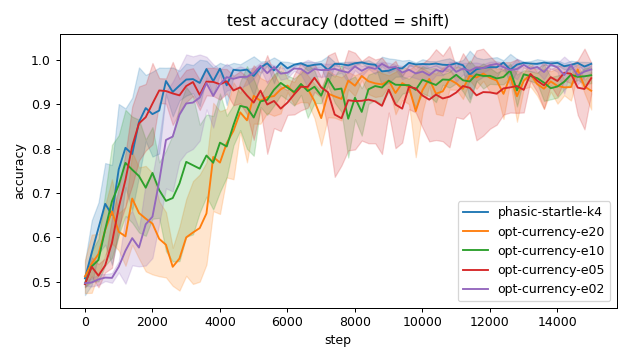
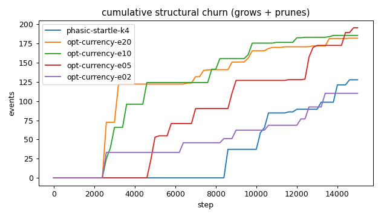
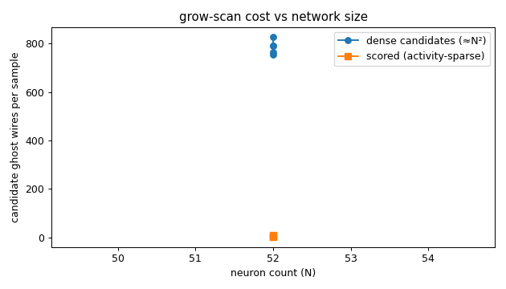
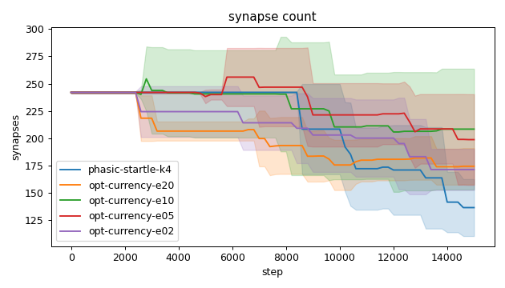
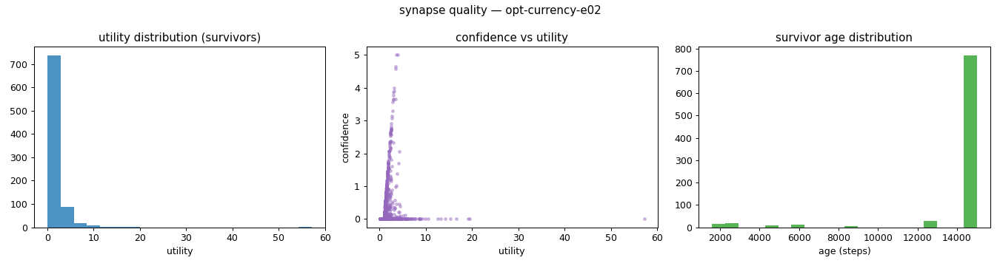
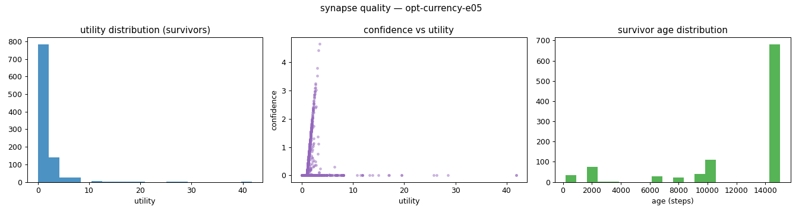
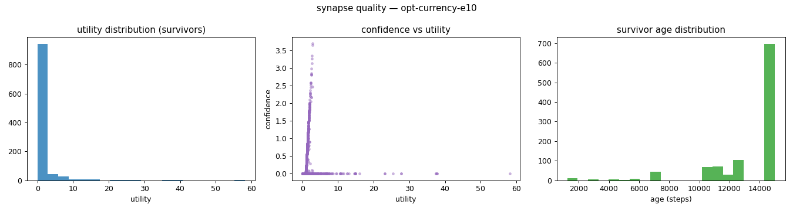
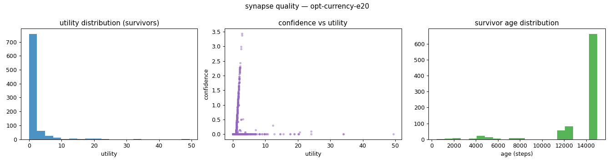
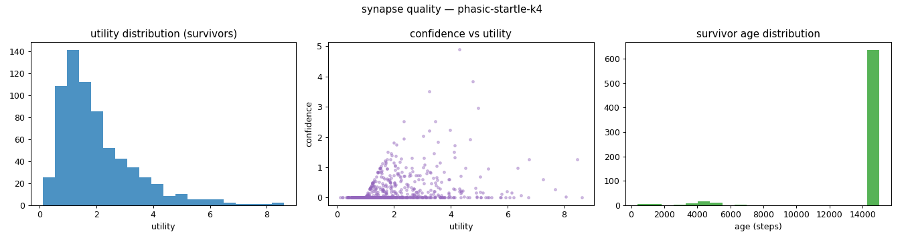
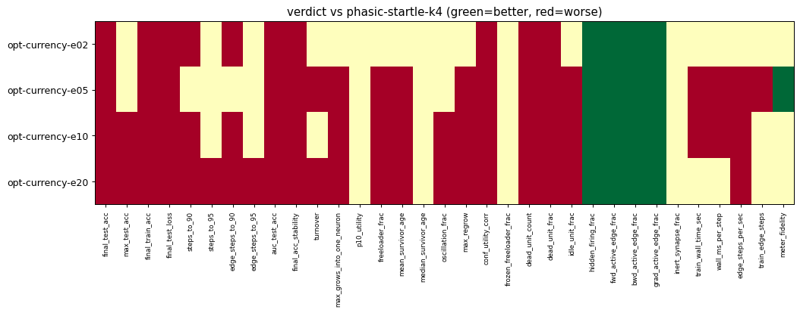

# Evaluation run: opt-currency-spirals-etasweep

- **Date:** 2026-06-19 10:45:21
- **Variants:** opt-currency-e02, opt-currency-e05, opt-currency-e10, opt-currency-e20, phasic-startle-k4  (baseline: phasic-startle-k4)
- **Seeds:** 5  |  **Dataset:** spirals  |  **Steps:** 15000 (+0 shift)
- **Commit:** 860ed0e
- **Command:** `python evaluate.py --variants phasic-startle-k4,opt-currency-e20,opt-currency-e10,opt-currency-e05,opt-currency-e02 --seeds 5 --dataset spirals --steps 15000 --baseline phasic-startle-k4 --jobs 8 --publish --run-name opt-currency-spirals-etasweep`

## Key metrics

| Metric | What it means | opt-currency-e02 | opt-currency-e05 | opt-currency-e10 | opt-currency-e20 | phasic-startle-k4 (baseline) |
|---|---|---|---|---|---|---|
| final_test_acc ↑ | held-out accuracy at the end of the run | 0.979 ± 0.007 ▼ | 0.959 ± 0.035 ▼ | 0.966 ± 0.018 ▼ | 0.931 ± 0.042 ▼ | 0.991 ± 0.004 |
| steps_to_90 ↓ | steps to first reach 90% test accuracy | 3001 ± 704.273 ▼ | 1881 ± 348.712 ≈ | 3201 ± 1368 ▼ | 4601 ± 521.536 ▼ | 1721 ± 587.878 |
| steps_to_95 ↓ | steps to first reach 95% test accuracy | 3321 ± 614.492 ≈ | 3241 ± 2053 ≈ | 4481 ± 1862 ≈ | 5361 ± 880 ▼ | 2681 ± 881.816 |
| auc_test_acc ↑ | area under the test-accuracy curve (speed + level) | 0.905 ± 0.016 ▼ | 0.895 ± 0.029 ▼ | 0.874 ± 0.014 ▼ | 0.847 ± 0.015 ▼ | 0.946 ± 0.019 |
| edge_steps_to_90 ↓ | live-edge training work to first reach 90% test accuracy | 721716 ± 169095 ▼ | 455162 ± 84274 ≈ | 781047 ± 342594 ▼ | 1050327 ± 120774 ▼ | 416402 ± 142130 |
| edge_steps_to_95 ↓ | live-edge training work to first reach 95% test accuracy | 793344 ± 150556 ≈ | 778930 ± 486990 ≈ | 1117046 ± 522667 ≈ | 1203727 ± 181613 ▼ | 648322 ± 211820 |
| synapse_count_end | live synapses at the end | 171.400 ± 18.874 ≈ | 198.800 ± 41.542 ≈ | 208.400 ± 55.269 ≈ | 174.400 ± 16.560 ≈ | 136.600 ± 26.066 |
| effective_density | live edges as a fraction of fully-connected | 0.298 ± 0.033 ≈ | 0.345 ± 0.072 ≈ | 0.362 ± 0.096 ≈ | 0.303 ± 0.029 ≈ | 0.237 ± 0.045 |
| avg_live_edges | time-average live edges during training | 211.975 ± 21.029 ≈ | 233.182 ± 14.053 ≈ | 228.889 ± 35.519 ≈ | 200.458 ± 10.728 ≈ | 213.837 ± 14.783 |
| train_edge_steps ↓ | cumulative live-edge steps over training | 3179840 ± 315461 ≈ | 3497967 ± 210808 ▼ | 3433562 ± 532824 ≈ | 3007072 ± 160937 ≈ | 3207771 ± 221761 |
| train_wall_time_sec ↓ | training-loop wall time only, excluding eval snapshots | 8.722 ± 0.956 ≈ | 10.081 ± 0.618 ▼ | 9.937 ± 1.339 ▼ | 8.583 ± 0.333 ≈ | 8.551 ± 0.610 |
| wall_ms_per_step ↓ | training-loop milliseconds per SGD step | 0.581 ± 0.064 ≈ | 0.672 ± 0.041 ▼ | 0.662 ± 0.089 ▼ | 0.572 ± 0.022 ≈ | 0.570 ± 0.041 |
| edge_steps_per_sec ↑ | live-edge steps processed per wall-clock second | 366105 ± 29280 ≈ | 347045 ± 5054 ▼ | 344557 ± 9416 ▼ | 350206 ± 7522 ▼ | 375194 ± 2571 |
| ghost_dense_cost | candidate ghost wires the grow-scan must consider (~N²) | 792.600 ± 18.874 ≈ | 765.200 ± 41.542 ≈ | 755.600 ± 55.269 ≈ | 789.600 ± 16.560 ≈ | 827.400 ± 26.066 |
| ghost_pairs_scored | candidate wires actually scored after activity+demand pruning | 8.182 ± 1.822 ≈ | 3.794 ± 1.697 ≈ | 1.664 ± 0.914 ≈ | 1.974 ± 1.014 ≈ | 10.077 ± 2.598 |
| mean_neuron_activation | avg hidden-neuron ReLU output on test data (neuron value) | 0.413 ± 0.065 ≈ | 1.249 ± 0.815 ≈ | 0.399 ± 0.149 ≈ | 0.353 ± 0.064 ≈ | 0.445 ± 0.054 |
| dead_unit_frac ↓ | fraction of hidden neurons that never fire (scale-free) | 0.233 ± 0.048 ▼ | 0.517 ± 0.040 ▼ | 0.646 ± 0.035 ▼ | 0.683 ± 0.024 ▼ | 0.113 ± 0.043 |
| hidden_firing_frac ↓ | fraction of hidden ReLUs active on test data | 0.354 ± 0.027 ▲ | 0.209 ± 0.048 ▲ | 0.137 ± 0.011 ▲ | 0.093 ± 0.010 ▲ | 0.480 ± 0.014 |
| fwd_active_edge_frac ↓ | fraction of live edges whose pre neuron is active | 0.536 ± 0.022 ▲ | 0.480 ± 0.062 ▲ | 0.383 ± 0.056 ▲ | 0.310 ± 0.024 ▲ | 0.646 ± 0.026 |
| bwd_active_edge_frac ↓ | fraction of live edges whose post delta is nonzero | 0.344 ± 0.041 ▲ | 0.296 ± 0.066 ▲ | 0.273 ± 0.054 ▲ | 0.235 ± 0.014 ▲ | 0.520 ± 0.037 |
| grad_active_edge_frac ↓ | fraction of live edges with nonzero weight gradient | 0.187 ± 0.030 ▲ | 0.163 ± 0.051 ▲ | 0.117 ± 0.036 ▲ | 0.083 ± 0.013 ▲ | 0.341 ± 0.030 |
| idle_unit_frac ↓ | fraction of hidden neurons dead OR outputless (not in service) | 0.258 ± 0.061 ≈ | 0.533 ± 0.039 ▼ | 0.650 ± 0.028 ▼ | 0.683 ± 0.024 ▼ | 0.204 ± 0.058 |
| n_recycle_events | dead-unit recycles fired over the run (sleep recycling) | 0 ± 0 ≈ | 0 ± 0 ≈ | 0 ± 0 ≈ | 0 ± 0 ≈ | 0 ± 0 |
| recycled_rehired_frac | of recycled units, fraction back in service at the end | — ± — ? | — ± — ? | — ± — ? | — ± — ? | — ± — |
| n_startle_events | demand-spike hiring alarms fired (startle growth) | 0 ± 0 ≈ | 2 ± 0.632 ≈ | 3.200 ± 1.720 ≈ | 3.800 ± 0.748 ≈ | 0.200 ± 0.400 |
| n_arousal_events | post-startle refinement windows that ran grow-only passes | 0 ± 0 ≈ | 0 ± 0 ≈ | 0 ± 0 ≈ | 0 ± 0 ≈ | 0 ± 0 |
| max_grows_into_one_neuron ↓ | most times one neuron was grown into (churn) | 6.800 ± 1.166 ≈ | 16.600 ± 3.611 ▼ | 22 ± 3.033 ▼ | 25.600 ± 2.059 ▼ | 5 ± 2.608 |
| oscillation_frac ↓ | fraction of grown edges grown ≥2× (thrash) | 0 ± 0 ≈ | 0.010 ± 0.012 ≈ | 0.048 ± 0.063 ▼ | 0.147 ± 0.084 ▼ | 0 ± 0 |
| freeloader_frac ↓ | fraction of synapses below the prune-utility floor | 0.049 ± 0.027 ≈ | 0.078 ± 0.052 ▼ | 0.060 ± 0.018 ▼ | 0.074 ± 0.015 ▼ | 0.027 ± 0.009 |
| conf_utility_corr ↑ | corr of confidence with real utility (calibration) | 0.050 ± 0.069 ▼ | -0.041 ± 0.031 ▼ | -0.073 ± 0.057 ▼ | -0.065 ± 0.024 ▼ | 0.316 ± 0.078 |
| dead_unit_count ↓ | hidden neurons that never fire on test data | 11.200 ± 2.315 ▼ | 24.800 ± 1.939 ▼ | 31 ± 1.673 ▼ | 32.800 ± 1.166 ▼ | 5.400 ± 2.059 |

## Full scorecard

| Metric | opt-currency-e02 | opt-currency-e05 | opt-currency-e10 | opt-currency-e20 | phasic-startle-k4 (baseline) |
|---|---|---|---|---|---|
| **Prediction performance** | | | | | |
| final_test_acc ↑ | 0.979 ± 0.007 ▼ | 0.959 ± 0.035 ▼ | 0.966 ± 0.018 ▼ | 0.931 ± 0.042 ▼ | 0.991 ± 0.004 |
| max_test_acc ↑ | 0.998 ± 0.002 ≈ | 0.994 ± 0.004 ≈ | 0.990 ± 0.004 ▼ | 0.993 ± 0.003 ▼ | 0.997 ± 0.002 |
| final_train_acc ↑ | 0.981 ± 0.008 ▼ | 0.960 ± 0.034 ▼ | 0.962 ± 0.015 ▼ | 0.929 ± 0.043 ▼ | 0.993 ± 0.004 |
| final_test_loss ↓ | 0.075 ± 0.021 ▼ | 0.249 ± 0.269 ▼ | 0.092 ± 0.033 ▼ | 0.539 ± 0.531 ▼ | 0.032 ± 0.024 |
| **Training efficacy** | | | | | |
| steps_to_90 ↓ | 3001 ± 704.273 ▼ | 1881 ± 348.712 ≈ | 3201 ± 1368 ▼ | 4601 ± 521.536 ▼ | 1721 ± 587.878 |
| steps_to_95 ↓ | 3321 ± 614.492 ≈ | 3241 ± 2053 ≈ | 4481 ± 1862 ≈ | 5361 ± 880 ▼ | 2681 ± 881.816 |
| edge_steps_to_90 ↓ | 721716 ± 169095 ▼ | 455162 ± 84274 ≈ | 781047 ± 342594 ▼ | 1050327 ± 120774 ▼ | 416402 ± 142130 |
| edge_steps_to_95 ↓ | 793344 ± 150556 ≈ | 778930 ± 486990 ≈ | 1117046 ± 522667 ≈ | 1203727 ± 181613 ▼ | 648322 ± 211820 |
| auc_test_acc ↑ | 0.905 ± 0.016 ▼ | 0.895 ± 0.029 ▼ | 0.874 ± 0.014 ▼ | 0.847 ± 0.015 ▼ | 0.946 ± 0.019 |
| final_acc_stability ↓ | 0.017 ± 0.006 ▼ | 0.030 ± 0.021 ▼ | 0.021 ± 0.007 ▼ | 0.032 ± 0.008 ▼ | 0.006 ± 0.002 |
| **Synapse structure** | | | | | |
| synapse_count_start | 242 ± 0.894 ≈ | 242 ± 0.894 ≈ | 242 ± 0.894 ≈ | 242 ± 0.894 ≈ | 242 ± 0.894 |
| synapse_count_peak | 242 ± 0.894 ≈ | 263.800 ± 24.161 ≈ | 262.400 ± 27.067 ≈ | 242 ± 0.894 ≈ | 242 ± 0.894 |
| synapse_count_end | 171.400 ± 18.874 ≈ | 198.800 ± 41.542 ≈ | 208.400 ± 55.269 ≈ | 174.400 ± 16.560 ≈ | 136.600 ± 26.066 |
| n_grow_events | 19.800 ± 8.818 ≈ | 76.200 ± 18.840 ≈ | 76 ± 17.193 ≈ | 57.200 ± 5.036 ≈ | 11.200 ± 7.626 |
| n_prune_events | 90.400 ± 24.171 ≈ | 119.400 ± 28.814 ≈ | 109.600 ± 41.365 ≈ | 124.800 ± 16.714 ≈ | 116.600 ± 22.096 |
| n_startle_events | 0 ± 0 ≈ | 2 ± 0.632 ≈ | 3.200 ± 1.720 ≈ | 3.800 ± 0.748 ≈ | 0.200 ± 0.400 |
| n_arousal_events | 0 ± 0 ≈ | 0 ± 0 ≈ | 0 ± 0 ≈ | 0 ± 0 ≈ | 0 ± 0 |
| distinct_neurons_grown | 5.400 ± 2.577 ≈ | 9.200 ± 1.720 ≈ | 8.800 ± 2.135 ≈ | 5.400 ± 1.497 ≈ | 2.600 ± 1.960 |
| turnover ↓ | 0.541 ± 0.211 ≈ | 0.847 ± 0.137 ▼ | 0.853 ± 0.268 ≈ | 0.917 ± 0.137 ▼ | 0.610 ± 0.136 |
| max_grows_into_one_neuron ↓ | 6.800 ± 1.166 ≈ | 16.600 ± 3.611 ▼ | 22 ± 3.033 ▼ | 25.600 ± 2.059 ▼ | 5 ± 2.608 |
| mean_fan_in | 3.428 ± 0.377 ≈ | 3.976 ± 0.831 ≈ | 4.168 ± 1.105 ≈ | 3.488 ± 0.331 ≈ | 2.732 ± 0.521 |
| mean_fan_out | 3.428 ± 0.377 ≈ | 3.976 ± 0.831 ≈ | 4.168 ± 1.105 ≈ | 3.488 ± 0.331 ≈ | 2.732 ± 0.521 |
| effective_density | 0.298 ± 0.033 ≈ | 0.345 ± 0.072 ≈ | 0.362 ± 0.096 ≈ | 0.303 ± 0.029 ≈ | 0.237 ± 0.045 |
| avg_live_edges | 211.975 ± 21.029 ≈ | 233.182 ± 14.053 ≈ | 228.889 ± 35.519 ≈ | 200.458 ± 10.728 ≈ | 213.837 ± 14.783 |
| **Synapse quality** | | | | | |
| p10_utility ↑ | 0.707 ± 0.111 ≈ | 0.700 ± 0.239 ≈ | 0.741 ± 0.131 ≈ | 0.795 ± 0.073 ≈ | 0.769 ± 0.066 |
| freeloader_frac ↓ | 0.049 ± 0.027 ≈ | 0.078 ± 0.052 ▼ | 0.060 ± 0.018 ▼ | 0.074 ± 0.015 ▼ | 0.027 ± 0.009 |
| mean_survivor_age ↑ | 14140 ± 180.224 ≈ | 12298 ± 789.436 ▼ | 13475 ± 435.283 ▼ | 13738 ± 269.834 ▼ | 14288 ± 478.473 |
| median_survivor_age ↑ | 15000 ± 0 ≈ | 15000 ± 0 ≈ | 15000 ± 0 ≈ | 15000 ± 0 ≈ | 15000 ± 0 |
| mean_pruned_lifespan | 8976 ± 3378 ≈ | 8322 ± 2095 ≈ | 5774 ± 1974 ≈ | 4861 ± 904.948 ≈ | 10977 ± 1603 |
| oscillation_frac ↓ | 0 ± 0 ≈ | 0.010 ± 0.012 ≈ | 0.048 ± 0.063 ▼ | 0.147 ± 0.084 ▼ | 0 ± 0 |
| max_regrow ↓ | 0 ± 0 ≈ | 0.400 ± 0.490 ▼ | 0.600 ± 0.490 ▼ | 1 ± 0 ▼ | -0.200 ± 0.400 |
| conf_utility_corr ↑ | 0.050 ± 0.069 ▼ | -0.041 ± 0.031 ▼ | -0.073 ± 0.057 ▼ | -0.065 ± 0.024 ▼ | 0.316 ± 0.078 |
| frozen_freeloader_frac ↓ | 0 ± 0 ≈ | 0 ± 0 ≈ | 0 ± 0 ≈ | 0 ± 0 ≈ | 0 ± 0 |
| dead_unit_count ↓ | 11.200 ± 2.315 ▼ | 24.800 ± 1.939 ▼ | 31 ± 1.673 ▼ | 32.800 ± 1.166 ▼ | 5.400 ± 2.059 |
| dead_unit_frac ↓ | 0.233 ± 0.048 ▼ | 0.517 ± 0.040 ▼ | 0.646 ± 0.035 ▼ | 0.683 ± 0.024 ▼ | 0.113 ± 0.043 |
| idle_unit_frac ↓ | 0.258 ± 0.061 ≈ | 0.533 ± 0.039 ▼ | 0.650 ± 0.028 ▼ | 0.683 ± 0.024 ▼ | 0.204 ± 0.058 |
| mean_neuron_activation | 0.413 ± 0.065 ≈ | 1.249 ± 0.815 ≈ | 0.399 ± 0.149 ≈ | 0.353 ± 0.064 ≈ | 0.445 ± 0.054 |
| hidden_firing_frac ↓ | 0.354 ± 0.027 ▲ | 0.209 ± 0.048 ▲ | 0.137 ± 0.011 ▲ | 0.093 ± 0.010 ▲ | 0.480 ± 0.014 |
| fwd_active_edge_frac ↓ | 0.536 ± 0.022 ▲ | 0.480 ± 0.062 ▲ | 0.383 ± 0.056 ▲ | 0.310 ± 0.024 ▲ | 0.646 ± 0.026 |
| bwd_active_edge_frac ↓ | 0.344 ± 0.041 ▲ | 0.296 ± 0.066 ▲ | 0.273 ± 0.054 ▲ | 0.235 ± 0.014 ▲ | 0.520 ± 0.037 |
| grad_active_edge_frac ↓ | 0.187 ± 0.030 ▲ | 0.163 ± 0.051 ▲ | 0.117 ± 0.036 ▲ | 0.083 ± 0.013 ▲ | 0.341 ± 0.030 |
| inert_synapse_frac ↓ | 0 ± 0 ≈ | 0 ± 0 ≈ | 0.002 ± 0.004 ≈ | 0.005 ± 0.009 ≈ | 0 ± 0 |
| used_vs_allocated | 0.708 ± 0.079 ≈ | 0.821 ± 0.169 ≈ | 0.861 ± 0.228 ≈ | 0.721 ± 0.069 ≈ | 0.564 ± 0.107 |
| n_recycle_events | 0 ± 0 ≈ | 0 ± 0 ≈ | 0 ± 0 ≈ | 0 ± 0 ≈ | 0 ± 0 |
| recycled_rehired_frac | — ± — ? | — ± — ? | — ± — ? | — ± — ? | — ± — |
| **Compute cost** | | | | | |
| train_wall_time_sec ↓ | 8.722 ± 0.956 ≈ | 10.081 ± 0.618 ▼ | 9.937 ± 1.339 ▼ | 8.583 ± 0.333 ≈ | 8.551 ± 0.610 |
| wall_ms_per_step ↓ | 0.581 ± 0.064 ≈ | 0.672 ± 0.041 ▼ | 0.662 ± 0.089 ▼ | 0.572 ± 0.022 ≈ | 0.570 ± 0.041 |
| edge_steps_per_sec ↑ | 366105 ± 29280 ≈ | 347045 ± 5054 ▼ | 344557 ± 9416 ▼ | 350206 ± 7522 ▼ | 375194 ± 2571 |
| train_edge_steps ↓ | 3179840 ± 315461 ≈ | 3497967 ± 210808 ▼ | 3433562 ± 532824 ≈ | 3007072 ± 160937 ≈ | 3207771 ± 221761 |
| ghost_dense_cost | 792.600 ± 18.874 ≈ | 765.200 ± 41.542 ≈ | 755.600 ± 55.269 ≈ | 789.600 ± 16.560 ≈ | 827.400 ± 26.066 |
| ghost_pairs_scored | 8.182 ± 1.822 ≈ | 3.794 ± 1.697 ≈ | 1.664 ± 0.914 ≈ | 1.974 ± 1.014 ≈ | 10.077 ± 2.598 |
| **Signal sanity** | | | | | |
| meter_fidelity ↑ | 0.723 ± 0.230 ≈ | 0.876 ± 0.072 ▲ | 0.846 ± 0.133 ≈ | 0.804 ± 0.095 ≈ | 0.719 ± 0.118 |

Baseline: **phasic-startle-k4**. ▲ better / ▼ worse / ≈ no clear difference vs baseline (95% bootstrap CI of the mean difference). Cells show mean ± std across seeds.

## Charts

### acc_curves

### churn_curves

### cost_scaling

### count_curves

### quality_opt-currency-e02

### quality_opt-currency-e05

### quality_opt-currency-e10

### quality_opt-currency-e20

### quality_phasic-startle-k4

### verdict_heatmap

