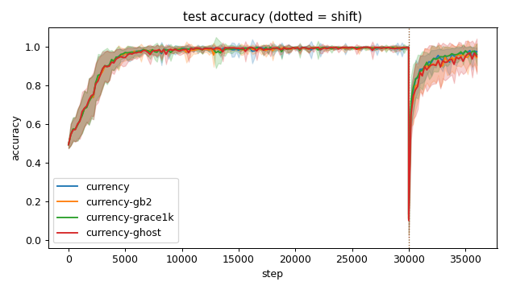
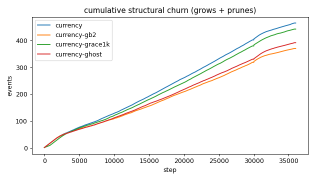
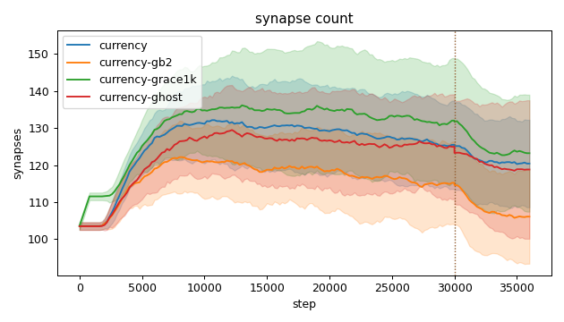
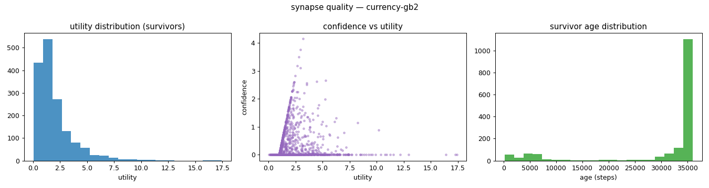
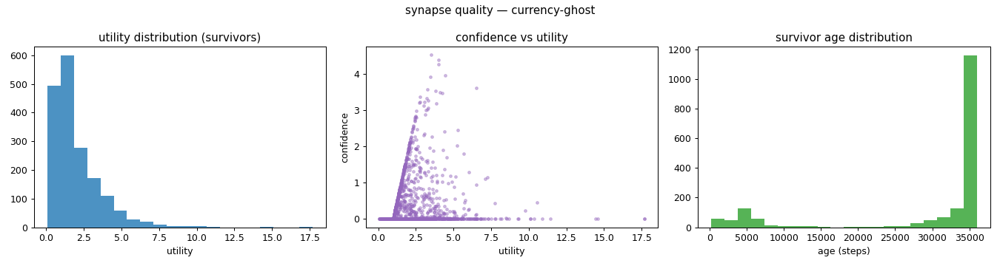
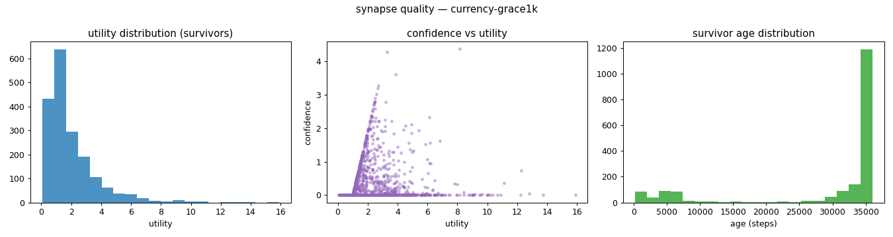
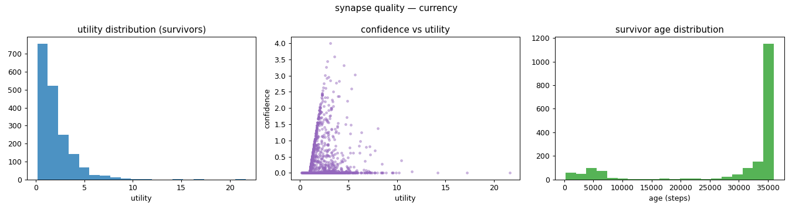
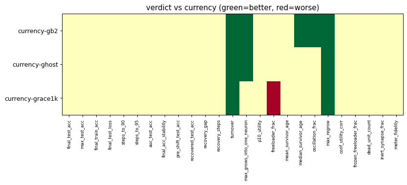

# Evaluation run: oscillation-shift-guardrail

- **Date:** 2026-05-31 20:49:04
- **Variants:** currency, currency-gb2, currency-ghost, currency-grace1k  (baseline: currency)
- **Seeds:** 15  |  **Dataset:** spirals  |  **Steps:** 30000 (+6000 shift)
- **Commit:** 0dacbe9
- **Command:** `python evaluate.py --variants currency,currency-gb2,currency-grace1k,currency-ghost --seeds 15 --baseline currency --jobs 10 --no-cache --publish --shift 6000 --run-name oscillation-shift-guardrail`

## Key metrics

| Metric | What it means | currency (baseline) | currency-gb2 | currency-ghost | currency-grace1k |
|---|---|---|---|---|---|
| final_test_acc ↑ | held-out accuracy at the end of the run | 0.972 ± 0.022 | 0.942 ± 0.073 ≈ | 0.949 ± 0.091 ≈ | 0.959 ± 0.057 ≈ |
| pre_shift_test_acc ↑ | test accuracy just before the concept shift | 0.996 ± 0.003 | 0.993 ± 0.011 ≈ | 0.994 ± 0.006 ≈ | 0.993 ± 0.008 ≈ |
| recovered_test_acc ↑ | test accuracy at the end, after the label swap | 0.972 ± 0.022 | 0.942 ± 0.073 ≈ | 0.949 ± 0.091 ≈ | 0.959 ± 0.057 ≈ |
| auc_test_acc ↑ | area under the test-accuracy curve (speed + level) | 0.945 ± 0.011 | 0.941 ± 0.015 ≈ | 0.940 ± 0.017 ≈ | 0.945 ± 0.014 ≈ |
| max_grows_into_one_neuron ↓ | most times one neuron was grown into (churn) | 39.067 ± 6.049 | 31.800 ± 5.115 ▲ | 26.733 ± 3.549 ▲ | 35.600 ± 6.631 ≈ |
| oscillation_frac ↓ | fraction of grown edges grown ≥2× (thrash) | 0.381 ± 0.058 | 0.342 ± 0.047 ▲ | 0.385 ± 0.037 ≈ | 0.401 ± 0.047 ≈ |
| freeloader_frac ↓ | fraction of synapses below the prune-utility floor | 0.016 ± 0.009 | 0.019 ± 0.012 ≈ | 0.019 ± 0.022 ≈ | 0.032 ± 0.022 ▼ |
| conf_utility_corr ↑ | corr of confidence with real utility (calibration) | 0.125 ± 0.099 | 0.096 ± 0.079 ≈ | 0.141 ± 0.128 ≈ | 0.109 ± 0.105 ≈ |
| dead_unit_count ↓ | hidden neurons that never fire on test data | 5.400 ± 2.752 | 5.933 ± 2.886 ≈ | 5.267 ± 3.395 ≈ | 4.933 ± 2.863 ≈ |

## Full scorecard

| Metric | currency (baseline) | currency-gb2 | currency-ghost | currency-grace1k |
|---|---|---|---|---|
| **Prediction performance** | | | | |
| final_test_acc ↑ | 0.972 ± 0.022 | 0.942 ± 0.073 ≈ | 0.949 ± 0.091 ≈ | 0.959 ± 0.057 ≈ |
| max_test_acc ↑ | 0.998 ± 0.002 | 0.999 ± 0.001 ≈ | 0.999 ± 0.001 ≈ | 0.999 ± 0.001 ≈ |
| final_train_acc ↑ | 0.973 ± 0.024 | 0.945 ± 0.066 ≈ | 0.950 ± 0.092 ≈ | 0.957 ± 0.055 ≈ |
| final_test_loss ↓ | 0.088 ± 0.047 | 0.171 ± 0.213 ≈ | 0.165 ± 0.220 ≈ | 0.153 ± 0.202 ≈ |
| **Training efficacy** | | | | |
| steps_to_90 ↓ | 3174 ± 775.858 | 3241 ± 900.962 ≈ | 3228 ± 885.036 ≈ | 3041 ± 705.030 ≈ |
| steps_to_95 ↓ | 3921 ± 1117 | 3948 ± 1179 ≈ | 4121 ± 1193 ≈ | 3868 ± 1099 ≈ |
| auc_test_acc ↑ | 0.945 ± 0.011 | 0.941 ± 0.015 ≈ | 0.940 ± 0.017 ≈ | 0.945 ± 0.014 ≈ |
| final_acc_stability ↓ | 0.025 ± 0.017 | 0.031 ± 0.019 ≈ | 0.037 ± 0.029 ≈ | 0.024 ± 0.019 ≈ |
| pre_shift_test_acc ↑ | 0.996 ± 0.003 | 0.993 ± 0.011 ≈ | 0.994 ± 0.006 ≈ | 0.993 ± 0.008 ≈ |
| recovered_test_acc ↑ | 0.972 ± 0.022 | 0.942 ± 0.073 ≈ | 0.949 ± 0.091 ≈ | 0.959 ± 0.057 ≈ |
| recovery_gap ↓ | 0.023 ± 0.022 | 0.051 ± 0.073 ≈ | 0.045 ± 0.090 ≈ | 0.035 ± 0.058 ≈ |
| recovery_steps ↓ | ∞ ± — | ∞ ± — ? | ∞ ± — ? | ∞ ± — ? |
| **Synapse structure** | | | | |
| synapse_count_start | 103.533 ± 1.024 | 103.533 ± 1.024 ≈ | 103.467 ± 1.024 ≈ | 103.533 ± 1.024 ≈ |
| synapse_count_peak | 137.133 ± 10.269 | 126.200 ± 9.282 ≈ | 135.400 ± 12.360 ≈ | 142.333 ± 14.826 ≈ |
| synapse_count_end | 120.400 ± 11.808 | 106.067 ± 12.715 ≈ | 118.800 ± 18.695 ≈ | 123.200 ± 15.791 ≈ |
| n_grow_events | 241.733 ± 25.215 | 187.333 ± 26.510 ≈ | 204.400 ± 23.403 ≈ | 231.867 ± 30.648 ≈ |
| n_prune_events | 222.867 ± 25.332 | 182.800 ± 19.508 ≈ | 187.133 ± 10.385 ≈ | 210.200 ± 23.847 ≈ |
| distinct_neurons_grown | 15 ± 2.066 | 14.400 ± 2.361 ≈ | 15.067 ± 1.914 ≈ | 15.933 ± 2.839 ≈ |
| turnover ↓ | 3.733 ± 0.469 | 3.223 ± 0.405 ▲ | 3.205 ± 0.243 ▲ | 3.425 ± 0.358 ▲ |
| max_grows_into_one_neuron ↓ | 39.067 ± 6.049 | 31.800 ± 5.115 ▲ | 26.733 ± 3.549 ▲ | 35.600 ± 6.631 ≈ |
| mean_fan_in | 4.013 ± 0.394 | 3.536 ± 0.424 ≈ | 3.960 ± 0.623 ≈ | 4.107 ± 0.526 ≈ |
| mean_fan_out | 4.013 ± 0.394 | 3.536 ± 0.424 ≈ | 3.960 ± 0.623 ≈ | 4.107 ± 0.526 ≈ |
| effective_density | 0.557 ± 0.055 | 0.491 ± 0.059 ≈ | 0.550 ± 0.087 ≈ | 0.570 ± 0.073 ≈ |
| **Synapse quality** | | | | |
| p10_utility ↑ | 0.679 ± 0.053 | 0.667 ± 0.074 ≈ | 0.660 ± 0.087 ≈ | 0.646 ± 0.048 ≈ |
| freeloader_frac ↓ | 0.016 ± 0.009 | 0.019 ± 0.012 ≈ | 0.019 ± 0.022 ≈ | 0.032 ± 0.022 ▼ |
| mean_survivor_age ↑ | 29741 ± 1904 | 30732 ± 1714 ≈ | 29641 ± 2254 ≈ | 29543 ± 2069 ≈ |
| median_survivor_age ↑ | 35893 ± 262.257 | 36000 ± 0 ▲ | 35940 ± 224.749 ≈ | 35933 ± 140.191 ≈ |
| mean_pruned_lifespan | 4207 ± 679.931 | 5011 ± 961.030 ≈ | 4984 ± 737.316 ≈ | 4964 ± 719.255 ≈ |
| oscillation_frac ↓ | 0.381 ± 0.058 | 0.342 ± 0.047 ▲ | 0.385 ± 0.037 ≈ | 0.401 ± 0.047 ≈ |
| max_regrow ↓ | 11.333 ± 2.300 | 9.867 ± 1.258 ▲ | 6.467 ± 1.024 ▲ | 8.067 ± 0.929 ▲ |
| conf_utility_corr ↑ | 0.125 ± 0.099 | 0.096 ± 0.079 ≈ | 0.141 ± 0.128 ≈ | 0.109 ± 0.105 ≈ |
| frozen_freeloader_frac ↓ | 0 ± 0 | 0 ± 0 ≈ | 0 ± 0 ≈ | 0 ± 0 ≈ |
| dead_unit_count ↓ | 5.400 ± 2.752 | 5.933 ± 2.886 ≈ | 5.267 ± 3.395 ≈ | 4.933 ± 2.863 ≈ |
| inert_synapse_frac ↓ | 0 ± 0 | 0 ± 0 ≈ | 0 ± 0 ≈ | 0 ± 0 ≈ |
| used_vs_allocated | 1.186 ± 0.114 | 1.045 ± 0.124 ≈ | 1.169 ± 0.176 ≈ | 1.213 ± 0.153 ≈ |
| **Signal sanity** | | | | |
| meter_fidelity ↑ | 0.871 ± 0.118 | 0.838 ± 0.138 ≈ | 0.844 ± 0.130 ≈ | 0.892 ± 0.097 ≈ |

Baseline: **currency**. ▲ better / ▼ worse / ≈ no clear difference vs baseline (95% bootstrap CI of the mean difference). Cells show mean ± std across seeds.

## Charts

### acc_curves

### churn_curves

### count_curves

### quality_currency-gb2

### quality_currency-ghost

### quality_currency-grace1k

### quality_currency

### verdict_heatmap

