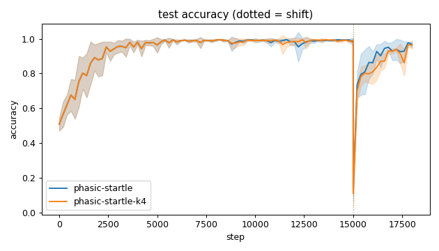
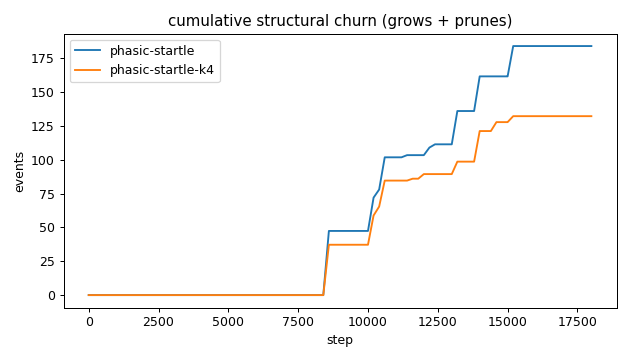
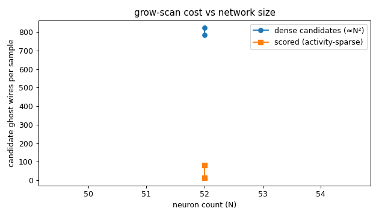
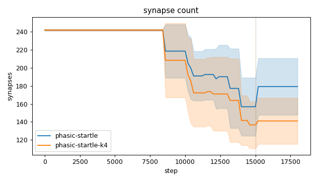
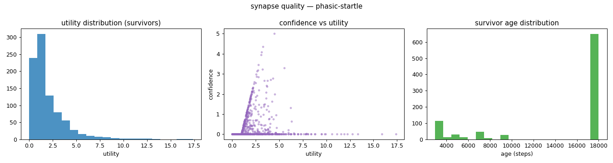
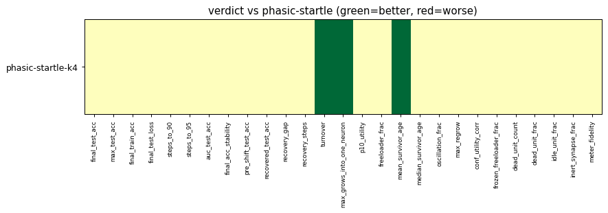

# Evaluation run: phasic-startle-k4-shift

- **Date:** 2026-06-12 21:25:00
- **Variants:** phasic-startle, phasic-startle-k4  (baseline: phasic-startle)
- **Seeds:** 5  |  **Dataset:** spirals  |  **Steps:** 15000 (+3000 shift)
- **Commit:** da0d1d1
- **Command:** `python evaluate.py --variants phasic-startle,phasic-startle-k4 --seeds 5 --dataset spirals --steps 15000 --shift 3000 --baseline phasic-startle --jobs 6 --no-cache --publish --run-name phasic-startle-k4-shift`

## Key metrics

| Metric | What it means | phasic-startle (baseline) | phasic-startle-k4 |
|---|---|---|---|
| final_test_acc ↑ | held-out accuracy at the end of the run | 0.967 ± 0.018 | 0.964 ± 0.020 ≈ |
| steps_to_90 ↓ | steps to first reach 90% test accuracy | 1721 ± 587.878 | 1721 ± 587.878 ≈ |
| steps_to_95 ↓ | steps to first reach 95% test accuracy | 2681 ± 881.816 | 2681 ± 881.816 ≈ |
| auc_test_acc ↑ | area under the test-accuracy curve (speed + level) | 0.933 ± 0.023 | 0.928 ± 0.019 ≈ |
| pre_shift_test_acc ↑ | test accuracy just before the concept shift | 0.981 ± 0.027 | 0.991 ± 0.004 ≈ |
| recovered_test_acc ↑ | test accuracy at the end, after the label swap | 0.967 ± 0.018 | 0.964 ± 0.020 ≈ |
| synapse_count_end | live synapses at the end | 179.200 ± 31.486 | 141 ± 25.675 ≈ |
| effective_density | live edges as a fraction of fully-connected | 0.311 ± 0.055 | 0.245 ± 0.045 ≈ |
| ghost_dense_cost | candidate ghost wires the grow-scan must consider (~N²) | 784.800 ± 31.486 | 823 ± 25.675 ≈ |
| ghost_pairs_scored | candidate wires actually scored after activity+demand pruning | 80.972 ± 19.655 | 13.023 ± 2.425 ≈ |
| mean_neuron_activation | avg hidden-neuron ReLU output on test data (neuron value) | 0.276 ± 0.087 | 0.302 ± 0.047 ≈ |
| dead_unit_frac ↓ | fraction of hidden neurons that never fire (scale-free) | 0.138 ± 0.028 | 0.150 ± 0.040 ≈ |
| idle_unit_frac ↓ | fraction of hidden neurons dead OR outputless (not in service) | 0.221 ± 0.050 | 0.250 ± 0.054 ≈ |
| n_recycle_events | dead-unit recycles fired over the run (sleep recycling) | 0 ± 0 | 0 ± 0 ≈ |
| recycled_rehired_frac | of recycled units, fraction back in service at the end | — ± — | — ± — ? |
| n_startle_events | demand-spike hiring alarms fired (startle growth) | 2 ± 0.632 | 1.600 ± 0.490 ≈ |
| n_arousal_events | post-startle refinement windows that ran grow-only passes | 0 ± 0 | 0 ± 0 ≈ |
| max_grows_into_one_neuron ↓ | most times one neuron was grown into (churn) | 10.600 ± 3.007 | 6 ± 1.414 ▲ |
| oscillation_frac ↓ | fraction of grown edges grown ≥2× (thrash) | 0.058 ± 0.117 | 0 ± 0 ≈ |
| freeloader_frac ↓ | fraction of synapses below the prune-utility floor | 0.124 ± 0.027 | 0.102 ± 0.020 ≈ |
| conf_utility_corr ↑ | corr of confidence with real utility (calibration) | 0.085 ± 0.052 | 0.045 ± 0.026 ≈ |
| dead_unit_count ↓ | hidden neurons that never fire on test data | 6.600 ± 1.356 | 7.200 ± 1.939 ≈ |

## Full scorecard

| Metric | phasic-startle (baseline) | phasic-startle-k4 |
|---|---|---|
| **Prediction performance** | | |
| final_test_acc ↑ | 0.967 ± 0.018 | 0.964 ± 0.020 ≈ |
| max_test_acc ↑ | 0.997 ± 0.002 | 0.997 ± 0.002 ≈ |
| final_train_acc ↑ | 0.971 ± 0.019 | 0.959 ± 0.019 ≈ |
| final_test_loss ↓ | 0.103 ± 0.032 | 0.109 ± 0.029 ≈ |
| **Training efficacy** | | |
| steps_to_90 ↓ | 1721 ± 587.878 | 1721 ± 587.878 ≈ |
| steps_to_95 ↓ | 2681 ± 881.816 | 2681 ± 881.816 ≈ |
| auc_test_acc ↑ | 0.933 ± 0.023 | 0.928 ± 0.019 ≈ |
| final_acc_stability ↓ | 0.045 ± 0.019 | 0.055 ± 0.022 ≈ |
| pre_shift_test_acc ↑ | 0.981 ± 0.027 | 0.991 ± 0.004 ≈ |
| recovered_test_acc ↑ | 0.967 ± 0.018 | 0.964 ± 0.020 ≈ |
| recovery_gap ↓ | 0.014 ± 0.021 | 0.027 ± 0.018 ≈ |
| recovery_steps ↓ | ∞ ± — | ∞ ± — ? |
| **Synapse structure** | | |
| synapse_count_start | 242 ± 0.894 | 242 ± 0.894 ≈ |
| synapse_count_peak | 242 ± 0.894 | 242 ± 0.894 ≈ |
| synapse_count_end | 179.200 ± 31.486 | 141 ± 25.675 ≈ |
| n_grow_events | 60.600 ± 8.040 | 15.600 ± 7.003 ≈ |
| n_prune_events | 123.400 ± 27.104 | 116.600 ± 22.096 ≈ |
| n_startle_events | 2 ± 0.632 | 1.600 ± 0.490 ≈ |
| n_arousal_events | 0 ± 0 | 0 ± 0 ≈ |
| distinct_neurons_grown | 16.800 ± 1.600 | 4.400 ± 1.200 ≈ |
| turnover ↓ | 0.878 ± 0.168 | 0.671 ± 0.150 ▲ |
| max_grows_into_one_neuron ↓ | 10.600 ± 3.007 | 6 ± 1.414 ▲ |
| mean_fan_in | 3.584 ± 0.630 | 2.820 ± 0.513 ≈ |
| mean_fan_out | 3.584 ± 0.630 | 2.820 ± 0.513 ≈ |
| effective_density | 0.311 ± 0.055 | 0.245 ± 0.045 ≈ |
| **Synapse quality** | | |
| p10_utility ↑ | 0.394 ± 0.119 | 0.479 ± 0.062 ≈ |
| freeloader_frac ↓ | 0.124 ± 0.027 | 0.102 ± 0.020 ≈ |
| mean_survivor_age ↑ | 14490 ± 702.392 | 16832 ± 491.009 ▲ |
| median_survivor_age ↑ | 18000 ± 0 | 18000 ± 0 ≈ |
| mean_pruned_lifespan | 10452 ± 1864 | 10977 ± 1603 ≈ |
| oscillation_frac ↓ | 0.058 ± 0.117 | 0 ± 0 ≈ |
| max_regrow ↓ | 0.200 ± 0.400 | 0 ± 0 ≈ |
| conf_utility_corr ↑ | 0.085 ± 0.052 | 0.045 ± 0.026 ≈ |
| frozen_freeloader_frac ↓ | 0 ± 0 | 0 ± 0 ≈ |
| dead_unit_count ↓ | 6.600 ± 1.356 | 7.200 ± 1.939 ≈ |
| dead_unit_frac ↓ | 0.138 ± 0.028 | 0.150 ± 0.040 ≈ |
| idle_unit_frac ↓ | 0.221 ± 0.050 | 0.250 ± 0.054 ≈ |
| mean_neuron_activation | 0.276 ± 0.087 | 0.302 ± 0.047 ≈ |
| inert_synapse_frac ↓ | 0 ± 0 | 0 ± 0 ≈ |
| used_vs_allocated | 0.740 ± 0.129 | 0.583 ± 0.105 ≈ |
| n_recycle_events | 0 ± 0 | 0 ± 0 ≈ |
| recycled_rehired_frac | — ± — | — ± — ? |
| **Compute cost** | | |
| ghost_dense_cost | 784.800 ± 31.486 | 823 ± 25.675 ≈ |
| ghost_pairs_scored | 80.972 ± 19.655 | 13.023 ± 2.425 ≈ |
| **Signal sanity** | | |
| meter_fidelity ↑ | 0.901 ± 0.073 | 0.951 ± 0.027 ≈ |

Baseline: **phasic-startle**. ▲ better / ▼ worse / ≈ no clear difference vs baseline (95% bootstrap CI of the mean difference). Cells show mean ± std across seeds.

## Charts

### acc_curves

### churn_curves

### cost_scaling

### count_curves

### quality_phasic-startle-k4

### quality_phasic-startle

### verdict_heatmap

