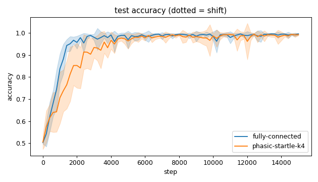
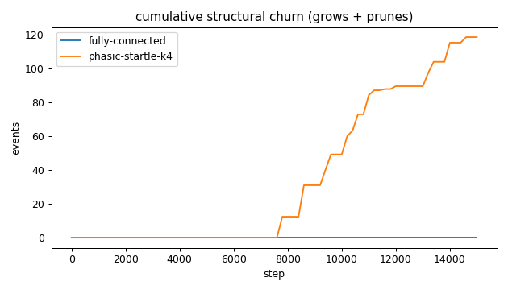
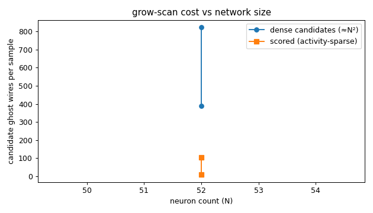
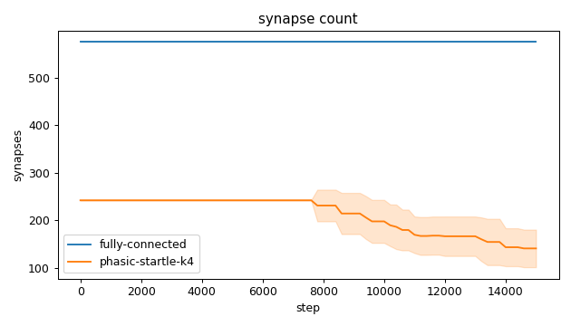
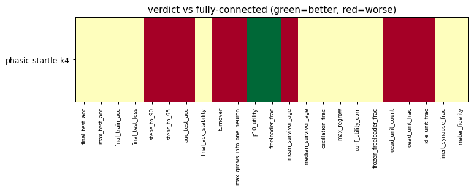

# Evaluation run: phasic-startle-k4-vs-fullyconnected-speed

- **Date:** 2026-06-12 22:00:14
- **Variants:** fully-connected, phasic-startle-k4  (baseline: fully-connected)
- **Seeds:** 10  |  **Dataset:** spirals  |  **Steps:** 15000 (+0 shift)
- **Commit:** aae0136
- **Command:** `python evaluate.py --variants fully-connected,phasic-startle-k4 --baseline fully-connected --seeds 10 --dataset spirals --steps 15000 --shift 0 --jobs 6 --no-cache --publish --run-name phasic-startle-k4-vs-fullyconnected-speed`

## Key metrics

| Metric | What it means | fully-connected (baseline) | phasic-startle-k4 |
|---|---|---|---|
| final_test_acc ↑ | held-out accuracy at the end of the run | 0.996 ± 0.004 | 0.993 ± 0.004 ≈ |
| steps_to_90 ↓ | steps to first reach 90% test accuracy | 1281 ± 132.665 | 2141 ± 805.233 ▼ |
| steps_to_95 ↓ | steps to first reach 95% test accuracy | 1521 ± 203.961 | 2881 ± 785.875 ▼ |
| auc_test_acc ↑ | area under the test-accuracy curve (speed + level) | 0.961 ± 0.006 | 0.937 ± 0.020 ▼ |
| synapse_count_end | live synapses at the end | 576 ± 0 | 140.800 ± 39.603 ≈ |
| effective_density | live edges as a fraction of fully-connected | 1 ± 0 | 0.244 ± 0.069 ≈ |
| ghost_dense_cost | candidate ghost wires the grow-scan must consider (~N²) | 388 ± 0 | 823.200 ± 39.603 ≈ |
| ghost_pairs_scored | candidate wires actually scored after activity+demand pruning | 105.084 ± 12.144 | 9.537 ± 2.538 ≈ |
| mean_neuron_activation | avg hidden-neuron ReLU output on test data (neuron value) | 0.400 ± 0.057 | 0.459 ± 0.058 ≈ |
| dead_unit_frac ↓ | fraction of hidden neurons that never fire (scale-free) | 0.023 ± 0.022 | 0.125 ± 0.062 ▼ |
| idle_unit_frac ↓ | fraction of hidden neurons dead OR outputless (not in service) | 0.023 ± 0.022 | 0.219 ± 0.100 ▼ |
| n_recycle_events | dead-unit recycles fired over the run (sleep recycling) | 0 ± 0 | 0 ± 0 ≈ |
| recycled_rehired_frac | of recycled units, fraction back in service at the end | — ± — | — ± — ? |
| n_startle_events | demand-spike hiring alarms fired (startle growth) | 0 ± 0 | 0.100 ± 0.300 ≈ |
| n_arousal_events | post-startle refinement windows that ran grow-only passes | 0 ± 0 | 0 ± 0 ≈ |
| max_grows_into_one_neuron ↓ | most times one neuron was grown into (churn) | 0 ± 0 | 4.200 ± 2.482 ▼ |
| oscillation_frac ↓ | fraction of grown edges grown ≥2× (thrash) | 0 ± 0 | 0 ± 0 ≈ |
| freeloader_frac ↓ | fraction of synapses below the prune-utility floor | 0.189 ± 0.013 | 0.044 ± 0.062 ▲ |
| conf_utility_corr ↑ | corr of confidence with real utility (calibration) | — ± — | 0.314 ± 0.077 ? |
| dead_unit_count ↓ | hidden neurons that never fire on test data | 1.100 ± 1.044 | 6 ± 3 ▼ |

## Full scorecard

| Metric | fully-connected (baseline) | phasic-startle-k4 |
|---|---|---|
| **Prediction performance** | | |
| final_test_acc ↑ | 0.996 ± 0.004 | 0.993 ± 0.004 ≈ |
| max_test_acc ↑ | 0.998 ± 0.001 | 0.998 ± 0.002 ≈ |
| final_train_acc ↑ | 0.995 ± 0.008 | 0.993 ± 0.005 ≈ |
| final_test_loss ↓ | 0.020 ± 0.018 | 0.030 ± 0.018 ≈ |
| **Training efficacy** | | |
| steps_to_90 ↓ | 1281 ± 132.665 | 2141 ± 805.233 ▼ |
| steps_to_95 ↓ | 1521 ± 203.961 | 2881 ± 785.875 ▼ |
| auc_test_acc ↑ | 0.961 ± 0.006 | 0.937 ± 0.020 ▼ |
| final_acc_stability ↓ | 0.005 ± 0.005 | 0.009 ± 0.009 ≈ |
| **Synapse structure** | | |
| synapse_count_start | 576 ± 0 | 242.100 ± 0.831 ≈ |
| synapse_count_peak | 576 ± 0 | 242.100 ± 0.831 ≈ |
| synapse_count_end | 576 ± 0 | 140.800 ± 39.603 ≈ |
| n_grow_events | 0 ± 0 | 8.600 ± 6.391 ≈ |
| n_prune_events | 0 ± 0 | 109.900 ± 40.695 ≈ |
| n_startle_events | 0 ± 0 | 0.100 ± 0.300 ≈ |
| n_arousal_events | 0 ± 0 | 0 ± 0 ≈ |
| distinct_neurons_grown | 0 ± 0 | 2.400 ± 1.685 ≈ |
| turnover ↓ | 0 ± 0 | 0.576 ± 0.222 ▼ |
| max_grows_into_one_neuron ↓ | 0 ± 0 | 4.200 ± 2.482 ▼ |
| mean_fan_in | 11.520 ± 0 | 2.816 ± 0.792 ≈ |
| mean_fan_out | 11.520 ± 0 | 2.816 ± 0.792 ≈ |
| effective_density | 1 ± 0 | 0.244 ± 0.069 ≈ |
| **Synapse quality** | | |
| p10_utility ↑ | 0.294 ± 0.022 | 0.718 ± 0.190 ▲ |
| freeloader_frac ↓ | 0.189 ± 0.013 | 0.044 ± 0.062 ▲ |
| mean_survivor_age ↑ | 15000 ± 0 | 14384 ± 414.129 ▼ |
| median_survivor_age ↑ | 15000 ± 0 | 15000 ± 0 ≈ |
| mean_pruned_lifespan | 0 ± 0 | 9567 ± 3469 ≈ |
| oscillation_frac ↓ | 0 ± 0 | 0 ± 0 ≈ |
| max_regrow ↓ | 0 ± 0 | -0.100 ± 0.300 ≈ |
| conf_utility_corr ↑ | — ± — | 0.314 ± 0.077 ? |
| frozen_freeloader_frac ↓ | 0 ± 0 | 0 ± 0 ≈ |
| dead_unit_count ↓ | 1.100 ± 1.044 | 6 ± 3 ▼ |
| dead_unit_frac ↓ | 0.023 ± 0.022 | 0.125 ± 0.062 ▼ |
| idle_unit_frac ↓ | 0.023 ± 0.022 | 0.219 ± 0.100 ▼ |
| mean_neuron_activation | 0.400 ± 0.057 | 0.459 ± 0.058 ≈ |
| inert_synapse_frac ↓ | 0 ± 0 | 0 ± 0 ≈ |
| used_vs_allocated | 1 ± 0 | 0.582 ± 0.163 ≈ |
| n_recycle_events | 0 ± 0 | 0 ± 0 ≈ |
| recycled_rehired_frac | — ± — | — ± — ? |
| **Compute cost** | | |
| ghost_dense_cost | 388 ± 0 | 823.200 ± 39.603 ≈ |
| ghost_pairs_scored | 105.084 ± 12.144 | 9.537 ± 2.538 ≈ |
| **Signal sanity** | | |
| meter_fidelity ↑ | 0.680 ± 0.181 | 0.717 ± 0.164 ≈ |

Baseline: **fully-connected**. ▲ better / ▼ worse / ≈ no clear difference vs baseline (95% bootstrap CI of the mean difference). Cells show mean ± std across seeds.

## Charts

### acc_curves

### churn_curves

### cost_scaling

### count_curves

### quality_fully-connected

### quality_phasic-startle-k4

### verdict_heatmap

